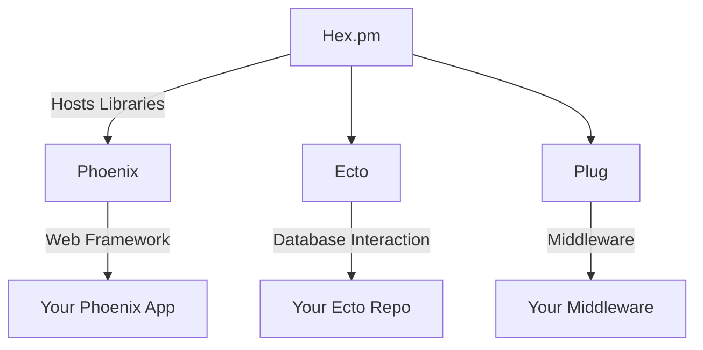

## 28.5. Leveraging Elixir Community Libraries and Tools

In the vibrant world of Elixir development, community libraries and tools play a pivotal role in enhancing productivity and fostering innovation. As expert software engineers and architects, understanding how to effectively leverage these resources can significantly impact the quality and efficiency of your projects. In this section, we will explore the best practices for utilizing community libraries and tools in Elixir, focusing on reusing solutions, assessing libraries, and contributing back to the community.

### Reusing Solutions

#### The Importance of Not Reinventing the Wheel

One of the core principles in software development is to avoid reinventing the wheel. By leveraging existing libraries, you can save valuable time and resources, allowing you to focus on the unique aspects of your project. Elixir's ecosystem is rich with libraries that cater to a wide range of functionalities, from web frameworks to data processing tools.

**Example: Using `Ecto` for Database Interactions**

Ecto is a powerful library for interacting with databases in Elixir. Instead of building your own ORM or query interface, Ecto provides a robust solution that is well-tested and widely adopted.

```elixir
defmodule MyApp.Repo do
  use Ecto.Repo,
    otp_app: :my_app,
    adapter: Ecto.Adapters.Postgres
end

defmodule MyApp.User do
  use Ecto.Schema

  schema "users" do
    field :name, :string
    field :email, :string
  end
end

# Querying the database
users = MyApp.Repo.all(MyApp.User)
```

By using Ecto, you benefit from its rich feature set, including migrations, changesets, and query building, without having to implement these from scratch.

#### Identifying Suitable Libraries

To make the most of community libraries, it's essential to identify those that align with your project requirements. Consider the following steps:

1. **Define Your Needs**: Clearly outline the functionality you require from a library.
2. **Research**: Use platforms like [Hex.pm](https://hex.pm/) to discover libraries that match your needs.
3. **Evaluate**: Assess the library's popularity, maintenance status, and compatibility with your project.

**Example: Choosing a JSON Parsing Library**

When selecting a JSON parsing library, you might consider `Jason` for its speed and ease of use.

```elixir
# Encoding a map to JSON
json = Jason.encode!(%{name: "Elixir", type: "language"})

# Decoding JSON to a map
map = Jason.decode!(json)
```

### Assessing Libraries

#### Community Adoption and Maintenance

A library's community adoption and maintenance status are critical indicators of its reliability. Popular libraries often have a large user base, which can lead to more frequent updates and better support.

**Key Considerations:**

- **Stars and Forks**: Check the library's repository on GitHub for stars and forks, which indicate its popularity.
- **Issues and Pull Requests**: Review open issues and pull requests to gauge the library's activity level.
- **Release Frequency**: Frequent releases suggest active maintenance and improvements.

#### Documentation Quality

Good documentation is essential for understanding how to use a library effectively. Look for libraries with comprehensive and clear documentation that includes:

- **Installation Instructions**: Clear steps for adding the library to your project.
- **Usage Examples**: Code snippets demonstrating common use cases.
- **API Reference**: Detailed descriptions of the library's functions and modules.

**Example: Assessing `Plug` Documentation**

Plug is a specification for composable modules in web applications. Its documentation provides clear guidance on setting up and using middleware in your Phoenix applications.

```elixir
defmodule MyAppWeb.Router do
  use MyAppWeb, :router

  pipeline :browser do
    plug :accepts, ["html"]
    plug :fetch_session
    plug :protect_from_forgery
  end

  scope "/", MyAppWeb do
    pipe_through :browser

    get "/", PageController, :index
  end
end
```

### Contribution

#### Giving Back to the Community

Contributing to community libraries not only enhances your skills but also strengthens the ecosystem. Here are ways you can contribute:

1. **Submit Improvements**: Propose enhancements or optimizations to existing libraries.
2. **Report Issues**: Provide detailed reports for any bugs or issues you encounter.
3. **Documentation**: Improve or expand the library's documentation to help others.

#### Engaging with Library Maintainers

Effective communication with library maintainers can lead to fruitful collaborations. When engaging with maintainers:

- **Be Respectful**: Acknowledge the effort that goes into maintaining open-source projects.
- **Provide Context**: Clearly explain the problem or enhancement you are proposing.
- **Follow Contribution Guidelines**: Adhere to the project's contribution guidelines to streamline the process.

**Example: Contributing to `Phoenix` Framework**

The Phoenix Framework is a popular web framework for building scalable applications. By contributing to its development, you can help shape its future.

```elixir
# Example of a potential contribution: Adding a new feature to the router
defmodule MyAppWeb.Router do
  use MyAppWeb, :router

  # New feature: Custom logging plug
  plug MyAppWeb.Plugs.CustomLogger

  scope "/", MyAppWeb do
    pipe_through :browser

    get "/", PageController, :index
  end
end
```

### Try It Yourself

Let's encourage experimentation by suggesting modifications to the code examples provided. Try adding new fields to the `User` schema in the Ecto example or creating a custom plug for logging in the Phoenix example. These exercises will help you gain hands-on experience with community libraries.

### Visualizing the Elixir Ecosystem

To better understand the interconnectedness of Elixir libraries and tools, let's visualize their relationships using a Mermaid.js diagram.


```mermaid
graph TD;
    Hex[Hex.pm] -->|Hosts Libraries| Library1[Phoenix]
    Hex --> Library2[Ecto]
    Hex --> Library3[Plug]
    Library1 -->|Web Framework| PhoenixApp[Your Phoenix App]
    Library2 -->|Database Interaction| EctoRepo[Your Ecto Repo]
    Library3 -->|Middleware| PlugMiddleware[Your Middleware]
```

**Diagram Description:** This diagram illustrates how Hex.pm serves as a central hub for Elixir libraries like Phoenix, Ecto, and Plug, which in turn provide foundational components for building web applications, database interactions, and middleware.

### Knowledge Check

Before we conclude, let's pose a few questions to reinforce your understanding:

- What are the benefits of using community libraries in Elixir development?
- How can you assess the reliability of a library?
- What are some ways you can contribute to the Elixir community?

### Summary of Key Takeaways

- **Reuse Solutions**: Leverage existing libraries to save time and focus on unique project aspects.
- **Assess Libraries**: Evaluate libraries based on community adoption, maintenance, and documentation quality.
- **Contribute**: Engage with the community by submitting improvements, reporting issues, and enhancing documentation.

### Embrace the Journey

Remember, leveraging community libraries and tools is just the beginning. As you progress, you'll discover new ways to optimize your development process and contribute to the Elixir ecosystem. Keep experimenting, stay curious, and enjoy the journey!

### References and Links

- [Hex.pm](https://hex.pm/): Explore Elixir libraries and packages.
- [Elixir Forum](https://elixirforum.com/): Engage with the Elixir community.
- [GitHub](https://github.com/): Discover and contribute to open-source Elixir projects.

## Quiz Time!



### What is one of the core principles in software development that encourages the use of community libraries?

- [x] Avoid reinventing the wheel
- [ ] Always build from scratch
- [ ] Use only proprietary software
- [ ] Ignore existing solutions

> **Explanation:** Avoiding reinventing the wheel allows developers to save time and resources by leveraging existing solutions.

### How can you identify suitable libraries for your Elixir project?

- [x] Define your needs and research on Hex.pm
- [ ] Choose the first library you find
- [ ] Use libraries with the most stars on GitHub
- [ ] Avoid researching and use trial and error

> **Explanation:** Defining your needs and researching on Hex.pm helps in finding libraries that align with your project requirements.

### What is a critical indicator of a library's reliability?

- [x] Community adoption and maintenance
- [ ] The number of lines of code
- [ ] The library's name
- [ ] The color of the logo

> **Explanation:** Community adoption and maintenance indicate a library's reliability through its popularity and active support.

### Why is good documentation important for a library?

- [x] It helps users understand how to use the library effectively
- [ ] It increases the library's file size
- [ ] It is not important
- [ ] It makes the library look more professional

> **Explanation:** Good documentation provides clear guidance on using the library, making it easier for developers to integrate it into their projects.

### What are some ways to contribute to community libraries?

- [x] Submit improvements and report issues
- [ ] Use the library without feedback
- [x] Improve documentation
- [ ] Keep contributions private

> **Explanation:** Contributing through improvements, reporting issues, and enhancing documentation strengthens the library and the community.

### How should you engage with library maintainers?

- [x] Be respectful and provide context
- [ ] Demand changes immediately
- [ ] Avoid communication
- [ ] Criticize their work

> **Explanation:** Engaging respectfully and providing context fosters positive collaboration with library maintainers.

### What platform hosts Elixir libraries and packages?

- [x] Hex.pm
- [ ] NPM
- [ ] RubyGems
- [ ] Maven Central

> **Explanation:** Hex.pm is the platform that hosts Elixir libraries and packages.

### What is the benefit of using Ecto for database interactions in Elixir?

- [x] It provides a robust and well-tested solution
- [ ] It is the only option available
- [ ] It is slower than other methods
- [ ] It requires extensive configuration

> **Explanation:** Ecto offers a robust and well-tested solution for database interactions, saving developers from building their own ORM.

### What should you look for when assessing a library's documentation?

- [x] Installation instructions and usage examples
- [ ] The length of the documentation
- [ ] The number of images
- [ ] The font style

> **Explanation:** Installation instructions and usage examples are crucial for understanding how to integrate and use the library effectively.

### True or False: Contributing to community libraries can enhance your skills and strengthen the ecosystem.

- [x] True
- [ ] False

> **Explanation:** Contributing to community libraries helps enhance your skills and strengthens the ecosystem by improving existing solutions and fostering collaboration.


