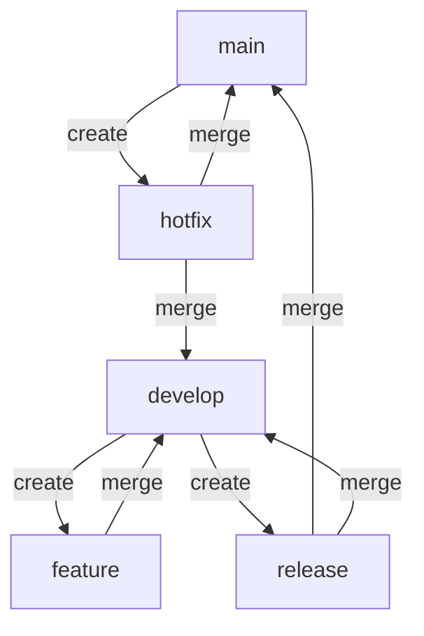
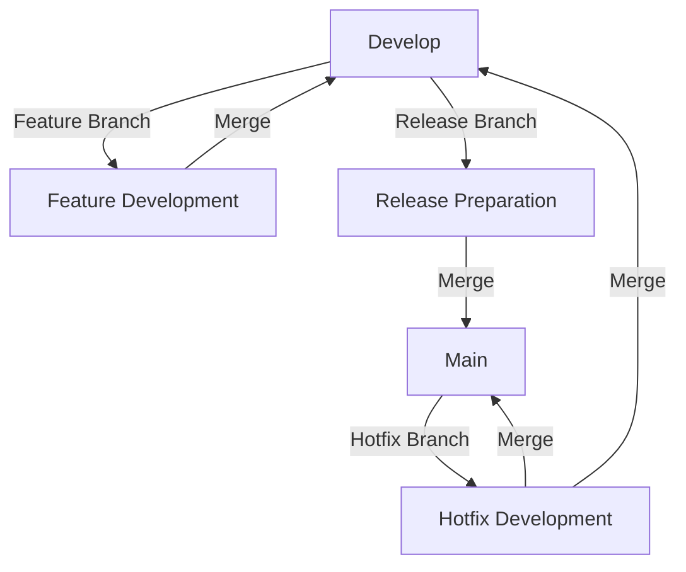

## 28.6. Version Control and Release Management

Version control and release management are critical components of modern software development, especially in the context of Elixir projects. They ensure that code changes are tracked, managed, and deployed efficiently and reliably. In this section, we will explore advanced strategies for version control and release management, focusing on branching strategies like Gitflow, semantic versioning, and changelog maintenance.

### Branching Strategies

Branching strategies are essential for managing the development workflow, especially in teams where multiple developers work on the same codebase. A well-defined branching strategy helps in organizing work, facilitating collaboration, and ensuring code quality.

#### Implementing Workflows like Gitflow

Gitflow is a popular branching strategy that provides a robust framework for managing feature development, releases, and hotfixes. It is particularly useful for projects with a continuous delivery model.

**Key Components of Gitflow:**

1. **Main Branches:**
   - **`main` (or `master`)**: This branch contains production-ready code. It should always reflect the latest stable release.
   - **`develop`**: This branch is used for integration. It contains the latest delivered development changes for the next release.

2. **Supporting Branches:**
   - **Feature Branches**: Used for developing new features. They branch off from `develop` and are merged back into `develop` when complete.
   - **Release Branches**: Created from `develop` when preparing for a new release. They allow for final bug fixes and preparation tasks before merging into `main`.
   - **Hotfix Branches**: Created from `main` to quickly address critical issues in production. Once fixed, they are merged back into both `main` and `develop`.

**Gitflow Workflow:**



**Implementing Gitflow in Elixir Projects:**

- **Initialize Gitflow**: Use the `git flow init` command to set up the Gitflow structure in your repository.
- **Feature Development**: Create a feature branch using `git flow feature start <feature-name>`, develop your feature, and then finish it with `git flow feature finish <feature-name>`.
- **Release Preparation**: Start a release branch with `git flow release start <release-version>`, perform necessary tasks, and finish with `git flow release finish <release-version>`.
- **Hotfix Management**: Quickly address production issues with `git flow hotfix start <hotfix-name>`, and finish with `git flow hotfix finish <hotfix-name>`.

**Benefits of Gitflow:**

- **Parallel Development**: Supports multiple developers working on different features simultaneously.
- **Stable Releases**: Ensures that only stable code is merged into the `main` branch.
- **Efficient Hotfixes**: Allows for quick resolution of critical issues without disrupting ongoing development.

### Semantic Versioning

Semantic versioning is a versioning scheme that conveys meaning about the underlying changes with each new release. It is crucial for communicating changes effectively to users and other developers.

#### Understanding Semantic Versioning

Semantic versioning follows the format `MAJOR.MINOR.PATCH`, where:

- **MAJOR**: Incremented for incompatible API changes.
- **MINOR**: Incremented for backward-compatible functionality.
- **PATCH**: Incremented for backward-compatible bug fixes.

**Example:**

- **Version 1.0.0**: Initial stable release.
- **Version 1.1.0**: Added new features in a backward-compatible manner.
- **Version 1.1.1**: Fixed bugs without affecting the API.

**Implementing Semantic Versioning in Elixir Projects:**

- **Define Versioning Policy**: Establish clear guidelines for when to increment each part of the version number.
- **Automate Versioning**: Use tools like `mix version` to automate version number updates based on commit messages or tags.
- **Communicate Changes**: Ensure that each release is accompanied by a changelog that explains the changes in terms of the versioning policy.

**Benefits of Semantic Versioning:**

- **Clear Communication**: Provides a clear and consistent way to communicate changes.
- **Dependency Management**: Helps in managing dependencies by specifying compatible versions.
- **User Trust**: Builds trust with users by ensuring predictable and stable releases.

### Changelog Maintenance

A changelog is a file that documents all notable changes made to a project. It is an essential tool for keeping track of changes and communicating them to users and developers.

#### Documenting Changes Between Releases

**Best Practices for Changelog Maintenance:**

- **Keep It Updated**: Regularly update the changelog with each new release.
- **Categorize Changes**: Organize changes into categories like Added, Changed, Deprecated, Removed, Fixed, and Security.
- **Be Descriptive**: Provide clear and concise descriptions of each change.
- **Link to Issues and Pull Requests**: Include links to relevant issues and pull requests for more context.

**Example Changelog Format:**

```markdown
# Changelog

## [1.1.0] - 2024-11-23
### Added
- New feature for user authentication.
- Support for additional payment gateways.

### Fixed
- Resolved issue with data serialization.
- Fixed bug in the notification system.

## [1.0.1] - 2024-10-15
### Security
- Patched vulnerability in the login system.

## [1.0.0] - 2024-09-01
### Initial Release
- Initial release with core functionality.
```

**Tools for Changelog Maintenance:**

- **Keep a CHANGELOG**: Follow the guidelines from [Keep a Changelog](https://keepachangelog.com/) for maintaining a well-structured changelog.
- **Automate with Scripts**: Use scripts to automate the generation and updating of changelogs based on commit messages or tags.

**Benefits of Maintaining a Changelog:**

- **Transparency**: Provides transparency about what changes have been made.
- **User Awareness**: Keeps users informed about new features, bug fixes, and security updates.
- **Development History**: Serves as a historical record of the project's development.

### Code Examples

Let's explore some code examples to illustrate these concepts in practice.

#### Example: Gitflow in Action

```shell
# Initialize Gitflow
git flow init

# Start a new feature
git flow feature start user-authentication

# Work on the feature
# (Make changes to your code here)

# Finish the feature
git flow feature finish user-authentication

# Start a release
git flow release start 1.1.0

# Prepare the release
# (Perform final testing and bug fixes here)

# Finish the release
git flow release finish 1.1.0

# Start a hotfix for a critical issue
git flow hotfix start fix-login-bug

# Fix the issue
# (Make changes to your code here)

# Finish the hotfix
git flow hotfix finish fix-login-bug
```

#### Example: Automating Semantic Versioning

```elixir
# mix.exs file

defmodule MyApp.MixProject do
  use Mix.Project

  def project do
    [
      app: :my_app,
      version: "1.1.0", # Update this version number as per semantic versioning
      elixir: "~> 1.12",
      start_permanent: Mix.env() == :prod,
      deps: deps()
    ]
  end

  # Define your dependencies here
  defp deps do
    []
  end
end
```

### Visualizing Version Control and Release Management

To better understand the flow of version control and release management, let's visualize the process using a Mermaid.js diagram.



### Knowledge Check

Let's test your understanding of version control and release management concepts.

1. **What is the purpose of a release branch in Gitflow?**
   - To prepare for a new release by finalizing features and fixing bugs.

2. **How does semantic versioning help in dependency management?**
   - By specifying compatible versions, it helps in managing dependencies.

3. **Why is it important to maintain a changelog?**
   - To provide transparency and keep users informed about changes.

### Try It Yourself

Experiment with the code examples provided. Try creating a new feature branch, making changes, and merging it back into the `develop` branch. Update the version number in your `mix.exs` file and generate a changelog entry for your changes.

### Conclusion

Version control and release management are vital for the success of any software project. By implementing strategies like Gitflow, semantic versioning, and maintaining a changelog, you can ensure a smooth and efficient development process. Remember, this is just the beginning. As you progress, you'll build more complex and interactive systems. Keep experimenting, stay curious, and enjoy the journey!

## Quiz: Version Control and Release Management



### What is the main purpose of the `develop` branch in Gitflow?

- [x] To integrate features and prepare for the next release
- [ ] To store production-ready code
- [ ] To manage hotfixes
- [ ] To handle experimental features

> **Explanation:** The `develop` branch is used for integrating features and preparing for the next release.

### Which of the following is NOT a component of semantic versioning?

- [ ] MAJOR
- [ ] MINOR
- [ ] PATCH
- [x] BUILD

> **Explanation:** Semantic versioning consists of MAJOR, MINOR, and PATCH components.

### What is the benefit of maintaining a changelog?

- [x] Provides transparency about changes
- [ ] Increases code complexity
- [ ] Reduces the need for documentation
- [ ] Eliminates the need for version control

> **Explanation:** A changelog provides transparency about changes and keeps users informed.

### How does Gitflow help in managing hotfixes?

- [x] By allowing hotfix branches to be created from the `main` branch
- [ ] By merging hotfixes directly into feature branches
- [ ] By storing hotfixes in the `develop` branch
- [ ] By eliminating the need for hotfixes

> **Explanation:** Gitflow allows hotfix branches to be created from the `main` branch for quick resolution of production issues.

### What is the role of the `main` branch in Gitflow?

- [x] To store production-ready code
- [ ] To integrate features
- [ ] To manage experimental features
- [ ] To handle bug fixes

> **Explanation:** The `main` branch stores production-ready code.

### Which command is used to start a new feature in Gitflow?

- [x] `git flow feature start <feature-name>`
- [ ] `git flow release start <release-name>`
- [ ] `git flow hotfix start <hotfix-name>`
- [ ] `git flow init`

> **Explanation:** `git flow feature start <feature-name>` is used to start a new feature.

### What does the PATCH number represent in semantic versioning?

- [x] Backward-compatible bug fixes
- [ ] Incompatible API changes
- [ ] Backward-compatible functionality
- [ ] New features

> **Explanation:** The PATCH number represents backward-compatible bug fixes.

### Why is it important to link issues and pull requests in a changelog?

- [x] To provide more context for changes
- [ ] To increase the size of the changelog
- [ ] To reduce the need for documentation
- [ ] To eliminate the need for version control

> **Explanation:** Linking issues and pull requests provides more context for changes.

### What is the benefit of automating semantic versioning?

- [x] Ensures consistent version updates
- [ ] Increases manual work
- [ ] Reduces code quality
- [ ] Eliminates the need for version control

> **Explanation:** Automating semantic versioning ensures consistent version updates.

### True or False: A changelog should only include major changes.

- [ ] True
- [x] False

> **Explanation:** A changelog should include all notable changes, not just major ones.


