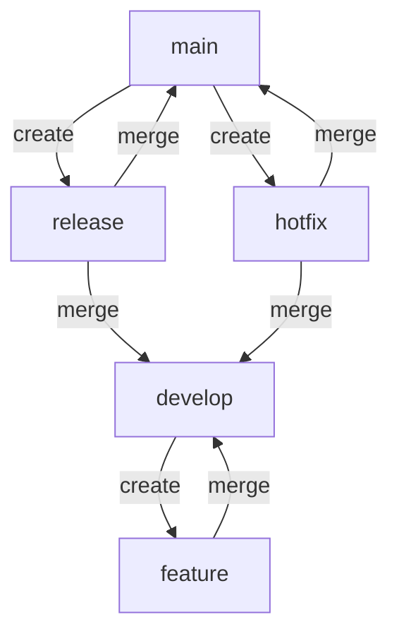

## 28.6. Version Control and Release Management

Version control and release management are critical components of software development, ensuring that code changes are tracked, organized, and deployed efficiently. In Elixir development, these practices are essential for maintaining code quality, facilitating collaboration, and ensuring the stability of applications. This section delves into the intricacies of version control and release management, focusing on branching strategies, semantic versioning, and changelog maintenance.

### Branching Strategies

Branching strategies are crucial for managing code changes and facilitating collaboration among developers. They provide a structured approach to developing features, fixing bugs, and releasing new versions. Let's explore some popular branching strategies, with a focus on Gitflow, which is widely used in the industry.

#### Implementing Workflows like Gitflow

Gitflow is a robust branching model that provides a clear workflow for managing feature development, releases, and hotfixes. It is particularly well-suited for projects with a continuous delivery model. Here’s a breakdown of how Gitflow can be implemented in Elixir projects:

1. **Main Branches**:
   - **`main`**: This branch contains the production-ready code. All releases are tagged in this branch.
   - **`develop`**: This is the integration branch for features. It contains the latest development changes that are ready for testing.

2. **Supporting Branches**:
   - **Feature Branches**: These branches are created from `develop` and are used to develop new features. Once a feature is complete, it is merged back into `develop`.
   - **Release Branches**: When the `develop` branch is stable and ready for a release, a release branch is created. This branch allows for final testing and bug fixes. Once the release is ready, it is merged into both `main` and `develop`.
   - **Hotfix Branches**: These branches are created from `main` to address critical issues in the production code. After the fix, the hotfix branch is merged into both `main` and `develop`.


```mermaid
graph TD;
    A[main] -->|create| B[hotfix]
    A -->|create| C[release]
    C -->|merge| A
    C -->|merge| D[develop]
    D -->|create| E[feature]
    E -->|merge| D
    B -->|merge| A
    B -->|merge| D
```

**Diagram Explanation**: This diagram illustrates the Gitflow branching model, highlighting the creation and merging of feature, release, and hotfix branches.

#### Benefits of Gitflow

- **Parallel Development**: Allows multiple developers to work on different features simultaneously without conflicts.
- **Release Management**: Facilitates the preparation and deployment of stable releases.
- **Hotfix Support**: Provides a mechanism for quickly addressing critical issues in production.

#### Alternative Branching Strategies

While Gitflow is popular, other branching strategies may be more suitable depending on your project's needs:

- **GitHub Flow**: A simpler model with a single long-lived branch (`main`) and short-lived feature branches. Ideal for continuous deployment environments.
- **GitLab Flow**: Combines elements of Gitflow and GitHub Flow, supporting multiple environments (e.g., staging, production).

### Semantic Versioning

Semantic versioning is a versioning scheme that communicates changes in a project effectively. It uses a three-part version number format: `MAJOR.MINOR.PATCH`. Understanding and implementing semantic versioning is crucial for managing dependencies and ensuring compatibility.

#### Communicating Changes Effectively

Semantic versioning helps developers understand the impact of changes in a new release. Here's how the version numbers are structured:

- **MAJOR**: Incremented for incompatible API changes.
- **MINOR**: Incremented for backward-compatible functionality.
- **PATCH**: Incremented for backward-compatible bug fixes.

For example, a version change from `1.2.3` to `2.0.0` indicates breaking changes, while a change to `1.3.0` indicates new features that are backward-compatible.

#### Implementing Semantic Versioning in Elixir

Elixir projects can benefit from semantic versioning by using tools like `Version` module in Elixir, which provides utilities for parsing and comparing version strings.

```elixir
defmodule MyApp.Versioning do
  @moduledoc """
  A module for handling semantic versioning in MyApp.
  """

  @spec compare_versions(String.t(), String.t()) :: :gt | :lt | :eq
  def compare_versions(version1, version2) do
    Version.compare(version1, version2)
  end
end

# Example usage
IO.inspect MyApp.Versioning.compare_versions("1.2.3", "1.3.0") # Output: :lt
```

**Code Explanation**: This Elixir module demonstrates how to compare version strings using the `Version` module, helping to determine the relationship between different versions.

### Changelog Maintenance

Maintaining a changelog is essential for documenting changes between releases. It provides a historical record of changes, making it easier for users and developers to track the evolution of a project.

#### Documenting Changes Between Releases

A well-maintained changelog should include:

- **Added**: New features or functionalities.
- **Changed**: Modifications to existing features.
- **Deprecated**: Features that are marked for future removal.
- **Removed**: Features that have been removed.
- **Fixed**: Bug fixes.
- **Security**: Security-related changes.

#### Best Practices for Changelog Maintenance

- **Automate Changelog Generation**: Use tools like `git-chglog` or `keep-a-changelog` to automate the generation of changelogs from commit messages.
- **Consistent Format**: Follow a consistent format to ensure readability and ease of use.
- **Link to Issues and Pull Requests**: Provide links to related issues and pull requests for more context.

```markdown
# Changelog

## [1.3.0] - 2024-11-23
### Added
- New feature for user authentication.

### Changed
- Updated the logging system to improve performance.

### Fixed
- Resolved an issue with the payment gateway integration.

## [1.2.3] - 2024-10-15
### Fixed
- Fixed a bug in the user registration process.
```

**Changelog Example**: This example shows a simple changelog format, documenting the changes in each release.

### Integrating Version Control and Release Management

To effectively manage version control and releases in Elixir projects, consider the following strategies:

- **Continuous Integration and Continuous Deployment (CI/CD)**: Integrate version control with CI/CD pipelines to automate testing and deployment processes.
- **Tagging Releases**: Use Git tags to mark release points in the version history, making it easier to identify and roll back to previous versions if necessary.
- **Release Automation**: Automate the release process using tools like `Distillery` or `Mix Releases` to streamline deployment and reduce human error.

### Conclusion

Version control and release management are foundational practices in Elixir development, ensuring that code changes are tracked, organized, and deployed efficiently. By implementing effective branching strategies, adopting semantic versioning, and maintaining comprehensive changelogs, developers can enhance collaboration, improve code quality, and ensure the stability of their applications.

Remember, mastering these practices is just the beginning. As you continue to develop your skills, you'll find new ways to optimize and streamline your development process. Keep experimenting, stay curious, and enjoy the journey!

## Quiz Time!



### Which branching strategy is particularly well-suited for projects with a continuous delivery model?

- [x] Gitflow
- [ ] GitHub Flow
- [ ] GitLab Flow
- [ ] Trunk-Based Development

> **Explanation:** Gitflow provides a structured workflow for feature development, releases, and hotfixes, making it ideal for continuous delivery.

### What does the MAJOR version number indicate in semantic versioning?

- [x] Incompatible API changes
- [ ] Backward-compatible functionality
- [ ] Backward-compatible bug fixes
- [ ] Security updates

> **Explanation:** The MAJOR version is incremented when there are incompatible API changes.

### Which tool can be used to automate changelog generation from commit messages?

- [x] git-chglog
- [ ] git-flow
- [ ] Mix
- [ ] Dialyzer

> **Explanation:** `git-chglog` is a tool that automates the generation of changelogs from commit messages.

### What is the purpose of a release branch in Gitflow?

- [x] To prepare and finalize a new release
- [ ] To develop new features
- [ ] To fix critical issues in production
- [ ] To merge changes from feature branches

> **Explanation:** A release branch is used to prepare and finalize a new release, allowing for final testing and bug fixes.

### What is one benefit of maintaining a changelog?

- [x] It provides a historical record of changes
- [ ] It automates code deployment
- [ ] It manages code dependencies
- [ ] It optimizes code performance

> **Explanation:** A changelog provides a historical record of changes, making it easier to track the evolution of a project.

### Which module in Elixir provides utilities for parsing and comparing version strings?

- [x] Version
- [ ] Mix
- [ ] Logger
- [ ] Ecto

> **Explanation:** The `Version` module in Elixir provides utilities for parsing and comparing version strings.

### What should a well-maintained changelog include?

- [x] Added, Changed, Deprecated, Removed, Fixed, Security
- [ ] Features, Bugs, Issues, Pull Requests
- [ ] Commits, Tags, Branches, Merges
- [ ] Code, Tests, Documentation, Deployment

> **Explanation:** A well-maintained changelog should include categories like Added, Changed, Deprecated, Removed, Fixed, and Security.

### Which tool can be used for release automation in Elixir?

- [x] Distillery
- [ ] Git
- [ ] ExUnit
- [ ] Dialyzer

> **Explanation:** Distillery is a tool that can be used for release automation in Elixir.

### What is a key advantage of using Git tags in version control?

- [x] They mark release points in the version history
- [ ] They automate code testing
- [ ] They provide code linting
- [ ] They optimize code execution

> **Explanation:** Git tags are used to mark release points in the version history, making it easier to identify and roll back to previous versions.

### True or False: Semantic versioning uses a two-part version number format.

- [ ] True
- [x] False

> **Explanation:** Semantic versioning uses a three-part version number format: MAJOR.MINOR.PATCH.


