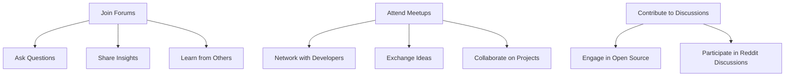

## 28.7. Continuous Learning and Community Engagement

In the rapidly evolving world of software development, continuous learning and community engagement are crucial for staying ahead. As expert software engineers and architects, it's essential to keep your skills sharp and stay informed about the latest trends and best practices in Elixir development. This section will guide you through various strategies for continuous learning and community engagement, ensuring you remain at the forefront of the Elixir ecosystem.

### Educational Resources

#### Participating in Online Courses, Webinars, and Workshops

To enhance your Elixir skills, consider enrolling in online courses and attending webinars and workshops. These resources offer structured learning paths and insights from industry experts.

- **Online Courses**: Platforms like Udemy, Coursera, and Pluralsight offer comprehensive Elixir courses. These courses cover everything from basic syntax to advanced design patterns and OTP principles. Look for courses with high ratings and positive reviews to ensure quality content.

- **Webinars**: Webinars provide an opportunity to learn from experts in real-time. They often cover the latest trends, tools, and techniques in Elixir development. Websites like Eventbrite and Meetup frequently list upcoming webinars.

- **Workshops**: Hands-on workshops are invaluable for gaining practical experience. They allow you to apply theoretical knowledge to real-world scenarios. Check local tech communities and conferences for workshop opportunities.

#### Code Example: Implementing a Simple Elixir Module

Let's create a simple Elixir module to demonstrate the basics of Elixir syntax and module creation.

```elixir
defmodule MathOperations do
  @moduledoc """
  A module for performing basic math operations.
  """

  @doc """
  Adds two numbers.

  ## Examples

      iex> MathOperations.add(2, 3)
      5

  """
  def add(a, b) do
    a + b
  end

  @doc """
  Subtracts the second number from the first.

  ## Examples

      iex> MathOperations.subtract(5, 3)
      2

  """
  def subtract(a, b) do
    a - b
  end
end
```

- **Explanation**: This module, `MathOperations`, provides basic arithmetic functions. The `@moduledoc` and `@doc` attributes are used for documentation, which is a best practice in Elixir development.

#### Try It Yourself

Experiment with the `MathOperations` module by adding more functions, such as multiplication and division. Test your functions using the Elixir interactive shell (IEx).

### Community Involvement

#### Joining Forums, Attending Meetups, Contributing to Discussions

Engaging with the Elixir community is an excellent way to learn from others, share your knowledge, and stay updated with the latest developments.

- **Forums**: Join forums like Elixir Forum and Stack Overflow to ask questions, share insights, and learn from the experiences of other developers. These platforms are great for troubleshooting and discovering new techniques.

- **Meetups**: Attend local Elixir meetups to network with fellow developers. Meetups provide a platform for exchanging ideas, discussing challenges, and collaborating on projects. Use Meetup.com to find Elixir meetups in your area.

- **Contributing to Discussions**: Participate in discussions on platforms like GitHub and Reddit. Engaging in open-source projects and contributing to discussions helps you gain a deeper understanding of Elixir and its ecosystem.

#### Visualizing Community Engagement



- **Description**: This diagram illustrates the various ways to engage with the Elixir community, including joining forums, attending meetups, and contributing to discussions.

### Staying Informed

#### Following Elixir Core Team Updates and Blogs

To stay informed about the latest developments in Elixir, follow updates from the Elixir core team and read relevant blogs.

- **Elixir Core Team Updates**: The Elixir core team regularly publishes updates on new features, bug fixes, and upcoming releases. Follow their announcements on the official Elixir website and GitHub repository.

- **Blogs**: Reading blogs written by experienced Elixir developers can provide valuable insights into best practices, design patterns, and real-world applications. Some popular blogs include Plataformatec's blog and Elixir Radar.

#### Code Example: Using Elixir's `Enum` Module

The `Enum` module is a powerful tool for working with collections in Elixir. Let's explore a simple example.

```elixir
defmodule ListOperations do
  @moduledoc """
  A module for performing operations on lists.
  """

  @doc """
  Filters even numbers from a list.

  ## Examples

      iex> ListOperations.filter_even([1, 2, 3, 4, 5])
      [2, 4]

  """
  def filter_even(list) do
    Enum.filter(list, fn x -> rem(x, 2) == 0 end)
  end
end
```

- **Explanation**: This module, `ListOperations`, uses the `Enum.filter/2` function to filter even numbers from a list. The `rem/2` function is used to determine if a number is even.

#### Try It Yourself

Modify the `ListOperations` module to include a function that filters odd numbers. Test your function using IEx.

### Embrace the Journey

Continuous learning and community engagement are ongoing processes. As you progress in your Elixir development journey, remember to stay curious, experiment with new ideas, and share your knowledge with others. The Elixir community is vibrant and welcoming, offering countless opportunities for growth and collaboration.

### Knowledge Check

- **Question**: What are some benefits of attending Elixir meetups?
  - **Answer**: Networking with developers, exchanging ideas, and collaborating on projects.

- **Exercise**: Create a new Elixir module that performs string operations, such as reversing a string and converting it to uppercase. Test your functions using IEx.

### Summary

In this section, we've explored strategies for continuous learning and community engagement in Elixir development. By participating in educational resources, engaging with the community, and staying informed, you can enhance your skills and stay updated with the latest trends. Remember, continuous learning is a journey, not a destination. Keep experimenting, stay curious, and enjoy the journey!

## Quiz: Continuous Learning and Community Engagement



### What is a benefit of participating in online courses for Elixir development?

- [x] Structured learning paths
- [ ] Immediate job placement
- [ ] Guaranteed certification
- [ ] Free access to all resources

> **Explanation:** Online courses provide structured learning paths that help you systematically enhance your Elixir skills.

### Which platform is commonly used for attending Elixir meetups?

- [x] Meetup.com
- [ ] LinkedIn
- [ ] Facebook
- [ ] Twitter

> **Explanation:** Meetup.com is a popular platform for finding and attending local Elixir meetups.

### What is the purpose of the `@moduledoc` attribute in Elixir?

- [x] To provide documentation for a module
- [ ] To define module-level variables
- [ ] To execute code at compile-time
- [ ] To import external libraries

> **Explanation:** The `@moduledoc` attribute is used to provide documentation for a module in Elixir.

### How can you stay informed about the latest Elixir developments?

- [x] Follow Elixir core team updates
- [ ] Only read books
- [ ] Ignore online resources
- [ ] Avoid community forums

> **Explanation:** Following Elixir core team updates is a great way to stay informed about the latest developments in Elixir.

### What is a key benefit of contributing to discussions on GitHub?

- [x] Engaging in open-source projects
- [ ] Receiving monetary rewards
- [ ] Guaranteed job offers
- [ ] Avoiding community interaction

> **Explanation:** Contributing to discussions on GitHub allows you to engage in open-source projects and learn from others.

### What does the `Enum.filter/2` function do in Elixir?

- [x] Filters elements from a collection based on a condition
- [ ] Sorts a list in ascending order
- [ ] Converts a list to a map
- [ ] Reverses a list

> **Explanation:** The `Enum.filter/2` function filters elements from a collection based on a specified condition.

### Which of the following is a benefit of attending webinars?

- [x] Learning from experts in real-time
- [ ] Guaranteed job placement
- [ ] Free certification
- [ ] Unlimited access to all content

> **Explanation:** Webinars provide an opportunity to learn from experts in real-time, often covering the latest trends and techniques.

### What is the primary focus of the Elixir Forum?

- [x] Asking questions and sharing insights
- [ ] Selling Elixir-related products
- [ ] Providing job listings
- [ ] Offering paid courses

> **Explanation:** The Elixir Forum is focused on asking questions, sharing insights, and learning from the experiences of other developers.

### What is a common activity at Elixir meetups?

- [x] Networking with fellow developers
- [ ] Selling products
- [ ] Watching movies
- [ ] Playing video games

> **Explanation:** Networking with fellow developers is a common and valuable activity at Elixir meetups.

### True or False: Continuous learning is a journey, not a destination.

- [x] True
- [ ] False

> **Explanation:** Continuous learning is an ongoing process that involves staying curious, experimenting with new ideas, and sharing knowledge with others.


