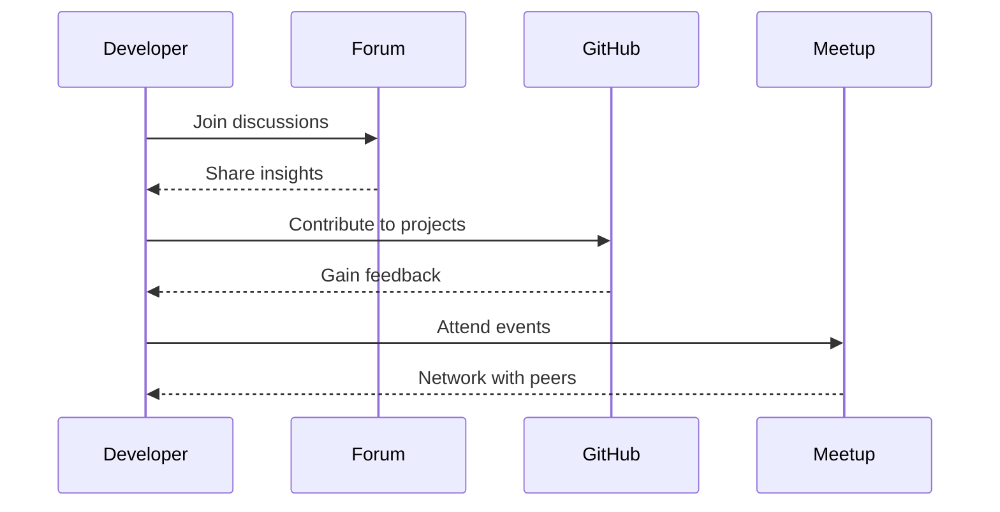

## 28.7. Continuous Learning and Community Engagement

In the ever-evolving field of software development, continuous learning and community engagement are vital for staying ahead. As an expert software engineer or architect working with Elixir, it is essential to remain updated with the latest advancements, tools, and best practices. This section delves into the significance of continuous learning, how to engage with the Elixir community effectively, and the resources available to enhance your expertise.

### Educational Resources

#### Participating in Online Courses, Webinars, and Workshops

Online courses, webinars, and workshops provide structured learning paths and insights from industry experts. These resources are invaluable for deepening your understanding of Elixir and its ecosystem.

- **Elixir School**: A free, open-source platform offering comprehensive tutorials on Elixir. It covers everything from basic syntax to advanced topics like OTP and metaprogramming. [Elixir School](https://elixirschool.com/) offers a community-driven approach to learning, with contributions from developers worldwide.

- **Udemy and Coursera**: These platforms host a variety of Elixir courses, ranging from beginner to advanced levels. Courses often include video lectures, quizzes, and hands-on projects to reinforce learning.

- **Conferences and Workshops**: Attending Elixir conferences such as ElixirConf and Code BEAM provides opportunities to learn from leading developers in the field. Workshops at these events offer hands-on experience with new tools and techniques.

- **Webinars and Online Meetups**: Platforms like Meetup and Eventbrite list numerous webinars and online meetups focused on Elixir. These events are perfect for learning about the latest trends and networking with fellow developers.

#### Code Example: Implementing a Simple Elixir Project

To solidify your learning, try building a simple Elixir project. Here's a basic example of an Elixir script that demonstrates pattern matching and recursion:

```elixir
defmodule Factorial do
  # Calculate factorial using recursion
  def of(0), do: 1
  def of(n) when n > 0 do
    n * of(n - 1)
  end
end

# Test the function
IO.puts Factorial.of(5)  # Output: 120
```

**Try It Yourself**: Modify the code to handle negative numbers gracefully by adding a guard clause that returns an error message.

### Community Involvement

#### Joining Forums, Attending Meetups, Contributing to Discussions

Engaging with the Elixir community is crucial for continuous learning and professional growth. The community is a rich source of knowledge, support, and collaboration opportunities.

- **Elixir Forum**: A popular online forum where developers discuss various topics related to Elixir, share projects, and seek advice. It's a great place to ask questions and contribute to discussions.

- **GitHub**: Contributing to open-source Elixir projects on GitHub is an excellent way to improve your skills and gain recognition in the community. It also provides insights into real-world codebases and development practices.

- **Meetups and Local User Groups**: Joining local Elixir meetups allows you to connect with other developers in your area. These gatherings often feature talks, coding sessions, and networking opportunities.

- **Slack and Discord Channels**: Many Elixir communities have active Slack and Discord channels where developers can chat in real-time, share resources, and collaborate on projects.

#### Visualizing Community Engagement

A sequence diagram can help visualize the process of community engagement:


```mermaid
sequenceDiagram
    participant Developer
    participant Forum
    participant GitHub
    participant Meetup
    Developer->>Forum: Join discussions
    Forum-->>Developer: Share insights
    Developer->>GitHub: Contribute to projects
    GitHub-->>Developer: Gain feedback
    Developer->>Meetup: Attend events
    Meetup-->>Developer: Network with peers
```

### Staying Informed

#### Following Elixir Core Team Updates and Blogs

Staying informed about the latest developments in Elixir is essential for maintaining your expertise. The Elixir core team and prominent community members regularly share updates, insights, and tutorials.

- **Elixir Core Team Blog**: The official Elixir blog is a primary source of updates on new releases, features, and changes in the language. Following it ensures you're aware of the latest advancements.

- **Community Blogs and Newsletters**: Blogs such as Plataformatec's and newsletters like "Elixir Radar" provide valuable insights, tutorials, and news about the Elixir ecosystem.

- **Social Media and Podcasts**: Follow Elixir developers and organizations on platforms like Twitter for real-time updates. Podcasts like "Elixir Mix" offer discussions on various Elixir topics and interviews with experts.

#### Knowledge Check

Let's reinforce what we've learned with a few questions:

- What are some platforms where you can find Elixir courses?
- How can contributing to open-source projects benefit your professional growth?
- Why is it important to follow updates from the Elixir core team?

### Embrace the Journey

Continuous learning and community engagement are not just about keeping up with the latest trends; they are about building a network, sharing knowledge, and contributing to the growth of the Elixir ecosystem. Remember, this is just the beginning. As you progress, you'll become more adept at solving complex problems and developing innovative solutions. Keep experimenting, stay curious, and enjoy the journey!

### Quiz Time!



### What is one benefit of participating in Elixir webinars and workshops?

- [x] Gaining insights from industry experts
- [ ] Avoiding community interaction
- [ ] Reducing the need for hands-on practice
- [ ] Focusing solely on theoretical knowledge

> **Explanation:** Webinars and workshops provide opportunities to learn from industry experts, offering valuable insights and practical knowledge.

### How can contributing to open-source projects on GitHub help your career?

- [x] Improve skills and gain recognition
- [ ] Limit exposure to new ideas
- [ ] Avoid collaboration with others
- [ ] Focus on personal projects only

> **Explanation:** Contributing to open-source projects helps improve skills, gain recognition, and collaborate with other developers.

### Which platform is ideal for real-time communication with the Elixir community?

- [x] Slack and Discord
- [ ] Elixir Forum
- [ ] GitHub
- [ ] Meetup

> **Explanation:** Slack and Discord channels offer real-time communication, making them ideal for immediate interaction with the community.

### Why is it important to follow the Elixir core team blog?

- [x] To stay informed about new releases and features
- [ ] To avoid learning about language changes
- [ ] To focus on outdated practices
- [ ] To disconnect from the community

> **Explanation:** Following the Elixir core team blog keeps you informed about new releases, features, and changes in the language.

### What is an advantage of attending local Elixir meetups?

- [x] Networking with peers
- [ ] Avoiding face-to-face interaction
- [ ] Limiting exposure to new ideas
- [ ] Focusing only on online resources

> **Explanation:** Attending local meetups allows you to network with peers, share knowledge, and learn from others in the community.

### Which resource provides comprehensive tutorials on Elixir?

- [x] Elixir School
- [ ] Social Media
- [ ] GitHub
- [ ] Meetup

> **Explanation:** Elixir School offers comprehensive tutorials on Elixir, covering a wide range of topics from basic to advanced.

### How can social media be useful for staying updated with Elixir?

- [x] Following developers and organizations for real-time updates
- [ ] Avoiding interaction with the community
- [ ] Focusing solely on personal opinions
- [ ] Disconnecting from the latest trends

> **Explanation:** Social media allows you to follow developers and organizations for real-time updates and insights into the Elixir ecosystem.

### What is a key benefit of engaging with the Elixir community?

- [x] Building a network and sharing knowledge
- [ ] Limiting exposure to new ideas
- [ ] Avoiding collaboration
- [ ] Focusing only on personal projects

> **Explanation:** Engaging with the community helps build a network, share knowledge, and contribute to the growth of the Elixir ecosystem.

### True or False: Continuous learning in Elixir is only about keeping up with the latest trends.

- [ ] True
- [x] False

> **Explanation:** Continuous learning is about building a network, sharing knowledge, and contributing to the Elixir ecosystem, not just keeping up with trends.

### What is the primary purpose of Elixir conferences?

- [x] Learning from leading developers and networking
- [ ] Avoiding new tools and techniques
- [ ] Focusing solely on theoretical knowledge
- [ ] Limiting exposure to industry experts

> **Explanation:** Elixir conferences provide opportunities to learn from leading developers, gain hands-on experience, and network with peers.



By actively engaging in continuous learning and community involvement, you can enhance your expertise and contribute to the vibrant Elixir ecosystem. Keep exploring, stay connected, and continue to grow as a developer!
