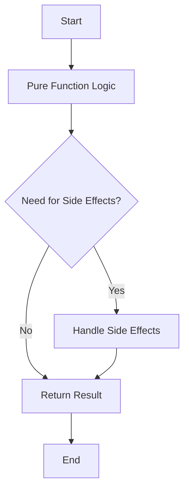

## 28.8. Balancing Functional and Pragmatic Approaches

In the realm of software development, Elixir stands out as a language that embraces the functional programming paradigm while also offering pragmatic solutions to real-world problems. As expert software engineers and architects, it is crucial to understand how to balance these two aspects to build robust, scalable, and maintainable systems. In this section, we will delve into the core concepts of functional programming, explore when and how to apply pragmatic solutions, and discuss hybrid approaches that combine the best of both worlds.

### Embracing Functional Concepts

Functional programming is a paradigm that emphasizes immutability, pure functions, and the avoidance of side effects. Elixir, as a functional language, encourages developers to adopt these principles to create predictable and reliable software.

#### Understanding and Applying Immutability

Immutability is a cornerstone of functional programming. It refers to the idea that once a data structure is created, it cannot be changed. This concept leads to several benefits, including easier reasoning about code, improved concurrency, and reduced chances of bugs due to unintended side effects.

**Example: Immutability in Elixir**

```elixir
# Define a list
original_list = [1, 2, 3]

# Attempt to modify the list
new_list = [0 | original_list]

IO.inspect(original_list) # Output: [1, 2, 3]
IO.inspect(new_list)      # Output: [0, 1, 2, 3]
```

In this example, `original_list` remains unchanged, demonstrating immutability. Instead, a new list `new_list` is created with the desired modifications.

#### Pure Functions

Pure functions are another fundamental concept in functional programming. A pure function is one that, given the same input, will always produce the same output and has no side effects.

**Example: Pure Function in Elixir**

```elixir
defmodule Math do
  def add(a, b) do
    a + b
  end
end

IO.inspect(Math.add(2, 3)) # Output: 5
```

The `add` function is pure because it consistently returns the same result for the same inputs and does not modify any external state.

### Pragmatic Solutions

While functional programming offers many advantages, there are situations where strict adherence to its principles may not be practical. In such cases, pragmatic solutions can be employed to achieve the desired outcome without compromising the overall integrity of the system.

#### Making Practical Decisions

In real-world applications, developers often face scenarios where side effects are necessary, such as interacting with databases, handling user input, or managing state. In these cases, it is essential to make practical decisions that balance functional purity with the need for side effects.

**Example: Handling Side Effects in Elixir**

```elixir
defmodule FileHandler do
  def read_file(path) do
    case File.read(path) do
      {:ok, content} -> {:ok, content}
      {:error, reason} -> {:error, reason}
    end
  end
end

# Reading a file involves side effects, but is necessary for functionality
IO.inspect(FileHandler.read_file("example.txt"))
```

In this example, reading a file is inherently a side effect, but it is managed in a way that maintains the function's predictability by returning a tuple indicating success or failure.

### Hybrid Approaches

Combining functional paradigms with necessary side effects can lead to a hybrid approach that leverages the strengths of both functional and imperative programming.

#### Combining Functional Paradigms with Side Effects

One effective strategy is to isolate side effects from the core logic of the application. This can be achieved by using functional constructs to handle the main logic and reserving side effects for specific modules or functions.

**Example: Hybrid Approach in Elixir**

```elixir
defmodule Calculator do
  def calculate(a, b, operation) do
    case operation do
      :add -> a + b
      :subtract -> a - b
      :multiply -> a * b
      :divide -> a / b
    end
  end
end

defmodule Logger do
  def log_result(result) do
    IO.puts("The result is: #{result}")
  end
end

# Main function that combines pure calculation with logging side effect
defmodule Main do
  def run do
    result = Calculator.calculate(10, 5, :add)
    Logger.log_result(result)
  end
end

Main.run()
```

In this example, the `Calculator` module handles pure calculations, while the `Logger` module manages the side effect of logging the result. This separation of concerns allows for a clear distinction between functional logic and side effects.

### Visualizing the Balance

To better understand the balance between functional and pragmatic approaches, let's visualize the flow of a typical Elixir application that combines these paradigms.



This flowchart illustrates how an application can begin with pure function logic, assess the need for side effects, handle them appropriately, and ultimately return a result.

### Key Considerations

When balancing functional and pragmatic approaches, consider the following:

- **Maintainability**: Ensure that the code remains easy to understand and modify.
- **Testability**: Keep pure functions separate from side effects to facilitate testing.
- **Performance**: Evaluate the impact of functional constructs on performance and optimize where necessary.
- **Scalability**: Design the system to handle increased load without sacrificing functional principles.

### Elixir's Unique Features

Elixir offers several unique features that support both functional and pragmatic approaches:

- **Pattern Matching**: Enables concise and expressive code, making it easier to implement functional logic.
- **Supervision Trees**: Provide a robust mechanism for managing side effects and ensuring fault tolerance.
- **Concurrency**: Leverages the BEAM VM to handle side effects concurrently, maintaining system responsiveness.

### Differences and Similarities

While functional and pragmatic approaches may seem at odds, they share common goals of building reliable and efficient software. The key difference lies in how they achieve these goals, with functional programming focusing on immutability and purity, and pragmatic solutions emphasizing practicality and flexibility.

### Conclusion

Balancing functional and pragmatic approaches in Elixir development requires a deep understanding of both paradigms and the ability to apply them judiciously. By embracing functional concepts, making practical decisions, and adopting hybrid approaches, developers can create systems that are both robust and adaptable.

### Try It Yourself

Experiment with the code examples provided in this section. Try modifying the `Calculator` module to include additional operations or change the `Logger` module to write results to a file instead of printing to the console. Observe how these changes affect the balance between functional and pragmatic approaches.

### Knowledge Check

- What are the benefits of immutability in functional programming?
- How can side effects be managed responsibly in Elixir?
- What are some key considerations when balancing functional and pragmatic approaches?

### Embrace the Journey

Remember, this is just the beginning. As you progress, you'll discover more ways to balance functional and pragmatic approaches in Elixir development. Keep experimenting, stay curious, and enjoy the journey!

## Quiz: Balancing Functional and Pragmatic Approaches



### What is a key benefit of immutability in functional programming?

- [x] Easier reasoning about code
- [ ] Increased complexity
- [ ] More side effects
- [ ] Slower performance

> **Explanation:** Immutability simplifies reasoning about code by ensuring data structures do not change unexpectedly.

### What is a pure function?

- [x] A function that always returns the same output for the same input
- [ ] A function that modifies external state
- [ ] A function with side effects
- [ ] A function that depends on global variables

> **Explanation:** Pure functions have no side effects and consistently return the same output for the same input.

### How can side effects be managed in Elixir?

- [x] By isolating them in specific modules or functions
- [ ] By mixing them with pure functions
- [ ] By avoiding them entirely
- [ ] By using global variables

> **Explanation:** Isolating side effects helps maintain the predictability and testability of the code.

### What is a hybrid approach in Elixir?

- [x] Combining functional paradigms with necessary side effects
- [ ] Using only pure functions
- [ ] Avoiding side effects entirely
- [ ] Relying on global state

> **Explanation:** A hybrid approach leverages both functional and imperative programming to achieve desired outcomes.

### What is a unique feature of Elixir that supports functional programming?

- [x] Pattern matching
- [ ] Global variables
- [ ] Mutable state
- [ ] Side effects

> **Explanation:** Pattern matching in Elixir enables concise and expressive functional code.

### Why is it important to separate pure functions from side effects?

- [x] To facilitate testing
- [ ] To increase complexity
- [ ] To reduce performance
- [ ] To use more global variables

> **Explanation:** Separating pure functions from side effects makes testing easier and more reliable.

### What is a key consideration when balancing functional and pragmatic approaches?

- [x] Maintainability
- [ ] Increasing side effects
- [ ] Reducing testability
- [ ] Using more global state

> **Explanation:** Maintainability ensures the code remains easy to understand and modify.

### How does Elixir handle concurrency?

- [x] By leveraging the BEAM VM
- [ ] By using global variables
- [ ] By avoiding side effects
- [ ] By relying on mutable state

> **Explanation:** Elixir uses the BEAM VM to efficiently manage concurrency and side effects.

### What is the purpose of supervision trees in Elixir?

- [x] To manage side effects and ensure fault tolerance
- [ ] To increase side effects
- [ ] To reduce performance
- [ ] To use more global variables

> **Explanation:** Supervision trees provide a robust mechanism for managing side effects and ensuring system reliability.

### True or False: Functional and pragmatic approaches share common goals of building reliable and efficient software.

- [x] True
- [ ] False

> **Explanation:** Both approaches aim to create reliable and efficient software, though they achieve these goals through different means.


