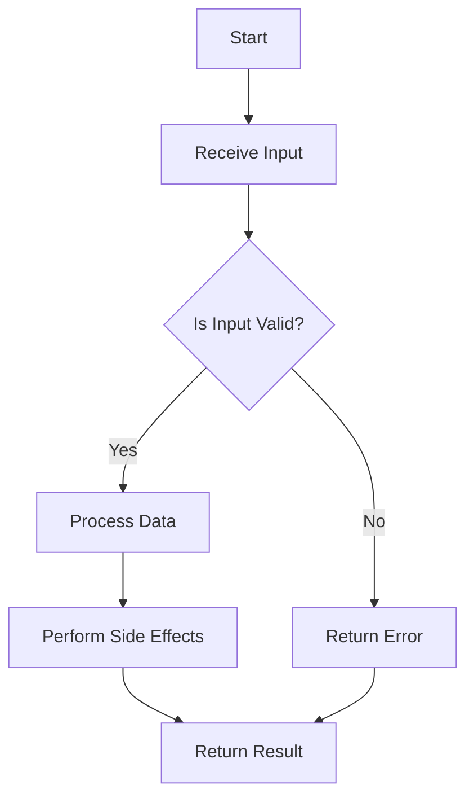

## 28.8. Balancing Functional and Pragmatic Approaches

In the realm of Elixir development, expert software engineers and architects often find themselves navigating the delicate balance between adhering to functional programming principles and adopting pragmatic solutions. This section delves into the intricacies of this balance, exploring how to embrace functional concepts while making practical decisions in real-world applications.

### Embracing Functional Concepts

Functional programming emphasizes immutability and pure functions, which are foundational to Elixir's design. Let's explore these concepts and how they contribute to building robust and maintainable systems.

#### Understanding Immutability

Immutability is the concept that once a data structure is created, it cannot be altered. This principle is central to functional programming and offers several benefits:

- **Predictability**: Immutable data structures ensure that functions do not have side effects, making them easier to reason about.
- **Concurrency**: Immutability simplifies concurrent programming by eliminating race conditions and the need for locks.
- **Debugging**: With immutable data, the state of the system at any point in time is consistent, aiding in debugging.

```elixir
# Example of immutability in Elixir
list = [1, 2, 3]
new_list = [0 | list]

IO.inspect(list)      # Output: [1, 2, 3]
IO.inspect(new_list)  # Output: [0, 1, 2, 3]
```

In this example, `list` remains unchanged when `new_list` is created, demonstrating immutability.

#### Pure Functions

Pure functions are those whose output is determined solely by their input values, without observable side effects. They offer several advantages:

- **Testability**: Pure functions are easier to test because they do not rely on external state.
- **Composability**: Functions can be composed together to build more complex operations.
- **Referential Transparency**: Pure functions can be replaced with their output value without changing the program's behavior.

```elixir
# Example of a pure function
defmodule Math do
  def add(a, b), do: a + b
end

IO.inspect(Math.add(2, 3))  # Output: 5
```

Here, the `add` function is pure because it always produces the same output for the same inputs.

### Pragmatic Solutions

While functional programming offers many advantages, there are scenarios where strict adherence to functional principles may not be practical. Pragmatic solutions involve making informed decisions that balance these principles with real-world constraints.

#### Handling Side Effects

In practice, applications need to perform side effects such as I/O operations, state management, and interactions with external systems. Elixir provides constructs to handle these effectively:

- **Processes**: Use processes to encapsulate state and manage side effects.
- **GenServer**: Leverage GenServer for managing stateful processes with a functional interface.

```elixir
# Example of using GenServer to manage state
defmodule Counter do
  use GenServer

  # Client API
  def start_link(initial_value) do
    GenServer.start_link(__MODULE__, initial_value, name: __MODULE__)
  end

  def increment do
    GenServer.call(__MODULE__, :increment)
  end

  # Server Callbacks
  def init(initial_value) do
    {:ok, initial_value}
  end

  def handle_call(:increment, _from, state) do
    {:reply, state + 1, state + 1}
  end
end

Counter.start_link(0)
IO.inspect(Counter.increment())  # Output: 1
```

In this example, `Counter` uses GenServer to manage state changes while maintaining a functional interface.

#### Performance Considerations

In some cases, performance constraints may necessitate deviations from pure functional approaches. Consider using mutable data structures or optimizing algorithms when performance is critical.

- **ETS (Erlang Term Storage)**: Use ETS for fast, in-memory storage that allows concurrent reads and writes.
- **NIFs (Native Implemented Functions)**: Implement performance-critical code in C for efficiency.

```elixir
# Example of using ETS for performance
:ets.new(:my_table, [:named_table, :public])

:ets.insert(:my_table, {:key, "value"})
value = :ets.lookup(:my_table, :key)

IO.inspect(value)  # Output: [{:key, "value"}]
```

ETS provides a pragmatic solution for high-performance data storage in Elixir.

### Hybrid Approaches

Hybrid approaches involve combining functional paradigms with necessary side effects in a responsible manner. This section explores strategies for achieving this balance.

#### Using Functional Interfaces for Side-Effectful Operations

Design modules and functions to provide a functional interface, even when they perform side effects. This approach maintains the benefits of functional programming while accommodating real-world needs.

- **Encapsulation**: Encapsulate side effects within modules, exposing only pure functions to the outside world.
- **Separation of Concerns**: Separate pure logic from side-effectful operations to enhance maintainability.

```elixir
# Example of encapsulating side effects
defmodule Logger do
  def log(message) do
    IO.puts("[LOG] #{message}")
  end
end

defmodule Calculator do
  def add(a, b) do
    result = a + b
    Logger.log("Adding #{a} and #{b}, result: #{result}")
    result
  end
end

IO.inspect(Calculator.add(2, 3))  # Output: 5
```

In this example, `Logger` encapsulates the side effect of printing to the console, while `Calculator` remains focused on computation.

#### Leveraging Elixir's Features

Elixir provides powerful features that facilitate hybrid approaches:

- **Pattern Matching**: Use pattern matching to handle different cases and simplify logic.
- **Pipelines**: Leverage pipelines to compose functions and streamline data transformations.

```elixir
# Example of using pipelines and pattern matching
defmodule DataProcessor do
  def process(data) do
    data
    |> Enum.map(&transform/1)
    |> Enum.filter(&filter/1)
  end

  defp transform(item), do: item * 2
  defp filter(item), do: rem(item, 3) == 0
end

IO.inspect(DataProcessor.process([1, 2, 3, 4, 5, 6]))  # Output: [6, 12]
```

This example demonstrates how pipelines and pattern matching can be combined to create clean and efficient data processing logic.

### Visualizing Functional and Pragmatic Approaches

To better understand the balance between functional and pragmatic approaches, let's visualize the flow of a typical Elixir application that combines these paradigms.


```mermaid
graph TD;
    A[Start] --> B[Receive Input];
    B --> C{Is Input Valid?};
    C -- Yes --> D[Process Data];
    C -- No --> E[Return Error];
    D --> F[Perform Side Effects];
    F --> G[Return Result];
    E --> G;
```

**Diagram Description**: This flowchart illustrates the typical flow of an Elixir application, where input is received and validated. If valid, data is processed and side effects are performed before returning the result. If invalid, an error is returned.

### References and Links

- [Elixir Official Documentation](https://elixir-lang.org/docs.html)
- [Functional Programming Concepts](https://www.martinfowler.com/articles/functional-programming.html)
- [Erlang Term Storage (ETS)](https://erlang.org/doc/man/ets.html)

### Knowledge Check

- How does immutability contribute to concurrency in Elixir?
- What are the benefits of using pure functions in software design?
- When might you choose to use ETS over traditional Elixir data structures?

### Embrace the Journey

Balancing functional and pragmatic approaches in Elixir is an ongoing journey. As you continue to develop your skills, remember that the goal is to create systems that are both robust and practical. Keep exploring, stay curious, and enjoy the process of mastering Elixir's unique blend of functional programming and real-world applicability.

### Quiz Time!



### What is immutability in functional programming?

- [x] Data structures cannot be altered once created
- [ ] Data structures can be changed at any time
- [ ] Functions can have side effects
- [ ] Variables can be reassigned

> **Explanation:** Immutability means that data structures cannot be changed once they are created, which is a core principle of functional programming.

### What is a pure function?

- [x] A function that always produces the same output for the same input
- [ ] A function that has side effects
- [ ] A function that can modify global state
- [ ] A function that relies on external inputs

> **Explanation:** A pure function's output is solely determined by its input, with no side effects or reliance on external state.

### How can side effects be managed in Elixir?

- [x] By using processes and GenServers
- [ ] By using mutable variables
- [ ] By avoiding all I/O operations
- [ ] By directly modifying state

> **Explanation:** Elixir manages side effects using processes and GenServers, allowing stateful operations while maintaining a functional interface.

### Why might you use ETS in Elixir?

- [x] For fast, in-memory storage with concurrent access
- [ ] For storing data on disk
- [ ] For handling HTTP requests
- [ ] For managing user sessions

> **Explanation:** ETS is used for efficient, in-memory storage that supports concurrent reads and writes.

### What is the benefit of using pipelines in Elixir?

- [x] They streamline data transformations and function composition
- [ ] They allow for mutable state
- [ ] They enable direct database access
- [ ] They facilitate network communication

> **Explanation:** Pipelines in Elixir help in composing functions and transforming data in a clean and efficient manner.

### What is the role of pattern matching in Elixir?

- [x] To simplify logic by handling different cases
- [ ] To allow mutable variables
- [ ] To enable direct I/O operations
- [ ] To perform database queries

> **Explanation:** Pattern matching simplifies logic by allowing different cases to be handled in a concise and readable way.

### How does GenServer help in managing state?

- [x] By encapsulating state within a process
- [ ] By using global variables
- [ ] By allowing direct state modification
- [ ] By avoiding all stateful operations

> **Explanation:** GenServer encapsulates state within a process, providing a structured way to manage stateful operations.

### What is a hybrid approach in Elixir?

- [x] Combining functional paradigms with necessary side effects
- [ ] Using only functional programming principles
- [ ] Avoiding all side effects
- [ ] Using mutable state exclusively

> **Explanation:** A hybrid approach in Elixir combines functional programming with necessary side effects to address real-world needs.

### How does separating pure logic from side effects enhance maintainability?

- [x] It keeps the codebase organized and easier to understand
- [ ] It allows for more side effects
- [ ] It enables direct state modification
- [ ] It reduces the need for testing

> **Explanation:** Separating pure logic from side effects keeps the codebase organized and makes it easier to understand and maintain.

### Is it possible to achieve zero side effects in a real-world application?

- [ ] True
- [x] False

> **Explanation:** In real-world applications, some side effects are inevitable, such as I/O operations and state management.


