## 28.9. Ethical Considerations in Software Development

In the rapidly evolving world of software development, ethical considerations have become paramount. As expert developers and architects, we hold the power to shape the digital landscape. This power comes with the responsibility to ensure that our creations are not only functional and efficient but also ethical. This section delves into three critical aspects of ethical software development: **User Privacy**, **Inclusive Design**, and **Social Responsibility**.

### User Privacy

#### Respecting User Data

User privacy is a cornerstone of ethical software development. With the increasing amount of personal data being collected, it is crucial to handle this information with care and respect. Developers must adhere to privacy laws and regulations, such as the General Data Protection Regulation (GDPR) in Europe and the California Consumer Privacy Act (CCPA) in the United States.

**Key Principles:**

- **Data Minimization:** Collect only the data that is necessary for the functionality of your application. Avoid gathering excessive information that could compromise user privacy.
  
- **Transparency:** Clearly inform users about what data is being collected, how it will be used, and who will have access to it. Provide users with easy-to-understand privacy policies.

- **User Consent:** Obtain explicit consent from users before collecting or processing their data. Implement mechanisms for users to withdraw consent easily.

- **Data Security:** Protect user data with robust security measures. Use encryption, secure storage, and regular security audits to prevent unauthorized access.

- **Anonymization:** Where possible, anonymize user data to protect individual identities. This can help mitigate risks in case of a data breach.

#### Code Example: Implementing Data Encryption in Elixir

```elixir
defmodule SecureData do
  @moduledoc """
  A module for encrypting and decrypting user data.
  """

  @key :crypto.strong_rand_bytes(32)

  @doc """
  Encrypts the given data using AES encryption.
  """
  def encrypt(data) do
    :crypto.block_encrypt(:aes_gcm, @key, <<0::96>>, data)
  end

  @doc """
  Decrypts the given encrypted data.
  """
  def decrypt(encrypted_data) do
    :crypto.block_decrypt(:aes_gcm, @key, <<0::96>>, encrypted_data)
  end
end
```

**Try It Yourself:** Modify the code to use a different encryption algorithm or key size. Experiment with encrypting and decrypting different types of data.

### Inclusive Design

#### Creating Accessible Applications

Inclusive design ensures that software is accessible to all users, regardless of their abilities or disabilities. It is an ethical imperative to create applications that do not exclude any group of people.

**Key Principles:**

- **Universal Design:** Design applications that can be used by the widest range of people possible. Consider users with visual, auditory, motor, or cognitive impairments.

- **Assistive Technologies:** Ensure compatibility with assistive technologies such as screen readers, voice recognition software, and alternative input devices.

- **Responsive Design:** Create interfaces that adapt to different screen sizes and orientations, making them accessible on various devices.

- **Clear Navigation:** Design intuitive navigation structures that are easy to understand and use. Avoid complex menus and ensure that all interactive elements are clearly labeled.

- **Testing for Accessibility:** Regularly test your applications for accessibility using tools like WAVE or Axe. Include users with disabilities in your testing process to gain valuable insights.

#### Code Example: Implementing Accessible Navigation in Phoenix

```elixir
defmodule MyAppWeb.Router do
  use MyAppWeb, :router

  pipeline :browser do
    plug :accepts, ["html"]
    plug :fetch_session
    plug :fetch_flash
    plug :protect_from_forgery
    plug :put_secure_browser_headers
  end

  scope "/", MyAppWeb do
    pipe_through :browser

    get "/", PageController, :index
    get "/about", PageController, :about
    get "/contact", PageController, :contact
  end
end
```

**Try It Yourself:** Add ARIA (Accessible Rich Internet Applications) attributes to your HTML templates to improve accessibility for users with screen readers.

### Social Responsibility

#### Considering the Broader Impact

Software development does not occur in a vacuum. The applications we create can have significant impacts on society, both positive and negative. As developers, we must consider these impacts and strive to contribute positively to the world.

**Key Principles:**

- **Ethical AI:** When developing AI systems, ensure they are free from bias and do not perpetuate discrimination. Implement fairness, accountability, and transparency in AI algorithms.

- **Environmental Impact:** Consider the environmental impact of your software. Optimize code for energy efficiency and reduce the carbon footprint of data centers.

- **Digital Wellbeing:** Design applications that promote healthy usage patterns. Avoid addictive design practices and provide users with tools to manage their digital wellbeing.

- **Community Engagement:** Engage with the communities affected by your software. Gather feedback and involve them in the development process to ensure their needs are met.

- **Open Source Contribution:** Contribute to open source projects and share your knowledge with the community. This fosters collaboration and innovation in the software industry.

#### Code Example: Implementing a Feedback System in Elixir

```elixir
defmodule Feedback do
  @moduledoc """
  A module for collecting user feedback.
  """

  @feedbacks Agent.start_link(fn -> [] end, name: __MODULE__)

  @doc """
  Adds a feedback entry.
  """
  def add_feedback(user_id, message) do
    Agent.update(@feedbacks, fn feedbacks -> [{user_id, message} | feedbacks] end)
  end

  @doc """
  Retrieves all feedback entries.
  """
  def get_feedbacks do
    Agent.get(@feedbacks, fn feedbacks -> feedbacks end)
  end
end
```

**Try It Yourself:** Extend the feedback system to categorize feedback by type (e.g., bug report, feature request) and implement a mechanism to respond to users.

### Visualizing Ethical Considerations

To better understand the interplay between user privacy, inclusive design, and social responsibility, let's visualize these concepts using a Venn diagram.

```mermaid
graph TD;
    A[User Privacy] --> B[Data Minimization];
    A --> C[Transparency];
    A --> D[User Consent];
    A --> E[Data Security];
    A --> F[Anonymization];
    G[Inclusive Design] --> H[Universal Design];
    G --> I[Assistive Technologies];
    G --> J[Responsive Design];
    G --> K[Clear Navigation];
    G --> L[Testing for Accessibility];
    M[Social Responsibility] --> N[Ethical AI];
    M --> O[Environmental Impact];
    M --> P[Digital Wellbeing];
    M --> Q[Community Engagement];
    M --> R[Open Source Contribution];
    A & G & M --> S[Ethical Software Development];
```



**Diagram Description:** This diagram illustrates the key components of ethical software development, showing how user privacy, inclusive design, and social responsibility intersect to form a comprehensive ethical framework.

### References and Links

- [General Data Protection Regulation (GDPR)](https://gdpr-info.eu/)
- [California Consumer Privacy Act (CCPA)](https://oag.ca.gov/privacy/ccpa)
- [WAVE Web Accessibility Evaluation Tool](https://wave.webaim.org/)
- [Axe Accessibility Testing Tool](https://www.deque.com/axe/)
- [Open Source Initiative](https://opensource.org/)

### Knowledge Check

- **Question:** What is the primary goal of data minimization in user privacy?
  - **Answer:** To collect only the data necessary for the application's functionality.

- **Question:** Name one tool that can be used to test web accessibility.
  - **Answer:** WAVE or Axe.

- **Question:** Why is it important to consider the environmental impact of software?
  - **Answer:** To reduce the carbon footprint and promote sustainable development.

### Embrace the Journey

Remember, ethical software development is an ongoing journey. As you continue to hone your skills and create innovative applications, keep these ethical considerations at the forefront of your mind. By doing so, you'll contribute to a more inclusive, respectful, and responsible digital world. Keep experimenting, stay curious, and enjoy the journey!

### Quiz: Ethical Considerations in Software Development



### What is the primary goal of data minimization in user privacy?

- [x] To collect only the data necessary for the application's functionality.
- [ ] To collect as much data as possible for analysis.
- [ ] To store user data indefinitely.
- [ ] To share user data with third parties.

> **Explanation:** Data minimization aims to limit data collection to what is necessary, reducing privacy risks.

### Which of the following is a principle of inclusive design?

- [x] Universal Design
- [ ] Data Encryption
- [ ] User Consent
- [ ] Anonymization

> **Explanation:** Universal Design is a principle of inclusive design, focusing on accessibility for all users.

### What is a key consideration in ethical AI development?

- [x] Ensuring algorithms are free from bias.
- [ ] Maximizing data collection.
- [ ] Prioritizing speed over accuracy.
- [ ] Ignoring user feedback.

> **Explanation:** Ethical AI development involves creating algorithms that are fair and unbiased.

### Which tool can be used to test web accessibility?

- [x] WAVE
- [ ] GDPR
- [ ] CCPA
- [ ] AES

> **Explanation:** WAVE is a tool for evaluating web accessibility, helping developers ensure their applications are accessible.

### What is the purpose of anonymizing user data?

- [x] To protect individual identities in case of a data breach.
- [ ] To increase data storage requirements.
- [x] To comply with privacy laws.
- [ ] To make data analysis more difficult.

> **Explanation:** Anonymization protects user identities and helps comply with privacy regulations.

### Why is community engagement important in software development?

- [x] To gather feedback and ensure the software meets user needs.
- [ ] To increase the complexity of the development process.
- [ ] To reduce the number of users.
- [ ] To prioritize developer preferences over user needs.

> **Explanation:** Engaging with the community helps developers create software that aligns with user needs and expectations.

### What is a benefit of open source contribution?

- [x] Fostering collaboration and innovation.
- [ ] Keeping code proprietary.
- [x] Sharing knowledge with the community.
- [ ] Limiting software distribution.

> **Explanation:** Open source contribution encourages collaboration and knowledge sharing, driving innovation.

### What is a key aspect of digital wellbeing in software design?

- [x] Promoting healthy usage patterns.
- [ ] Encouraging addictive design practices.
- [ ] Maximizing screen time.
- [ ] Ignoring user feedback.

> **Explanation:** Digital wellbeing focuses on creating software that supports healthy and balanced usage.

### What is the role of encryption in user privacy?

- [x] To protect user data from unauthorized access.
- [ ] To increase data collection.
- [ ] To simplify data analysis.
- [ ] To share data with third parties.

> **Explanation:** Encryption secures user data, preventing unauthorized access and enhancing privacy.

### True or False: Ethical software development is a one-time effort.

- [ ] True
- [x] False

> **Explanation:** Ethical software development is an ongoing process that requires continuous attention and adaptation.


