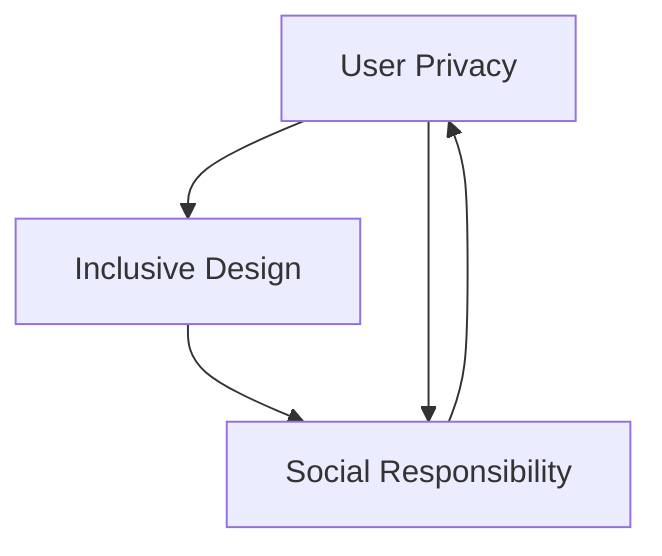

## 28.9. Ethical Considerations in Software Development

In today's rapidly evolving technological landscape, ethical considerations in software development are more important than ever. As expert Elixir developers, we have the power to shape the digital world. With this power comes the responsibility to ensure that the software we create is not only functional and efficient but also ethical. This section explores the key ethical considerations in software development, focusing on user privacy, inclusive design, and social responsibility.

### User Privacy

User privacy is a cornerstone of ethical software development. As developers, we must respect user data and adhere to privacy laws. This involves understanding the legal frameworks that govern data protection and implementing best practices to safeguard user information.

#### Understanding Privacy Laws

Privacy laws vary by region, but some of the most influential include the General Data Protection Regulation (GDPR) in Europe and the California Consumer Privacy Act (CCPA) in the United States. These laws set strict guidelines for how personal data should be collected, stored, and processed. As developers, it's crucial to familiarize ourselves with these regulations to ensure compliance.

#### Implementing Privacy by Design

Privacy by Design is a proactive approach that integrates privacy into the development process from the outset. This means considering privacy implications at every stage of the software development lifecycle. Key principles include:

- **Data Minimization**: Collect only the data necessary for the application's functionality.
- **Anonymization**: Use techniques to ensure that personal data cannot be traced back to individual users.
- **Transparency**: Clearly inform users about what data is being collected and how it will be used.

#### Code Example: Implementing Data Anonymization in Elixir

```elixir
defmodule DataAnonymizer do
  @moduledoc """
  Provides functions to anonymize user data.
  """

  @doc """
  Anonymizes a list of user data by removing personally identifiable information.
  """
  def anonymize_data(users) do
    Enum.map(users, fn user ->
      %{
        id: user.id,
        email: anonymize_email(user.email),
        name: anonymize_name(user.name)
      }
    end)
  end

  defp anonymize_email(email) do
    String.replace(email, ~r/@.*/, "@example.com")
  end

  defp anonymize_name(name) do
    String.first(name) <> "****"
  end
end
```

In this example, we anonymize user data by replacing email domains and obscuring names. This is a simple yet effective way to protect user privacy.

### Inclusive Design

Inclusive design ensures that applications are accessible to all users, regardless of their abilities or circumstances. As developers, we must strive to create software that is usable by the widest possible audience.

#### Principles of Inclusive Design

Inclusive design is guided by several key principles:

- **Equitable Use**: The design should be useful to people with diverse abilities.
- **Flexibility in Use**: The design should accommodate a wide range of individual preferences and abilities.
- **Simple and Intuitive Use**: The design should be easy to understand, regardless of the user's experience or knowledge.

#### Implementing Accessibility in Elixir Applications

To create accessible applications, we must consider various aspects such as screen readers, keyboard navigation, and color contrast. Elixir developers working with the Phoenix framework can leverage tools and libraries to enhance accessibility.

#### Code Example: Adding Accessibility Features in a Phoenix Application

```elixir
defmodule MyAppWeb.PageController do
  use MyAppWeb, :controller

  def index(conn, _params) do
    conn
    |> put_resp_content_type("text/html")
    |> render("index.html", title: "Accessible Page")
  end
end
```

In the associated `index.html.eex` template, we can add ARIA (Accessible Rich Internet Applications) attributes to enhance accessibility:

```html
<h1 aria-label="Welcome to Our Accessible Page">Welcome!</h1>
<p>This page is designed with accessibility in mind.</p>
```

By incorporating ARIA attributes, we improve the experience for users relying on assistive technologies.

### Social Responsibility

Social responsibility in software development involves considering the broader impact of our work on society. This includes ethical considerations around the use of technology and its potential consequences.

#### The Impact of Technology on Society

Technology has the power to transform society, but it can also exacerbate existing inequalities or create new challenges. As developers, we must be aware of the potential societal impacts of our work and strive to use technology for the greater good.

#### Ethical Decision-Making in Software Development

Ethical decision-making involves evaluating the potential consequences of our actions and making choices that align with our values. This can be challenging, especially when faced with complex or ambiguous situations.

#### Code Example: Implementing Ethical Features in Software

Consider a social media platform that wants to promote positive interactions while minimizing harmful content. We can implement features such as content moderation and reporting systems to support ethical use.

```elixir
defmodule ContentModeration do
  @moduledoc """
  Provides functions for moderating user-generated content.
  """

  @doc """
  Filters inappropriate content based on predefined keywords.
  """
  def filter_content(content) do
    prohibited_keywords = ["spam", "hate", "violence"]
    Enum.any?(prohibited_keywords, fn keyword -> String.contains?(content, keyword) end)
  end
end
```

In this example, we filter content based on a list of prohibited keywords. This is a basic approach to content moderation that can be expanded with more sophisticated techniques.

### Visualizing Ethical Considerations

To better understand the ethical considerations in software development, let's visualize the relationship between user privacy, inclusive design, and social responsibility.


```mermaid
graph TD;
    A[User Privacy] --> B[Inclusive Design];
    B --> C[Social Responsibility];
    A --> C;
    C --> A;
```

This diagram illustrates how these ethical considerations are interconnected and mutually reinforcing. By prioritizing these aspects, we can create software that is not only functional but also ethical.

### References and Further Reading

To deepen your understanding of ethical considerations in software development, consider exploring the following resources:

- [The General Data Protection Regulation (GDPR)](https://gdpr-info.eu/)
- [The California Consumer Privacy Act (CCPA)](https://oag.ca.gov/privacy/ccpa)
- [Web Content Accessibility Guidelines (WCAG)](https://www.w3.org/WAI/standards-guidelines/wcag/)
- [Ethical OS Toolkit](https://ethicalos.org/)

### Knowledge Check

- What are the key principles of Privacy by Design?
- How can we implement inclusive design in Elixir applications?
- What are some potential societal impacts of technology?
- How can ethical decision-making be applied in software development?

### Embrace the Journey

Remember, ethical considerations are an ongoing journey. As developers, we must continuously evaluate our practices and strive to improve. By prioritizing ethics in our work, we contribute to a more just and equitable digital world. Keep exploring, stay curious, and enjoy the journey!

## Quiz Time!



### Which of the following is a principle of Privacy by Design?

- [x] Data Minimization
- [ ] Data Maximization
- [ ] Data Duplication
- [ ] Data Obfuscation

> **Explanation:** Data Minimization is a key principle of Privacy by Design, emphasizing the collection of only necessary data.

### What is the purpose of ARIA attributes in web development?

- [x] To enhance accessibility for users with disabilities
- [ ] To improve website speed
- [ ] To optimize search engine rankings
- [ ] To increase visual appeal

> **Explanation:** ARIA attributes are used to improve accessibility by providing additional information to assistive technologies.

### Which law governs data protection in Europe?

- [x] GDPR
- [ ] CCPA
- [ ] HIPAA
- [ ] COPPA

> **Explanation:** The General Data Protection Regulation (GDPR) is the primary data protection law in Europe.

### What is the main goal of inclusive design?

- [x] To create applications accessible to all users
- [ ] To optimize applications for high performance
- [ ] To reduce development costs
- [ ] To enhance visual design

> **Explanation:** Inclusive design aims to make applications accessible and usable by the widest possible audience.

### How can developers promote ethical use of technology?

- [x] By implementing features like content moderation
- [ ] By focusing solely on functionality
- [ ] By ignoring societal impacts
- [ ] By prioritizing profit over ethics

> **Explanation:** Implementing features like content moderation helps promote ethical use by minimizing harmful interactions.

### What is a potential consequence of ignoring ethical considerations in software development?

- [x] Exacerbating societal inequalities
- [ ] Improving user satisfaction
- [ ] Enhancing software performance
- [ ] Reducing development time

> **Explanation:** Ignoring ethical considerations can lead to negative societal impacts, such as exacerbating inequalities.

### What role does transparency play in user privacy?

- [x] It informs users about data collection and usage
- [ ] It enhances visual design
- [ ] It reduces application size
- [ ] It speeds up development

> **Explanation:** Transparency involves clearly informing users about what data is collected and how it will be used.

### Why is it important to consider the societal impact of technology?

- [x] Technology can transform society and create new challenges
- [ ] Technology has no impact on society
- [ ] Technology always benefits society
- [ ] Technology is neutral

> **Explanation:** Technology has the power to transform society, but it can also create challenges that need to be addressed.

### What is a key benefit of implementing Privacy by Design?

- [x] Enhanced user trust and compliance with regulations
- [ ] Increased development speed
- [ ] Reduced application complexity
- [ ] Improved visual design

> **Explanation:** Privacy by Design enhances user trust and ensures compliance with data protection regulations.

### Ethical considerations in software development are a one-time task.

- [ ] True
- [x] False

> **Explanation:** Ethical considerations are an ongoing journey that requires continuous evaluation and improvement.




