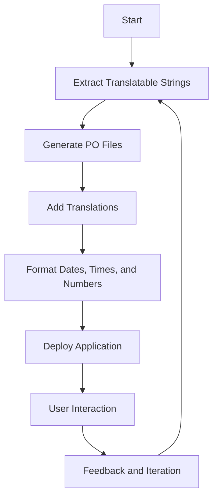

## 29.1. Introduction to i18n and l10n in Elixir

In today's interconnected world, software applications are no longer confined to local markets. They are expected to cater to a global audience, which necessitates the need for internationalization (i18n) and localization (l10n). In this section, we will delve into these concepts within the context of Elixir, a functional programming language known for its scalability and fault tolerance.

### Global Reach

Expanding your applications to support users worldwide is not just about translating text. It involves adapting your software to meet the cultural, linguistic, and technical needs of users from different regions. This process is crucial for enhancing user experience and increasing market reach.

### Understanding Concepts

#### Internationalization (i18n)

Internationalization is the process of designing your software in a way that makes it easy to adapt to various languages and regions without requiring engineering changes. It involves:

- **Separation of Text and Code**: Ensuring that all user-visible text is stored separately from the codebase.
- **Use of Locale Files**: Creating files that contain translations for different languages.
- **Flexible Date and Time Formats**: Allowing for different date and time representations based on locale.
- **Number and Currency Formatting**: Supporting various formats for numbers and currencies.

#### Localization (l10n)

Localization is the adaptation of your software to meet the specific needs of a particular region or culture. This includes:

- **Translation of Text**: Converting text into the language of the target audience.
- **Cultural Adaptation**: Modifying content to align with cultural norms and expectations.
- **Legal and Regulatory Compliance**: Ensuring that the software adheres to local laws and regulations.
- **Support for Local Formats**: Adapting formats for dates, times, numbers, and currencies.

### Implementing i18n and l10n in Elixir

Elixir provides robust tools and libraries to facilitate internationalization and localization. Let's explore how you can implement these concepts in your Elixir applications.

#### Using Gettext for Localization

Gettext is a popular library in the Elixir ecosystem that provides a framework for internationalizing and localizing applications. It allows developers to extract translatable strings from their code and manage translations efficiently.

##### Setting Up Gettext

To start using Gettext in your Elixir project, you need to add it as a dependency in your `mix.exs` file:

```elixir
defp deps do
  [
    {:gettext, "~> 0.18"}
  ]
end
```

Run `mix deps.get` to fetch the dependency.

##### Creating a Gettext Module

Create a Gettext module in your application to handle translations:

```elixir
defmodule MyApp.Gettext do
  use Gettext, otp_app: :my_app
end
```

This module will serve as the entry point for all translation-related functions.

##### Extracting Translatable Strings

Use the `gettext` function to mark strings for translation:

```elixir
import MyApp.Gettext

def greet_user(name) do
  IO.puts(gettext("Hello, %{name}!", name: name))
end
```

The `gettext` function extracts the string "Hello, %{name}!" for translation.

##### Generating PO Files

Run `mix gettext.extract` to generate Portable Object (PO) files, which contain the translatable strings. These files are located in the `priv/gettext` directory.

##### Translating Strings

Edit the PO files to add translations for different languages. For example, to translate to Spanish, you would modify the `es/LC_MESSAGES/default.po` file:

```
msgid "Hello, %{name}!"
msgstr "¡Hola, %{name}!"
```

##### Using Translations

Once translations are added, the `gettext` function will automatically use the appropriate translation based on the user's locale.

#### Handling Date, Time, and Number Formats

Elixir provides the `Timex` library for handling date and time formatting, and the `Cldr` library for number and currency formatting.

##### Formatting Dates and Times with Timex

Add Timex to your dependencies:

```elixir
defp deps do
  [
    {:timex, "~> 3.7"}
  ]
end
```

Use Timex to format dates and times based on locale:

```elixir
import Timex

def format_date(date, locale) do
  Timex.format!(date, "{ISO:Extended}", locale: locale)
end
```

##### Formatting Numbers and Currencies with Cldr

Add Cldr to your dependencies:

```elixir
defp deps do
  [
    {:ex_cldr, "~> 2.0"},
    {:ex_cldr_numbers, "~> 2.0"}
  ]
end
```

Use Cldr to format numbers and currencies:

```elixir
import Cldr.Number

def format_currency(amount, currency, locale) do
  Cldr.Number.to_string!(amount, currency: currency, locale: locale)
end
```

### Visualizing the i18n and l10n Workflow

To better understand the workflow of internationalization and localization in Elixir, let's visualize the process using a Mermaid.js flowchart.



**Figure 1: Internationalization and Localization Workflow in Elixir**

This diagram illustrates the cyclical nature of i18n and l10n, emphasizing the importance of continuous feedback and iteration.

### Challenges and Best Practices

#### Challenges

- **Complexity**: Managing translations and locale-specific formats can be complex, especially for large applications.
- **Consistency**: Ensuring consistency across different languages and regions is crucial for maintaining a cohesive user experience.
- **Performance**: Loading and processing translations can impact performance, especially if not optimized.

#### Best Practices

- **Centralize Translations**: Keep all translations in a central location to simplify management and updates.
- **Automate Extraction**: Use tools to automate the extraction of translatable strings to reduce manual effort.
- **Test Thoroughly**: Test your application in different locales to ensure that all translations and formats are correct.
- **Monitor Performance**: Use caching and other techniques to optimize the performance of your internationalized application.

### Try It Yourself

To solidify your understanding of i18n and l10n in Elixir, try modifying the code examples provided. Experiment with adding new languages, changing date and time formats, and optimizing performance. This hands-on approach will help you gain practical experience and confidence in implementing these concepts.

### References and Further Reading

- [Elixir Gettext Documentation](https://hexdocs.pm/gettext)
- [Timex Library for Date and Time](https://hexdocs.pm/timex)
- [Cldr for Number and Currency Formatting](https://hexdocs.pm/ex_cldr)
- [MDN Web Docs on Internationalization](https://developer.mozilla.org/en-US/docs/Web/JavaScript/Guide/Internationalization)
- [W3C Internationalization Activity](https://www.w3.org/International/)

### Knowledge Check

- What is the difference between internationalization and localization?
- How does Gettext facilitate localization in Elixir?
- What are some challenges associated with i18n and l10n?
- How can you optimize the performance of an internationalized application?

### Embrace the Journey

Remember, mastering internationalization and localization is a journey. As you progress, you'll build more inclusive and user-friendly applications. Keep experimenting, stay curious, and enjoy the process of making your software accessible to a global audience.

## Quiz: Introduction to i18n and l10n in Elixir



### What is the primary goal of internationalization (i18n)?

- [x] To design software that can be easily adapted to various languages and regions.
- [ ] To translate software into multiple languages.
- [ ] To ensure software complies with local laws.
- [ ] To optimize software performance.

> **Explanation:** Internationalization focuses on designing software that can be easily adapted to different languages and regions without requiring engineering changes.

### Which Elixir library is commonly used for localization?

- [ ] Timex
- [x] Gettext
- [ ] Cldr
- [ ] Phoenix

> **Explanation:** Gettext is a popular library in Elixir for managing translations and facilitating localization.

### What is the role of PO files in localization?

- [x] They contain translatable strings and their translations.
- [ ] They store user preferences.
- [ ] They manage application configurations.
- [ ] They handle date and time formatting.

> **Explanation:** PO files are used to store translatable strings and their corresponding translations for different languages.

### How can you format dates and times in Elixir based on locale?

- [ ] Using Gettext
- [x] Using Timex
- [ ] Using Cldr
- [ ] Using Phoenix

> **Explanation:** Timex is a library in Elixir that provides tools for formatting dates and times based on locale.

### What is a key challenge in implementing i18n and l10n?

- [x] Managing translations and locale-specific formats.
- [ ] Writing efficient algorithms.
- [ ] Ensuring code readability.
- [ ] Implementing security features.

> **Explanation:** Managing translations and locale-specific formats can be complex, especially for large applications.

### Which library is used for number and currency formatting in Elixir?

- [ ] Gettext
- [ ] Timex
- [x] Cldr
- [ ] Phoenix

> **Explanation:** Cldr is a library in Elixir used for formatting numbers and currencies according to locale.

### What is a best practice for managing translations?

- [x] Centralize translations in a single location.
- [ ] Store translations in the codebase.
- [ ] Use hardcoded strings.
- [ ] Translate only the main features.

> **Explanation:** Centralizing translations simplifies management and updates, ensuring consistency across the application.

### How can you optimize the performance of an internationalized application?

- [x] Use caching and other optimization techniques.
- [ ] Increase server resources.
- [ ] Reduce the number of translations.
- [ ] Limit the number of supported languages.

> **Explanation:** Caching and optimization techniques can help improve the performance of an internationalized application.

### What is the purpose of the `gettext` function in Elixir?

- [x] To mark strings for translation.
- [ ] To format dates and times.
- [ ] To manage application configurations.
- [ ] To handle user authentication.

> **Explanation:** The `gettext` function is used to mark strings for translation, facilitating the localization process.

### True or False: Localization involves adapting software to meet the cultural, linguistic, and technical needs of users from different regions.

- [x] True
- [ ] False

> **Explanation:** Localization focuses on adapting software to meet the specific needs of different regions, including cultural, linguistic, and technical aspects.


