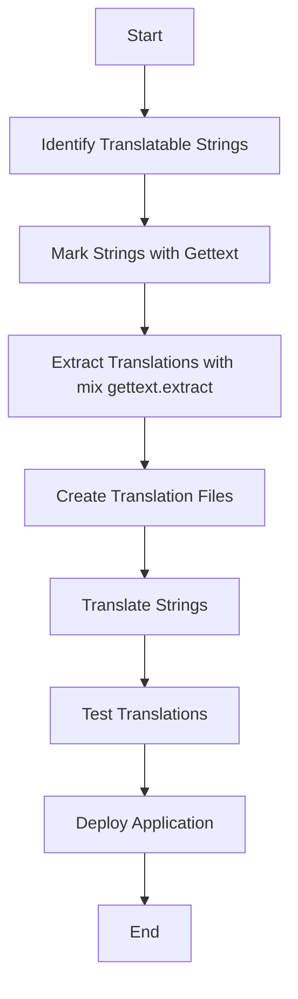

## 29.1. Introduction to i18n and l10n in Elixir

In today's interconnected world, software applications must cater to a global audience. This requires not only translating text but also adapting applications to various cultural norms and regional preferences. This process is known as internationalization (i18n) and localization (l10n). In this section, we will explore how Elixir, a functional programming language known for its scalability and fault tolerance, can be leveraged to implement i18n and l10n effectively.

### Global Reach: Expanding Applications to Support Users Worldwide

As businesses expand their reach, the importance of supporting multiple languages and regional differences becomes paramount. This is not just about translating text but also about considering cultural nuances, date formats, currency, and more. By internationalizing and localizing your Elixir applications, you can ensure a seamless user experience for audiences across the globe.

### Understanding Concepts: i18n and l10n

Before diving into the technical aspects, let's clarify the terms:

- **Internationalization (i18n):** This is the process of designing software applications so that they can be easily adapted to various languages and regions without requiring engineering changes. It involves separating text from code, supporting multiple character sets, and ensuring that the application can handle different formats for dates, numbers, and currencies.

- **Localization (l10n):** This refers to the adaptation of software for a specific region or language by translating text and adjusting the application to meet cultural expectations. Localization involves translating text, adjusting layouts, and ensuring cultural appropriateness.

### Why Internationalization and Localization Matter

The benefits of i18n and l10n are numerous:

1. **Increased Market Reach:** By supporting multiple languages, you can reach a broader audience.
2. **Improved User Experience:** Users are more likely to engage with applications in their native language.
3. **Competitive Advantage:** Offering localized content can set you apart from competitors.
4. **Compliance with Local Regulations:** Some regions have legal requirements for language support.

### Elixir's Role in i18n and l10n

Elixir, with its robust ecosystem and functional programming paradigm, provides several tools and libraries to facilitate i18n and l10n. Let's explore some of these tools and how they can be used to build internationalized and localized applications.

### Key Elixir Libraries for i18n and l10n

#### Gettext

Gettext is a popular library in the Elixir ecosystem for handling translations. It provides a simple API for marking strings for translation and supports pluralization, domain-based translations, and more.

**Installation and Setup:**

To use Gettext in your Elixir project, add it to your `mix.exs` file:

```elixir
defp deps do
  [
    {:gettext, "~> 0.18"}
  ]
end
```

Run `mix deps.get` to install the dependency.

**Configuring Gettext:**

Create a Gettext module in your application:

```elixir
defmodule MyApp.Gettext do
  use Gettext, otp_app: :my_app
end
```

**Marking Strings for Translation:**

Use the `gettext/1` function to mark strings for translation:

```elixir
import MyApp.Gettext

def greet_user(name) do
  IO.puts gettext("Hello, %{name}!", name: name)
end
```

**Generating Translation Files:**

Run `mix gettext.extract` to generate `.pot` files, which serve as templates for translations.

**Adding Translations:**

Create translation files for each locale in the `priv/gettext` directory. For example, for Spanish translations, create `priv/gettext/es/LC_MESSAGES/default.po`.

**Example Translation File:**

```po
msgid "Hello, %{name}!"
msgstr "¡Hola, %{name}!"
```

#### Pluralization and Domain-Based Translations

Gettext supports pluralization, allowing you to handle singular and plural forms of a message. It also supports domain-based translations, enabling you to organize translations into different contexts.

**Pluralization Example:**

```elixir
ngettext("You have one new message.", "You have %{count} new messages.", message_count)
```

**Domain-Based Translation Example:**

```elixir
dgettext("errors", "An error occurred.")
```

### Handling Dates, Times, and Numbers

Internationalization involves more than just translating text. It also requires handling different formats for dates, times, and numbers. Elixir provides several libraries to assist with this.

#### Timex

Timex is a comprehensive date and time library for Elixir. It supports various date and time formats, making it ideal for i18n and l10n.

**Installation:**

Add Timex to your `mix.exs` file:

```elixir
defp deps do
  [
    {:timex, "~> 3.7"}
  ]
end
```

**Formatting Dates:**

```elixir
import Timex

date = ~D[2024-11-23]
formatted_date = Timex.format!(date, "{D}/{M}/{YYYY}", :strftime)
IO.puts formatted_date  # Output: 23/11/2024
```

#### Cldr

Cldr (Common Locale Data Repository) is another powerful library for handling internationalization concerns, such as formatting numbers, currencies, and dates according to locale-specific rules.

**Installation:**

Add Cldr to your `mix.exs` file:

```elixir
defp deps do
  [
    {:ex_cldr, "~> 2.0"}
  ]
end
```

**Using Cldr for Number Formatting:**

```elixir
{:ok, number} = Cldr.Number.to_string(1234.56, locale: "fr")
IO.puts number  # Output: 1 234,56
```

### Integrating i18n and l10n in Phoenix Applications

Phoenix, the web framework for Elixir, seamlessly integrates with Gettext for i18n and l10n. When you generate a new Phoenix project, Gettext is included by default.

**Using Gettext in Phoenix:**

In your Phoenix views and controllers, you can use Gettext to translate strings:

```elixir
defmodule MyAppWeb.PageController do
  use MyAppWeb, :controller
  import MyAppWeb.Gettext

  def index(conn, _params) do
    conn
    |> put_flash(:info, gettext("Welcome to our website!"))
    |> render("index.html")
  end
end
```

### Visualizing the i18n and l10n Workflow

To better understand the workflow of implementing i18n and l10n in Elixir, let's visualize the process using a Mermaid.js diagram.


```mermaid
flowchart TD
    A[Start] --> B[Identify Translatable Strings]
    B --> C[Mark Strings with Gettext]
    C --> D[Extract Translations with mix gettext.extract]
    D --> E[Create Translation Files]
    E --> F[Translate Strings]
    F --> G[Test Translations]
    G --> H[Deploy Application]
    H --> I[End]
```

**Diagram Description:** This flowchart illustrates the process of implementing internationalization and localization in an Elixir application, from identifying translatable strings to deploying the application with translations.

### Best Practices for i18n and l10n in Elixir

1. **Plan Ahead:** Consider i18n and l10n early in the development process to avoid costly refactoring later.
2. **Use Consistent Terminology:** Ensure consistency in terminology across translations.
3. **Test Thoroughly:** Test translations in different locales to ensure accuracy and appropriateness.
4. **Leverage Community Resources:** Utilize community libraries like Gettext and Cldr to streamline the process.
5. **Automate Where Possible:** Use scripts and tools to automate the extraction and management of translations.

### Challenges and Considerations

- **Cultural Sensitivity:** Be aware of cultural differences and ensure translations are culturally appropriate.
- **Performance:** Loading multiple translation files can impact performance; optimize where possible.
- **Continuous Updates:** Maintain translations as your application evolves.

### Try It Yourself

Now that we've covered the basics, try implementing i18n and l10n in a sample Elixir application. Start by setting up Gettext, extracting translations, and testing in different locales. Experiment with Timex and Cldr for formatting dates and numbers according to locale-specific rules.

### References and Further Reading

- [Gettext Documentation](https://hexdocs.pm/gettext)
- [Timex Documentation](https://hexdocs.pm/timex)
- [Cldr Documentation](https://hexdocs.pm/ex_cldr)
- [Phoenix Framework](https://www.phoenixframework.org/)

### Knowledge Check

To reinforce your understanding, consider the following questions:

1. What are the primary differences between internationalization and localization?
2. How does Gettext facilitate i18n in Elixir applications?
3. What role does Timex play in handling date and time formats for different locales?
4. Why is cultural sensitivity important in localization?
5. How can you optimize performance when dealing with multiple translation files?

### Embrace the Journey

Remember, mastering i18n and l10n is a journey. As you progress, you'll build more inclusive and globally accessible applications. Keep experimenting, stay curious, and enjoy the journey!

## Quiz Time!



### What is the primary purpose of internationalization (i18n)?

- [x] To design software so it can be easily adapted to various languages and regions
- [ ] To translate software into multiple languages
- [ ] To adapt software for specific cultural norms
- [ ] To improve software performance

> **Explanation:** Internationalization (i18n) involves designing software so it can be easily adapted to different languages and regions without requiring engineering changes.

### Which Elixir library is commonly used for handling translations?

- [x] Gettext
- [ ] Timex
- [ ] Cldr
- [ ] Phoenix

> **Explanation:** Gettext is a popular library in Elixir for handling translations, providing a simple API for marking strings for translation.

### What is the role of localization (l10n) in software development?

- [ ] To design software for easy adaptation to various languages
- [x] To adapt software for specific regions and cultures
- [ ] To improve software security
- [ ] To enhance software scalability

> **Explanation:** Localization (l10n) involves adapting software for specific regions and cultures by translating text and adjusting the application to meet cultural expectations.

### How does Timex assist in internationalization efforts?

- [x] By supporting various date and time formats
- [ ] By translating text into different languages
- [ ] By improving application performance
- [ ] By managing user authentication

> **Explanation:** Timex is a comprehensive date and time library for Elixir that supports various date and time formats, making it ideal for internationalization efforts.

### What is a key consideration when implementing localization?

- [ ] Ensuring high performance
- [x] Cultural sensitivity
- [ ] Reducing memory usage
- [ ] Enhancing security

> **Explanation:** Cultural sensitivity is crucial in localization to ensure that translations are culturally appropriate and resonate with the target audience.

### Which command is used to generate translation files in Gettext?

- [ ] mix gettext.compile
- [x] mix gettext.extract
- [ ] mix gettext.translate
- [ ] mix gettext.build

> **Explanation:** The command `mix gettext.extract` is used to generate `.pot` files, which serve as templates for translations in Gettext.

### What is a benefit of using domain-based translations in Gettext?

- [x] Organizing translations into different contexts
- [ ] Improving application performance
- [ ] Enhancing security
- [ ] Reducing code complexity

> **Explanation:** Domain-based translations in Gettext allow developers to organize translations into different contexts, making management easier.

### How can you test translations in an Elixir application?

- [ ] By using the Phoenix framework
- [x] By testing in different locales
- [ ] By optimizing performance
- [ ] By improving security

> **Explanation:** Testing translations in different locales ensures accuracy and appropriateness, helping to identify any issues with the translations.

### What is the significance of the `gettext/1` function?

- [x] It marks strings for translation
- [ ] It formats dates and times
- [ ] It handles user authentication
- [ ] It improves application performance

> **Explanation:** The `gettext/1` function is used to mark strings for translation in Elixir applications using the Gettext library.

### True or False: Internationalization and localization are the same processes.

- [ ] True
- [x] False

> **Explanation:** Internationalization and localization are distinct processes. Internationalization involves designing software for easy adaptation, while localization involves adapting software for specific regions and cultures.


