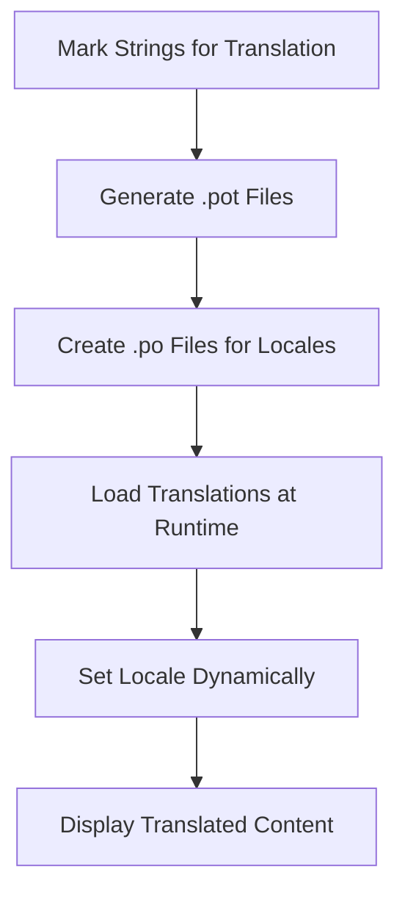

## 29.2. Using Gettext for Localization

Localization is a crucial aspect of modern software development, enabling applications to reach a global audience by supporting multiple languages and regional preferences. In Elixir, the Gettext framework provides a robust solution for internationalization and localization, allowing developers to manage translations efficiently. This section will guide you through the process of using Gettext for localization in Elixir applications, covering the framework's key features, implementation strategies, and best practices.

### Understanding Gettext Framework

Gettext is a widely-used internationalization (i18n) library in the Elixir ecosystem, inspired by the GNU Gettext tools. It offers a standardized approach to managing translations, making it easier to adapt applications for different languages and locales. Gettext's primary functions include:

- **Extraction and Translation**: Marking strings for translation and generating `.pot` files for translators.
- **Runtime Translation**: Loading translations according to the user's locale.

#### Key Concepts

1. **Translation Domains**: Gettext organizes translations into domains, which are essentially namespaces for translation keys. This allows for better organization and separation of translations within an application.

2. **Pluralization**: Gettext supports plural forms, enabling developers to handle language-specific pluralization rules effectively.

3. **Interpolation**: Gettext allows for dynamic content within translations, using placeholders that can be replaced with runtime values.

4. **Locale Management**: Gettext manages different locales, allowing applications to switch languages based on user preferences or system settings.

### Setting Up Gettext in Elixir

To start using Gettext in your Elixir project, you need to add it as a dependency and configure it appropriately.

#### Step 1: Add Gettext Dependency

Add Gettext to your project's `mix.exs` file:

```elixir
defp deps do
  [
    {:gettext, "~> 0.18"}
  ]
end
```

Run `mix deps.get` to fetch the dependency.

#### Step 2: Configure Gettext

Create a module to use Gettext in your application. This module will serve as the entry point for all translation functions.

```elixir
defmodule MyApp.Gettext do
  use Gettext, otp_app: :my_app
end
```

Ensure that your `config/config.exs` file includes the Gettext configuration:

```elixir
config :my_app, MyApp.Gettext,
  default_locale: "en",
  locales: ["en", "es", "fr"]
```

### Extracting and Translating Strings

Gettext provides a straightforward mechanism for marking strings for translation and generating translation files.

#### Marking Strings for Translation

Use the `gettext/1` function to mark strings for translation:

```elixir
import MyApp.Gettext

def greet_user(name) do
  gettext("Hello, %{name}!", name: name)
end
```

For pluralization, use `ngettext/3`:

```elixir
def item_count_message(count) do
  ngettext("You have one item.", "You have %{count} items.", count, count: count)
end
```

#### Generating `.pot` Files

Run the following command to extract marked strings and generate a `.pot` file:

```shell
mix gettext.extract
```

This command creates a `priv/gettext` directory with a `default.pot` file containing all the strings marked for translation.

#### Translating Strings

Translators can use the `.pot` file to create `.po` files for each locale. For example, to add Spanish translations, create a `priv/gettext/es/LC_MESSAGES/default.po` file and add translations:

```po
msgid "Hello, %{name}!"
msgstr "¡Hola, %{name}!"
```

### Runtime Translation

Gettext loads translations at runtime based on the user's locale. You can set the locale dynamically in your application.

#### Setting the Locale

Use `Gettext.put_locale/1` to set the locale for the current process:

```elixir
Gettext.put_locale(MyApp.Gettext, "es")
```

To retrieve the current locale, use `Gettext.get_locale/0`:

```elixir
current_locale = Gettext.get_locale(MyApp.Gettext)
```

#### Loading Translations

Gettext automatically loads translations from the `priv/gettext` directory. Ensure that your application includes this directory in the release build.

### Best Practices for Using Gettext

1. **Organize Translations**: Use domains to organize translations logically. For example, separate translations for UI elements, error messages, and notifications.

2. **Handle Pluralization**: Always use `ngettext/3` for strings that involve counts or quantities to ensure correct pluralization across different languages.

3. **Use Interpolation**: Leverage interpolation to insert dynamic content into translations, making them more flexible and reusable.

4. **Test Translations**: Regularly test translations in different locales to ensure accuracy and completeness.

5. **Collaborate with Translators**: Work closely with translators to maintain high-quality translations. Provide context and explanations for complex strings.

### Visualizing Gettext Workflow

Below is a diagram illustrating the Gettext workflow, from marking strings to runtime translation:



### Try It Yourself

Experiment with Gettext by modifying the code examples provided. Try adding a new locale, such as French, and update the translations accordingly. Test the application by switching between different locales and observing the changes in the user interface.

### References and Further Reading

- [Elixir Gettext Documentation](https://hexdocs.pm/gettext)
- [GNU Gettext Manual](https://www.gnu.org/software/gettext/manual/gettext.html)
- [Localization Best Practices](https://www.w3.org/International/questions/qa-i18n)

### Knowledge Check

- What is the purpose of the Gettext framework in Elixir?
- How do you mark a string for translation using Gettext?
- What is the difference between `.pot` and `.po` files?
- How can you dynamically set the locale in an Elixir application?

### Embrace the Journey

Localization is a powerful tool that enhances user experience by making applications accessible to a global audience. By mastering Gettext, you can create applications that speak the language of your users, fostering inclusivity and engagement. Remember, this is just the beginning. As you progress, you'll discover more ways to leverage localization in your projects. Keep experimenting, stay curious, and enjoy the journey!

## Quiz: Using Gettext for Localization



### What is the primary purpose of the Gettext framework in Elixir?

- [x] To manage translations and support internationalization
- [ ] To optimize database queries
- [ ] To handle file uploads
- [ ] To manage user authentication

> **Explanation:** Gettext is used for managing translations and supporting internationalization in Elixir applications.

### How do you mark a string for translation using Gettext?

- [x] Use the `gettext/1` function
- [ ] Use the `translate/1` function
- [ ] Use the `localize/1` function
- [ ] Use the `i18n/1` function

> **Explanation:** The `gettext/1` function is used to mark strings for translation in Elixir.

### What file format is used to store translations for different locales?

- [ ] `.json`
- [ ] `.xml`
- [x] `.po`
- [ ] `.yaml`

> **Explanation:** Translations for different locales are stored in `.po` files.

### How can you dynamically set the locale in an Elixir application?

- [ ] Use `Locale.set/1`
- [x] Use `Gettext.put_locale/1`
- [ ] Use `SetLocale/1`
- [ ] Use `Locale.change/1`

> **Explanation:** `Gettext.put_locale/1` is used to dynamically set the locale in an Elixir application.

### What is the difference between `.pot` and `.po` files?

- [x] `.pot` files are templates for translations, while `.po` files contain actual translations
- [ ] `.pot` files are used for configuration, while `.po` files are for logging
- [ ] `.pot` files are for testing, while `.po` files are for production
- [ ] `.pot` files are for error messages, while `.po` files are for warnings

> **Explanation:** `.pot` files are templates that contain strings marked for translation, while `.po` files contain the actual translations for specific locales.

### Which function is used for handling pluralization in Gettext?

- [ ] `gettext_plural/3`
- [x] `ngettext/3`
- [ ] `pluralize/3`
- [ ] `gettext/3`

> **Explanation:** `ngettext/3` is used for handling pluralization in Gettext.

### What is the role of interpolation in Gettext?

- [ ] To compress translation files
- [x] To insert dynamic content into translations
- [ ] To encrypt translation data
- [ ] To manage translation memory

> **Explanation:** Interpolation is used to insert dynamic content into translations, making them more flexible.

### How do you generate a `.pot` file in an Elixir project using Gettext?

- [ ] Run `mix gettext.create`
- [ ] Run `mix gettext.compile`
- [x] Run `mix gettext.extract`
- [ ] Run `mix gettext.build`

> **Explanation:** Running `mix gettext.extract` generates a `.pot` file containing strings marked for translation.

### What is a best practice when working with translators?

- [x] Provide context and explanations for complex strings
- [ ] Only provide the `.pot` file without any additional information
- [ ] Avoid using placeholders in translations
- [ ] Use a single `.po` file for all locales

> **Explanation:** Providing context and explanations for complex strings helps translators maintain high-quality translations.

### True or False: Gettext automatically loads translations from the `priv/gettext` directory.

- [x] True
- [ ] False

> **Explanation:** Gettext automatically loads translations from the `priv/gettext` directory at runtime.


