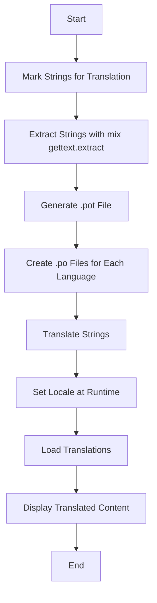

## 29.2. Using Gettext for Localization

Localization is a critical aspect of software development, especially for applications intended for global audiences. Elixir, with its robust ecosystem, provides a powerful tool for localization: Gettext. In this guide, we will explore how to effectively use Gettext for localization in Elixir applications. We will cover the Gettext framework, the process of extracting and translating strings, and how to perform runtime translations based on user locales.

### Understanding the Gettext Framework

Gettext is a widely used framework for internationalization (i18n) and localization (l10n) in Elixir applications. It provides a standardized way to mark strings for translation, manage translation files, and load translations at runtime. Let's delve into the core components of Gettext and how they facilitate localization.

#### Key Features of Gettext

- **String Marking**: Gettext allows developers to mark strings in their code that need translation.
- **Translation Files**: It uses `.pot`, `.po`, and `.mo` files to store translations.
- **Locale Management**: Gettext can dynamically load translations based on the user's locale.
- **Pluralization**: It supports plural forms, which are essential for languages with complex plural rules.

### Setting Up Gettext in Your Elixir Project

To begin using Gettext, you need to add it to your Elixir project. Here's how you can set it up:

1. **Add Gettext to Your Mix Project**: Include Gettext as a dependency in your `mix.exs` file.

   ```elixir
   defp deps do
     [
       {:gettext, "~> 0.18"}
     ]
   end
   ```

2. **Fetch and Compile Dependencies**: Run the following command to fetch and compile the Gettext dependency:

   ```shell
   mix deps.get
   mix deps.compile
   ```

3. **Generate Gettext Configuration**: Use the following mix task to generate the necessary configuration files:

   ```shell
   mix gettext.extract --merge
   ```

   This command will create a `priv/gettext` directory with a default `en/LC_MESSAGES` structure.

### Marking Strings for Translation

Once Gettext is set up, the next step is to mark strings in your code for translation. This is done using the `gettext/1` macro provided by the Gettext module.

#### Example of Marking Strings

Here is a simple example of marking a string for translation in an Elixir module:

```elixir
defmodule MyAppWeb.PageController do
  use MyAppWeb, :controller
  import MyAppWeb.Gettext

  def index(conn, _params) do
    message = gettext("Welcome to our website!")
    render(conn, "index.html", message: message)
  end
end
```

In this example, the `gettext/1` macro is used to mark the string "Welcome to our website!" for translation.

### Extracting and Translating Strings

After marking strings in your code, the next step is to extract these strings into a `.pot` file, which serves as a template for translators.

#### Extracting Strings

Run the following command to extract marked strings into a `.pot` file:

```shell
mix gettext.extract
```

This command scans your codebase for `gettext` calls and generates a `priv/gettext/default.pot` file.

#### Translating Strings

Translators use the `.pot` file to create `.po` files for each target language. For example, to translate into Spanish, you would create a `priv/gettext/es/LC_MESSAGES/default.po` file.

Here is an example of a `.po` file:

```
msgid "Welcome to our website!"
msgstr "¡Bienvenido a nuestro sitio web!"
```

### Runtime Translation

Gettext provides a seamless way to load and apply translations at runtime based on the user's locale.

#### Setting the Locale

To set the locale dynamically, you can use the `Gettext.put_locale/1` function. This is typically done in a plug or controller action.

```elixir
defmodule MyAppWeb.LocalePlug do
  import Plug.Conn
  import MyAppWeb.Gettext

  def init(default), do: default

  def call(conn, _default) do
    locale = get_locale_from_request(conn)
    Gettext.put_locale(MyAppWeb.Gettext, locale)
    conn
  end

  defp get_locale_from_request(conn) do
    # Logic to determine locale from request headers, cookies, etc.
    "es"
  end
end
```

#### Using Translations

Once the locale is set, all subsequent `gettext` calls will use the translations for that locale.

```elixir
defmodule MyAppWeb.PageController do
  use MyAppWeb, :controller
  import MyAppWeb.Gettext

  def index(conn, _params) do
    message = gettext("Welcome to our website!")
    render(conn, "index.html", message: message)
  end
end
```

### Advanced Features of Gettext

Gettext offers several advanced features that make it a powerful tool for localization.

#### Pluralization

Gettext supports plural forms, which are crucial for languages with complex plural rules. You can use the `ngettext/3` macro to handle pluralization.

```elixir
defmodule MyAppWeb.CartView do
  import MyAppWeb.Gettext

  def item_count_message(count) do
    ngettext("You have one item in your cart.",
             "You have %{count} items in your cart.",
             count)
  end
end
```

#### Domain-Based Translations

Gettext allows you to organize translations into domains, which can be useful for separating translations by context, such as errors or UI messages.

```elixir
defmodule MyAppWeb.ErrorView do
  import MyAppWeb.Gettext

  def render("404.html", _assigns) do
    dgettext("errors", "Page not found")
  end
end
```

### Visualizing Gettext Workflow

To better understand the workflow of using Gettext in Elixir, let's visualize the process using a Mermaid.js flowchart:


```mermaid
flowchart TD
    A[Start] --> B[Mark Strings for Translation]
    B --> C[Extract Strings with mix gettext.extract]
    C --> D[Generate .pot File]
    D --> E[Create .po Files for Each Language]
    E --> F[Translate Strings]
    F --> G[Set Locale at Runtime]
    G --> H[Load Translations]
    H --> I[Display Translated Content]
    I --> J[End]
```

This flowchart illustrates the process from marking strings for translation to displaying translated content based on the user's locale.

### Best Practices for Using Gettext

1. **Consistent Marking**: Always use `gettext` macros consistently to mark strings for translation.
2. **Regular Extraction**: Regularly run `mix gettext.extract` to keep your `.pot` file up-to-date.
3. **Collaborate with Translators**: Work closely with translators to ensure accurate translations.
4. **Test Translations**: Test your application in different locales to verify translations are applied correctly.
5. **Use Domains Wisely**: Organize translations into domains to keep them manageable and contextually relevant.

### Common Pitfalls and How to Avoid Them

- **Forgetting to Set Locale**: Ensure the locale is set before rendering any translated content.
- **Inconsistent String Marking**: Double-check that all user-facing strings are marked for translation.
- **Neglecting Pluralization**: Use `ngettext` for strings that involve counts or quantities.

### References and Further Reading

- [Elixir Gettext Documentation](https://hexdocs.pm/gettext/Gettext.html)
- [GNU Gettext Manual](https://www.gnu.org/software/gettext/manual/gettext.html)
- [Localization Best Practices](https://www.w3.org/International/questions/qa-i18n)

### Knowledge Check

Let's reinforce what we've learned with some questions and exercises.

1. **What is the purpose of the `.pot` file in Gettext?**
2. **How do you dynamically set the locale in an Elixir application?**
3. **Explain the difference between `gettext/1` and `ngettext/3`.**
4. **Why is it important to use domains in Gettext?**
5. **Describe a scenario where pluralization is necessary in localization.**

### Try It Yourself

Experiment with the code examples provided. Try adding a new language to your application and test the translations. Modify the `LocalePlug` to detect the user's preferred language from the request headers.

### Embrace the Journey

Localization is an ongoing process that requires attention to detail and collaboration. As you integrate Gettext into your Elixir applications, remember that this is just the beginning. Keep experimenting with different locales, stay curious about linguistic nuances, and enjoy the journey of making your application accessible to a global audience!

## Quiz Time!



### What is the primary purpose of the Gettext framework in Elixir?

- [x] To provide a standardized way to handle internationalization and localization.
- [ ] To manage application configuration settings.
- [ ] To optimize database queries for multilingual support.
- [ ] To enhance security features in Elixir applications.

> **Explanation:** Gettext is primarily used for internationalization and localization in Elixir applications, allowing developers to manage translations efficiently.

### Which file format is used by Gettext to store translations for each language?

- [ ] `.json`
- [x] `.po`
- [ ] `.xml`
- [ ] `.yaml`

> **Explanation:** Gettext uses `.po` files to store translations for each language, which are derived from the `.pot` template file.

### How can you dynamically set the locale in an Elixir application using Gettext?

- [x] By using the `Gettext.put_locale/1` function.
- [ ] By modifying the application's configuration file.
- [ ] By setting an environment variable.
- [ ] By using a database query.

> **Explanation:** The `Gettext.put_locale/1` function is used to dynamically set the locale based on user preferences or request headers.

### What is the difference between `gettext/1` and `ngettext/3` in Gettext?

- [ ] `gettext/1` is for domain-based translations, while `ngettext/3` is for string marking.
- [x] `gettext/1` is for simple translations, while `ngettext/3` handles pluralization.
- [ ] `gettext/1` is for extracting strings, while `ngettext/3` is for loading translations.
- [ ] `gettext/1` is for runtime translation, while `ngettext/3` is for compile-time translation.

> **Explanation:** `gettext/1` is used for simple translations, while `ngettext/3` handles pluralization, allowing for different translations based on quantity.

### Why is it important to use domains in Gettext?

- [ ] To increase the performance of translation loading.
- [ ] To minimize the size of translation files.
- [x] To organize translations by context, such as errors or UI messages.
- [ ] To enable automatic translation updates.

> **Explanation:** Domains help organize translations by context, making it easier to manage and apply them appropriately in different parts of the application.

### What command is used to extract marked strings into a `.pot` file in Gettext?

- [ ] `mix gettext.compile`
- [x] `mix gettext.extract`
- [ ] `mix gettext.merge`
- [ ] `mix gettext.update`

> **Explanation:** The `mix gettext.extract` command is used to scan the codebase and extract marked strings into a `.pot` file.

### How does Gettext handle pluralization in translations?

- [ ] By using JSON arrays in `.po` files.
- [x] By using the `ngettext/3` macro to specify singular and plural forms.
- [ ] By creating separate `.po` files for each plural form.
- [ ] By using regular expressions in translation strings.

> **Explanation:** Gettext uses the `ngettext/3` macro to specify different translations for singular and plural forms, accommodating languages with complex plural rules.

### What is a common pitfall when using Gettext for localization?

- [ ] Overusing domains for translations.
- [ ] Using JSON files instead of `.po` files.
- [x] Forgetting to set the locale before rendering translated content.
- [ ] Using `gettext` macros in non-user-facing strings.

> **Explanation:** A common pitfall is forgetting to set the locale, which results in translations not being applied correctly.

### What role do translators play in the Gettext workflow?

- [ ] They write code to mark strings for translation.
- [x] They use the `.pot` file to create `.po` files with translations.
- [ ] They configure the application's locale settings.
- [ ] They manage the deployment of translated applications.

> **Explanation:** Translators use the `.pot` file to create `.po` files, providing translations for each marked string in the application.

### True or False: Gettext can automatically detect and apply the user's preferred language without any additional configuration.

- [ ] True
- [x] False

> **Explanation:** Gettext requires explicit configuration to detect and apply the user's preferred language, typically through request headers or user settings.



By mastering Gettext, you can make your Elixir applications accessible to a global audience, ensuring that users from different linguistic backgrounds can interact with your software in their native language. Keep exploring and refining your localization skills to create truly international applications.
