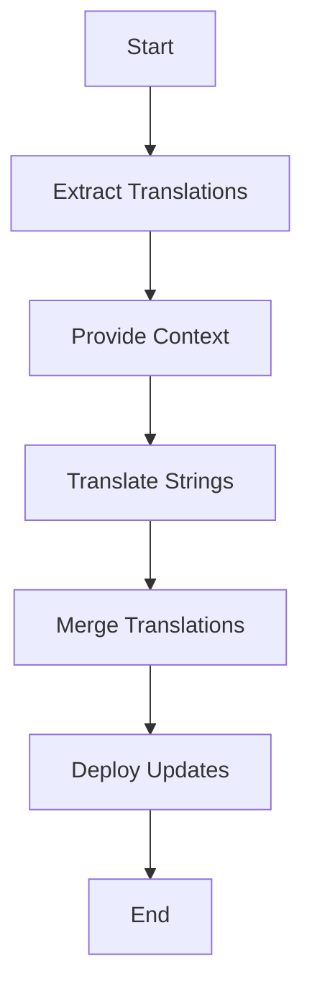

## 29.3. Managing Translation Files

In the realm of global software development, managing translation files efficiently is crucial for delivering a seamless user experience across different languages and cultures. This section delves into the intricacies of managing translation files in Elixir, focusing on best practices for organizing translations, collaborating with translators, and automating processes to ensure your application is ready for international markets.

### Organizing Translations

Effective organization of translation files is the foundation of a robust internationalization strategy. Let's explore how to structure these files by language and domain to facilitate easy management and updates.

#### Structuring Files by Language and Domain

When structuring translation files, it's essential to consider both language and domain. This approach not only simplifies the management of translations but also enhances the clarity and maintainability of your codebase.

**Language-Based Structure**

Organizing translation files by language involves creating separate directories for each language your application supports. This structure allows for easy addition of new languages and simplifies the process of updating existing translations.

```plaintext
locales/
  ├── en/
  │   ├── errors.po
  │   ├── messages.po
  │   └── labels.po
  ├── es/
  │   ├── errors.po
  │   ├── messages.po
  │   └── labels.po
  └── fr/
      ├── errors.po
      ├── messages.po
      └── labels.po
```

**Domain-Based Structure**

In addition to organizing by language, consider structuring files by domain or feature. This method groups translations related to specific parts of your application, such as authentication, user interface, or error messages.

```plaintext
locales/
  ├── authentication/
  │   ├── en.po
  │   ├── es.po
  │   └── fr.po
  ├── ui/
  │   ├── en.po
  │   ├── es.po
  │   └── fr.po
  └── errors/
      ├── en.po
      ├── es.po
      └── fr.po
```

**Code Example: Loading Translations**

Here's how you can load translations in Elixir using the `Gettext` library, which is a popular choice for managing translations in Elixir applications.

```elixir
defmodule MyApp.Gettext do
  use Gettext, otp_app: :my_app
end

# Usage in your application
import MyApp.Gettext

# Translating a simple string
IO.puts gettext("Hello, World!")

# Translating a string with a domain
IO.puts dgettext("errors", "An error occurred.")
```

### Collaboration with Translators

Collaboration with translators is a critical aspect of managing translation files. Providing context and managing updates effectively ensures that translations are accurate and relevant.

#### Providing Context

Translators need context to provide accurate translations. This context can include information about where the text appears in the application, the intended audience, and any specific terminology that should be used.

**Code Comments for Context**

Include comments in your translation files to provide context for translators. These comments can describe the purpose of the text and any nuances that should be considered.

```plaintext
msgid "Welcome"
msgstr ""
# This message is displayed on the homepage when a user logs in.
```

**Translation Management Tools**

Consider using translation management tools that allow you to provide context directly within the platform. Tools like Crowdin, Transifex, or PhraseApp offer features for adding context and screenshots to translations.

#### Managing Updates

Keeping translations up-to-date is an ongoing process. Establishing a workflow for managing updates ensures that new and modified strings are translated promptly.

**Version Control**

Use version control systems like Git to track changes in translation files. This approach allows you to see who made changes, when they were made, and why.

**Continuous Integration**

Integrate translation updates into your continuous integration (CI) pipeline. This integration ensures that translations are tested and deployed alongside your application's code.

### Automating Processes

Automation is key to efficiently managing translation files, especially as your application grows and supports more languages.

#### Using Tools for Merging and Updating Translations

Automating the merging and updating of translation files reduces manual effort and minimizes errors. Let's explore some tools and techniques for achieving this.

**Gettext for Elixir**

The `Gettext` library in Elixir provides built-in support for managing translations, including tools for extracting, merging, and updating translation files.

**Extracting Translations**

Use the `mix gettext.extract` command to extract translatable strings from your codebase. This command generates `.pot` files that can be used as templates for translators.

```bash
mix gettext.extract
```

**Merging Translations**

The `mix gettext.merge` command merges new translations into existing `.po` files. This command ensures that your translation files are always up-to-date with the latest strings from your codebase.

```bash
mix gettext.merge priv/gettext
```

**Automating with Scripts**

Consider writing scripts to automate the extraction and merging of translations. These scripts can be integrated into your CI pipeline to ensure translations are always current.

```bash
#!/bin/bash

# Extract new translatable strings
mix gettext.extract

# Merge new strings into existing translation files
mix gettext.merge priv/gettext
```

### Visualizing Translation Management

To better understand the process of managing translation files, let's visualize the workflow using a Mermaid.js diagram.



**Diagram Description:** This flowchart illustrates the translation management process, starting with extracting translations, providing context, translating strings, merging translations, and deploying updates.

### Knowledge Check

Before we conclude, let's reinforce our understanding with a few questions:

- How can you structure translation files to facilitate easy management?
- What are some best practices for collaborating with translators?
- How can automation improve the management of translation files?

### Try It Yourself

Now that we've covered the essentials of managing translation files, it's time to put your knowledge into practice. Try modifying the code examples provided to add support for a new language or domain. Experiment with different structures and see how they affect the ease of managing translations.

### Embrace the Journey

Remember, managing translation files is an ongoing process that evolves as your application grows. Stay curious, keep experimenting, and enjoy the journey of making your application accessible to a global audience.

### References and Links

For further reading and resources, consider exploring the following:

- [Elixir Gettext Documentation](https://hexdocs.pm/gettext/Gettext.html)
- [Crowdin Translation Management](https://crowdin.com/)
- [Transifex Localization Platform](https://www.transifex.com/)
- [PhraseApp Translation Management](https://phrase.com/)

## Quiz: Managing Translation Files



### How should translation files be structured for easy management?

- [x] By language and domain
- [ ] By file size
- [ ] Alphabetically
- [ ] Randomly

> **Explanation:** Structuring translation files by language and domain facilitates easy management and updates.

### What is a key benefit of providing context to translators?

- [x] It ensures accurate translations
- [ ] It reduces file size
- [ ] It speeds up the translation process
- [ ] It eliminates the need for version control

> **Explanation:** Providing context helps translators understand the purpose and nuances of the text, leading to more accurate translations.

### Which tool is commonly used in Elixir for managing translations?

- [x] Gettext
- [ ] Babel
- [ ] Rosetta
- [ ] Polyglot

> **Explanation:** Gettext is a popular library in Elixir for managing translations.

### What command is used to extract translatable strings in Elixir?

- [x] mix gettext.extract
- [ ] mix gettext.compile
- [ ] mix gettext.update
- [ ] mix gettext.build

> **Explanation:** The `mix gettext.extract` command extracts translatable strings from the codebase.

### How can automation benefit translation management?

- [x] By reducing manual effort
- [ ] By increasing file size
- [ ] By making translations less accurate
- [ ] By eliminating the need for translators

> **Explanation:** Automation reduces manual effort and minimizes errors in translation management.

### What is the purpose of the `mix gettext.merge` command?

- [x] To merge new translations into existing files
- [ ] To delete old translations
- [ ] To compile translation files
- [ ] To extract translatable strings

> **Explanation:** The `mix gettext.merge` command merges new translations into existing `.po` files.

### Why is version control important for managing translation files?

- [x] It tracks changes and updates
- [ ] It increases file size
- [ ] It speeds up the translation process
- [ ] It eliminates the need for translators

> **Explanation:** Version control tracks changes and updates, providing a history of modifications to translation files.

### What is a benefit of using translation management tools?

- [x] They provide context and manage updates
- [ ] They increase file size
- [ ] They eliminate the need for translators
- [ ] They make translations less accurate

> **Explanation:** Translation management tools provide context and manage updates, improving the accuracy and efficiency of translations.

### How can you provide context to translators in translation files?

- [x] By including comments
- [ ] By increasing file size
- [ ] By using random strings
- [ ] By eliminating version control

> **Explanation:** Including comments in translation files provides context for translators.

### True or False: Automating translation processes can eliminate the need for translators.

- [ ] True
- [x] False

> **Explanation:** Automation streamlines processes but does not eliminate the need for human translators who provide context and cultural understanding.


