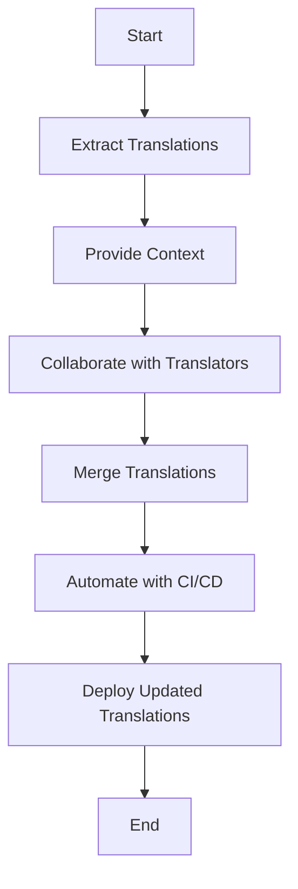

## 29.3. Managing Translation Files

In today's globalized world, software applications must cater to users from different linguistic backgrounds. This necessitates robust internationalization (i18n) and localization (l10n) strategies, particularly in managing translation files. In this section, we delve into the best practices for managing translation files in Elixir applications, focusing on organization, collaboration, and automation.

### Organizing Translations

#### Structuring Files by Language and Domain

Organizing translation files effectively is crucial for maintaining a scalable and manageable codebase. In Elixir, a common practice is to use the `gettext` library, which provides a structured way to handle translations.

1. **Language Folders**: Create separate folders for each language. This helps in isolating translations and makes it easier to manage and update them.

   ```
   ├── priv
   │   ├── gettext
   │   │   ├── en
   │   │   │   └── LC_MESSAGES
   │   │   │       └── default.po
   │   │   ├── es
   │   │   │   └── LC_MESSAGES
   │   │   │       └── default.po
   │   │   └── fr
   │   │       └── LC_MESSAGES
   │   │           └── default.po
   ```

2. **Domain-Based Structuring**: Within each language folder, structure files based on application domains or modules. This approach allows for more granular control over translations and can improve collaboration among developers and translators.

   ```
   ├── priv
   │   ├── gettext
   │   │   ├── en
   │   │   │   ├── LC_MESSAGES
   │   │   │   │   ├── auth.po
   │   │   │   │   ├── errors.po
   │   │   │   │   └── main.po
   ```

3. **Consistent Naming Conventions**: Use consistent naming conventions for your translation files to avoid confusion and ensure that everyone involved in the project understands the file structure.

#### Code Example

Here's a basic example of how you might set up a translation file using `gettext` in Elixir:

```elixir
# In your Elixir module
defmodule MyAppWeb.Gettext do
  use Gettext, otp_app: :my_app
end

# Using translations in your application
import MyAppWeb.Gettext

# Simple translation
gettext("Hello, world!")

# Domain-based translation
dgettext("errors", "An error occurred")
```

### Collaboration with Translators

#### Providing Context and Managing Updates

Collaboration with translators is an integral part of the localization process. Providing context and managing updates efficiently can significantly enhance the quality of translations.

1. **Contextual Information**: Provide contextual information for translators to understand the usage of strings. This can be done by adding comments or notes in the `.po` files.

   ```plaintext
   #: lib/my_app_web/templates/page/index.html.eex:10
   msgid "Welcome to MyApp!"
   msgstr ""
   ```

2. **Version Control**: Use version control systems like Git to manage changes in translation files. This allows you to track changes, revert to previous versions if necessary, and collaborate more effectively with translators.

3. **Regular Updates**: Establish a process for regularly updating translation files. This can include setting up a schedule for when translations need to be reviewed and updated, especially after significant changes in the application.

#### Code Example

Here's how you might add comments to a `.po` file to provide context:

```plaintext
#. This is the welcome message displayed on the homepage.
msgid "Welcome to MyApp!"
msgstr ""
```

### Automating Processes

#### Using Tools for Merging and Updating Translations

Automation is key to managing translation files efficiently, especially in large projects with frequent updates.

1. **Automated Extraction**: Use tools to automatically extract translatable strings from your codebase. In Elixir, `gettext` provides a mix task for this purpose.

   ```bash
   mix gettext.extract
   ```

2. **Merging Translations**: Automate the merging of new translations into existing `.po` files. This can be done using `gettext.merge`.

   ```bash
   mix gettext.merge priv/gettext
   ```

3. **Continuous Integration**: Integrate translation management into your CI/CD pipeline. This ensures that translations are always up-to-date and reduces the risk of missing translations in production.

#### Code Example

Automating the extraction and merging of translations can be done using the following commands:

```bash
# Extract new strings
mix gettext.extract

# Merge new strings into existing translation files
mix gettext.merge priv/gettext
```

### Visualizing Translation Management Workflow

To better understand the workflow of managing translation files, let's visualize the process using a flowchart.


```mermaid
flowchart TD
    A[Start] --> B[Extract Translations]
    B --> C[Provide Context]
    C --> D[Collaborate with Translators]
    D --> E[Merge Translations]
    E --> F[Automate with CI/CD]
    F --> G[Deploy Updated Translations]
    G --> H[End]
```

**Figure 1**: Translation Management Workflow

### References and Links

- [Elixir Gettext Documentation](https://hexdocs.pm/gettext/Gettext.html)
- [GNU Gettext Manual](https://www.gnu.org/software/gettext/manual/gettext.html)
- [Git Version Control](https://git-scm.com/doc)

### Knowledge Check

- **Question**: Why is it important to provide context in translation files?
  - **Answer**: Providing context helps translators understand the usage of strings, leading to more accurate translations.

- **Question**: What is the purpose of using domain-based structuring for translation files?
  - **Answer**: Domain-based structuring allows for more granular control and organization of translations, making it easier to manage and collaborate.

### Embrace the Journey

Remember, managing translation files is an ongoing process that evolves with your application. By organizing your files effectively, collaborating with translators, and automating processes, you can ensure that your application is accessible to a global audience. Keep experimenting, stay curious, and enjoy the journey of building inclusive software!

### Quiz Time!



### What is the primary benefit of structuring translation files by language and domain?

- [x] It improves organization and maintainability.
- [ ] It reduces the size of translation files.
- [ ] It eliminates the need for translators.
- [ ] It automates the translation process.

> **Explanation:** Structuring files by language and domain helps in organizing and maintaining translations, making it easier to manage and update them.

### Why is it important to provide contextual information in translation files?

- [x] To help translators understand the usage of strings.
- [ ] To reduce the number of translation files.
- [ ] To automate the translation process.
- [ ] To eliminate the need for translators.

> **Explanation:** Providing context helps translators understand the usage of strings, leading to more accurate translations.

### Which tool is commonly used in Elixir for managing translations?

- [x] Gettext
- [ ] Phoenix
- [ ] Ecto
- [ ] Mix

> **Explanation:** `gettext` is a widely used tool in Elixir for managing translations.

### What is the purpose of the `mix gettext.extract` command?

- [x] To extract translatable strings from the codebase.
- [ ] To compile Elixir code.
- [ ] To deploy the application.
- [ ] To merge translations.

> **Explanation:** The `mix gettext.extract` command is used to extract translatable strings from the codebase.

### How can translation management be integrated into a CI/CD pipeline?

- [x] By automating extraction and merging of translations.
- [ ] By manually updating translation files.
- [ ] By eliminating the need for translations.
- [ ] By using a different version control system.

> **Explanation:** Integrating translation management into a CI/CD pipeline involves automating the extraction and merging of translations to ensure they are always up-to-date.

### What is a common practice for organizing translation files in Elixir?

- [x] Creating separate folders for each language.
- [ ] Using a single file for all translations.
- [ ] Storing translations in the database.
- [ ] Hardcoding translations in the application code.

> **Explanation:** A common practice is to create separate folders for each language to isolate translations and make them easier to manage.

### Why should version control systems be used for translation files?

- [x] To track changes and collaborate effectively.
- [ ] To automate translations.
- [ ] To eliminate the need for translators.
- [ ] To reduce the number of translation files.

> **Explanation:** Version control systems help track changes and collaborate effectively with translators.

### What is the benefit of using domain-based structuring for translation files?

- [x] It allows for more granular control over translations.
- [ ] It reduces the size of translation files.
- [ ] It eliminates the need for translators.
- [ ] It automates the translation process.

> **Explanation:** Domain-based structuring allows for more granular control and organization of translations, making it easier to manage and collaborate.

### What is the purpose of the `mix gettext.merge` command?

- [x] To merge new translations into existing `.po` files.
- [ ] To compile Elixir code.
- [ ] To deploy the application.
- [ ] To extract translatable strings.

> **Explanation:** The `mix gettext.merge` command is used to merge new translations into existing `.po` files.

### True or False: Automating translation processes can reduce the risk of missing translations in production.

- [x] True
- [ ] False

> **Explanation:** Automating translation processes ensures that translations are always up-to-date, reducing the risk of missing translations in production.



By following these best practices, you'll be well-equipped to manage translation files effectively in your Elixir applications. Keep exploring and refining your approach to create software that resonates with users worldwide.
