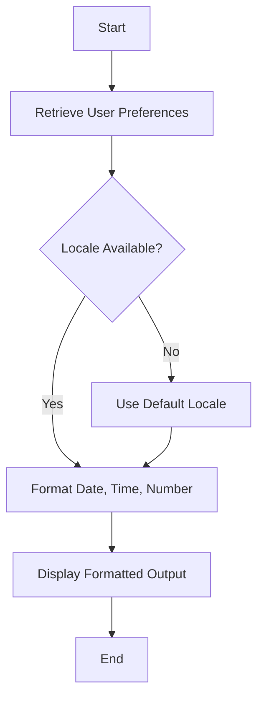

## 29.4. Handling Date, Time, and Number Formats

In today's globalized world, software applications must cater to a diverse audience, each with unique preferences for how dates, times, and numbers are displayed. Elixir, with its robust ecosystem, provides powerful tools and libraries to handle these locale-specific formats efficiently. In this section, we will delve into the intricacies of formatting dates, times, and numbers in Elixir, leveraging libraries like `Timex` and `Cldr`, and implementing dynamic formatting based on user preferences.

### Locale-Specific Formats

Locale-specific formatting is crucial for creating applications that feel native to users from different regions. This involves adapting the display of dates, times, currencies, and numbers to match local conventions.

#### Adapting Date and Time Formats

Different locales have varying conventions for displaying dates and times. For instance, while the United States commonly uses the "MM/DD/YYYY" format, many European countries prefer "DD/MM/YYYY". Similarly, time can be represented in 12-hour or 24-hour formats.

**Example:**

```elixir
# US format
date_us = Timex.format!(~N[2024-11-23 15:30:00], "{M}/{D}/{YYYY} {h12}:{m} {AM}")

# European format
date_eu = Timex.format!(~N[2024-11-23 15:30:00], "{D}/{M}/{YYYY} {h24}:{m}")
```

#### Adapting Number and Currency Formats

Numbers and currencies also vary by locale. For example, the number "1,000.50" in the US might be written as "1.000,50" in Germany. Currency symbols and their placement can also differ.

**Example:**

```elixir
# US currency format
currency_us = Cldr.Number.to_string!(1000.50, locale: "en-US", format: :currency)

# German currency format
currency_de = Cldr.Number.to_string!(1000.50, locale: "de-DE", format: :currency)
```

### Libraries and Tools

Elixir offers several libraries to facilitate the handling of date, time, and number formats. Two of the most prominent are `Timex` and `Cldr`.

#### Timex

`Timex` is a comprehensive date and time library for Elixir. It provides a wide range of functionalities, including parsing, formatting, and manipulating dates and times.

**Key Features:**

- **Parsing and Formatting:** Easily parse and format dates and times using custom patterns.
- **Time Zone Support:** Convert between different time zones.
- **Date Arithmetic:** Perform operations like adding or subtracting days, months, or years.

**Example:**

```elixir
# Parsing a date string
{:ok, date} = Timex.parse("2024-11-23", "{YYYY}-{M}-{D}")

# Formatting a date
formatted_date = Timex.format!(date, "{D}-{M}-{YYYY}")
```

#### Cldr

`Cldr` (Common Locale Data Repository) is a library that provides locale-specific formatting for numbers, currencies, and dates. It leverages the Unicode CLDR data to ensure accurate and up-to-date locale information.

**Key Features:**

- **Locale-Specific Formatting:** Format numbers, currencies, and dates according to locale conventions.
- **Pluralization:** Handle plural forms in different languages.
- **Dynamic Locale Switching:** Easily switch between locales at runtime.

**Example:**

```elixir
# Formatting a number
number = Cldr.Number.to_string!(1234.56, locale: "fr-FR")

# Formatting a date
date = Cldr.DateTime.to_string!(~N[2024-11-23 15:30:00], locale: "ja-JP")
```

### Dynamic Formatting

Dynamic formatting allows applications to adjust date, time, and number formats based on user preferences or settings. This is particularly useful in applications with a global user base.

#### Implementing Dynamic Formatting

To implement dynamic formatting, you can store user preferences in a database and apply them at runtime. This involves retrieving the user's preferred locale and using it to format dates, times, and numbers.

**Example:**

```elixir
defmodule UserPreferences do
  def get_locale(user_id) do
    # Retrieve the user's preferred locale from the database
    # For demonstration purposes, we'll return a hardcoded value
    "es-ES"
  end
end

defmodule Formatter do
  def format_date(date, user_id) do
    locale = UserPreferences.get_locale(user_id)
    Cldr.DateTime.to_string!(date, locale: locale)
  end

  def format_currency(amount, user_id) do
    locale = UserPreferences.get_locale(user_id)
    Cldr.Number.to_string!(amount, locale: locale, format: :currency)
  end
end

# Usage
user_id = 1
date = ~N[2024-11-23 15:30:00]
amount = 1000.50

formatted_date = Formatter.format_date(date, user_id)
formatted_currency = Formatter.format_currency(amount, user_id)
```

### Visualizing Date, Time, and Number Formatting

To better understand the flow of date, time, and number formatting in Elixir, let's visualize the process using a flowchart.



**Description:** This flowchart illustrates the process of formatting dates, times, and numbers based on user preferences. The application retrieves the user's preferred locale, formats the data accordingly, and displays the formatted output.

### References and Links

- [Timex Documentation](https://hexdocs.pm/timex)
- [Cldr Documentation](https://hexdocs.pm/ex_cldr)
- [Unicode CLDR](http://cldr.unicode.org/)

### Knowledge Check

- **Question:** How does the `Timex` library help in handling time zones?
- **Exercise:** Modify the `Formatter` module to include time zone conversion based on user preferences.

### Embrace the Journey

Remember, mastering date, time, and number formatting in Elixir is just the beginning. As you continue to explore Elixir's capabilities, you'll discover even more powerful tools and techniques to enhance your applications. Keep experimenting, stay curious, and enjoy the journey!

### Quiz: Handling Date, Time, and Number Formats



### What is the primary purpose of the `Timex` library in Elixir?

- [x] To handle date and time parsing, formatting, and manipulation
- [ ] To manage database connections
- [ ] To format numbers and currencies
- [ ] To handle HTTP requests

> **Explanation:** `Timex` is a comprehensive library for handling dates and times in Elixir, including parsing, formatting, and manipulation.

### Which library is used for locale-specific formatting of numbers and currencies in Elixir?

- [ ] Timex
- [x] Cldr
- [ ] Ecto
- [ ] Phoenix

> **Explanation:** `Cldr` is used for locale-specific formatting of numbers, currencies, and dates in Elixir.

### How can you format a date in the "DD/MM/YYYY" format using `Timex`?

- [x] `Timex.format!(~N[2024-11-23 15:30:00], "{D}/{M}/{YYYY}")`
- [ ] `Timex.format!(~N[2024-11-23 15:30:00], "{YYYY}-{M}-{D}")`
- [ ] `Timex.format!(~N[2024-11-23 15:30:00], "{M}/{D}/{YYYY}")`
- [ ] `Timex.format!(~N[2024-11-23 15:30:00], "{YYYY}/{D}/{M}")`

> **Explanation:** The correct format string for "DD/MM/YYYY" is `"{D}/{M}/{YYYY}"`.

### What does the `Cldr.Number.to_string!` function do?

- [x] Formats a number according to a specified locale
- [ ] Parses a date string into a DateTime struct
- [ ] Converts a string to a number
- [ ] Handles HTTP requests

> **Explanation:** `Cldr.Number.to_string!` formats a number according to the specified locale and format.

### Which of the following is a feature of the `Timex` library?

- [x] Time zone support
- [ ] Database migrations
- [ ] HTTP request handling
- [ ] File I/O operations

> **Explanation:** `Timex` provides support for time zone conversions and other date/time operations.

### What is the purpose of dynamic formatting in applications?

- [x] To adjust formats based on user preferences or settings
- [ ] To handle database transactions
- [ ] To manage server configurations
- [ ] To optimize application performance

> **Explanation:** Dynamic formatting allows applications to adjust date, time, and number formats based on user preferences or settings.

### How can you retrieve a user's preferred locale for formatting in an application?

- [x] By storing and retrieving the locale from a database
- [ ] By hardcoding the locale in the application
- [ ] By using a random locale each time
- [ ] By asking the user every time they log in

> **Explanation:** User preferences, including locale, are typically stored in a database and retrieved as needed.

### What is the role of the `Cldr.DateTime.to_string!` function?

- [x] Formats a DateTime struct according to a specified locale
- [ ] Parses a number into a string
- [ ] Converts a string to a DateTime struct
- [ ] Handles file I/O operations

> **Explanation:** `Cldr.DateTime.to_string!` formats a DateTime struct according to the specified locale.

### True or False: The `Timex` library can be used to format numbers and currencies.

- [ ] True
- [x] False

> **Explanation:** `Timex` is primarily used for date and time operations, not for formatting numbers and currencies.

### Which of the following is NOT a feature of the `Cldr` library?

- [ ] Locale-specific formatting
- [ ] Pluralization handling
- [ ] Dynamic locale switching
- [x] Database connection management

> **Explanation:** `Cldr` does not manage database connections; it focuses on locale-specific formatting and related features.


