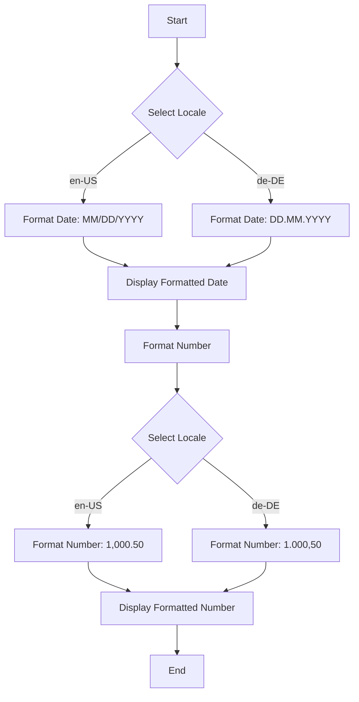

## 29.4. Handling Date, Time, and Number Formats

In a globally connected world, software applications must cater to diverse user bases with varying locale-specific preferences. Handling date, time, and number formats is crucial for ensuring that your Elixir applications are user-friendly and culturally relevant. In this section, we'll delve into the intricacies of managing these formats using Elixir, focusing on locale-specific adaptations and dynamic formatting techniques. We'll explore libraries such as `Timex` and `Cldr`, which are invaluable tools for this purpose.

### Locale-Specific Formats

Locale-specific formatting involves adapting the display of dates, currencies, and numbers to match the conventions of different regions. This is essential for applications that serve an international audience, as it enhances user experience by aligning with local expectations.

#### Understanding Locale-Specific Formats

Locale-specific formats vary widely across different regions. For instance, the date format in the United States is typically `MM/DD/YYYY`, while in many European countries, it is `DD/MM/YYYY`. Similarly, the decimal separator in numbers is a period in the US (`1,000.50`) and a comma in many European countries (`1.000,50`). Currency symbols also differ, with the dollar sign (`$`) preceding the amount in the US and the euro sign (`€`) following the amount in many European countries.

#### Implementing Locale-Specific Formats in Elixir

To implement locale-specific formats in Elixir, we can leverage libraries that provide comprehensive support for internationalization and localization. Two such libraries are `Timex` and `Cldr`.

### Libraries and Tools

#### Timex

`Timex` is a powerful date and time library for Elixir that provides extensive functionality for parsing, formatting, and manipulating dates and times.

**Key Features of Timex:**
- Parsing and formatting dates and times in various formats.
- Time zone conversion and arithmetic operations.
- Support for ISO 8601 and other common date formats.

**Example: Using Timex for Date Formatting**

```elixir
# Import Timex
import Timex

# Define a date
date = ~D[2024-11-23]

# Format the date in a specific locale
formatted_date_us = Timex.format!(date, "{M}/{D}/{YYYY}", :strftime)
formatted_date_eu = Timex.format!(date, "{D}/{M}/{YYYY}", :strftime)

IO.puts("US Format: #{formatted_date_us}")  # Output: US Format: 11/23/2024
IO.puts("EU Format: #{formatted_date_eu}")  # Output: EU Format: 23/11/2024
```

In this example, we use `Timex.format!` to format a date in both US and European formats. The `:strftime` option allows us to specify the desired format string.

#### Cldr

`Cldr` (Common Locale Data Repository) is a library that provides comprehensive support for internationalization, including number and currency formatting.

**Key Features of Cldr:**
- Locale-specific number and currency formatting.
- Support for pluralization and list formatting.
- Integration with `Timex` for date and time formatting.

**Example: Using Cldr for Number Formatting**

```elixir
# Import Cldr
import Cldr.Number

# Define a number
number = 1000.50

# Format the number in a specific locale
formatted_number_us = Cldr.Number.to_string!(number, locale: "en-US")
formatted_number_eu = Cldr.Number.to_string!(number, locale: "de-DE")

IO.puts("US Format: #{formatted_number_us}")  # Output: US Format: 1,000.50
IO.puts("EU Format: #{formatted_number_eu}")  # Output: EU Format: 1.000,50
```

In this example, we use `Cldr.Number.to_string!` to format a number according to US and European conventions.

### Dynamic Formatting

Dynamic formatting involves adjusting date, time, and number formats based on user preferences or settings. This is particularly useful in applications where users can select their preferred locale or where the application automatically detects the user's locale.

#### Implementing Dynamic Formatting in Elixir

To implement dynamic formatting, we can use a combination of `Timex` and `Cldr` to dynamically adjust formats based on user settings.

**Example: Dynamic Date and Number Formatting**

```elixir
defmodule MyApp.Formatter do
  import Timex
  import Cldr.Number

  def format_date(date, locale) do
    format_string = case locale do
      "en-US" -> "{M}/{D}/{YYYY}"
      "de-DE" -> "{D}.{M}.{YYYY}"
      _ -> "{YYYY}-{M}-{D}"
    end

    Timex.format!(date, format_string, :strftime)
  end

  def format_number(number, locale) do
    Cldr.Number.to_string!(number, locale: locale)
  end
end

# Example usage
date = ~D[2024-11-23]
number = 1000.50

IO.puts("Formatted Date (US): #{MyApp.Formatter.format_date(date, "en-US")}")
IO.puts("Formatted Date (DE): #{MyApp.Formatter.format_date(date, "de-DE")}")
IO.puts("Formatted Number (US): #{MyApp.Formatter.format_number(number, "en-US")}")
IO.puts("Formatted Number (DE): #{MyApp.Formatter.format_number(number, "de-DE")}")
```

In this example, the `MyApp.Formatter` module provides functions for formatting dates and numbers based on the specified locale. The `format_date` function selects a format string based on the locale, while the `format_number` function uses `Cldr` to format the number.

### Visualizing Date, Time, and Number Formatting

To better understand the process of formatting dates, times, and numbers, let's visualize the workflow using Mermaid.js diagrams.


```mermaid
flowchart TD
    A[Start] --> B{Select Locale}
    B -->|en-US| C[Format Date: MM/DD/YYYY]
    B -->|de-DE| D[Format Date: DD.MM.YYYY]
    C --> E[Display Formatted Date]
    D --> E
    E --> F[Format Number]
    F --> G{Select Locale}
    G -->|en-US| H[Format Number: 1,000.50]
    G -->|de-DE| I[Format Number: 1.000,50]
    H --> J[Display Formatted Number]
    I --> J
    J --> K[End]
```

**Diagram Description:**
This flowchart illustrates the process of formatting dates and numbers based on the selected locale. The workflow begins with selecting a locale, followed by formatting the date and number according to locale-specific conventions, and finally displaying the formatted values.

### Try It Yourself

To deepen your understanding of date, time, and number formatting in Elixir, try modifying the code examples provided above. Experiment with different locales and formats to see how the output changes. Consider adding support for additional locales or implementing user preference settings to dynamically adjust formats.

### Knowledge Check

- What is the significance of locale-specific formatting in international applications?
- How does `Timex` facilitate date and time formatting in Elixir?
- What are the key features of the `Cldr` library?
- How can dynamic formatting enhance user experience in global applications?

### Key Takeaways

- Locale-specific formatting is essential for creating user-friendly applications that cater to diverse audiences.
- Libraries like `Timex` and `Cldr` provide powerful tools for handling date, time, and number formats in Elixir.
- Dynamic formatting allows applications to adjust formats based on user preferences or detected locales.

### Embrace the Journey

Handling date, time, and number formats in Elixir is a crucial step in building applications that resonate with users worldwide. As you continue to explore internationalization and localization, remember that this is just the beginning. Keep experimenting, stay curious, and enjoy the journey!

## Quiz Time!



### What is the primary purpose of locale-specific formatting?

- [x] To adapt displays of dates, currencies, and numbers to match regional conventions.
- [ ] To improve application performance.
- [ ] To reduce code complexity.
- [ ] To enhance security.

> **Explanation:** Locale-specific formatting ensures that dates, currencies, and numbers are displayed according to regional conventions, improving user experience.

### Which library in Elixir is used for date and time manipulation?

- [x] Timex
- [ ] Cldr
- [ ] Ecto
- [ ] Phoenix

> **Explanation:** Timex is a powerful library in Elixir used for date and time manipulation, including parsing, formatting, and arithmetic operations.

### How does `Cldr` assist in internationalization?

- [x] By providing locale-specific number and currency formatting.
- [ ] By handling database connections.
- [ ] By managing application state.
- [ ] By rendering HTML templates.

> **Explanation:** Cldr provides comprehensive support for internationalization, including locale-specific number and currency formatting.

### What is dynamic formatting?

- [x] Adjusting formats based on user preferences or settings.
- [ ] Using hardcoded formats in the application.
- [ ] Formatting data at compile time.
- [ ] Ignoring user locale settings.

> **Explanation:** Dynamic formatting involves adjusting date, time, and number formats based on user preferences or settings, enhancing user experience.

### Which function is used in `Timex` to format dates?

- [x] Timex.format!
- [ ] Cldr.Number.to_string!
- [ ] Date.to_string
- [ ] Enum.map

> **Explanation:** Timex.format! is used to format dates in Elixir, allowing for custom format strings.

### What is the output of `Cldr.Number.to_string!(1000.50, locale: "de-DE")`?

- [x] 1.000,50
- [ ] 1,000.50
- [ ] 1000.50
- [ ] 1.000,50€

> **Explanation:** In the "de-DE" locale, the number is formatted with a comma as the decimal separator and a period as the thousand separator.

### What does the `:strftime` option in `Timex.format!` specify?

- [x] The format string for date formatting.
- [ ] The time zone for conversion.
- [ ] The locale for number formatting.
- [ ] The default date value.

> **Explanation:** The `:strftime` option in `Timex.format!` specifies the format string used for date formatting.

### Which of the following is a feature of `Cldr`?

- [x] Pluralization support.
- [ ] Database migrations.
- [ ] Websocket handling.
- [ ] JSON parsing.

> **Explanation:** Cldr supports pluralization, list formatting, and locale-specific number and currency formatting.

### Why is dynamic formatting important?

- [x] It enhances user experience by aligning with user preferences.
- [ ] It simplifies code by using hardcoded formats.
- [ ] It reduces application size.
- [ ] It improves database performance.

> **Explanation:** Dynamic formatting enhances user experience by aligning with user preferences or detected locales, making applications more user-friendly.

### True or False: Timex can only format dates in the "en-US" locale.

- [ ] True
- [x] False

> **Explanation:** Timex can format dates in various locales, not just "en-US", by using custom format strings.




