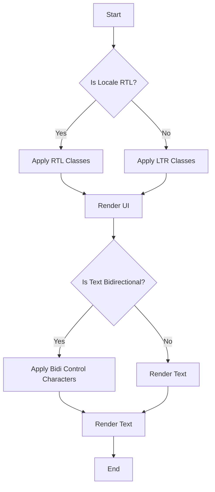

## 29.5. Right-to-Left Language Support

In today's globalized world, supporting multiple languages in software applications is crucial. Among these, right-to-left (RTL) languages such as Arabic, Hebrew, and Persian present unique challenges. This section will guide you through the process of implementing RTL language support in Elixir applications, focusing on UI adjustments, bidirectional text handling, and testing strategies.

### Understanding Right-to-Left Language Support

Right-to-left languages require specific considerations in both design and implementation. Unlike left-to-right (LTR) languages, RTL languages flow from right to left, affecting text alignment, UI layout, and overall user experience. Let's explore the key components of RTL support.

### UI Adjustments for RTL Languages

#### Mirroring Layouts

Mirroring is the process of flipping the layout horizontally to accommodate RTL languages. This involves reversing the order of UI elements, such as navigation bars, icons, and buttons.

- **Navigation Bars**: In RTL languages, navigation bars should be aligned to the right. This means that any icons or menu items should be mirrored to maintain consistency.
- **Icons and Buttons**: Icons with directional meaning, such as arrows, should be flipped to point in the correct direction. For example, a "next" button should point left instead of right.

```elixir
defmodule MyAppWeb.LayoutView do
  use MyAppWeb, :view

  # Function to determine if the current locale is RTL
  def rtl_locale?(locale) do
    Enum.member?(["ar", "he", "fa"], locale)
  end

  # Function to apply RTL classes
  def rtl_class(locale) do
    if rtl_locale?(locale), do: "rtl", else: ""
  end
end
```

In this example, we define a helper function `rtl_locale?` to check if the current locale is an RTL language. The `rtl_class` function then applies an RTL-specific CSS class to the layout.

#### Aligning Text Appropriately

Text alignment is another critical aspect of RTL support. Text should be aligned to the right for RTL languages, ensuring readability and a natural flow.

- **CSS Adjustments**: Use CSS to adjust text alignment based on the language direction.

```css
body.rtl {
  direction: rtl;
  text-align: right;
}

body.ltr {
  direction: ltr;
  text-align: left;
}
```

By applying these CSS rules, you can dynamically adjust text alignment based on the user's language preference.

### Bidirectional Text Handling

Bidirectional (bidi) text refers to content that includes both LTR and RTL text. Handling bidi text requires careful attention to ensure that the text displays correctly.

#### Unicode Bidirectional Algorithm

The Unicode Bidirectional Algorithm (UBA) is a standard for handling bidi text. It defines how text should be displayed when LTR and RTL scripts are mixed.

- **Embedding and Overriding**: Use Unicode control characters to explicitly define text direction when necessary. For example, the `U+202A` (LEFT-TO-RIGHT EMBEDDING) and `U+202B` (RIGHT-TO-LEFT EMBEDDING) characters can be used to control text direction.

```elixir
defmodule MyAppWeb.TextHelper do
  # Function to wrap text with bidi control characters
  def bidi_wrap(text, direction) do
    case direction do
      :rtl -> "\u202B#{text}\u202C" # RTL embedding
      :ltr -> "\u202A#{text}\u202C" # LTR embedding
      _ -> text
    end
  end
end
```

In this example, the `bidi_wrap` function wraps text with the appropriate bidi control characters based on the specified direction.

#### Handling Mixed Content

When dealing with mixed content, it's essential to ensure that the text flows naturally. This may involve using HTML attributes like `dir` to specify text direction.

```html
<p dir="auto">
  This is an example of mixed content: مرحبا (Hello in Arabic).
</p>
```

The `dir="auto"` attribute allows the browser to automatically determine the direction of the text based on its content.

### Testing RTL Language Support

Testing is a crucial step in ensuring that your application provides a seamless experience for RTL users. Here are some strategies to consider:

#### Verifying UI Correctness

- **Visual Inspection**: Manually inspect the UI to ensure that all elements are correctly mirrored and aligned.
- **Automated Testing**: Use automated testing tools to verify that the UI behaves as expected in RTL mode.

```elixir
defmodule MyAppWeb.RtlTest do
  use ExUnit.Case, async: true
  use MyAppWeb.ConnCase

  test "renders page with RTL layout" do
    conn = get(conn(), "/?locale=ar")
    assert html_response(conn, 200) =~ "class=\"rtl\""
  end
end
```

In this test case, we simulate a request with an RTL locale and verify that the `rtl` class is applied to the page.

#### User Feedback

- **Gather Feedback**: Collect feedback from native RTL speakers to identify any issues or areas for improvement.
- **Iterate and Improve**: Use feedback to refine your implementation and ensure a high-quality user experience.

### Visualizing RTL Support

To better understand the process of implementing RTL support, let's visualize the flow of handling RTL languages in an Elixir application.



This flowchart illustrates the decision-making process for applying RTL support in an Elixir application. It highlights the steps involved in determining the locale, applying the appropriate classes, and handling bidirectional text.

### Key Takeaways

- **Mirroring Layouts**: Ensure that UI elements are mirrored for RTL languages to provide a natural user experience.
- **Bidirectional Text**: Use the Unicode Bidirectional Algorithm to handle mixed LTR and RTL content effectively.
- **Testing**: Verify UI correctness through visual inspection, automated testing, and user feedback.

### Embrace the Journey

Implementing RTL support in your Elixir applications is a rewarding journey that enhances accessibility and inclusivity. As you progress, you'll gain valuable insights into internationalization and localization, enabling you to build applications that cater to a global audience. Keep experimenting, stay curious, and enjoy the journey!

## Quiz: Right-to-Left Language Support



### What is the primary purpose of mirroring layouts in RTL language support?

- [x] To ensure UI elements are aligned and ordered correctly for RTL languages
- [ ] To change the color scheme of the application
- [ ] To increase the font size for better readability
- [ ] To add more animations to the UI

> **Explanation:** Mirroring layouts ensures that UI elements are aligned and ordered correctly for RTL languages, providing a natural user experience.

### Which CSS property is used to adjust text alignment for RTL languages?

- [x] `direction`
- [ ] `float`
- [ ] `display`
- [ ] `position`

> **Explanation:** The `direction` CSS property is used to adjust text alignment for RTL languages by setting the text flow direction.

### What is the role of the Unicode Bidirectional Algorithm in RTL support?

- [x] It defines how text should be displayed when LTR and RTL scripts are mixed
- [ ] It changes the font style for RTL languages
- [ ] It translates text from LTR to RTL languages
- [ ] It compresses text for faster loading

> **Explanation:** The Unicode Bidirectional Algorithm defines how text should be displayed when LTR and RTL scripts are mixed, ensuring correct text flow.

### How can you specify text direction in HTML for mixed content?

- [x] Use the `dir` attribute
- [ ] Use the `align` attribute
- [ ] Use the `style` attribute
- [ ] Use the `lang` attribute

> **Explanation:** The `dir` attribute in HTML is used to specify text direction, which is essential for handling mixed content.

### What is a common method for testing RTL language support in Elixir applications?

- [x] Automated testing with ExUnit
- [ ] Manual code review
- [ ] Increasing server resources
- [ ] Using a different programming language

> **Explanation:** Automated testing with ExUnit is a common method for verifying RTL language support in Elixir applications.

### Which function in Elixir can be used to wrap text with bidi control characters?

- [x] `bidi_wrap`
- [ ] `text_align`
- [ ] `rtl_format`
- [ ] `locale_check`

> **Explanation:** The `bidi_wrap` function can be used to wrap text with bidi control characters, ensuring correct text direction.

### What is the purpose of gathering user feedback in RTL language support?

- [x] To identify issues and areas for improvement
- [ ] To increase application speed
- [ ] To reduce server costs
- [ ] To change the application theme

> **Explanation:** Gathering user feedback helps identify issues and areas for improvement, ensuring a high-quality user experience.

### Which languages are typically considered RTL?

- [x] Arabic
- [x] Hebrew
- [ ] English
- [ ] Spanish

> **Explanation:** Arabic and Hebrew are examples of RTL languages, while English and Spanish are LTR languages.

### What is the benefit of using the `rtl_class` function in Elixir?

- [x] It dynamically applies RTL-specific CSS classes based on the locale
- [ ] It changes the application language
- [ ] It compresses images for faster loading
- [ ] It increases the database size

> **Explanation:** The `rtl_class` function dynamically applies RTL-specific CSS classes based on the locale, ensuring correct UI adjustments.

### True or False: The `dir="auto"` attribute allows the browser to automatically determine text direction.

- [x] True
- [ ] False

> **Explanation:** The `dir="auto"` attribute allows the browser to automatically determine text direction based on the content, which is useful for handling mixed content.


