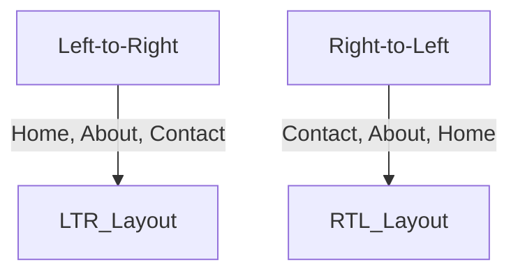

## 29.5. Right-to-Left Language Support

In today's globalized world, supporting multiple languages in software applications is essential. For many languages, including Arabic, Hebrew, and Persian, text is written from right to left (RTL). Ensuring that your Elixir applications support RTL languages involves more than just translating text; it requires careful UI adjustments, handling bidirectional text, and rigorous testing. This section will guide you through the intricacies of implementing RTL support in Elixir applications.

### Introduction to RTL Language Support

Right-to-left (RTL) language support is a crucial aspect of internationalization and localization. While left-to-right (LTR) languages like English are more common in software development, RTL languages are spoken by millions worldwide. Proper RTL support enhances user experience, increases accessibility, and expands your application's reach.

### UI Adjustments

UI adjustments for RTL languages are essential to provide a seamless experience for users. This involves mirroring layouts, aligning text appropriately, and ensuring that visual elements are correctly oriented.

#### Mirroring Layouts

Mirroring a layout involves flipping the UI horizontally so that elements that appear on the left in LTR languages appear on the right in RTL languages. This includes navigation menus, buttons, and icons. 

**Example:**

Consider a simple navigation bar with three buttons: Home, About, and Contact. In an LTR layout, these buttons appear from left to right. In an RTL layout, they should appear from right to left.

```elixir
defmodule MyAppWeb.LayoutView do
  use MyAppWeb, :view

  def render_navigation_bar(conn) do
    direction = get_direction(conn)
    buttons = ["Home", "About", "Contact"]

    if direction == :rtl do
      buttons = Enum.reverse(buttons)
    end

    Enum.map(buttons, fn button ->
      content_tag(:button, button)
    end)
  end

  defp get_direction(conn) do
    # Determine the direction based on the user's language preference
    case get_locale(conn) do
      "ar" -> :rtl
      "he" -> :rtl
      _ -> :ltr
    end
  end
end
```

**Diagram: Mirrored Layout**


```mermaid
graph TD
    LTR[Left-to-Right] -->|Home, About, Contact| LTR_Layout
    RTL[Right-to-Left] -->|Contact, About, Home| RTL_Layout
```

#### Aligning Text Appropriately

Text alignment is another critical aspect of RTL support. In RTL languages, text should be right-aligned by default. This applies to both block-level elements and inline elements.

**CSS Example:**

```css
body[dir="rtl"] {
  text-align: right;
}

body[dir="ltr"] {
  text-align: left;
}
```

### Bidirectional Text

Handling bidirectional (bidi) text is a complex challenge when supporting RTL languages. Bidi text occurs when both RTL and LTR text are present in the same document, such as Arabic text with English numbers or URLs.

#### Unicode Bidirectional Algorithm

The Unicode Bidirectional Algorithm is a set of rules that determine the order of characters in bidirectional text. Understanding and applying this algorithm is crucial for correctly displaying bidi text.

**Example:**

```elixir
defmodule MyApp.BidiText do
  def process_text(text) do
    # Use Elixir's Unicode library to handle bidi text
    Unicode.normalize(text, :nfc)
  end
end
```

#### Embedding and Overriding

To handle bidi text, you may need to use special Unicode control characters, such as:

- **LRM (Left-to-Right Mark):** `U+200E`
- **RLM (Right-to-Left Mark):** `U+200F`
- **LRE (Left-to-Right Embedding):** `U+202A`
- **RLE (Right-to-Left Embedding):** `U+202B`
- **PDF (Pop Directional Formatting):** `U+202C`

**Example:**

```elixir
defmodule MyApp.BidiText do
  def wrap_bidi_text(text, direction) do
    case direction do
      :rtl -> "\u202B#{text}\u202C"
      :ltr -> "\u202A#{text}\u202C"
    end
  end
end
```

### Testing RTL Support

Testing is a critical step in ensuring that your application correctly supports RTL languages. This involves verifying UI correctness, checking text alignment, and ensuring proper functionality of bidirectional text.

#### Verifying UI Correctness

Use automated tests and manual checks to ensure that the UI is correctly mirrored and that all elements are properly aligned.

**Example Test:**

```elixir
defmodule MyAppWeb.RtlTest do
  use ExUnit.Case, async: true
  import Phoenix.LiveViewTest

  test "navigation bar is mirrored in RTL mode" do
    {:ok, view, _html} = live(conn, "/")

    assert render(view) =~ "Contact"
    assert render(view) =~ "About"
    assert render(view) =~ "Home"
  end
end
```

#### Handling Mixed Content

Ensure that your application can correctly display mixed RTL and LTR content. This may involve using specific libraries or tools to handle bidi text.

#### User Testing

Conduct user testing with native speakers of RTL languages to identify any issues that automated tests may miss. This feedback is invaluable for ensuring a high-quality user experience.

### Try It Yourself

To deepen your understanding of RTL support, try modifying the provided code examples. Experiment with different text directions and observe how the UI changes. Consider implementing additional features, such as language switching and dynamic layout adjustments.

### Conclusion

Supporting RTL languages in your Elixir applications is a vital aspect of internationalization and localization. By making UI adjustments, handling bidirectional text, and conducting thorough testing, you can provide a seamless experience for users of RTL languages. Remember, this is just the beginning. As you progress, you'll build more complex and interactive applications. Keep experimenting, stay curious, and enjoy the journey!

## Quiz Time!



### What is the primary purpose of mirroring layouts for RTL languages?

- [x] To flip the UI horizontally so elements appear correctly for RTL users
- [ ] To change the color scheme for RTL users
- [ ] To adjust the font size for RTL users
- [ ] To modify the language of the content

> **Explanation:** Mirroring layouts involves flipping the UI horizontally to ensure that elements appear correctly for users of RTL languages.

### Which CSS property is used to align text to the right for RTL languages?

- [ ] `font-weight`
- [ ] `color`
- [x] `text-align`
- [ ] `font-size`

> **Explanation:** The `text-align` property is used to align text to the right for RTL languages.

### What is the Unicode Bidirectional Algorithm used for?

- [ ] Changing text color
- [x] Determining the order of characters in bidirectional text
- [ ] Adjusting font size
- [ ] Translating text

> **Explanation:** The Unicode Bidirectional Algorithm is used to determine the order of characters in bidirectional text, ensuring correct display of mixed RTL and LTR content.

### Which Unicode control character is used for Right-to-Left Embedding?

- [ ] `U+202A`
- [x] `U+202B`
- [ ] `U+202C`
- [ ] `U+200E`

> **Explanation:** The `U+202B` character is used for Right-to-Left Embedding in bidirectional text.

### What should be verified during RTL support testing?

- [x] UI correctness and text alignment
- [ ] Only text color
- [ ] Only font size
- [ ] Only image resolution

> **Explanation:** During RTL support testing, it's important to verify UI correctness and text alignment to ensure a seamless user experience.

### Which Elixir module can be used to normalize text for bidirectional support?

- [ ] Enum
- [ ] String
- [x] Unicode
- [ ] List

> **Explanation:** The Unicode module in Elixir can be used to normalize text for bidirectional support.

### Why is user testing important for RTL support?

- [ ] To change the application language
- [x] To identify issues that automated tests may miss
- [ ] To adjust the font size
- [ ] To modify the color scheme

> **Explanation:** User testing is important for identifying issues that automated tests may miss, ensuring a high-quality user experience.

### What is the role of the `get_direction` function in the provided Elixir code example?

- [ ] To change the font size
- [x] To determine the text direction based on the user's language preference
- [ ] To adjust the color scheme
- [ ] To modify the layout

> **Explanation:** The `get_direction` function determines the text direction based on the user's language preference, allowing for appropriate UI adjustments.

### Which of the following is NOT a Unicode control character for bidirectional text?

- [ ] LRM
- [ ] RLM
- [ ] PDF
- [x] CSS

> **Explanation:** CSS is not a Unicode control character; it's a style sheet language used for describing the presentation of a document.

### True or False: RTL support only involves translating text into RTL languages.

- [ ] True
- [x] False

> **Explanation:** RTL support involves more than just translating text; it includes UI adjustments, handling bidirectional text, and thorough testing.


