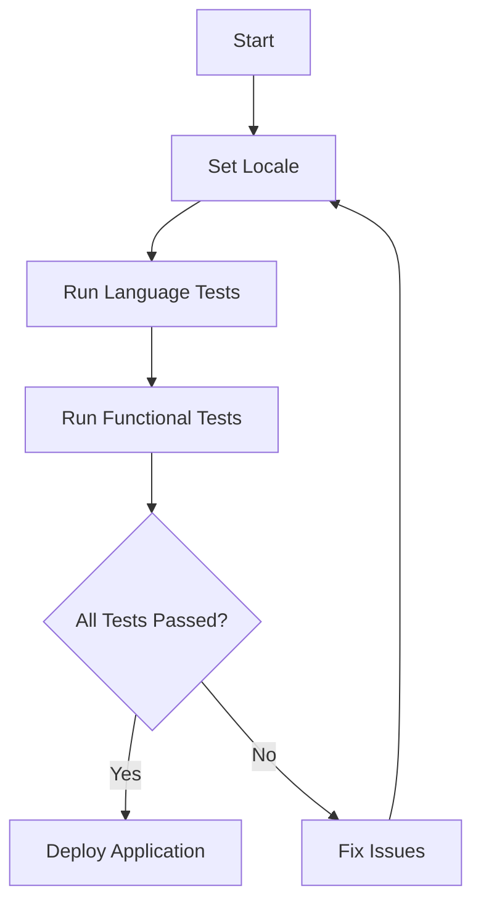

## 29.6. Testing Internationalized Applications

As software engineers and architects, ensuring that your Elixir applications are ready for a global audience is crucial. Internationalization (i18n) and localization (l10n) are key components in this process. However, testing internationalized applications presents unique challenges. This guide will walk you through the essential concepts, strategies, and tools for effectively testing internationalized applications in Elixir.

### Understanding Internationalization and Localization

Before diving into testing, it's important to understand the difference between internationalization and localization:

- **Internationalization (i18n)**: The process of designing your application so it can be adapted to various languages and regions without requiring engineering changes.
- **Localization (l10n)**: The process of adapting your application to a specific locale, including translating text and adjusting formats for dates, currencies, and more.

### Language Testing

Language testing ensures that translations appear correctly and that the application behaves as expected in different languages. This involves verifying that all user interface elements are translated and that the translations are contextually appropriate.

#### Key Considerations for Language Testing

1. **Translation Completeness**: Ensure that all strings in the application are translated. Missing translations can lead to a poor user experience.

2. **Contextual Accuracy**: Verify that translations make sense in the given context. This may require collaboration with native speakers or professional translators.

3. **Character Encoding**: Ensure that your application supports the character sets required for different languages, including those with non-Latin scripts.

4. **Text Expansion**: Some languages require more space than others. Ensure that your UI can accommodate text expansion without breaking layouts.

5. **Right-to-Left (RTL) Support**: For languages like Arabic and Hebrew, ensure that your application supports RTL text direction.

#### Code Example: Language Testing with Gettext

Elixir's Gettext library is a powerful tool for managing translations. Here's a simple example of how to use Gettext for language testing:

```elixir
# Import the Gettext module
import MyApp.Gettext

# Define a function to fetch a translated string
def welcome_message(locale) do
  Gettext.put_locale(locale)
  gettext("Welcome to our application!")
end

# Test the function with different locales
IO.puts welcome_message("en") # Output: "Welcome to our application!"
IO.puts welcome_message("es") # Output: "¡Bienvenido a nuestra aplicación!"
```

In this example, we use `Gettext.put_locale/1` to set the desired locale and `gettext/1` to fetch the translated string. This approach allows you to test translations programmatically.

### Functional Tests

Functional tests ensure that your application behaves correctly across different locales. This involves verifying that all features work as expected, regardless of the language or region settings.

#### Key Considerations for Functional Testing

1. **Locale-Specific Logic**: Ensure that any logic specific to a locale, such as date formatting or currency conversion, is tested thoroughly.

2. **User Interface**: Verify that the UI remains consistent and usable across different locales. This includes checking for layout issues caused by text expansion or RTL support.

3. **Data Validation**: Ensure that data input and validation work correctly for different locales, including handling of decimal separators, date formats, and more.

4. **Error Messages**: Verify that error messages are translated and contextually appropriate.

#### Code Example: Functional Testing with ExUnit

ExUnit is Elixir's built-in testing framework, which can be used to write functional tests for internationalized applications. Here's an example:

```elixir
defmodule MyApp.FunctionalTest do
  use ExUnit.Case

  test "welcome message is translated correctly" do
    assert MyApp.welcome_message("en") == "Welcome to our application!"
    assert MyApp.welcome_message("es") == "¡Bienvenido a nuestra aplicación!"
  end

  test "date formatting is locale-specific" do
    assert MyApp.format_date(~D[2024-11-23], "en") == "November 23, 2024"
    assert MyApp.format_date(~D[2024-11-23], "fr") == "23 novembre 2024"
  end
end
```

In this example, we define functional tests to verify that the welcome message and date formatting are correct for different locales.

### Automation

Automating the testing process is essential for maintaining quality and efficiency, especially when dealing with multiple languages and locales.

#### Key Considerations for Automation

1. **Test Coverage**: Ensure that your automated test suite covers all critical paths and edge cases for each locale.

2. **Continuous Integration**: Integrate your tests into a continuous integration (CI) pipeline to ensure that they are run automatically with each code change.

3. **Localization Testing Tools**: Consider using specialized tools for localization testing, such as pseudo-localization, which simulates translations to identify potential issues.

4. **Performance Testing**: Ensure that your application performs well under different locale settings, especially if locale-specific logic affects performance.

#### Code Example: Automating Tests with Mix

Elixir's Mix tool can be used to automate the execution of your test suite. Here's how you can set up a basic automation script:

```elixir
# Define a Mix task for running tests
defmodule Mix.Tasks.TestAllLocales do
  use Mix.Task

  @shortdoc "Run tests for all supported locales"

  def run(_) do
    locales = ["en", "es", "fr", "de"]
    Enum.each(locales, fn locale ->
      System.put_env("LOCALE", locale)
      Mix.Task.run("test")
    end)
  end
end
```

In this example, we define a custom Mix task that runs tests for each supported locale. This approach allows you to automate the testing process for multiple languages.

### Visualizing the Testing Process

To better understand the testing process for internationalized applications, let's visualize it using a flowchart:



**Figure 1**: This flowchart illustrates the process of testing internationalized applications, from setting the locale to running language and functional tests, and finally deploying the application if all tests pass.

### References and Further Reading

- [Elixir Gettext Documentation](https://hexdocs.pm/gettext/Gettext.html)
- [ExUnit Documentation](https://hexdocs.pm/ex_unit/ExUnit.html)
- [Internationalization and Localization Best Practices](https://www.w3.org/International/questions/qa-i18n)

### Knowledge Check

- What is the difference between internationalization and localization?
- How can you ensure that translations are contextually accurate?
- What are some common challenges in testing internationalized applications?

### Embrace the Journey

Testing internationalized applications is a complex but rewarding process. By following the strategies and best practices outlined in this guide, you'll be well-equipped to deliver high-quality applications to a global audience. Remember, this is just the beginning. As you continue to explore the world of internationalization and localization, keep experimenting, stay curious, and enjoy the journey!

### Quiz: Testing Internationalized Applications



### What is the primary goal of language testing in internationalized applications?

- [x] Ensuring translations appear correctly
- [ ] Improving application performance
- [ ] Enhancing security features
- [ ] Reducing code complexity

> **Explanation:** Language testing focuses on verifying that translations are accurate and contextually appropriate.

### Which Elixir library is commonly used for managing translations?

- [x] Gettext
- [ ] Ecto
- [ ] Phoenix
- [ ] ExUnit

> **Explanation:** Gettext is a widely used library in Elixir for handling translations and managing internationalization.

### What is a key consideration when testing the user interface of an internationalized application?

- [x] Text expansion and layout issues
- [ ] Database indexing
- [ ] Network latency
- [ ] Memory usage

> **Explanation:** Text expansion can affect the layout of the user interface, so it's important to ensure that the UI remains consistent across different languages.

### How can you automate the testing of multiple locales in Elixir?

- [x] Use a custom Mix task to run tests for each locale
- [ ] Manually change the locale and run tests
- [ ] Use a third-party service for testing
- [ ] Skip testing for different locales

> **Explanation:** A custom Mix task can automate the process of running tests for each supported locale, ensuring comprehensive test coverage.

### What is pseudo-localization?

- [x] A technique to simulate translations and identify potential issues
- [ ] A method for optimizing database queries
- [ ] A tool for debugging network errors
- [ ] A process for encrypting sensitive data

> **Explanation:** Pseudo-localization is a technique used to simulate translations, helping developers identify potential issues with internationalization.

### Which of the following is a common challenge in testing internationalized applications?

- [x] Ensuring contextual accuracy of translations
- [ ] Managing database migrations
- [ ] Implementing caching strategies
- [ ] Configuring server environments

> **Explanation:** Ensuring that translations are contextually accurate is a common challenge in testing internationalized applications.

### What is the purpose of functional tests in internationalized applications?

- [x] Checking application behavior across different locales
- [ ] Improving code readability
- [ ] Enhancing security protocols
- [ ] Reducing memory usage

> **Explanation:** Functional tests verify that the application behaves correctly across different locales, ensuring consistent functionality.

### Why is it important to test error messages in internationalized applications?

- [x] To ensure they are translated and contextually appropriate
- [ ] To improve application performance
- [ ] To reduce server load
- [ ] To enhance user authentication

> **Explanation:** Testing error messages ensures that they are translated correctly and make sense in the given context, improving the user experience.

### What is the role of continuous integration in testing internationalized applications?

- [x] Automating the execution of tests with each code change
- [ ] Managing server configurations
- [ ] Optimizing database queries
- [ ] Enhancing application security

> **Explanation:** Continuous integration automates the execution of tests, ensuring that they are run consistently with each code change.

### True or False: Localization involves designing your application to be adaptable to various languages and regions.

- [ ] True
- [x] False

> **Explanation:** Localization is the process of adapting your application to a specific locale, while internationalization involves designing the application to be adaptable to various languages and regions.


