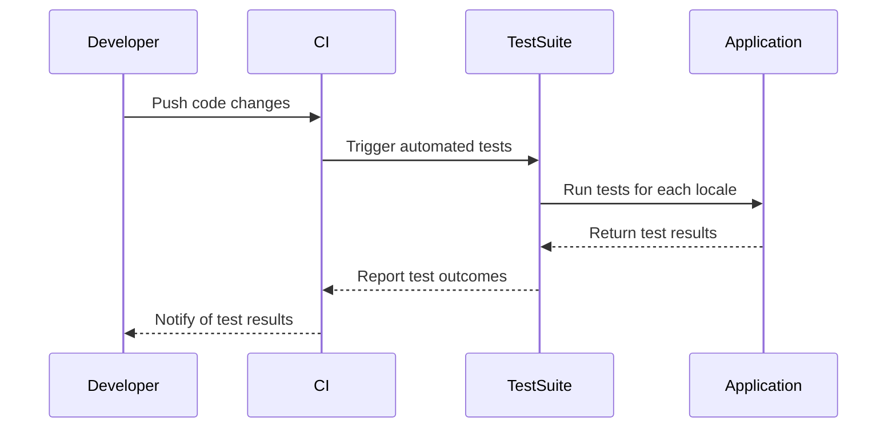

## 29.6. Testing Internationalized Applications

In today's globalized world, developing applications that cater to diverse linguistic and cultural backgrounds is more important than ever. Internationalization (i18n) and localization (l10n) are crucial processes that allow applications to adapt to different languages and regions. However, ensuring that these applications perform correctly across various locales requires rigorous testing. In this section, we will delve into the methodologies and tools available for testing internationalized applications in Elixir.

### Introduction to Internationalization and Localization

Before diving into testing, it's essential to understand the distinction between internationalization and localization:

- **Internationalization (i18n):** The process of designing software applications so that they can be adapted to various languages and regions without engineering changes. This involves abstracting user interface elements and other locale-specific features.

- **Localization (l10n):** The process of adapting internationalized software for a specific region or language by adding locale-specific components and translating text.

### Language Testing

Language testing is a fundamental part of ensuring that your application displays text correctly in different languages. This involves verifying that translations are accurate and contextually appropriate.

#### Ensuring Translations Appear Correctly

1. **Translation Consistency:** Ensure that translations are consistent across the application. Use a centralized translation file or service to manage translations effectively.

2. **UI Layout and Design:** Different languages have varying text lengths, which can affect UI layout. Test your application to ensure that text expansion or contraction does not break the design.

3. **Character Encoding:** Verify that your application supports the character sets required for different languages, including special characters and diacritics.

4. **Right-to-Left (RTL) Language Support:** For languages like Arabic and Hebrew, ensure that your application supports RTL text direction.

5. **Plurals and Gender:** Some languages have complex rules for plurals and gender. Ensure that your application handles these correctly.

#### Code Example: Testing Translations in Elixir

Let's explore a basic example of testing translations in an Elixir application using the `Gettext` library.

```elixir
# lib/my_app/gettext.ex
defmodule MyApp.Gettext do
  use Gettext, otp_app: :my_app
end

# test/my_app/gettext_test.exs
defmodule MyApp.GettextTest do
  use ExUnit.Case
  import MyApp.Gettext

  test "translates a simple string" do
    assert gettext("Hello") == "Hola" # Assuming Spanish translation is "Hola"
  end

  test "handles pluralization" do
    assert ngettext("There is one apple", "There are %{count} apples", 1) == "Hay una manzana"
    assert ngettext("There is one apple", "There are %{count} apples", 5) == "Hay %{count} manzanas"
  end
end
```

### Functional Tests

Functional testing ensures that your application's behavior is consistent across different locales. This involves verifying that all features work as expected when the application is used in various languages.

#### Checking Application Behavior Across Different Locales

1. **Locale Switching:** Test the application's ability to switch between different locales seamlessly. Ensure that all UI elements, including date and time formats, currency, and numbers, update according to the selected locale.

2. **Input and Output Validation:** Verify that the application correctly handles input and output for different languages, including text input, form submissions, and data display.

3. **Error Messages and Notifications:** Ensure that error messages and notifications are translated and displayed correctly in all supported languages.

4. **Cultural Nuances:** Consider cultural differences that may affect how users interact with your application. This includes date formats, number separators, and color symbolism.

#### Code Example: Functional Testing with ExUnit

Here's how you can set up functional tests to verify locale-specific behavior in an Elixir application.

```elixir
# test/my_app/locale_functional_test.exs
defmodule MyApp.LocaleFunctionalTest do
  use ExUnit.Case
  import MyApp.Gettext

  setup do
    # Set the default locale for tests
    Gettext.put_locale(MyApp.Gettext, "es")
    :ok
  end

  test "displays date in Spanish format" do
    date = ~D[2024-11-23]
    assert MyApp.DateFormatter.format(date) == "23 de noviembre de 2024"
  end

  test "handles currency in Spanish locale" do
    amount = 1234.56
    assert MyApp.CurrencyFormatter.format(amount) == "1.234,56 €"
  end
end
```

### Automation

Automating the testing process for internationalized applications is crucial for maintaining efficiency and consistency. Automated test suites can cover multiple languages and locales, reducing the risk of human error and ensuring comprehensive coverage.

#### Using Test Suites to Cover Multiple Languages

1. **Parameterized Tests:** Use parameterized tests to run the same test cases across different locales. This ensures that all functionalities are verified for each supported language.

2. **Continuous Integration (CI):** Integrate your test suite into a CI pipeline to automatically run tests for all locales whenever changes are made to the codebase.

3. **Localization Testing Tools:** Utilize tools like `gettext` for managing translations and `ex_unit` for writing and running tests. These tools can help automate the testing process and ensure that all translations are up-to-date.

4. **Visual Regression Testing:** Implement visual regression testing to capture screenshots of your application in different languages and compare them to baseline images. This helps identify UI issues caused by text expansion or contraction.

#### Code Example: Automated Testing with ExUnit and Gettext

Below is an example of how to automate testing for multiple locales using ExUnit and Gettext.

```elixir
# test/my_app/locale_automation_test.exs
defmodule MyApp.LocaleAutomationTest do
  use ExUnit.Case
  import MyApp.Gettext

  @locales ["en", "es", "fr", "de"]

  Enum.each(@locales, fn locale ->
    @locale locale
    test "verifies translations for locale #{@locale}" do
      Gettext.put_locale(MyApp.Gettext, @locale)
      assert gettext("Welcome") == expected_translation(@locale, "Welcome")
    end
  end)

  defp expected_translation("en", "Welcome"), do: "Welcome"
  defp expected_translation("es", "Welcome"), do: "Bienvenido"
  defp expected_translation("fr", "Welcome"), do: "Bienvenue"
  defp expected_translation("de", "Welcome"), do: "Willkommen"
end
```

### Visualizing the Testing Process

To better understand the testing process for internationalized applications, let's visualize the workflow using a sequence diagram.


```mermaid
sequenceDiagram
    participant Developer
    participant CI
    participant TestSuite
    participant Application

    Developer->>CI: Push code changes
    CI->>TestSuite: Trigger automated tests
    TestSuite->>Application: Run tests for each locale
    Application-->>TestSuite: Return test results
    TestSuite-->>CI: Report test outcomes
    CI-->>Developer: Notify of test results
```

**Description:** This diagram illustrates the flow of automated testing for internationalized applications. The developer pushes code changes, triggering the CI pipeline to run the test suite. The test suite executes tests for each locale on the application, and the results are reported back to the developer.

### References and Further Reading

- [Elixir Gettext Documentation](https://hexdocs.pm/gettext/Gettext.html)
- [ExUnit Testing Framework](https://hexdocs.pm/ex_unit/ExUnit.html)
- [Internationalization and Localization in Software](https://www.w3.org/International/)

### Knowledge Check

To ensure you've grasped the key concepts, consider the following questions:

1. What is the difference between internationalization and localization?
2. Why is it important to test UI layouts for different languages?
3. How can you automate testing for multiple locales in an Elixir application?
4. What are some challenges associated with testing RTL languages?
5. How does visual regression testing help in internationalization testing?

### Summary and Encouragement

Testing internationalized applications is a complex but rewarding process. By ensuring that your application performs seamlessly across different languages and regions, you can reach a broader audience and enhance user satisfaction. Remember, this is just the beginning. As you continue to explore internationalization and localization, you'll discover new challenges and opportunities to improve your applications. Keep experimenting, stay curious, and enjoy the journey!

## Quiz Time!



### What is the primary goal of internationalization in software development?

- [x] To design software that can be easily adapted to various languages and regions.
- [ ] To translate all text into different languages.
- [ ] To create multiple versions of the software for each locale.
- [ ] To ensure that the software only supports English.

> **Explanation:** Internationalization involves designing software so that it can be adapted to different languages and regions without requiring engineering changes.

### Which library is commonly used in Elixir for managing translations?

- [x] Gettext
- [ ] ExUnit
- [ ] Phoenix
- [ ] Ecto

> **Explanation:** Gettext is a library used in Elixir for managing translations and internationalization.

### Why is it important to test UI layouts for different languages?

- [x] Different languages have varying text lengths, which can affect UI layout.
- [ ] To ensure that all languages use the same font.
- [ ] To verify that the application only supports one language.
- [ ] To make sure that the application supports only left-to-right text.

> **Explanation:** Different languages can have varying text lengths, which may affect the layout and design of the UI.

### What is the purpose of using parameterized tests in internationalization testing?

- [x] To run the same test cases across different locales.
- [ ] To test only one locale at a time.
- [ ] To create separate test cases for each language.
- [ ] To ensure that tests are run manually.

> **Explanation:** Parameterized tests allow running the same test cases across different locales, ensuring comprehensive coverage.

### How can visual regression testing help in internationalization testing?

- [x] By capturing screenshots in different languages and comparing them to baseline images.
- [ ] By ensuring that all text is translated correctly.
- [ ] By verifying the application's performance.
- [ ] By checking the application's security.

> **Explanation:** Visual regression testing captures screenshots of the application in different languages and compares them to baseline images to identify UI issues.

### What is a challenge associated with testing RTL languages?

- [x] Ensuring that the application supports right-to-left text direction.
- [ ] Verifying that the application uses the same font for all languages.
- [ ] Making sure that the application only supports left-to-right text.
- [ ] Ensuring that the application only supports English.

> **Explanation:** Testing RTL languages involves ensuring that the application supports right-to-left text direction, which can be challenging.

### What is the benefit of integrating the test suite into a CI pipeline?

- [x] To automatically run tests for all locales whenever changes are made to the codebase.
- [ ] To manually run tests for each locale.
- [ ] To ensure that tests are only run once.
- [ ] To create separate test cases for each language.

> **Explanation:** Integrating the test suite into a CI pipeline allows for automatic testing of all locales whenever changes are made to the codebase.

### Which of the following is a key aspect of functional testing for internationalized applications?

- [x] Verifying that all features work as expected in various languages.
- [ ] Ensuring that the application only supports one language.
- [ ] Creating separate versions of the software for each locale.
- [ ] Translating all text into different languages.

> **Explanation:** Functional testing involves verifying that all features work as expected when the application is used in various languages.

### What is the role of Gettext in Elixir applications?

- [x] Managing translations and internationalization.
- [ ] Handling database operations.
- [ ] Managing application state.
- [ ] Providing real-time communication.

> **Explanation:** Gettext is used for managing translations and internationalization in Elixir applications.

### True or False: Localization involves designing software so that it can be adapted to various languages and regions without engineering changes.

- [ ] True
- [x] False

> **Explanation:** Localization is the process of adapting internationalized software for a specific region or language by adding locale-specific components and translating text.


