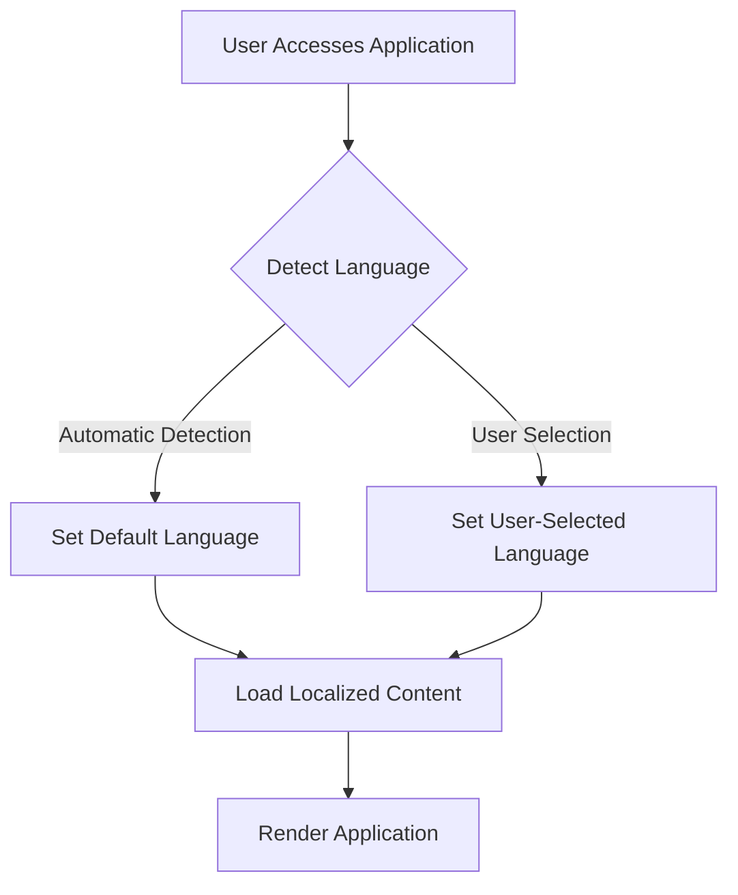

## 29.7. Best Practices for Global Applications

In today's interconnected world, developing applications that cater to a global audience is not just an advantage but a necessity. As expert software engineers and architects, understanding the nuances of creating global applications using Elixir is crucial. This section delves into best practices for developing global applications, focusing on cultural sensitivity, performance optimization, and user experience.

### Cultural Sensitivity

Cultural sensitivity is paramount when developing applications for a global audience. It involves understanding and respecting cultural norms, avoiding offensive content, and ensuring that your application resonates with users from diverse backgrounds.

#### Respecting Cultural Norms

1. **Research and Understand Cultural Differences**: Before launching your application in a new region, conduct thorough research to understand the cultural norms and values of that region. This includes language nuances, color symbolism, and local customs.

2. **Avoid Stereotypes and Offensive Content**: Ensure that your application content does not perpetuate stereotypes or include offensive material. This requires sensitivity and awareness of cultural taboos and preferences.

3. **Use Local Experts**: Collaborate with local experts or cultural consultants to review your application content and design. They can provide valuable insights into cultural appropriateness and help avoid potential pitfalls.

4. **Cultural Adaptation of Visuals and Icons**: Visual elements such as icons and images should be culturally appropriate. For instance, certain symbols may have different meanings in different cultures, so it's important to adapt them accordingly.

#### Code Example: Dynamic Content Loading

```elixir
defmodule MyApp.Localization do
  @moduledoc """
  Module for handling localization and cultural adaptation.
  """

  # Function to load content based on user's locale
  def load_content(locale) do
    case locale do
      "en-US" -> load_english_content()
      "fr-FR" -> load_french_content()
      _ -> load_default_content()
    end
  end

  defp load_english_content do
    # Load English content
    IO.puts("Loading English content...")
  end

  defp load_french_content do
    # Load French content
    IO.puts("Loading French content...")
  end

  defp load_default_content do
    # Load default content
    IO.puts("Loading default content...")
  end
end
```

### Performance

Performance optimization is critical when dealing with the additional overhead of localization and internationalization. Efficient caching strategies and optimization techniques can significantly enhance the performance of global applications.

#### Caching and Optimization

1. **Implement Caching Strategies**: Use caching mechanisms to store localized content and reduce the need for repeated data retrieval. This can be achieved using Elixir's ETS (Erlang Term Storage) or external caching solutions like Redis.

2. **Optimize Resource Loading**: Minimize the loading time of resources such as images, fonts, and scripts by using content delivery networks (CDNs) and optimizing file sizes.

3. **Leverage Asynchronous Processing**: Utilize Elixir's concurrency model to handle background tasks asynchronously, ensuring that the main application flow remains responsive.

4. **Monitor and Analyze Performance**: Regularly monitor application performance using tools like New Relic or AppSignal to identify bottlenecks and optimize accordingly.

#### Code Example: Caching with ETS

```elixir
defmodule MyApp.Cache do
  @moduledoc """
  Module for caching localized content using ETS.
  """

  # Create an ETS table for caching
  def start_link do
    :ets.new(:localized_content, [:named_table, :public, read_concurrency: true])
  end

  # Function to fetch content from cache
  def fetch_content(locale) do
    case :ets.lookup(:localized_content, locale) do
      [{^locale, content}] -> content
      [] -> load_and_cache_content(locale)
    end
  end

  # Load content and cache it
  defp load_and_cache_content(locale) do
    content = MyApp.Localization.load_content(locale)
    :ets.insert(:localized_content, {locale, content})
    content
  end
end
```

### User Experience

Providing a seamless user experience is essential for global applications. This includes offering intuitive language switching, appropriate default settings, and ensuring that the application is accessible to users with varying levels of technical proficiency.

#### Seamless Language Switching

1. **Intuitive Language Selection**: Provide users with an easy-to-find language selection option. This can be a dropdown menu or a toggle button prominently displayed on the application interface.

2. **Persist User Preferences**: Remember user language preferences across sessions by storing them in cookies or user profiles.

3. **Automatic Language Detection**: Implement automatic language detection based on the user's browser settings or IP address, with the option for users to manually change the language if needed.

#### Code Example: Language Switching

```elixir
defmodule MyApp.LanguageSwitcher do
  @moduledoc """
  Module for handling language switching in the application.
  """

  # Function to switch language based on user selection
  def switch_language(conn, %{"locale" => locale}) do
    conn
    |> put_session(:locale, locale)
    |> redirect(to: "/")
  end

  # Function to get current language
  def current_language(conn) do
    get_session(conn, :locale) || "en"
  end
end
```

### Visualizing Global Application Architecture

To better understand the architecture of a global application, let's visualize the process flow using a Mermaid.js diagram.



**Diagram Description**: This flowchart illustrates the process of language detection and content loading in a global application. It shows how the application sets the language based on automatic detection or user selection and then loads the appropriate localized content.

### Knowledge Check

- **Question**: Why is cultural sensitivity important in global applications?
- **Challenge**: Implement a caching strategy for localized content using Elixir's ETS.

### Embrace the Journey

Remember, developing global applications is an ongoing journey. As you continue to build and refine your applications, keep experimenting with new techniques, stay curious about cultural nuances, and enjoy the process of creating software that resonates with users worldwide.

### References and Links

- [Elixir Internationalization Guide](https://hexdocs.pm/gettext/overview.html)
- [New Relic for Elixir](https://newrelic.com/products/application-monitoring/elixir)
- [AppSignal for Elixir](https://appsignal.com/elixir)

## Quiz: Best Practices for Global Applications



### Why is cultural sensitivity important in global applications?

- [x] To ensure the application resonates with users from diverse backgrounds
- [ ] To increase the application's loading speed
- [ ] To reduce the application's memory usage
- [ ] To improve the application's security

> **Explanation:** Cultural sensitivity ensures that the application is respectful and appropriate for users from different cultural backgrounds, enhancing user acceptance and satisfaction.

### What is a key strategy for optimizing performance in global applications?

- [x] Implementing caching mechanisms
- [ ] Increasing the number of servers
- [ ] Reducing the application's features
- [ ] Using larger images

> **Explanation:** Caching mechanisms help store localized content, reducing the need for repeated data retrieval and improving performance.

### How can user language preferences be persisted across sessions?

- [x] By storing them in cookies or user profiles
- [ ] By hardcoding them in the application
- [ ] By using a single language for all users
- [ ] By asking users to select their language every time

> **Explanation:** Storing language preferences in cookies or user profiles ensures that users don't have to select their language every time they access the application.

### What is the benefit of automatic language detection?

- [x] It provides a seamless user experience by setting the default language based on user settings
- [ ] It increases the application's security
- [ ] It reduces the application's memory usage
- [ ] It improves the application's loading speed

> **Explanation:** Automatic language detection enhances user experience by setting the default language based on the user's browser settings or IP address.

### Which tool can be used to monitor application performance?

- [x] New Relic
- [ ] ETS
- [ ] Gettext
- [ ] Phoenix

> **Explanation:** New Relic is a tool that can be used to monitor application performance and identify bottlenecks.

### What is the purpose of using local experts in global application development?

- [x] To provide insights into cultural appropriateness and avoid potential pitfalls
- [ ] To increase the application's loading speed
- [ ] To reduce the application's memory usage
- [ ] To improve the application's security

> **Explanation:** Local experts can provide valuable insights into cultural norms and help ensure that the application content is appropriate for the target audience.

### How can visual elements be adapted for cultural sensitivity?

- [x] By ensuring they are culturally appropriate and resonate with the target audience
- [ ] By using the same visuals for all cultures
- [ ] By focusing only on text content
- [ ] By ignoring cultural differences

> **Explanation:** Visual elements should be adapted to ensure they are culturally appropriate and resonate with the target audience, avoiding any potential misunderstandings or offense.

### What is a benefit of using Elixir's concurrency model in global applications?

- [x] It allows handling background tasks asynchronously, keeping the application responsive
- [ ] It increases the application's loading speed
- [ ] It reduces the application's memory usage
- [ ] It improves the application's security

> **Explanation:** Elixir's concurrency model allows for asynchronous processing of background tasks, ensuring that the main application flow remains responsive.

### What is the role of the `switch_language` function in the code example?

- [x] To switch the application language based on user selection
- [ ] To increase the application's loading speed
- [ ] To reduce the application's memory usage
- [ ] To improve the application's security

> **Explanation:** The `switch_language` function handles language switching based on user selection, updating the session with the chosen language.

### True or False: Cultural sensitivity is only important for text content in global applications.

- [ ] True
- [x] False

> **Explanation:** Cultural sensitivity is important for all aspects of an application, including text, visuals, and interactions, to ensure the application is appropriate and respectful for all users.


