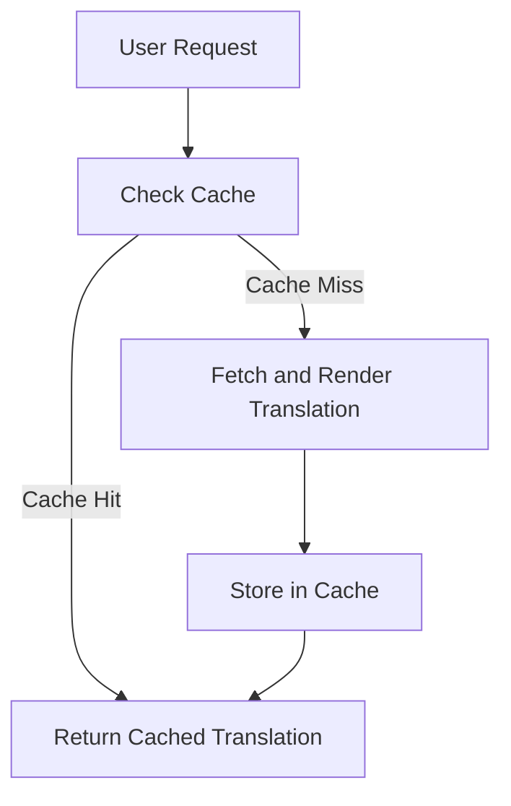

## 29.7. Best Practices for Global Applications

Creating applications that cater to a global audience involves more than just translating text. It requires a deep understanding of cultural nuances, performance optimization to handle diverse user bases, and a user experience that feels native to users from different regions. In this section, we will explore best practices for developing global applications using Elixir, focusing on cultural sensitivity, performance, and user experience.

### Cultural Sensitivity

#### Understanding Cultural Norms

When developing global applications, it's crucial to respect cultural norms and avoid content that might be considered offensive or inappropriate in different cultures. Here are some key considerations:

1. **Language and Tone**: Ensure that translations are not only accurate but also appropriate in tone. What might be considered humorous in one culture could be offensive in another.

2. **Symbols and Icons**: Be cautious with the use of symbols and icons. For instance, a thumbs-up icon is positive in many Western cultures but can be offensive in some Middle Eastern countries.

3. **Colors and Imagery**: Colors have different meanings across cultures. For example, white is associated with purity in Western cultures but can symbolize mourning in some Asian cultures.

4. **Date and Time Formats**: Use locale-specific formats for dates and times. For example, the date format in the US is MM/DD/YYYY, while in many European countries, it's DD/MM/YYYY.

5. **Cultural References**: Avoid using cultural references or idioms that may not be understood globally.

#### Implementing Cultural Sensitivity in Elixir

Elixir, with its robust ecosystem, provides tools to help implement cultural sensitivity:

- **Gettext**: Use the Gettext library for managing translations. It supports pluralization and provides a way to handle context-specific translations.

- **Locale Detection**: Implement locale detection to automatically adjust content based on the user's location or preferences.

- **Customizable Themes**: Allow users to choose themes or color schemes that align with their cultural preferences.

#### Example: Implementing Gettext in Elixir

```elixir
# In your mix.exs file, add :gettext to your list of dependencies
defp deps do
  [
    {:gettext, "~> 0.18"}
  ]
end

# Create a gettext module
defmodule MyApp.Gettext do
  use Gettext, otp_app: :my_app
end

# Use gettext in your application
defmodule MyApp.HelloController do
  use MyApp.Web, :controller
  import MyApp.Gettext

  def index(conn, _params) do
    message = gettext("Hello, world!")
    render(conn, "index.html", message: message)
  end
end
```

### Performance Optimization

#### Handling Localization Overhead

Localization can introduce overhead in terms of data processing and rendering. Here are some strategies to mitigate these issues:

1. **Caching**: Use caching to store pre-rendered translations and locale-specific content. This reduces the need to repeatedly process the same data.

2. **Efficient Data Structures**: Choose data structures that optimize access and manipulation of localized content. Elixir's immutable data structures can be leveraged for efficient handling of translations.

3. **Asynchronous Processing**: Offload heavy localization tasks to background processes using Elixir's concurrency features.

#### Example: Caching Translations

```elixir
defmodule MyApp.TranslationCache do
  use GenServer

  # Start the GenServer
  def start_link(_) do
    GenServer.start_link(__MODULE__, %{}, name: __MODULE__)
  end

  # Fetch a translation from the cache
  def get_translation(key) do
    GenServer.call(__MODULE__, {:get, key})
  end

  # Store a translation in the cache
  def put_translation(key, value) do
    GenServer.cast(__MODULE__, {:put, key, value})
  end

  # GenServer callbacks
  def init(state) do
    {:ok, state}
  end

  def handle_call({:get, key}, _from, state) do
    {:reply, Map.get(state, key), state}
  end

  def handle_cast({:put, key, value}, state) do
    {:noreply, Map.put(state, key, value)}
  end
end
```

#### Visualizing Performance Optimization


```mermaid
flowchart TD
    A[User Request] --> B[Check Cache]
    B -->|Cache Hit| C[Return Cached Translation]
    B -->|Cache Miss| D[Fetch and Render Translation]
    D --> E[Store in Cache]
    E --> C
```

*Diagram: This flowchart illustrates the process of caching translations to optimize performance. The system first checks the cache; if a translation is found, it is returned directly. Otherwise, the translation is fetched, rendered, and stored in the cache for future use.*

### User Experience

#### Seamless Language Switching

Providing users with the ability to switch languages seamlessly enhances their experience. Consider the following practices:

1. **User Preferences**: Allow users to set their preferred language and remember their choice for future visits.

2. **Intuitive Language Selector**: Design an intuitive language selector that is easily accessible, such as a dropdown menu in the navigation bar.

3. **Instant Updates**: Implement instant updates when a user switches languages, without requiring a page refresh.

#### Example: Language Switching in Phoenix

```elixir
defmodule MyAppWeb.LanguageController do
  use MyAppWeb, :controller

  def switch_language(conn, %{"locale" => locale}) do
    Gettext.put_locale(MyApp.Gettext, locale)
    conn
    |> put_session(:locale, locale)
    |> redirect(to: "/")
  end
end
```

#### Appropriate Default Settings

Setting appropriate defaults can greatly enhance the user experience:

1. **Locale Detection**: Automatically detect the user's locale based on their browser settings or IP address.

2. **Fallback Options**: Provide sensible fallback options if a specific translation is unavailable.

3. **Consistent User Interface**: Ensure that the user interface remains consistent across different locales.

#### Example: Locale Detection

```elixir
defmodule MyAppWeb.Plugs.Locale do
  import Plug.Conn

  def init(default), do: default

  def call(conn, _default) do
    locale = get_locale(conn)
    Gettext.put_locale(MyApp.Gettext, locale)
    assign(conn, :locale, locale)
  end

  defp get_locale(conn) do
    case get_session(conn, :locale) do
      nil -> get_browser_locale(conn)
      locale -> locale
    end
  end

  defp get_browser_locale(conn) do
    # Extract the Accept-Language header and determine the locale
    conn
    |> get_req_header("accept-language")
    |> List.first()
    |> parse_accept_language()
  end

  defp parse_accept_language(header) do
    # Simple parsing logic for demonstration purposes
    case header do
      "en-US" -> "en"
      "fr-FR" -> "fr"
      _ -> "en"
    end
  end
end
```

### Knowledge Check

- **Question**: Why is cultural sensitivity important in global applications?
  - **Answer**: It ensures that content is respectful and appropriate for users from different cultural backgrounds, avoiding potential offense or misunderstanding.

- **Exercise**: Implement a simple Elixir application that uses Gettext for translations. Experiment with adding translations for different languages and test the application by switching locales.

### Embrace the Journey

Remember, developing global applications is an ongoing journey. As you continue to build and refine your applications, keep cultural sensitivity, performance, and user experience at the forefront of your design process. Stay curious, embrace feedback from diverse user groups, and enjoy the process of creating applications that resonate with a global audience.

## Quiz Time!



### Why is cultural sensitivity important in global applications?

- [x] It ensures content is respectful and appropriate for diverse users.
- [ ] It helps in reducing application size.
- [ ] It speeds up the development process.
- [ ] It increases the number of features.

> **Explanation:** Cultural sensitivity ensures that content is respectful and appropriate for users from different cultural backgrounds, avoiding potential offense or misunderstanding.

### Which library is commonly used in Elixir for managing translations?

- [x] Gettext
- [ ] Ecto
- [ ] Phoenix
- [ ] Plug

> **Explanation:** Gettext is a library used in Elixir for managing translations, supporting pluralization and context-specific translations.

### What is a key consideration when choosing colors for a global application?

- [x] Colors have different meanings across cultures.
- [ ] Colors should be chosen based on the developer's preference.
- [ ] Colors should always be bright and vibrant.
- [ ] Colors should be changed frequently to keep the application fresh.

> **Explanation:** Colors have different meanings across cultures, so it's important to choose them carefully to ensure they are appropriate for all users.

### How can caching help in optimizing performance for global applications?

- [x] By storing pre-rendered translations and locale-specific content.
- [ ] By reducing the number of features in the application.
- [ ] By increasing the size of the application.
- [ ] By making the application more complex.

> **Explanation:** Caching helps in optimizing performance by storing pre-rendered translations and locale-specific content, reducing the need to repeatedly process the same data.

### What is a best practice for providing seamless language switching in applications?

- [x] Allow users to set their preferred language and remember their choice.
- [ ] Require users to restart the application to change the language.
- [ ] Only offer language options during installation.
- [ ] Change the language randomly to keep users engaged.

> **Explanation:** Allowing users to set their preferred language and remembering their choice for future visits provides a seamless language-switching experience.

### What should be considered when setting default settings for global applications?

- [x] Locale detection and sensible fallback options.
- [ ] Only the developer's language preference.
- [ ] The most popular language globally.
- [ ] Randomly selecting a language for each user.

> **Explanation:** Default settings should consider locale detection and provide sensible fallback options to enhance the user experience.

### Which of the following is a strategy to handle localization overhead?

- [x] Use caching to store pre-rendered translations.
- [ ] Increase the number of translations available.
- [ ] Use a single language for all users.
- [ ] Remove all translations to simplify the application.

> **Explanation:** Caching is a strategy to handle localization overhead by storing pre-rendered translations and reducing processing time.

### What is the purpose of using an intuitive language selector in applications?

- [x] To allow users to easily switch languages.
- [ ] To make the application look more complex.
- [ ] To reduce the number of languages available.
- [ ] To confuse users with too many options.

> **Explanation:** An intuitive language selector allows users to easily switch languages, enhancing their experience.

### What role does the Gettext library play in Elixir applications?

- [x] It manages translations and supports pluralization.
- [ ] It handles database connections.
- [ ] It manages user authentication.
- [ ] It provides real-time communication features.

> **Explanation:** Gettext manages translations in Elixir applications and supports pluralization and context-specific translations.

### True or False: Cultural references and idioms should be avoided in global applications.

- [x] True
- [ ] False

> **Explanation:** Cultural references and idioms should be avoided in global applications as they may not be understood or appreciated by users from different cultural backgrounds.




