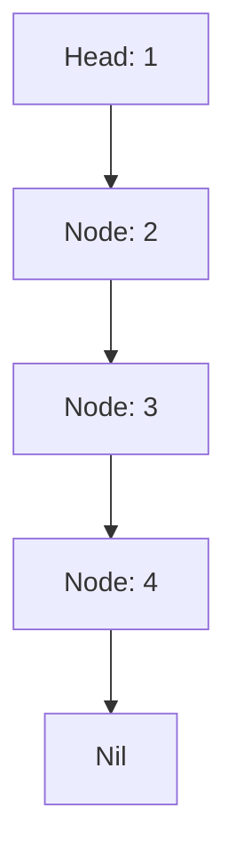
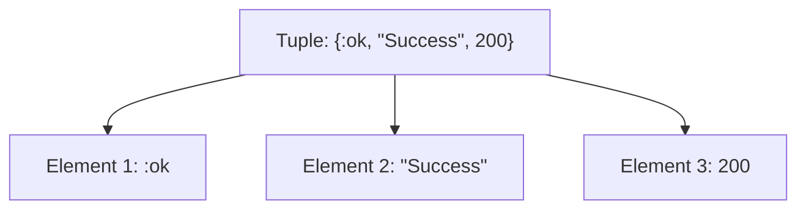
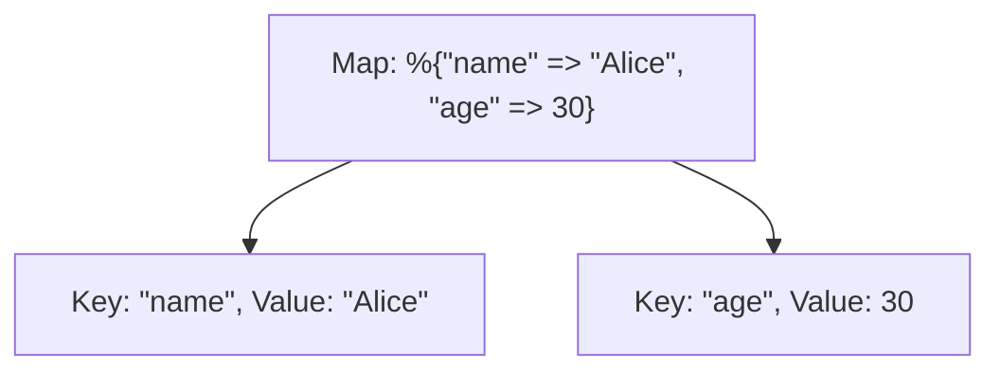

## 3.1.1. Lists, Tuples, and Maps

In Elixir, understanding the core data structures—Lists, Tuples, and Maps—is crucial for writing efficient and idiomatic code. These structures form the backbone of data manipulation in Elixir, each offering unique characteristics and operations that cater to different use cases. Let's delve into each of these data structures, explore their features, and learn how to use them effectively.

### Lists

Lists in Elixir are ordered collections of elements, which can be of any type. They are one of the most commonly used data structures due to their flexibility and ease of use.

#### Characteristics of Lists

- **Ordered**: Lists maintain the order of elements, which means the sequence in which elements are added is preserved.
- **Linked List Implementation**: Internally, lists are implemented as linked lists, making operations like head/tail decomposition efficient.
- **Dynamic Size**: Lists can grow and shrink dynamically, allowing for flexible data manipulation.

#### Common Operations on Lists

1. **Concatenation**: Combine two lists using the `++` operator.

   ```elixir
   list1 = [1, 2, 3]
   list2 = [4, 5, 6]
   combined_list = list1 ++ list2
   # combined_list is [1, 2, 3, 4, 5, 6]
   ```

2. **Head/Tail Decomposition**: Extract the first element (head) and the rest of the list (tail).

   ```elixir
   [head | tail] = [1, 2, 3, 4]
   # head is 1, tail is [2, 3, 4]
   ```

3. **Enumeration**: Iterate over elements using `Enum` module functions.

   ```elixir
   Enum.each([1, 2, 3], fn x -> IO.puts(x) end)
   ```

4. **Pattern Matching**: Use pattern matching to destructure lists.

   ```elixir
   case [1, 2, 3] do
     [1, 2, 3] -> "Matched"
     _ -> "Not matched"
   end
   ```

#### Performance Considerations

- **Access Time**: Accessing the head of a list is O(1), but accessing the tail is O(n) due to the linked list structure.
- **Modification**: Prepending elements is efficient, but appending requires traversing the entire list.

#### Try It Yourself

Experiment with list operations by modifying the following code:

```elixir
list = [10, 20, 30]
new_list = [5 | list]  # Try changing the prepended element
IO.inspect(new_list)
```

### Tuples

Tuples are fixed-size collections used to group related values. They are efficient for accessing elements by index but are immutable in size.

#### Characteristics of Tuples

- **Fixed Size**: Once created, the size of a tuple cannot be changed.
- **Efficient Index Access**: Accessing elements by index is fast.
- **Immutability**: Tuples are immutable, meaning they cannot be altered after creation.

#### Common Operations on Tuples

1. **Access by Index**: Retrieve elements using the `elem/2` function.

   ```elixir
   tuple = {:ok, "Success", 200}
   status = elem(tuple, 0)  # status is :ok
   ```

2. **Tuple Size**: Determine the number of elements using `tuple_size/1`.

   ```elixir
   size = tuple_size({:ok, "Success", 200})
   # size is 3
   ```

3. **Pattern Matching**: Use pattern matching to destructure tuples.

   ```elixir
   {:ok, message, code} = {:ok, "Success", 200}
   ```

#### Performance Considerations

- **Access Time**: Accessing elements by index is O(1).
- **Modification**: Modifying a tuple requires creating a new tuple, which can be costly for large tuples.

#### Try It Yourself

Modify the following code to experiment with tuples:

```elixir
tuple = {:error, "Failed", 404}
new_tuple = put_elem(tuple, 1, "Not Found")  # Try changing the error message
IO.inspect(new_tuple)
```

### Maps

Maps are key-value storage structures used for unordered data. They are highly versatile and support complex data manipulation.

#### Characteristics of Maps

- **Key-Value Pairs**: Maps store data as key-value pairs, allowing for efficient retrieval.
- **Dynamic Size**: Maps can grow and shrink dynamically.
- **Pattern Matching**: Maps support pattern matching, making them powerful for data extraction.

#### Common Operations on Maps

1. **Accessing Values**: Retrieve values using keys.

   ```elixir
   map = %{"name" => "Alice", "age" => 30}
   name = map["name"]  # name is "Alice"
   ```

2. **Updating Values**: Use the `Map.put/3` function to update values.

   ```elixir
   updated_map = Map.put(map, "age", 31)
   ```

3. **Pattern Matching**: Extract values using pattern matching.

   ```elixir
   %{"name" => name} = %{"name" => "Alice", "age" => 30}
   ```

4. **Enumerating**: Iterate over key-value pairs using `Enum` module functions.

   ```elixir
   Enum.each(map, fn {key, value} -> IO.puts("#{key}: #{value}") end)
   ```

#### Performance Considerations

- **Access Time**: Accessing values by key is O(1) on average.
- **Modification**: Maps are efficient for updates and deletions.

#### Try It Yourself

Experiment with map operations by modifying the following code:

```elixir
map = %{"city" => "New York", "population" => 8_000_000}
new_map = Map.put(map, "country", "USA")  # Try adding a new key-value pair
IO.inspect(new_map)
```

### Visualizing Data Structures

To better understand how these data structures work, let's visualize them using Mermaid.js diagrams.

#### List Structure



*Caption: A linked list structure showing nodes connected in sequence.*

#### Tuple Structure



*Caption: A tuple structure with fixed elements accessed by index.*

#### Map Structure



*Caption: A map structure showing key-value pairs.*

### Key Takeaways

- **Lists** are ideal for ordered collections and support efficient head/tail operations.
- **Tuples** are best for fixed-size collections with fast index access.
- **Maps** provide flexible key-value storage with efficient access and updates.

### Further Reading

For more information on Elixir's data structures, consider exploring the following resources:

- [Elixir's Official Documentation](https://elixir-lang.org/docs.html)
- [Elixir School: Data Structures](https://elixirschool.com/en/lessons/basics/collections/)

### Knowledge Check

- How do lists differ from tuples in terms of mutability and size?
- What are the performance implications of using maps for large datasets?
- How can pattern matching be used effectively with maps?

### Embrace the Journey

Remember, mastering these data structures is just the beginning. As you progress, you'll unlock the full potential of Elixir's functional programming paradigm. Keep experimenting, stay curious, and enjoy the journey!

## Quiz: Lists, Tuples, and Maps



### What is the primary characteristic of lists in Elixir?

- [x] Ordered collections of elements
- [ ] Fixed-size collections
- [ ] Key-value storage
- [ ] Immutable collections

> **Explanation:** Lists in Elixir are ordered collections of elements, maintaining the sequence in which elements are added.

### How are tuples different from lists in Elixir?

- [x] Tuples are fixed-size collections
- [ ] Tuples are ordered collections
- [ ] Tuples allow dynamic size changes
- [ ] Tuples are key-value pairs

> **Explanation:** Tuples are fixed-size collections, unlike lists which can grow and shrink dynamically.

### What operation is efficient in lists due to their linked list implementation?

- [x] Head/tail decomposition
- [ ] Index access
- [ ] Key-value retrieval
- [ ] Size modification

> **Explanation:** Lists are implemented as linked lists, making head/tail decomposition efficient.

### Which function is used to access elements in a tuple by index?

- [x] `elem/2`
- [ ] `Map.get/2`
- [ ] `Enum.at/2`
- [ ] `List.first/1`

> **Explanation:** The `elem/2` function is used to access elements in a tuple by index.

### What is a key feature of maps in Elixir?

- [x] Key-value storage
- [ ] Ordered elements
- [ ] Fixed size
- [ ] Linked list implementation

> **Explanation:** Maps store data as key-value pairs, allowing for efficient retrieval and updates.

### How can you update a value in a map?

- [x] Using `Map.put/3`
- [ ] Using `List.update_at/3`
- [ ] Using `Tuple.replace_at/3`
- [ ] Using `Enum.map/2`

> **Explanation:** The `Map.put/3` function is used to update values in a map.

### What is the average time complexity for accessing a value by key in a map?

- [x] O(1)
- [ ] O(n)
- [ ] O(log n)
- [ ] O(n^2)

> **Explanation:** Accessing values by key in a map is O(1) on average.

### Which data structure is best for grouping related values with fast index access?

- [x] Tuples
- [ ] Lists
- [ ] Maps
- [ ] Sets

> **Explanation:** Tuples are best for grouping related values with fast index access.

### What is the result of concatenating two lists `[1, 2] ++ [3, 4]`?

- [x] `[1, 2, 3, 4]`
- [ ] `[3, 4, 1, 2]`
- [ ] `[1, 2]`
- [ ] `[3, 4]`

> **Explanation:** Concatenating two lists `[1, 2] ++ [3, 4]` results in `[1, 2, 3, 4]`.

### True or False: Maps in Elixir maintain the order of elements.

- [ ] True
- [x] False

> **Explanation:** Maps do not maintain the order of elements; they are unordered key-value storage structures.


