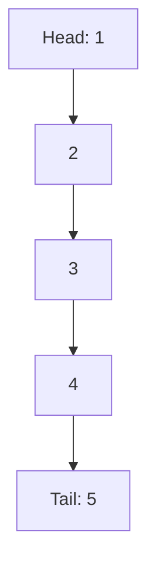
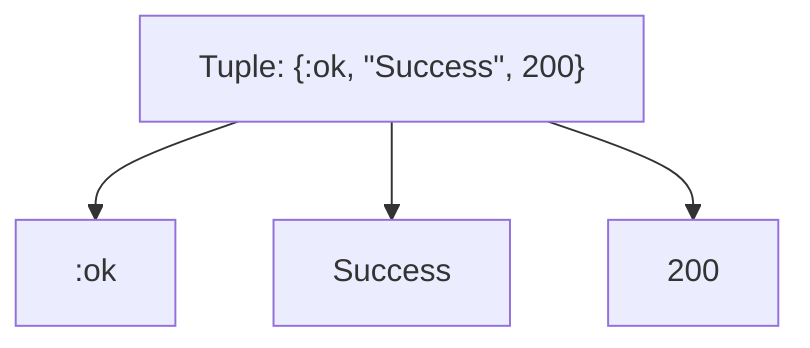
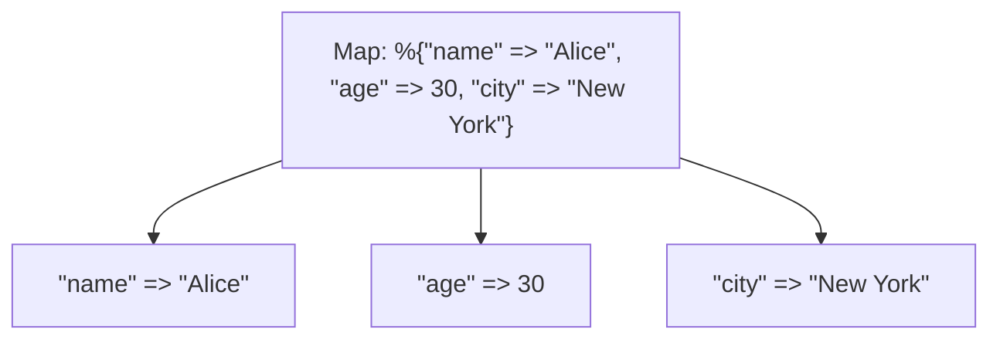

## 3.1.1. Lists, Tuples, and Maps

In Elixir, understanding the fundamental data structures such as Lists, Tuples, and Maps is crucial for building efficient and scalable applications. These data structures are not only the building blocks of data manipulation in Elixir but also embody the principles of functional programming. Let's delve into each of these data structures, explore their characteristics, and learn how to effectively utilize them in your Elixir applications.

### Lists

**Lists** in Elixir are ordered collections of elements. They are one of the most commonly used data structures due to their flexibility and ease of manipulation. Lists are implemented as linked lists, making them efficient for operations such as head/tail decomposition.

#### Characteristics of Lists

- **Ordered**: Elements are stored in a specific sequence.
- **Dynamic Size**: Lists can grow or shrink as needed.
- **Linked Structure**: Each element points to the next, allowing for efficient traversal.

#### Common Operations on Lists

1. **Concatenation**: Joining two lists together.
2. **Head/Tail Decomposition**: Extracting the first element (head) and the rest of the list (tail).
3. **Enumeration**: Iterating over each element in the list.

#### Code Example: Basic List Operations

```elixir
# Define a list
list = [1, 2, 3, 4, 5]

# Concatenate two lists
concatenated_list = list ++ [6, 7, 8]
IO.inspect(concatenated_list) # Output: [1, 2, 3, 4, 5, 6, 7, 8]

# Head and Tail decomposition
[head | tail] = list
IO.inspect(head) # Output: 1
IO.inspect(tail) # Output: [2, 3, 4, 5]

# Enumerate through the list
Enum.each(list, fn x -> IO.puts(x) end)
```

#### Try It Yourself

Experiment with the list operations by modifying the code above. Try creating a list of strings or tuples and perform similar operations.

### Tuples

**Tuples** are fixed-size collections used for grouping related values. They are stored contiguously in memory, allowing for efficient access by index. However, tuples are immutable in size, meaning once created, their size cannot be changed.

#### Characteristics of Tuples

- **Fixed Size**: The number of elements is determined at creation.
- **Efficient Index Access**: Elements can be accessed quickly by their index.
- **Immutable**: The size and contents cannot be altered after creation.

#### Common Uses of Tuples

1. **Grouping Related Data**: Often used to return multiple values from a function.
2. **Pattern Matching**: Useful in function clauses and case statements.

#### Code Example: Using Tuples

```elixir
# Define a tuple
tuple = {:ok, "Success", 200}

# Access elements by index
status = elem(tuple, 0)
message = elem(tuple, 1)
code = elem(tuple, 2)

IO.inspect(status) # Output: :ok
IO.inspect(message) # Output: "Success"
IO.inspect(code) # Output: 200

# Pattern matching with tuples
case tuple do
  {:ok, msg, _} -> IO.puts("Operation successful: #{msg}")
  {:error, reason} -> IO.puts("Operation failed: #{reason}")
end
```

#### Try It Yourself

Modify the tuple example to include different types of data, such as a list or another tuple, and practice accessing and pattern matching.

### Maps

**Maps** are key-value storage structures used for unordered data. They provide a flexible way to associate keys with values and are often used when the data needs to be accessed by specific keys rather than by position.

#### Characteristics of Maps

- **Key-Value Pairs**: Each element is a pair consisting of a key and a value.
- **Unordered**: The order of elements is not guaranteed.
- **Flexible Keys**: Keys can be of any data type.

#### Common Operations on Maps

1. **Accessing Values**: Retrieve values using keys.
2. **Updating Values**: Change values associated with keys.
3. **Pattern Matching**: Match specific keys and values in function clauses.

#### Code Example: Working with Maps

```elixir
# Define a map
map = %{"name" => "Alice", "age" => 30, "city" => "New York"}

# Access a value by key
name = map["name"]
IO.inspect(name) # Output: "Alice"

# Update a value
updated_map = Map.put(map, "age", 31)
IO.inspect(updated_map) # Output: %{"name" => "Alice", "age" => 31, "city" => "New York"}

# Pattern matching with maps
%{"name" => name, "age" => age} = map
IO.puts("Name: #{name}, Age: #{age}")
```

#### Try It Yourself

Create a map with different data types as keys and values. Practice updating and accessing values using both dot notation and the `Map` module functions.

### Visualizing Lists, Tuples, and Maps

To better understand the structure and relationships of these data types, let's visualize them using Mermaid.js diagrams.

#### List Structure


```mermaid
graph TD;
    A[Head: 1] --> B[2]
    B --> C[3]
    C --> D[4]
    D --> E[Tail: 5]
```

*Diagram: A linked list structure showing the head and tail decomposition.*

#### Tuple Structure


```mermaid
graph TD;
    A["Tuple: {:ok, #34;Success#34;, 200}"]
    A --> B[:ok]
    A --> C["Success"]
    A --> D[200]
```

*Diagram: A tuple structure showing fixed-size and indexed access.*

#### Map Structure


```mermaid
graph TD;
    A["Map: %{#34;name#34; => #34;Alice#34;, #34;age#34; => 30, #34;city#34; => #34;New York#34;}"]
    A --> B[#34;name#34; => #34;Alice#34;]
    A --> C[#34;age#34; => 30]
    A --> D[#34;city#34; => #34;New York#34;]
```

*Diagram: A map structure showing key-value pairs.*

### Best Practices and Considerations

- **Choose the Right Data Structure**: Use lists for ordered collections, tuples for fixed-size grouping, and maps for key-value storage.
- **Leverage Pattern Matching**: Utilize pattern matching to simplify code and improve readability.
- **Optimize for Performance**: Consider the performance implications of each data structure, particularly with large datasets.
- **Immutable Data**: Embrace immutability for safer concurrent operations and predictable behavior.

### Knowledge Check

1. **What is the primary advantage of using lists in Elixir?**
   - [ ] They are faster than tuples.
   - [x] They allow dynamic resizing and easy traversal.
   - [ ] They are always sorted.

2. **How do you access the second element of a tuple?**
   - [ ] Using the `List` module.
   - [x] Using the `elem/2` function.
   - [ ] By pattern matching only.

3. **What is a key characteristic of maps?**
   - [ ] They are ordered collections.
   - [x] They store data as key-value pairs.
   - [ ] They are immutable in size.

4. **Which operation is not typically performed on lists?**
   - [ ] Concatenation
   - [ ] Head/tail decomposition
   - [x] Index-based access

5. **What is a common use case for tuples?**
   - [ ] Storing large datasets
   - [x] Grouping related values
   - [ ] Implementing queues

### Summary

In this section, we've explored the essential data structures in Elixir: Lists, Tuples, and Maps. Each serves a unique purpose and offers specific advantages, making them invaluable tools in your functional programming toolkit. By understanding their characteristics and operations, you can choose the right data structure for your application's needs and leverage Elixir's powerful pattern matching capabilities to write clean and efficient code.

Remember, mastering these data structures is just the beginning. As you continue your journey with Elixir, you'll discover even more ways to harness their power in building robust and scalable applications.

## Quiz Time!



### What is a key characteristic of lists in Elixir?

- [x] They are ordered collections.
- [ ] They are unordered collections.
- [ ] They are immutable in size.
- [ ] They have constant-time access.

> **Explanation:** Lists in Elixir are ordered collections, allowing for dynamic resizing and traversal.

### How do you access an element in a tuple by index?

- [ ] Using the `List` module.
- [x] Using the `elem/2` function.
- [ ] Using the `Map` module.
- [ ] Using pattern matching only.

> **Explanation:** The `elem/2` function is used to access elements in a tuple by index.

### What is a common use case for maps in Elixir?

- [ ] Storing ordered collections.
- [x] Storing key-value pairs.
- [ ] Implementing stacks.
- [ ] Grouping fixed-size values.

> **Explanation:** Maps are used for storing key-value pairs, providing flexible access to data by keys.

### Which operation is not typically performed on tuples?

- [ ] Index-based access
- [ ] Pattern matching
- [ ] Grouping related data
- [x] Dynamic resizing

> **Explanation:** Tuples are immutable in size, so dynamic resizing is not possible.

### What is the primary advantage of using lists?

- [ ] They are always sorted.
- [x] They allow dynamic resizing and easy traversal.
- [ ] They provide constant-time access.
- [ ] They are faster than maps.

> **Explanation:** Lists allow dynamic resizing and easy traversal, making them flexible for various operations.

### Which data structure is best for grouping related values with a fixed size?

- [ ] List
- [x] Tuple
- [ ] Map
- [ ] Set

> **Explanation:** Tuples are best for grouping related values with a fixed size due to their efficient access by index.

### What is the primary disadvantage of using lists for large datasets?

- [ ] They are unordered.
- [ ] They are immutable.
- [x] They have linear-time access.
- [ ] They cannot be concatenated.

> **Explanation:** Lists have linear-time access, which can be inefficient for large datasets.

### How can you update a value in a map?

- [ ] By using the `List` module.
- [x] By using the `Map.put/3` function.
- [ ] By using the `Tuple` module.
- [ ] By using pattern matching only.

> **Explanation:** The `Map.put/3` function is used to update values in a map.

### What is the output of the following Elixir code: `[head | tail] = [1, 2, 3, 4]`?

- [x] `head` is 1, `tail` is [2, 3, 4]
- [ ] `head` is [1], `tail` is [2, 3, 4]
- [ ] `head` is 1, `tail` is [1, 2, 3, 4]
- [ ] `head` is [1, 2], `tail` is [3, 4]

> **Explanation:** The head of the list is 1, and the tail is the rest of the list, [2, 3, 4].

### True or False: Maps in Elixir guarantee the order of key-value pairs.

- [ ] True
- [x] False

> **Explanation:** Maps in Elixir do not guarantee the order of key-value pairs, as they are unordered collections.



Remember, this is just the beginning. As you progress, you'll build more complex and interactive applications. Keep experimenting, stay curious, and enjoy the journey!
