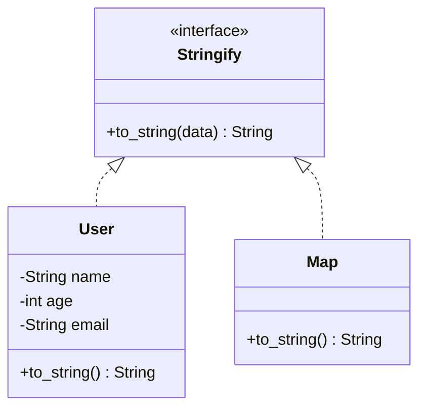

## 3.1.2. Structs and Protocols

In the world of Elixir, understanding the concepts of Structs and Protocols is crucial for building robust and scalable applications. These features allow developers to define custom data types and achieve polymorphism, which are essential for maintaining clean and efficient codebases. Let's dive deep into these concepts and explore how they can be leveraged in your Elixir projects.

### Structs in Elixir

Structs in Elixir are custom data types built on top of maps. They provide a way to define a set of keys with default values, ensuring data integrity and consistency across your application.

#### Defining Structs

To define a struct, you use the `defstruct` keyword within a module. Here's a simple example:

```elixir
defmodule User do
  defstruct name: "Anonymous", age: 0, email: nil
end
```

In this example, we define a `User` struct with three fields: `name`, `age`, and `email`. Each field has a default value, which is used if no value is provided when creating an instance of the struct.

#### Creating and Using Structs

Creating an instance of a struct is straightforward:

```elixir
# Creating a User struct with default values
user1 = %User{}

# Creating a User struct with custom values
user2 = %User{name: "Alice", age: 30, email: "alice@example.com"}
```

Structs are immutable, meaning that once a struct is created, its fields cannot be changed. However, you can create a new struct with updated values using the `|` operator:

```elixir
# Updating the age of user2
user3 = %User{user2 | age: 31}
```

#### Enforcing Data Integrity

One of the key benefits of using structs is data integrity. Unlike maps, structs enforce the presence of predefined keys, preventing accidental typos or missing fields:

```elixir
# This will raise a KeyError because :username is not a defined key
user4 = %User{username: "Bob"}
```

#### Structs vs. Maps

While structs are built on top of maps, they offer additional benefits such as enforced keys and default values. However, it's important to note that structs do not support dynamic keys, which can be a limitation in certain scenarios.

### Protocols in Elixir

Protocols in Elixir provide a mechanism for achieving polymorphism, allowing you to define a common interface for different data types. This is particularly useful when you want to implement the same functionality across various types without relying on inheritance.

#### Defining Protocols

A protocol is defined using the `defprotocol` keyword. Here's an example of a simple protocol for converting data to a string:

```elixir
defprotocol Stringify do
  @doc "Converts a data structure to a string"
  def to_string(data)
end
```

#### Implementing Protocols

Once a protocol is defined, you can implement it for different data types using the `defimpl` keyword:

```elixir
defimpl Stringify, for: User do
  def to_string(user) do
    "User: #{user.name}, Age: #{user.age}, Email: #{user.email}"
  end
end

defimpl Stringify, for: Map do
  def to_string(map) do
    Enum.map(map, fn {key, value} -> "#{key}: #{value}" end)
    |> Enum.join(", ")
  end
end
```

In this example, we implement the `Stringify` protocol for both the `User` struct and the `Map` data type. This allows us to call `Stringify.to_string/1` on any `User` or `Map` instance:

```elixir
IO.puts Stringify.to_string(user2) # Output: User: Alice, Age: 30, Email: alice@example.com
IO.puts Stringify.to_string(%{foo: "bar", baz: "qux"}) # Output: foo: bar, baz: qux
```

#### Protocols and Polymorphism

Protocols are a powerful tool for achieving polymorphism in Elixir. They allow you to define a common interface for different data types, enabling you to write flexible and reusable code.

### Visualizing Structs and Protocols

To better understand the relationship between structs and protocols, let's visualize how they interact using a class diagram:



In this diagram, the `Stringify` protocol acts as an interface, with `User` and `Map` implementing the `to_string` method. This illustrates how protocols enable polymorphism by allowing different data types to share a common interface.

### Best Practices for Using Structs and Protocols

- **Use Structs for Data Integrity**: Leverage structs to enforce data integrity and consistency across your application. Define default values and ensure that all required fields are present.
- **Implement Protocols for Polymorphism**: Use protocols to define common interfaces for different data types. This allows you to write flexible and reusable code without relying on inheritance.
- **Avoid Overusing Protocols**: While protocols are powerful, they should be used judiciously. Overusing protocols can lead to complex and hard-to-maintain codebases.
- **Document Protocol Implementations**: Clearly document each protocol implementation to ensure that other developers understand the intended behavior for each data type.

### Try It Yourself

To solidify your understanding of structs and protocols, try modifying the code examples provided. Here are a few suggestions:

- **Add a New Field to the User Struct**: Add a new field to the `User` struct, such as `:role`, and update the `Stringify` implementation to include this field in the output.
- **Implement the Stringify Protocol for a New Data Type**: Choose a new data type, such as a list or tuple, and implement the `Stringify` protocol for it.
- **Create a New Protocol**: Define a new protocol for a different functionality, such as converting data to JSON, and implement it for the `User` struct and another data type.

### Further Reading

For more information on structs and protocols in Elixir, check out the following resources:

- [Elixir's Official Documentation on Structs](https://hexdocs.pm/elixir/Kernel.html#defstruct/1)
- [Elixir's Official Documentation on Protocols](https://hexdocs.pm/elixir/Protocol.html)
- [Learn You Some Erlang for Great Good!](http://learnyousomeerlang.com) - A comprehensive guide to Erlang, which shares many concepts with Elixir.

### Knowledge Check

Before moving on, take a moment to reflect on what you've learned. Consider the following questions:

- How do structs enforce data integrity in Elixir?
- What are the benefits of using protocols for polymorphism?
- How can you implement a protocol for a custom data type?

### Summary

In this section, we've explored the powerful features of structs and protocols in Elixir. Structs provide a way to define custom data types with enforced keys and default values, ensuring data integrity across your application. Protocols, on the other hand, enable polymorphism by defining common interfaces for different data types. By leveraging these features, you can build robust and scalable applications in Elixir.

Remember, this is just the beginning. As you continue your journey with Elixir, you'll discover even more ways to harness the power of functional programming. Keep experimenting, stay curious, and enjoy the journey!

## Quiz: Structs and Protocols



### What is a struct in Elixir?

- [x] A custom data type built on top of maps with predefined keys.
- [ ] A dynamic data type that allows any key-value pairs.
- [ ] A type of list with enforced keys.
- [ ] A protocol implementation.

> **Explanation:** Structs are custom data types in Elixir that are built on top of maps with predefined keys, ensuring data integrity.

### How do you define a struct in Elixir?

- [x] Using the `defstruct` keyword within a module.
- [ ] Using the `defmodule` keyword.
- [ ] Using the `defprotocol` keyword.
- [ ] Using the `defimpl` keyword.

> **Explanation:** Structs are defined using the `defstruct` keyword within a module.

### What is the purpose of protocols in Elixir?

- [x] To achieve polymorphism by defining common interfaces for different data types.
- [ ] To enforce data integrity.
- [ ] To create dynamic key-value pairs.
- [ ] To define default values for structs.

> **Explanation:** Protocols in Elixir are used to achieve polymorphism by defining common interfaces for different data types.

### How do you implement a protocol for a data type?

- [x] Using the `defimpl` keyword.
- [ ] Using the `defstruct` keyword.
- [ ] Using the `defmodule` keyword.
- [ ] Using the `defprotocol` keyword.

> **Explanation:** Protocols are implemented for data types using the `defimpl` keyword.

### What happens if you try to create a struct with an undefined key?

- [x] A `KeyError` is raised.
- [ ] The struct is created with a nil value for the undefined key.
- [ ] The struct is created with a default value for the undefined key.
- [ ] The struct is created without the undefined key.

> **Explanation:** Attempting to create a struct with an undefined key raises a `KeyError`.

### Can structs have dynamic keys?

- [ ] Yes, structs can have dynamic keys.
- [x] No, structs cannot have dynamic keys.
- [ ] Yes, but only if defined with `defstruct`.
- [ ] No, structs must have all keys defined at runtime.

> **Explanation:** Structs cannot have dynamic keys; all keys must be predefined.

### What is the benefit of using structs over maps?

- [x] Enforced keys and default values.
- [ ] Dynamic key-value pairs.
- [ ] Faster access times.
- [ ] Automatic protocol implementation.

> **Explanation:** Structs offer enforced keys and default values, providing data integrity over maps.

### How do you update a field in a struct?

- [x] Using the `|` operator to create a new struct with updated values.
- [ ] Directly modifying the field.
- [ ] Using the `update` function.
- [ ] Using the `set` function.

> **Explanation:** Structs are immutable, so you use the `|` operator to create a new struct with updated values.

### What keyword is used to define a protocol in Elixir?

- [x] `defprotocol`
- [ ] `defstruct`
- [ ] `defimpl`
- [ ] `defmodule`

> **Explanation:** Protocols are defined using the `defprotocol` keyword.

### True or False: Protocols in Elixir allow for inheritance.

- [ ] True
- [x] False

> **Explanation:** Protocols in Elixir do not allow for inheritance; they provide polymorphism through common interfaces.




