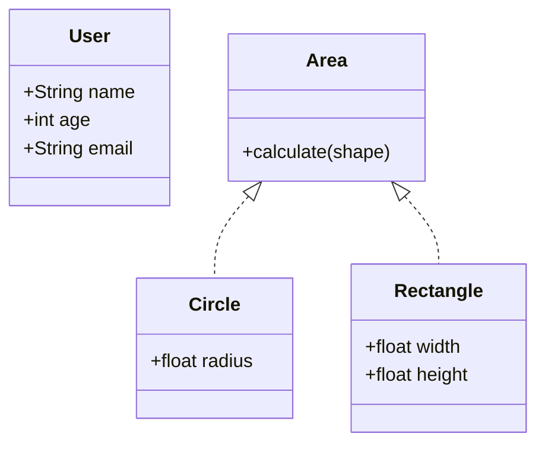

## 3.1.2. Structs and Protocols

In the world of Elixir, understanding and effectively utilizing structs and protocols is crucial for any expert software engineer or architect. These tools are essential in achieving data integrity and polymorphism, which are foundational for building scalable and maintainable applications. In this section, we will explore the intricacies of structs and protocols, providing you with the knowledge to harness their full potential.

### Structs in Elixir

Structs are a cornerstone of data management in Elixir. They are essentially extensions of maps but with a fixed set of keys and optional default values. This design enforces data integrity by ensuring that only predefined keys are present, reducing the risk of runtime errors.

#### Defining and Using Structs

To define a struct, we use the `defstruct` keyword within a module. This allows us to create a custom data type with specific fields. Let's look at an example:

```elixir
defmodule User do
  defstruct name: "Anonymous", age: 0, email: nil
end

# Creating a new User struct
user = %User{name: "Alice", age: 30}
IO.inspect(user)
```

**Explanation:** In the example above, we define a `User` struct with fields `name`, `age`, and `email`. Default values are provided for `name` and `age`, while `email` is set to `nil`.

#### Enforcing Data Integrity

Structs help enforce data integrity by preventing the addition of arbitrary keys. Attempting to add a key not defined in the struct will result in a compilation error:

```elixir
# This will raise an error
user = %User{name: "Bob", age: 25, username: "bob25"}
```

**Key Takeaway:** Structs ensure that only the specified fields are used, providing a layer of safety and predictability.

#### Pattern Matching with Structs

Elixir's powerful pattern matching capabilities extend to structs, allowing for concise and expressive code:

```elixir
def greet_user(%User{name: name}) do
  "Hello, #{name}!"
end

IO.puts(greet_user(user))
```

**Explanation:** Here, we match the `User` struct to extract the `name` field directly within the function signature, making the code more readable and efficient.

### Protocols in Elixir

Protocols are Elixir's answer to polymorphism, enabling different data types to respond to a common set of functions. They allow us to define a shared interface that can be implemented by various types, promoting code reuse and flexibility.

#### Defining a Protocol

To define a protocol, we use the `defprotocol` keyword. This creates a contract that different data types can implement:

```elixir
defprotocol Stringify do
  @doc "Converts data to a string representation"
  def to_string(data)
end
```

**Explanation:** The `Stringify` protocol defines a single function, `to_string/1`, which must be implemented by any data type that adheres to this protocol.

#### Implementing a Protocol

Once a protocol is defined, we can implement it for different data types using `defimpl`:

```elixir
defimpl Stringify, for: User do
  def to_string(%User{name: name, age: age}) do
    "#{name}, aged #{age}"
  end
end

IO.puts(Stringify.to_string(user))
```

**Explanation:** We implement the `Stringify` protocol for the `User` struct, providing a custom string representation. This allows us to call `Stringify.to_string/1` on a `User` struct, demonstrating polymorphism.

#### Protocols and Built-in Types

Protocols in Elixir can also be implemented for built-in types, such as lists or tuples, enhancing their functionality:

```elixir
defimpl Stringify, for: List do
  def to_string(list) do
    Enum.join(list, ", ")
  end
end

IO.puts(Stringify.to_string(["apple", "banana", "cherry"]))
```

**Explanation:** By implementing the `Stringify` protocol for lists, we can convert a list of strings into a comma-separated string.

### Combining Structs and Protocols

Structs and protocols often work hand-in-hand to create robust and flexible systems. Structs provide a way to define and enforce data structures, while protocols offer a mechanism for polymorphic behavior.

#### Example: A Simple Shape System

Let's combine structs and protocols to create a simple system for handling different shapes:

```elixir
defmodule Circle do
  defstruct radius: 0
end

defmodule Rectangle do
  defstruct width: 0, height: 0
end

defprotocol Area do
  @doc "Calculates the area of a shape"
  def calculate(shape)
end

defimpl Area, for: Circle do
  def calculate(%Circle{radius: r}) do
    :math.pi() * r * r
  end
end

defimpl Area, for: Rectangle do
  def calculate(%Rectangle{width: w, height: h}) do
    w * h
  end
end

circle = %Circle{radius: 5}
rectangle = %Rectangle{width: 4, height: 6}

IO.puts("Circle area: #{Area.calculate(circle)}")
IO.puts("Rectangle area: #{Area.calculate(rectangle)}")
```

**Explanation:** In this example, we define two structs, `Circle` and `Rectangle`, and a protocol `Area` with a function `calculate/1`. We implement the protocol for both structs, providing specific logic to calculate the area. This demonstrates how structs and protocols can be used together to achieve polymorphic behavior.

### Visualizing Structs and Protocols

To better understand the relationship between structs and protocols, let's visualize the process using a class diagram:


```mermaid
classDiagram
    class User {
      +String name
      +int age
      +String email
    }
    class Circle {
      +float radius
    }
    class Rectangle {
      +float width
      +float height
    }
    class Area {
      +calculate(shape)
    }
    Area <|.. Circle
    Area <|.. Rectangle
```

**Diagram Description:** This diagram illustrates how the `Area` protocol is implemented by both the `Circle` and `Rectangle` structs, showcasing the polymorphic relationship.

### Best Practices for Using Structs and Protocols

- **Use Structs for Data Integrity:** Always use structs when you need to enforce a specific structure and ensure data integrity.
- **Leverage Protocols for Polymorphism:** Utilize protocols to define common interfaces for different data types, promoting code reuse and flexibility.
- **Avoid Overusing Protocols:** While protocols are powerful, overusing them can lead to complex and hard-to-maintain code. Use them judiciously.
- **Document Protocol Implementations:** Clearly document each protocol implementation to ensure clarity and maintainability.

### Try It Yourself

To solidify your understanding, try modifying the code examples. For instance, add a new shape, such as a `Triangle`, and implement the `Area` protocol for it. Experiment with different default values in structs and see how they affect your code.

### References and Further Reading

- [Elixir Structs](https://hexdocs.pm/elixir/Kernel.html#defstruct/1)
- [Elixir Protocols](https://hexdocs.pm/elixir/Protocol.html)
- [Elixir's Pattern Matching](https://elixir-lang.org/getting-started/pattern-matching.html)

### Knowledge Check

- What are the benefits of using structs over maps?
- How do protocols facilitate polymorphism in Elixir?
- Can you implement a protocol for a built-in type? Provide an example.

### Summary

In this section, we've explored the power of structs and protocols in Elixir. Structs provide a way to define and enforce data structures, while protocols enable polymorphic behavior across different data types. By mastering these tools, you can build more robust and flexible applications.

## Quiz Time!



### What is a primary benefit of using structs over maps in Elixir?

- [x] Enforcing a fixed set of keys
- [ ] Allowing dynamic key-value pairs
- [ ] Providing built-in functions for data manipulation
- [ ] Enabling pattern matching

> **Explanation:** Structs enforce a fixed set of keys, ensuring data integrity and reducing runtime errors.

### How do protocols in Elixir achieve polymorphism?

- [x] By defining a common interface for different data types
- [ ] By allowing dynamic dispatch of functions
- [ ] By using inheritance
- [ ] By providing default implementations

> **Explanation:** Protocols define a common interface that various data types can implement, enabling polymorphic behavior.

### Which keyword is used to define a struct in Elixir?

- [x] defstruct
- [ ] defmodule
- [ ] defprotocol
- [ ] defimpl

> **Explanation:** The `defstruct` keyword is used to define a struct within a module.

### What happens if you try to add a non-existent key to a struct?

- [x] Compilation error
- [ ] Runtime error
- [ ] The key is added dynamically
- [ ] A warning is issued

> **Explanation:** Attempting to add a non-existent key to a struct results in a compilation error.

### Can protocols be implemented for built-in types in Elixir?

- [x] Yes
- [ ] No

> **Explanation:** Protocols can be implemented for built-in types, enhancing their functionality.

### What is the purpose of the `defimpl` keyword in Elixir?

- [x] To implement a protocol for a specific data type
- [ ] To define a new protocol
- [ ] To create a new module
- [ ] To declare a struct

> **Explanation:** The `defimpl` keyword is used to implement a protocol for a specific data type.

### Which of the following is true about structs in Elixir?

- [x] They are built on top of maps
- [ ] They allow any key-value pairs
- [ ] They cannot have default values
- [ ] They are immutable

> **Explanation:** Structs are built on top of maps and can have default values, but they enforce a fixed set of keys.

### What is a common use case for protocols in Elixir?

- [x] Defining a shared interface for different data types
- [ ] Creating complex data structures
- [ ] Managing application state
- [ ] Handling errors

> **Explanation:** Protocols are commonly used to define a shared interface for different data types, enabling polymorphism.

### How can you modify a struct in Elixir?

- [x] Using the update syntax `%Struct{struct | key: value}`
- [ ] Directly assigning a new value to a key
- [ ] Using the `put` function
- [ ] Using the `replace` function

> **Explanation:** The update syntax `%Struct{struct | key: value}` is used to modify a struct in Elixir.

### Structs in Elixir are immutable. True or False?

- [x] True
- [ ] False

> **Explanation:** Like all data structures in Elixir, structs are immutable, meaning they cannot be changed once created.



Remember, mastering structs and protocols is just the beginning. As you continue your journey with Elixir, these tools will become invaluable in building complex and efficient applications. Keep experimenting, stay curious, and enjoy the journey!
