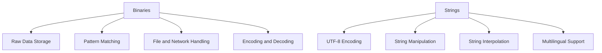

## 3.1.3. Binaries and Strings

In Elixir, understanding the distinction and usage of binaries and strings is crucial for efficient data handling, especially when dealing with raw data, file operations, and network communications. This section delves into the nuances of binaries and strings, providing expert insights and practical examples to enhance your Elixir programming skills.

### Binaries in Elixir

#### Understanding Binaries

Binaries in Elixir are sequences of bytes used to store raw binary data. They are essential for handling files, network packets, and various encoding tasks. Binaries are defined using the `<<>>` syntax and can store any byte value.

```elixir
# Define a binary
binary_data = <<1, 2, 3, 4, 5>>
IO.inspect(binary_data) # Output: <<1, 2, 3, 4, 5>>
```

#### Storing Raw Binary Data

Binaries are efficient for storing raw data due to their compact representation. They are particularly useful when dealing with large datasets or when performance is a concern.

```elixir
# Example of binary data representing an image
image_data = <<255, 216, 255, 224, 0, 16, 74, 70, 73, 70, 0, 1>>
IO.inspect(image_data)
```

#### Binary Pattern Matching

Elixir's pattern matching capabilities extend to binaries, allowing you to extract specific parts of binary data efficiently.

```elixir
# Extracting parts of a binary
<<header::binary-size(4), rest::binary>> = <<1, 2, 3, 4, 5, 6, 7, 8>>
IO.inspect(header) # Output: <<1, 2, 3, 4>>
IO.inspect(rest)   # Output: <<5, 6, 7, 8>>
```

#### Handling Files and Network Packets

Binaries are ideal for reading and writing files or handling network packets, where data is often in a binary format.

```elixir
# Reading a file as binary
{:ok, binary_content} = File.read("example.bin")
IO.inspect(binary_content)

# Writing binary data to a file
:ok = File.write("output.bin", binary_content)
```

#### Encoding and Decoding

Binaries are often used for encoding and decoding data, such as converting between different formats or compressing data.

```elixir
# Encoding a string to binary
string = "Hello, Elixir!"
binary = :erlang.term_to_binary(string)
IO.inspect(binary)

# Decoding binary back to string
decoded_string = :erlang.binary_to_term(binary)
IO.inspect(decoded_string) # Output: "Hello, Elixir!"
```

### Strings in Elixir

#### UTF-8 Encoded Binaries

In Elixir, strings are UTF-8 encoded binaries, making them efficient for handling textual data. This encoding ensures that strings can represent a wide range of characters from different languages.

```elixir
# Define a string
greeting = "Hello, 世界!"
IO.inspect(greeting) # Output: "Hello, 世界!"
```

#### String Manipulation Functions

Elixir provides a rich set of functions for string manipulation, allowing you to perform operations such as concatenation, slicing, and transformation.

```elixir
# Concatenating strings
hello = "Hello"
world = "World"
greeting = hello <> ", " <> world <> "!"
IO.inspect(greeting) # Output: "Hello, World!"

# Slicing strings
substring = String.slice(greeting, 0, 5)
IO.inspect(substring) # Output: "Hello"
```

#### String Interpolation

String interpolation in Elixir allows you to embed expressions within strings, making it easy to construct dynamic text.

```elixir
# String interpolation
name = "Elixir"
message = "Welcome to #{name} programming!"
IO.inspect(message) # Output: "Welcome to Elixir programming!"
```

#### Working with Multilingual Text

Elixir's support for UTF-8 encoding makes it well-suited for working with multilingual text, ensuring that characters from various languages are handled correctly.

```elixir
# Multilingual string
multilingual_text = "Bonjour, こんにちは, مرحبا"
IO.inspect(multilingual_text)
```

### Visualizing Binaries and Strings

To better understand how binaries and strings are structured and manipulated in Elixir, let's visualize their composition and operations.



*Diagram: Overview of Binaries and Strings in Elixir*

### Key Differences Between Binaries and Strings

- **Purpose**: Binaries are used for raw data storage, while strings are specifically for textual data.
- **Encoding**: Strings are UTF-8 encoded binaries, ensuring proper character representation.
- **Operations**: Binaries support pattern matching and raw data manipulation, whereas strings offer rich text manipulation functions.

### Best Practices for Using Binaries and Strings

- **Choose the Right Type**: Use binaries for raw data and strings for text to ensure optimal performance and clarity.
- **Leverage Pattern Matching**: Utilize pattern matching for efficient binary data extraction.
- **Utilize String Functions**: Take advantage of Elixir's robust string functions for text manipulation.
- **Be Mindful of Encoding**: Ensure proper encoding when working with multilingual text to avoid errors.

### Try It Yourself

Experiment with the following code snippets to deepen your understanding of binaries and strings in Elixir. Modify the examples to see how changes affect the output.

```elixir
# Experiment with binary pattern matching
<<first_byte, rest::binary>> = <<10, 20, 30, 40, 50>>
IO.inspect(first_byte) # Output: 10
IO.inspect(rest)       # Output: <<20, 30, 40, 50>>

# Experiment with string manipulation
phrase = "Functional Programming"
new_phrase = String.replace(phrase, "Functional", "Elixir")
IO.inspect(new_phrase) # Output: "Elixir Programming"
```

### Further Reading

For more information on binaries and strings in Elixir, consider exploring the following resources:

- [Elixir's Official Documentation on Binaries](https://hexdocs.pm/elixir/Binary.html)
- [Elixir's Official Documentation on Strings](https://hexdocs.pm/elixir/String.html)
- [Understanding UTF-8 Encoding](https://www.utf8-chartable.de/)

### Knowledge Check

Before moving on, test your understanding of binaries and strings with the following questions:

1. What is the primary use of binaries in Elixir?
2. How are strings encoded in Elixir?
3. Demonstrate how to concatenate two strings in Elixir.
4. Explain how pattern matching can be used with binaries.
5. What is the significance of UTF-8 encoding for strings?

### Embrace the Journey

Remember, mastering binaries and strings in Elixir is just one step in your journey to becoming an expert Elixir developer. Keep experimenting, stay curious, and enjoy the process of learning and discovery!

## Quiz: Binaries and Strings



### What is the primary use of binaries in Elixir?

- [x] Storing raw binary data
- [ ] Storing textual data
- [ ] Performing arithmetic operations
- [ ] Managing database connections

> **Explanation:** Binaries in Elixir are primarily used for storing raw binary data, such as files and network packets.

### How are strings encoded in Elixir?

- [x] UTF-8
- [ ] ASCII
- [ ] UTF-16
- [ ] Base64

> **Explanation:** Strings in Elixir are UTF-8 encoded binaries, allowing for a wide range of character representations.

### Which syntax is used to define a binary in Elixir?

- [x] `<<>>`
- [ ] `{}`
- [ ] `[]`
- [ ] `()`

> **Explanation:** Binaries in Elixir are defined using the `<<>>` syntax.

### How can you concatenate two strings in Elixir?

- [x] Using the `<>` operator
- [ ] Using the `+` operator
- [ ] Using the `concat` function
- [ ] Using the `append` function

> **Explanation:** In Elixir, strings are concatenated using the `<>` operator.

### What is the significance of UTF-8 encoding for strings?

- [x] It allows for a wide range of character representations
- [ ] It compresses data for storage
- [ ] It encrypts data for security
- [ ] It speeds up data processing

> **Explanation:** UTF-8 encoding allows strings to represent characters from various languages, making them versatile for internationalization.

### How can pattern matching be used with binaries?

- [x] To extract specific parts of binary data
- [ ] To perform arithmetic operations
- [ ] To manage database connections
- [ ] To encrypt data

> **Explanation:** Pattern matching in Elixir can be used to extract specific parts of binary data efficiently.

### What function can be used to replace a substring in a string?

- [x] `String.replace/3`
- [ ] `String.concat/2`
- [ ] `String.append/2`
- [ ] `String.insert/3`

> **Explanation:** The `String.replace/3` function is used to replace a substring within a string in Elixir.

### What is the output of `String.slice("Hello, World!", 0, 5)`?

- [x] "Hello"
- [ ] "World"
- [ ] "Hello, "
- [ ] "World!"

> **Explanation:** The `String.slice/3` function extracts a substring starting at index 0 with a length of 5, resulting in "Hello".

### Which of the following is a valid binary in Elixir?

- [x] `<<1, 2, 3>>`
- [ ] `[1, 2, 3]`
- [ ] `{1, 2, 3}`
- [ ] `"123"`

> **Explanation:** `<<1, 2, 3>>` is a valid binary in Elixir, defined using the `<<>>` syntax.

### True or False: Strings in Elixir are immutable.

- [x] True
- [ ] False

> **Explanation:** Strings in Elixir are immutable, meaning they cannot be changed after they are created.


