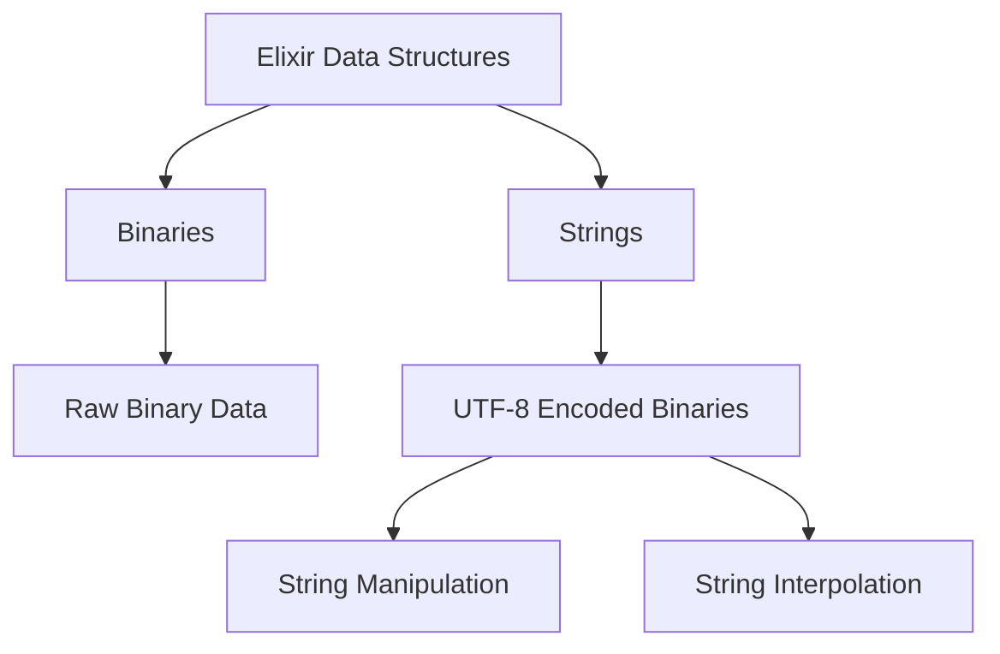

## 3.1.3. Binaries and Strings

In Elixir, binaries and strings are fundamental data structures that play a crucial role in handling raw data and textual information. Understanding these concepts is essential for expert developers who aim to build efficient and scalable applications. In this section, we will dive deep into the workings of binaries and strings, exploring their storage, manipulation, and best practices.

### Binaries in Elixir

Binaries in Elixir are sequences of bytes that are used to store raw binary data. They are particularly useful for handling files, network packets, and encoding operations. Let's explore how binaries work in Elixir and how you can leverage them in your applications.

#### Storing Raw Binary Data

Binaries are defined using the `<<>>` syntax, which allows you to specify a sequence of bytes. For example:

```elixir
# Define a binary with three bytes
binary_data = <<1, 2, 3>>

# Print the binary
IO.inspect(binary_data)
```

In this example, `binary_data` is a binary consisting of three bytes: 1, 2, and 3.

#### Binary Patterns and Matching

Elixir provides powerful pattern matching capabilities that extend to binaries. You can use pattern matching to extract specific parts of a binary. For example:

```elixir
# Define a binary
binary = <<1, 2, 3, 4, 5>>

# Match the first two bytes and the rest
<<first, second, rest::binary>> = binary

# Print the extracted values
IO.inspect(first)   # Output: 1
IO.inspect(second)  # Output: 2
IO.inspect(rest)    # Output: <<3, 4, 5>>
```

In this code, we use pattern matching to extract the first two bytes and the remaining part of the binary. The `::binary` syntax indicates that `rest` should be treated as a binary.

#### Handling Files and Network Packets

Binaries are often used to handle files and network packets. For example, you can read a file as a binary and process its contents:

```elixir
# Read a file as a binary
{:ok, file_content} = File.read("example.txt")

# Process the binary data
IO.inspect(file_content)
```

Similarly, you can use binaries to handle network packets, allowing you to efficiently process data received over a network.

### Strings in Elixir

In Elixir, strings are UTF-8 encoded binaries that represent textual data. They provide a rich set of functions for manipulation and interpolation, making them a powerful tool for handling text.

#### UTF-8 Encoded Binaries

Elixir strings are essentially UTF-8 encoded binaries. This means that every string in Elixir is a binary, and you can use binary operations on strings. For example:

```elixir
# Define a string
string = "Hello, Elixir!"

# Check if the string is a binary
is_binary = is_binary(string)

# Print the result
IO.puts("Is the string a binary? #{is_binary}")
```

In this example, `is_binary` will be `true`, confirming that strings are indeed binaries.

#### String Manipulation Functions

Elixir provides a comprehensive set of functions for string manipulation. These functions are part of the `String` module and allow you to perform various operations on strings. Here are some examples:

```elixir
# Convert a string to uppercase
uppercase = String.upcase("hello")

# Reverse a string
reversed = String.reverse("elixir")

# Replace a substring
replaced = String.replace("hello world", "world", "Elixir")

# Print the results
IO.puts(uppercase)  # Output: HELLO
IO.puts(reversed)   # Output: rilixe
IO.puts(replaced)   # Output: hello Elixir
```

These functions demonstrate the versatility of the `String` module in Elixir, enabling you to perform a wide range of string operations.

#### String Interpolation

String interpolation is a powerful feature in Elixir that allows you to embed expressions within strings. This is done using the `#{}` syntax. For example:

```elixir
# Define variables
name = "Elixir"
version = "1.12"

# Interpolate variables into a string
message = "Welcome to #{name} version #{version}!"

# Print the message
IO.puts(message)
```

In this example, the variables `name` and `version` are interpolated into the string `message`, resulting in the output: "Welcome to Elixir version 1.12!".

### Best Practices for Binaries and Strings

When working with binaries and strings in Elixir, it's important to follow best practices to ensure efficient and maintainable code.

#### Use Pattern Matching for Efficiency

Pattern matching is a powerful tool in Elixir, and it can be used to efficiently process binaries and strings. By using pattern matching, you can extract specific parts of a binary or string without the need for additional parsing logic.

#### Leverage the String Module

The `String` module in Elixir provides a rich set of functions for string manipulation. Whenever possible, use these functions instead of implementing custom logic for string operations. This will make your code more concise and easier to maintain.

#### Be Mindful of Encoding

Since Elixir strings are UTF-8 encoded binaries, it's important to be mindful of encoding when working with strings. Ensure that any external data you process is properly encoded to avoid issues with string manipulation.

#### Optimize Binary Operations

When working with large binaries, consider optimizing your operations to minimize memory usage and improve performance. This can be achieved by using efficient data structures and avoiding unnecessary copying of binary data.

### Visualizing Binaries and Strings

To better understand how binaries and strings work in Elixir, let's visualize the relationship between these data structures using a diagram.


```mermaid
graph TD;
    A[Elixir Data Structures] --> B[Binaries];
    A --> C[Strings];
    B --> D[Raw Binary Data];
    C --> E[UTF-8 Encoded Binaries];
    E --> F[String Manipulation];
    E --> G[String Interpolation];
```

This diagram illustrates how binaries and strings are related in Elixir. Binaries are used for storing raw binary data, while strings are UTF-8 encoded binaries that provide additional functionalities for string manipulation and interpolation.

### Try It Yourself

Experimentation is key to mastering binaries and strings in Elixir. Try modifying the code examples provided in this section to deepen your understanding of these concepts. For instance, you can:

- Create a binary from a file and extract specific parts using pattern matching.
- Use the `String` module to perform complex string manipulations.
- Implement a custom function that processes a binary and returns a modified version.

### Knowledge Check

Let's reinforce your understanding of binaries and strings in Elixir with some questions and exercises:

1. What is the primary use of binaries in Elixir?
2. How can you convert a string to uppercase using the `String` module?
3. What is string interpolation, and how is it used in Elixir?
4. Why is it important to be mindful of encoding when working with strings?
5. How does pattern matching enhance the efficiency of binary operations?

### Embrace the Journey

Remember, mastering binaries and strings in Elixir is just one step in your journey as an expert developer. As you progress, you'll encounter more complex scenarios that require a deep understanding of these concepts. Keep experimenting, stay curious, and enjoy the journey!

### References and Links

For further reading on binaries and strings in Elixir, consider exploring the following resources:

- [Elixir Documentation](https://elixir-lang.org/docs.html)
- [Learn You Some Erlang for Great Good!](https://learnyousomeerlang.com/content)
- [Programming Elixir ≥ 1.6](https://pragprog.com/titles/elixir16/programming-elixir-1-6/)

## Quiz Time!



### What is a binary in Elixir used for?

- [x] Storing raw binary data
- [ ] Storing textual data
- [ ] Storing numerical data
- [ ] Storing complex objects

> **Explanation:** Binaries are used for storing raw binary data, such as files and network packets.

### How can you define a binary in Elixir?

- [x] Using the `<<>>` syntax
- [ ] Using the `""` syntax
- [ ] Using the `[]` syntax
- [ ] Using the `{}` syntax

> **Explanation:** Binaries are defined using the `<<>>` syntax in Elixir.

### What is the primary encoding used for strings in Elixir?

- [x] UTF-8
- [ ] ASCII
- [ ] UTF-16
- [ ] ISO-8859-1

> **Explanation:** Elixir strings are UTF-8 encoded binaries.

### How can you convert a string to uppercase in Elixir?

- [x] Using `String.upcase/1`
- [ ] Using `String.lowercase/1`
- [ ] Using `String.capitalize/1`
- [ ] Using `String.reverse/1`

> **Explanation:** The `String.upcase/1` function is used to convert a string to uppercase.

### What is string interpolation in Elixir?

- [x] Embedding expressions within strings
- [ ] Converting strings to binaries
- [ ] Splitting strings into lists
- [ ] Concatenating strings

> **Explanation:** String interpolation allows embedding expressions within strings using the `#{}` syntax.

### How can you check if a string is a binary in Elixir?

- [x] Using `is_binary/1`
- [ ] Using `is_string/1`
- [ ] Using `is_list/1`
- [ ] Using `is_integer/1`

> **Explanation:** The `is_binary/1` function checks if a value is a binary, which includes strings.

### What is the benefit of using pattern matching with binaries?

- [x] Efficiently extracting parts of a binary
- [ ] Converting binaries to strings
- [ ] Concatenating binaries
- [ ] Reversing binaries

> **Explanation:** Pattern matching allows you to efficiently extract specific parts of a binary.

### Why is it important to be mindful of encoding with strings?

- [x] To avoid issues with string manipulation
- [ ] To increase memory usage
- [ ] To decrease performance
- [ ] To simplify code

> **Explanation:** Proper encoding ensures that string manipulations work correctly, avoiding potential errors.

### What module provides functions for string manipulation in Elixir?

- [x] The `String` module
- [ ] The `Binary` module
- [ ] The `Enum` module
- [ ] The `List` module

> **Explanation:** The `String` module provides a comprehensive set of functions for string manipulation.

### True or False: Elixir strings are not binaries.

- [ ] True
- [x] False

> **Explanation:** Elixir strings are UTF-8 encoded binaries, making them a type of binary.


