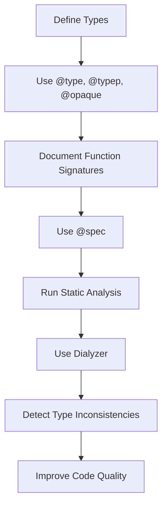

## 3.10. Typespecs and Specs

In the world of software development, ensuring code reliability and maintainability is paramount. Elixir, with its robust type system and static analysis tools, provides developers with powerful mechanisms to achieve these goals. In this section, we will delve into the intricacies of Elixir's typespecs and specs, exploring how they can be used to define types, document function signatures, and perform static analysis to detect potential issues.

### Defining Types

Types in Elixir are defined using typespecs, which serve as a form of documentation and a tool for static analysis. They help developers understand the expected input and output types of functions, making the codebase more readable and maintainable.

#### Using `@type`, `@typep`, and `@opaque`

Elixir provides several directives for defining types:

- **`@type`**: Used to define public types that can be used outside the module.
- **`@typep`**: Used to define private types that are only accessible within the module.
- **`@opaque`**: Used to define types that are public but whose internal structure is hidden.

Let's explore each of these with examples.

```elixir
defmodule Geometry do
  # Public type definition
  @type point :: {number, number}

  # Private type definition
  @typep vector :: {number, number, number}

  # Opaque type definition
  @opaque matrix :: list(list(number))

  # Function using the public type
  @spec distance(point, point) :: number
  def distance({x1, y1}, {x2, y2}) do
    :math.sqrt(:math.pow(x2 - x1, 2) + :math.pow(y2 - y1, 2))
  end
end
```

In this example, `point` is a public type that can be used by other modules, `vector` is a private type used only within the `Geometry` module, and `matrix` is an opaque type whose internal structure is hidden from external modules.

#### Key Considerations

- **Public Types**: Use `@type` when you want to expose a type to other modules. This is useful for defining interfaces or APIs.
- **Private Types**: Use `@typep` for internal types that should not be exposed. This helps encapsulate the module's implementation details.
- **Opaque Types**: Use `@opaque` to hide the internal structure of a type while still allowing it to be used externally. This is useful for abstract data types where the implementation should not be visible.

### Function Specifications

Function specifications, or specs, are used to document the expected input and output types of functions. They serve as a contract between the function and its callers, ensuring that the function is used correctly.

#### Documenting Function Signatures with `@spec`

The `@spec` directive is used to define the types of a function's arguments and its return value. This helps both developers and tools like Dialyzer understand how the function should be used.

```elixir
defmodule Math do
  # Function specification
  @spec add(number, number) :: number
  def add(a, b) do
    a + b
  end

  @spec multiply(number, number) :: number
  def multiply(a, b) do
    a * b
  end
end
```

In this example, the `add` and `multiply` functions are specified to take two numbers as arguments and return a number. This makes it clear to anyone reading the code what the functions expect and what they return.

#### Benefits of Using Specs

- **Documentation**: Specs serve as documentation, making it easier for developers to understand how to use a function.
- **Error Detection**: Tools like Dialyzer can use specs to detect type inconsistencies and potential bugs.
- **Code Quality**: Specs encourage developers to think about the types their functions work with, leading to better-designed code.

### Static Analysis with Dialyzer

Dialyzer is a static analysis tool that uses typespecs to detect type inconsistencies and potential bugs in Elixir code. It can identify issues such as unreachable code, type errors, and more.

#### Detecting Type Inconsistencies and Potential Bugs

To use Dialyzer, you need to generate a PLT (Persistent Lookup Table) file, which contains information about the types used in your project and its dependencies. Once the PLT is generated, Dialyzer can analyze your code for potential issues.

```bash
# Generate the PLT file
mix dialyzer --plt

# Run Dialyzer to analyze the code
mix dialyzer
```

Dialyzer will output any warnings it finds, allowing you to address potential issues before they become bugs.

#### Example of Dialyzer in Action

Consider the following code:

```elixir
defmodule Calculator do
  @spec divide(number, number) :: {:ok, number} | {:error, String.t()}
  def divide(_a, 0), do: {:error, "Cannot divide by zero"}
  def divide(a, b), do: {:ok, a / b}
end
```

If we accidentally change the spec to return only `{:ok, number}`, Dialyzer will warn us about the inconsistency:

```elixir
defmodule Calculator do
  @spec divide(number, number) :: {:ok, number}
  def divide(_a, 0), do: {:error, "Cannot divide by zero"}
  def divide(a, b), do: {:ok, a / b}
end
```

Running Dialyzer will produce a warning indicating that the function can return `{:error, String.t()}`, which is not covered by the spec.

#### Key Takeaways

- **Early Detection**: Dialyzer helps detect potential issues early in the development process.
- **Type Safety**: By using typespecs and Dialyzer, you can ensure that your code adheres to the expected types, reducing runtime errors.
- **Improved Code Quality**: Static analysis encourages developers to write more robust and maintainable code.

### Visualizing Typespecs and Specs

To better understand the flow of typespecs and specs in Elixir, let's visualize the process using a Mermaid.js diagram.



**Diagram Description**: This flowchart illustrates the process of defining types, documenting function signatures, and using static analysis with Dialyzer to detect type inconsistencies and improve code quality.

### Try It Yourself

To solidify your understanding of typespecs and specs, try modifying the examples provided. Experiment with different types and specs, and run Dialyzer to see how it detects inconsistencies. Here are some suggestions:

- Add a new function to the `Math` module that performs subtraction and document it with a spec.
- Change the `divide` function in the `Calculator` module to return a different error message and update the spec accordingly.
- Introduce a new opaque type in the `Geometry` module and use it in a function.

### References and Links

- [Elixir Typespecs and Behaviours](https://hexdocs.pm/elixir/typespecs.html)
- [Dialyzer: Success Typings for Erlang](https://erlang.org/doc/man/dialyzer.html)
- [Elixir Documentation](https://elixir-lang.org/docs.html)

### Knowledge Check

- What is the purpose of using `@type`, `@typep`, and `@opaque` in Elixir?
- How do function specifications help in documenting code?
- What role does Dialyzer play in static analysis?

### Embrace the Journey

Remember, mastering typespecs and specs is just the beginning. As you continue to explore Elixir, you'll discover more ways to enhance your code's reliability and maintainability. Keep experimenting, stay curious, and enjoy the journey!

## Quiz: Typespecs and Specs



### What is the purpose of `@type` in Elixir?

- [x] To define public types that can be used outside the module
- [ ] To define private types that are only accessible within the module
- [ ] To define types that are public but whose internal structure is hidden
- [ ] To define types that are used only for testing

> **Explanation:** `@type` is used to define public types that can be accessed by other modules.

### How does `@spec` benefit developers?

- [x] It serves as documentation for function signatures
- [x] It helps tools like Dialyzer detect type inconsistencies
- [ ] It automatically generates test cases for functions
- [ ] It optimizes the function's performance

> **Explanation:** `@spec` documents function signatures and aids static analysis tools in detecting type inconsistencies.

### What is the role of Dialyzer in Elixir?

- [x] To perform static analysis and detect type inconsistencies
- [ ] To compile Elixir code into bytecode
- [ ] To run unit tests on Elixir code
- [ ] To format Elixir code according to style guidelines

> **Explanation:** Dialyzer is a static analysis tool that detects type inconsistencies and potential bugs in Elixir code.

### Which directive is used to define private types in Elixir?

- [ ] @type
- [x] @typep
- [ ] @opaque
- [ ] @spec

> **Explanation:** `@typep` is used to define private types that are only accessible within the module.

### What does `@opaque` do in Elixir?

- [x] It defines types that are public but whose internal structure is hidden
- [ ] It defines private types that are only accessible within the module
- [ ] It defines types that are used only for testing
- [ ] It defines types that are automatically serialized

> **Explanation:** `@opaque` defines types that are public but hides their internal structure from external modules.

### How can Dialyzer help improve code quality?

- [x] By detecting type inconsistencies early in the development process
- [ ] By automatically refactoring code
- [ ] By generating documentation for the codebase
- [ ] By optimizing code for performance

> **Explanation:** Dialyzer detects type inconsistencies, helping developers address potential issues before they become bugs.

### What is a PLT file in the context of Dialyzer?

- [x] A file that contains information about the types used in a project and its dependencies
- [ ] A file that stores the results of unit tests
- [ ] A file that contains the compiled bytecode of an Elixir project
- [ ] A file that defines the project's dependencies

> **Explanation:** A PLT (Persistent Lookup Table) file contains type information used by Dialyzer for static analysis.

### Why is it important to use typespecs in Elixir?

- [x] To improve code readability and maintainability
- [x] To help detect potential bugs through static analysis
- [ ] To automatically generate user interfaces
- [ ] To enhance the performance of Elixir code

> **Explanation:** Typespecs improve code readability and help detect potential bugs through static analysis.

### What happens if a function's implementation does not match its spec?

- [x] Dialyzer will produce a warning indicating the inconsistency
- [ ] The function will not compile
- [ ] The function will throw an error at runtime
- [ ] The function will automatically be corrected

> **Explanation:** Dialyzer will produce a warning if a function's implementation does not match its spec.

### True or False: `@typep` can be used to define types that are accessible outside the module.

- [ ] True
- [x] False

> **Explanation:** `@typep` is used to define private types that are only accessible within the module.


