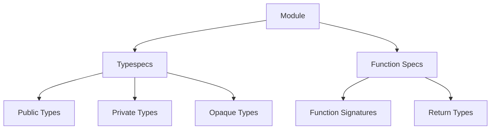

## 3.10. Typespecs and Specs

In this section, we delve into the world of Typespecs and Specs in Elixir, which are essential tools for expert software engineers and architects aiming to build robust, maintainable, and error-free applications. Typespecs and Specs provide a way to define types and document function signatures, enabling static analysis of your code with tools like Dialyzer. This enhances code reliability and helps catch potential bugs before they become issues in production.

### Defining Types

Elixir provides a powerful way to define custom types using Typespecs. These types help in documenting and enforcing the expected data structures in your codebase, making it easier to understand and maintain.

#### Using `@type`, `@typep`, and `@opaque`

Elixir offers three primary directives for defining types:

- **`@type`**: Used to define public types that can be accessed outside the module.
- **`@typep`**: Used for private types, accessible only within the module where they are defined.
- **`@opaque`**: Similar to `@type`, but the internal structure is hidden from external modules, promoting encapsulation.

Let's explore each with examples:

```elixir
defmodule Geometry do
  @type point :: {number, number}
  @typep private_point :: {integer, integer}
  @opaque vector :: {number, number}

  @spec distance(point, point) :: number
  def distance({x1, y1}, {x2, y2}) do
    :math.sqrt(:math.pow(x2 - x1, 2) + :math.pow(y2 - y1, 2))
  end

  @spec scale(vector, number) :: vector
  def scale({x, y}, factor) do
    {x * factor, y * factor}
  end
end
```

- **`@type point`**: Defines a public type `point` as a tuple of two numbers.
- **`@typep private_point`**: Defines a private type `private_point` as a tuple of two integers, only accessible within the `Geometry` module.
- **`@opaque vector`**: Defines an opaque type `vector`, ensuring that its internal structure is not visible outside the module.

### Function Specifications

Function specifications, or Specs, are used to document the expected input and output types of functions. This not only serves as documentation but also aids tools like Dialyzer in performing static analysis.

#### Documenting Function Signatures with `@spec`

The `@spec` directive is used to specify the types of arguments and the return type of a function. Here's how you can use it:

```elixir
defmodule Calculator do
  @spec add(number, number) :: number
  def add(a, b) do
    a + b
  end

  @spec divide(number, number) :: {:ok, number} | {:error, String.t()}
  def divide(_a, 0), do: {:error, "Cannot divide by zero"}
  def divide(a, b), do: {:ok, a / b}
end
```

- **`@spec add(number, number) :: number`**: Specifies that `add` takes two numbers and returns a number.
- **`@spec divide(number, number) :: {:ok, number} | {:error, String.t()}`**: Specifies that `divide` returns a tuple indicating success or an error message.

### Static Analysis with Dialyzer

Dialyzer (DIscrepancy AnaLYZer for ERlang) is a static analysis tool that identifies type inconsistencies, unreachable code, and potential bugs in your Elixir codebase. By leveraging Typespecs and Specs, Dialyzer can provide more accurate analysis.

#### Detecting Type Inconsistencies and Potential Bugs

To use Dialyzer, you need to first generate a PLT (Persistent Lookup Table) file, which contains information about the modules in your project. Here's how you can set up and run Dialyzer:

1. **Generate the PLT file**:

   ```bash
   mix dialyzer --plt
   ```

2. **Run Dialyzer**:

   ```bash
   mix dialyzer
   ```

Dialyzer will analyze your code and report any discrepancies between the actual code and the defined Specs. For example, if you define a function to return a number but it can also return `nil`, Dialyzer will flag this as a potential issue.

### Visualizing Typespecs and Specs

To better understand the relationship between types and function specifications, let's visualize how these components interact within a module.


```mermaid
graph TD;
    A[Module] --> B[Typespecs];
    A --> C[Function Specs];
    B --> D[Public Types];
    B --> E[Private Types];
    B --> F[Opaque Types];
    C --> G[Function Signatures];
    C --> H[Return Types];
```

**Diagram Description**: This diagram illustrates the relationship between a module and its types and function specifications. Typespecs define public, private, and opaque types, while function specs document the function signatures and return types.

### Try It Yourself

Experiment with Typespecs and Specs by modifying the examples provided. Try defining your own types and function specifications in a new module. Consider the following challenges:

- Define a type for a `rectangle` and a function spec for calculating its area.
- Create a private type for a `circle` and a function that calculates its circumference.
- Use Dialyzer to analyze your code and identify any discrepancies.

### References and Links

- [Elixir's Official Documentation on Typespecs](https://hexdocs.pm/elixir/typespecs.html)
- [Dialyzer: DIscrepancy AnaLYZer for ERlang](http://erlang.org/doc/man/dialyzer.html)
- [Learn You Some Erlang for Great Good!](https://learnyousomeerlang.com/dialyzer)

### Knowledge Check

- **Question**: What is the difference between `@type` and `@opaque`?
- **Exercise**: Create a module with a function that takes a list of integers and returns the sum. Use Specs to define the function signature.

### Embrace the Journey

Remember, mastering Typespecs and Specs is a journey that enhances your ability to write clear, maintainable, and error-free code. As you progress, you'll find that these tools not only improve your code quality but also make collaboration with other developers more efficient. Keep experimenting, stay curious, and enjoy the journey!

## Quiz Time!



### What is the purpose of `@type` in Elixir?

- [x] To define a public type that can be accessed outside the module.
- [ ] To define a private type that is only accessible within the module.
- [ ] To hide the internal structure of a type.
- [ ] To define a function specification.

> **Explanation:** `@type` is used to define a public type in Elixir, which can be accessed outside the module.

### How does `@opaque` differ from `@type`?

- [x] It hides the internal structure of the type from external modules.
- [ ] It is the same as `@type`.
- [ ] It is used for defining private types.
- [ ] It is used for defining function specifications.

> **Explanation:** `@opaque` hides the internal structure of the type from external modules, promoting encapsulation.

### What is the role of `@spec` in Elixir?

- [x] To document the expected input and output types of a function.
- [ ] To define a private type.
- [ ] To generate a PLT file.
- [ ] To analyze code for discrepancies.

> **Explanation:** `@spec` is used to document the expected input and output types of a function.

### What tool is used for static analysis in Elixir?

- [x] Dialyzer
- [ ] ExUnit
- [ ] Mix
- [ ] Credo

> **Explanation:** Dialyzer is used for static analysis in Elixir to detect type inconsistencies and potential bugs.

### How do you generate a PLT file for Dialyzer?

- [x] mix dialyzer --plt
- [ ] mix test
- [ ] mix compile
- [ ] mix format

> **Explanation:** The command `mix dialyzer --plt` is used to generate a PLT file for Dialyzer.

### What does Dialyzer do?

- [x] Detects type inconsistencies and potential bugs.
- [ ] Formats code.
- [ ] Runs tests.
- [ ] Compiles code.

> **Explanation:** Dialyzer detects type inconsistencies and potential bugs in Elixir code.

### Which directive is used to define private types in Elixir?

- [x] @typep
- [ ] @type
- [ ] @opaque
- [ ] @spec

> **Explanation:** `@typep` is used to define private types in Elixir.

### What is the return type of the divide function in the example?

- [x] {:ok, number} | {:error, String.t()}
- [ ] number
- [ ] {:error, number}
- [ ] String.t()

> **Explanation:** The `divide` function returns a tuple indicating success or an error message.

### What is the benefit of using Typespecs in Elixir?

- [x] They help document and enforce expected data structures.
- [ ] They format code.
- [ ] They run tests.
- [ ] They compile code.

> **Explanation:** Typespecs help document and enforce expected data structures in Elixir code.

### True or False: Dialyzer can identify unreachable code.

- [x] True
- [ ] False

> **Explanation:** Dialyzer can identify unreachable code in Elixir, helping to improve code quality.


