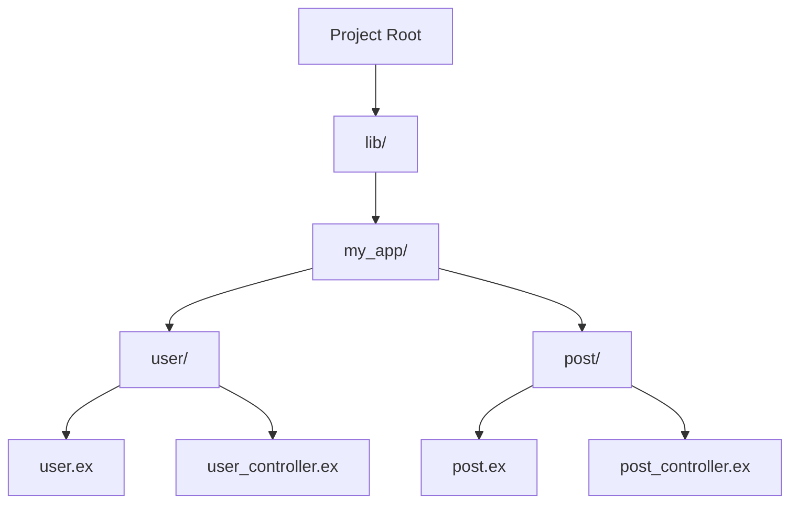

## 3.11. Coding Style and Conventions

In the world of software development, coding style and conventions play a crucial role in ensuring that code is not only functional but also maintainable and readable. In Elixir, a language known for its expressiveness and concurrency capabilities, adhering to a consistent coding style is vital for collaboration and long-term project success. This section delves into the best practices for coding style and conventions in Elixir, providing expert developers with the guidance needed to write clean, efficient, and maintainable code.

### Adhering to the Elixir Style Guide

Elixir has a well-defined style guide that outlines the standard practices for formatting and structuring code. Following these guidelines helps maintain consistency across projects and teams, making it easier for developers to read and understand each other's code.

#### Indentation and Formatting

- **Use two spaces for indentation**: Elixir code should be indented with two spaces, not tabs. This ensures uniformity across different editors and environments.
  
```elixir
defmodule Example do
  def greet(name) do
    IO.puts("Hello, #{name}!")
  end
end
```

- **Align multi-line expressions**: When expressions span multiple lines, align them for clarity.

```elixir
result = Enum.map(collection, fn item ->
  process_item(item)
end)
```

- **Limit line length to 80 characters**: Keeping lines short improves readability, especially when viewing code on smaller screens or in split views.

#### Spacing and Blank Lines

- **Use spaces around operators**: This enhances readability by clearly separating operands.

```elixir
sum = a + b
```

- **Separate logical sections with blank lines**: Use blank lines to separate different sections of code, such as between function definitions or logical blocks within a function.

```elixir
defmodule Math do
  def add(a, b) do
    a + b
  end

  def subtract(a, b) do
    a - b
  end
end
```

#### Comments and Documentation

- **Write meaningful comments**: Comments should explain why something is done, not what is done. Use them sparingly and ensure they add value.

```elixir
# Calculate the factorial of a number using recursion
def factorial(0), do: 1
def factorial(n), do: n * factorial(n - 1)
```

- **Use module and function documentation**: Elixir supports inline documentation using `@doc` and `@moduledoc` attributes. This is essential for generating documentation with tools like ExDoc.

```elixir
defmodule Calculator do
  @moduledoc """
  A simple calculator module for basic arithmetic operations.
  """

  @doc """
  Adds two numbers together.
  """
  def add(a, b), do: a + b
end
```

### Consistent Naming

Naming conventions are critical for code readability and maintainability. In Elixir, there are specific guidelines for naming variables, functions, and modules.

#### Variables and Functions

- **Use snake_case for variables and function names**: This is the standard convention in Elixir, making it easy to distinguish between different types of identifiers.

```elixir
def calculate_area(radius) do
  pi = 3.14159
  pi * radius * radius
end
```

- **Choose descriptive names**: Variable and function names should clearly convey their purpose or the data they hold.

```elixir
def fetch_user_data(user_id) do
  # Fetch data logic
end
```

#### Modules and Constants

- **Use PascalCase for module names**: Module names should be capitalized and use PascalCase to differentiate them from variables and functions.

```elixir
defmodule UserProfile do
  # Module logic
end
```

- **Use uppercase for constants**: Constants should be written in uppercase with underscores separating words.

```elixir
@max_retries 5
```

### Code Readability

Writing clear and maintainable code is essential for long-term project success. This involves thoughtful structuring and organization of code.

#### Function Length and Complexity

- **Keep functions short and focused**: Each function should perform a single task. If a function becomes too long or complex, consider breaking it into smaller, more manageable functions.

```elixir
def process_data(data) do
  cleaned_data = clean_data(data)
  transformed_data = transform_data(cleaned_data)
  save_data(transformed_data)
end
```

- **Use pattern matching effectively**: Pattern matching can simplify code by eliminating the need for complex conditional logic.

```elixir
def handle_response({:ok, data}), do: process_data(data)
def handle_response({:error, reason}), do: log_error(reason)
```

#### Structuring Code

- **Organize code logically**: Group related functions and modules together. Use folders and files to reflect the logical structure of the application.

```plaintext
lib/
  my_app/
    user/
      user.ex
      user_controller.ex
    post/
      post.ex
      post_controller.ex
```

- **Use modules to encapsulate functionality**: Modules should encapsulate related functions and data, promoting modularity and reusability.

```elixir
defmodule ShoppingCart do
  def add_item(cart, item), do: # logic
  def remove_item(cart, item), do: # logic
end
```

### Try It Yourself

Experiment with the following code snippets to practice Elixir coding style and conventions:

1. **Refactor a long function**: Break down a complex function into smaller, more focused functions.
2. **Apply pattern matching**: Rewrite a series of conditional statements using pattern matching.
3. **Organize a module**: Create a new module and organize related functions within it.

### Visualizing Elixir Code Structure

To better understand how to structure Elixir code, let's visualize a typical project layout using a Mermaid.js diagram:



This diagram represents a simple Elixir project structure, where the `lib/` directory contains the main application code, organized into subdirectories for different features or components.

### References and Links

For further reading on Elixir coding style and conventions, consider the following resources:

- [Elixir Style Guide](https://github.com/christopheradams/elixir_style_guide)
- [Elixir Documentation](https://elixir-lang.org/docs.html)
- [ExDoc Documentation Tool](https://hexdocs.pm/ex_doc/readme.html)

### Knowledge Check

- **What is the standard indentation for Elixir code?**
- **Why is it important to use descriptive names for variables and functions?**
- **How can pattern matching improve code readability?**

### Embrace the Journey

Remember, mastering coding style and conventions is a continuous journey. As you write more Elixir code, you'll develop a deeper understanding of what makes code readable and maintainable. Keep experimenting, stay curious, and enjoy the process of refining your coding skills!

## Quiz: Coding Style and Conventions



### What is the recommended indentation style for Elixir code?

- [x] Two spaces
- [ ] Four spaces
- [ ] Tabs
- [ ] No indentation

> **Explanation:** Elixir code should be indented with two spaces for consistency and readability.

### How should variables and function names be formatted in Elixir?

- [x] snake_case
- [ ] camelCase
- [ ] PascalCase
- [ ] UPPERCASE

> **Explanation:** Variables and function names in Elixir should use snake_case to maintain consistency with the language's conventions.

### What is the purpose of using pattern matching in Elixir?

- [x] Simplify code by eliminating complex conditional logic
- [ ] Increase code execution speed
- [ ] Reduce memory usage
- [ ] Improve error handling

> **Explanation:** Pattern matching simplifies code by allowing developers to handle different cases directly in function definitions, reducing the need for complex conditional logic.

### How should module names be formatted in Elixir?

- [x] PascalCase
- [ ] snake_case
- [ ] camelCase
- [ ] UPPERCASE

> **Explanation:** Module names in Elixir should use PascalCase to differentiate them from variables and functions.

### What is the benefit of keeping functions short and focused?

- [x] Easier to read and maintain
- [ ] Faster execution
- [ ] Uses less memory
- [ ] Reduces compilation time

> **Explanation:** Short and focused functions are easier to read and maintain, making the codebase more manageable.

### Why is it important to use spaces around operators?

- [x] Enhances readability
- [ ] Increases performance
- [ ] Reduces file size
- [ ] Improves error handling

> **Explanation:** Using spaces around operators enhances readability by clearly separating operands.

### How can you generate documentation for Elixir code?

- [x] Use `@doc` and `@moduledoc` attributes
- [ ] Use inline comments
- [ ] Use external documentation tools
- [ ] Use `@comment` attribute

> **Explanation:** Elixir supports inline documentation using `@doc` and `@moduledoc` attributes, which can be used to generate documentation with tools like ExDoc.

### What is the recommended line length for Elixir code?

- [x] 80 characters
- [ ] 100 characters
- [ ] 120 characters
- [ ] No limit

> **Explanation:** Keeping lines to 80 characters improves readability, especially on smaller screens or in split views.

### How should constants be formatted in Elixir?

- [x] UPPERCASE with underscores
- [ ] camelCase
- [ ] snake_case
- [ ] PascalCase

> **Explanation:** Constants in Elixir should be written in UPPERCASE with underscores separating words.

### True or False: Comments should explain what the code does.

- [ ] True
- [x] False

> **Explanation:** Comments should explain why something is done, not what is done, as the code itself should be clear enough to convey what it does.


