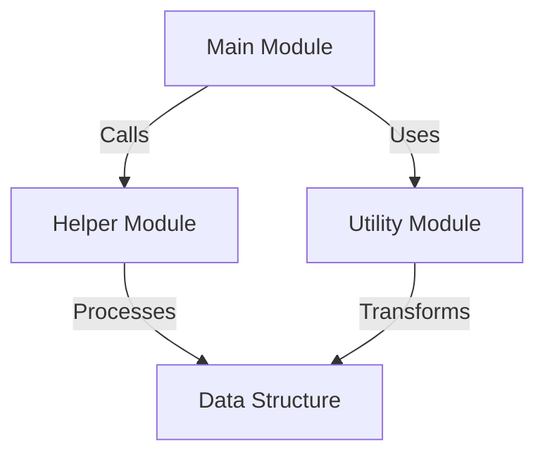

## 3.11. Coding Style and Conventions

In the realm of software development, coding style and conventions play a pivotal role in ensuring code is not only functional but also maintainable and readable. This is particularly true in Elixir, a language built on the principles of functional programming and concurrency. In this section, we will delve into the essential aspects of Elixir coding style and conventions, providing expert developers with the guidance needed to write clean, efficient, and maintainable code.

### Adhering to the Elixir Style Guide

The Elixir community has established a comprehensive style guide that outlines the best practices for writing Elixir code. Adhering to these guidelines ensures consistency across projects and teams, making it easier for developers to read and understand each other's code. Let's explore some of the key elements of the Elixir style guide.

#### Standard Practices for Formatting and Structure

1. **Indentation and Line Length:**
   - Use two spaces for indentation. Avoid using tabs.
   - Keep line lengths to a maximum of 80 characters for better readability.

2. **Module and Function Definitions:**
   - Use descriptive names for modules and functions. Module names should be in CamelCase, while function names should be in snake_case.
   - Group related functions within the same module to maintain cohesion.

3. **Use of Parentheses:**
   - Use parentheses for function calls, especially when passing arguments. This enhances clarity and reduces ambiguity.

4. **Pipe Operator (`|>`):**
   - Use the pipe operator to chain function calls, improving readability by clearly showing the data flow.

```elixir
# Example of using the pipe operator
result =
  data
  |> transform()
  |> process()
  |> output()
```

5. **Code Comments:**
   - Write comments to explain complex logic or decisions. Avoid obvious comments that restate the code.

6. **Whitespace and Blank Lines:**
   - Use blank lines to separate logical sections of code, enhancing readability.

7. **Consistent Use of Aliases and Imports:**
   - Use `alias` and `import` to shorten module names and bring functions into scope, but do so sparingly to avoid confusion.

### Consistent Naming

Naming conventions are crucial for code clarity and maintainability. Consistent naming helps developers understand the purpose and scope of variables, functions, and modules at a glance.

#### Guidelines for Variables, Functions, and Modules

1. **Variables:**
   - Use descriptive names that convey the purpose of the variable.
   - Prefer short, meaningful names for loop counters or temporary variables.

2. **Functions:**
   - Function names should be verbs or verb phrases, clearly indicating the action performed.
   - Use descriptive names for functions, especially public ones, to convey their behavior.

3. **Modules:**
   - Module names should be nouns or noun phrases, representing the entity or concept they encapsulate.
   - Use CamelCase for module names, and organize modules hierarchically to reflect the application's structure.

### Code Readability

Code readability is a cornerstone of maintainable software. Writing clear, maintainable code involves thoughtful structuring and adherence to conventions that make the codebase approachable for any developer.

#### Writing Clear, Maintainable Code with Thoughtful Structure

1. **Use of Pattern Matching:**
   - Leverage pattern matching to simplify code and eliminate unnecessary conditionals.

```elixir
# Example of pattern matching
defmodule Math do
  def add({a, b}), do: a + b
end
```

2. **Function Composition:**
   - Compose smaller functions to build complex functionality, promoting modularity and reuse.

3. **Avoid Deep Nesting:**
   - Limit the depth of nested structures to enhance readability and reduce cognitive load.

4. **Error Handling:**
   - Use idiomatic error handling patterns, such as `{:ok, result}` and `{:error, reason}`, to manage errors gracefully.

```elixir
# Example of idiomatic error handling
case File.read("path/to/file") do
  {:ok, content} -> process_content(content)
  {:error, reason} -> handle_error(reason)
end
```

5. **Consistent Formatting:**
   - Use tools like `mix format` to enforce consistent code formatting automatically.

6. **Documentation:**
   - Write comprehensive documentation for modules and functions using `@doc` and `@moduledoc` attributes.

### Visualizing Elixir Code Structure

To further enhance understanding, let's visualize a typical Elixir code structure using a Mermaid.js diagram. This diagram represents the relationships between modules, functions, and data flow in an Elixir application.


```mermaid
graph TD;
    A[Main Module] -->|Calls| B[Helper Module];
    A -->|Uses| C[Utility Module];
    B -->|Processes| D[Data Structure];
    C -->|Transforms| D;
```

**Diagram Description:** This diagram illustrates a simple Elixir application structure where the main module interacts with helper and utility modules, which in turn process and transform data structures.

### Try It Yourself

To solidify your understanding of Elixir coding style and conventions, try modifying the following code example. Experiment with different naming conventions, indentation styles, or error handling patterns.

```elixir
defmodule Example do
  def greet(name) do
    IO.puts("Hello, #{name}!")
  end

  def add(a, b) do
    a + b
  end

  def divide(a, b) do
    if b == 0 do
      {:error, "Cannot divide by zero"}
    else
      {:ok, a / b}
    end
  end
end
```

### References and Links

For further reading on Elixir coding style and conventions, consider exploring the following resources:
- [Elixir Style Guide](https://github.com/christopheradams/elixir_style_guide)
- [Elixir Documentation](https://elixir-lang.org/docs.html)

### Knowledge Check

As you progress through this section, consider the following questions to reinforce your understanding:
- How does the use of the pipe operator enhance code readability in Elixir?
- What are the benefits of adhering to consistent naming conventions in a codebase?
- Why is it important to limit the depth of nested structures in your code?

### Embrace the Journey

Remember, mastering coding style and conventions is a continuous journey. As you refine your skills, you'll find that writing clean, maintainable code becomes second nature. Keep experimenting, stay curious, and enjoy the process of becoming an expert Elixir developer!

### Quiz Time!



### What is the recommended indentation style in Elixir?

- [x] Two spaces
- [ ] Four spaces
- [ ] Tabs
- [ ] No indentation

> **Explanation:** Elixir style guide recommends using two spaces for indentation to maintain consistency and readability.

### Which naming convention is used for module names in Elixir?

- [x] CamelCase
- [ ] snake_case
- [ ] kebab-case
- [ ] UPPERCASE

> **Explanation:** Module names in Elixir should be in CamelCase to clearly distinguish them from function names.

### What is the purpose of the pipe operator (`|>`) in Elixir?

- [x] To chain function calls
- [ ] To declare variables
- [ ] To handle errors
- [ ] To define modules

> **Explanation:** The pipe operator is used to chain function calls, enhancing readability by clearly showing the data flow.

### How should function names be structured in Elixir?

- [x] As verbs or verb phrases
- [ ] As nouns or noun phrases
- [ ] In CamelCase
- [ ] In UPPERCASE

> **Explanation:** Function names should be verbs or verb phrases to clearly indicate the action performed by the function.

### Why is it important to use pattern matching in Elixir?

- [x] To simplify code and eliminate unnecessary conditionals
- [ ] To increase code complexity
- [ ] To make code harder to read
- [ ] To avoid using functions

> **Explanation:** Pattern matching simplifies code by eliminating unnecessary conditionals and making the code more declarative.

### What is the purpose of `mix format` in Elixir?

- [x] To enforce consistent code formatting
- [ ] To compile code
- [ ] To run tests
- [ ] To deploy applications

> **Explanation:** `mix format` is a tool used to automatically format Elixir code, ensuring consistent style across the codebase.

### Which of the following is a key aspect of writing maintainable code?

- [x] Code readability
- [ ] Code obfuscation
- [ ] Deep nesting
- [ ] Lack of comments

> **Explanation:** Code readability is essential for writing maintainable code, making it easier for developers to understand and modify the codebase.

### What should be avoided to enhance code readability?

- [x] Deep nesting
- [ ] Use of pattern matching
- [ ] Consistent naming
- [ ] Use of comments

> **Explanation:** Deep nesting should be avoided as it reduces code readability and increases cognitive load.

### How can you manage errors gracefully in Elixir?

- [x] Using idiomatic error handling patterns like `{:ok, result}` and `{:error, reason}`
- [ ] Ignoring errors
- [ ] Using global variables
- [ ] Using random error codes

> **Explanation:** Idiomatic error handling patterns in Elixir, such as `{:ok, result}` and `{:error, reason}`, help manage errors gracefully.

### Is it important to write comments for obvious code?

- [ ] True
- [x] False

> **Explanation:** Writing comments for obvious code is unnecessary and can clutter the codebase. Comments should explain complex logic or decisions.


