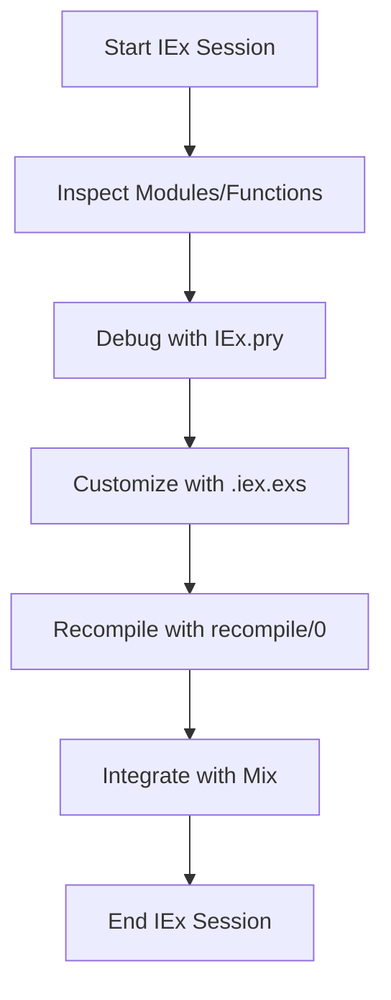

## 3.12. Effective Use of IEx (Interactive Shell)

Elixir's Interactive Shell, known as IEx, is a powerful tool that allows developers to interact with their code in real-time. It provides an environment where you can test functions, inspect modules, debug applications, and even customize your development workflow. In this section, we will explore the various features of IEx, focusing on how expert software engineers and architects can leverage it to enhance their productivity and code quality.

### Exploring Code in IEx

#### Inspecting Modules, Functions, and Documentation

One of the primary uses of IEx is to explore and understand the codebase. You can inspect modules, functions, and their documentation directly from the shell. This is particularly useful when working with large codebases or unfamiliar libraries.

**Example: Inspecting a Module**

To inspect a module, you can use the `h` helper function, which stands for "help". This function provides documentation for modules and functions.

```elixir
iex> h Enum
```

This command will display the documentation for the `Enum` module, including a list of available functions and their descriptions.

**Example: Inspecting a Function**

To get detailed information about a specific function, you can pass the function name and arity to the `h` helper.

```elixir
iex> h Enum.map/2
```

This will show the documentation for the `map/2` function in the `Enum` module, including its parameters and examples of usage.

#### Exploring Code with `i`

The `i` command is another useful tool in IEx. It provides detailed information about a given value, including its type, data structure, and memory usage.

```elixir
iex> i [1, 2, 3]
```

This command will output information about the list `[1, 2, 3]`, such as its type (`List`), length, and memory usage.

### Debugging with IEx

Debugging is an essential part of software development, and IEx provides several tools to help you debug your Elixir applications effectively.

#### Using `IEx.pry` for Interactive Debugging Sessions

`IEx.pry` is a powerful feature that allows you to pause the execution of your code and enter an interactive session. This is similar to setting a breakpoint in traditional debuggers.

**Example: Using `IEx.pry`**

To use `IEx.pry`, you need to require the `IEx` module and insert the `IEx.pry` call at the point in your code where you want to start the interactive session.

```elixir
defmodule Example do
  def calculate(a, b) do
    require IEx; IEx.pry()
    a + b
  end
end
```

When you run this code, execution will pause at the `IEx.pry` call, and you will be dropped into an interactive session where you can inspect variables, evaluate expressions, and step through the code.

**Important Note:** Ensure that the `:iex` application is running when using `IEx.pry`. This is typically the case when running your application in development mode.

### Customization

IEx is highly customizable, allowing you to tailor the environment to suit your workflow and preferences.

#### Configuring IEx with `.iex.exs`

The `.iex.exs` file is a script that runs every time you start an IEx session. You can use this file to configure your IEx environment, load custom modules, or set up aliases.

**Example: Customizing IEx with `.iex.exs`**

Create a `.iex.exs` file in your project's root directory and add the following configuration:

```elixir
# .iex.exs

# Load custom modules
import_file_if_available("custom_helpers.exs")

# Set up aliases
alias MyApp.Repo
alias MyApp.Accounts.User

# Configure IEx
IEx.configure(inspect: [limit: 5])
```

This configuration will load a custom helper file, set up aliases for commonly used modules, and configure the IEx inspector to limit the output to five items.

### Advanced IEx Features

#### Using `recompile/0` for Rapid Development

The `recompile/0` function is a handy tool for rapid development. It recompiles the current project without leaving the IEx session, allowing you to test changes immediately.

```elixir
iex> recompile()
```

This command is particularly useful when making small changes to your code and wanting to see the effects without restarting the entire application.

#### Integrating with Mix

IEx can be integrated with Mix, Elixir's build tool, to provide additional functionality. For example, you can start an IEx session with your project's dependencies and environment loaded by running:

```bash
$ iex -S mix
```

This command starts an IEx session with your Mix project loaded, allowing you to interact with your application's modules and functions directly.

### Visualizing IEx Workflow

To better understand how IEx fits into the development workflow, let's visualize the process using a flowchart.



**Figure 1: IEx Workflow**

This flowchart illustrates the typical workflow when using IEx, from starting a session to inspecting code, debugging, customizing, recompiling, and integrating with Mix.

### Try It Yourself

To get the most out of IEx, try experimenting with the following exercises:

1. **Inspect a Module:** Use the `h` helper to inspect a module you frequently use in your projects. Explore its functions and documentation.

2. **Debug with IEx.pry:** Insert an `IEx.pry` call in a function and run your application. Experiment with inspecting variables and stepping through the code.

3. **Customize IEx:** Create a `.iex.exs` file and add some custom configurations. Try setting up aliases for modules you use often.

4. **Use recompile/0:** Make a small change to your code and use `recompile/0` to see the changes in action without restarting IEx.

5. **Integrate with Mix:** Start an IEx session with Mix and explore your project's modules and functions.

### Knowledge Check

Before we wrap up, let's reinforce what we've learned with a few questions:

- What command do you use to inspect a module's documentation in IEx?
- How do you start an interactive debugging session with IEx?
- What is the purpose of the `.iex.exs` file?
- How can you recompile your project without leaving IEx?
- How do you start an IEx session with your Mix project loaded?

### Embrace the Journey

Remember, mastering IEx is a journey. As you become more familiar with its features, you'll find yourself using it more effectively to explore, debug, and customize your Elixir development experience. Keep experimenting, stay curious, and enjoy the journey!

## Quiz: Effective Use of IEx (Interactive Shell)



### What command is used to inspect a module's documentation in IEx?

- [x] h
- [ ] i
- [ ] inspect
- [ ] doc

> **Explanation:** The `h` command is used to access the documentation for modules and functions in IEx.

### How do you start an interactive debugging session with IEx?

- [x] IEx.pry
- [ ] IEx.debug
- [ ] IEx.inspect
- [ ] IEx.break

> **Explanation:** `IEx.pry` is used to pause execution and start an interactive debugging session in IEx.

### What is the purpose of the `.iex.exs` file?

- [x] To configure the IEx environment
- [ ] To compile Elixir code
- [ ] To run tests
- [ ] To deploy applications

> **Explanation:** The `.iex.exs` file is used to configure the IEx environment, such as setting up aliases and loading custom modules.

### How can you recompile your project without leaving IEx?

- [x] recompile/0
- [ ] compile/0
- [ ] reload/0
- [ ] refresh/0

> **Explanation:** The `recompile/0` function recompiles the current project without leaving the IEx session.

### How do you start an IEx session with your Mix project loaded?

- [x] iex -S mix
- [ ] iex --mix
- [ ] iex -m
- [ ] iex --start

> **Explanation:** The `iex -S mix` command starts an IEx session with the Mix project loaded, allowing interaction with the application's modules and functions.

### Which command provides detailed information about a value in IEx?

- [x] i
- [ ] h
- [ ] inspect
- [ ] info

> **Explanation:** The `i` command provides detailed information about a value, including its type and memory usage.

### What does the `IEx.configure/1` function do?

- [x] Configures the IEx environment
- [ ] Compiles Elixir code
- [ ] Runs tests
- [ ] Deploys applications

> **Explanation:** `IEx.configure/1` is used to configure the IEx environment, such as setting inspection limits.

### What is the primary use of the `h` helper function in IEx?

- [x] To access documentation
- [ ] To compile code
- [ ] To debug applications
- [ ] To run tests

> **Explanation:** The `h` helper function is used to access documentation for modules and functions in IEx.

### Can you use `IEx.pry` in a production environment?

- [ ] Yes
- [x] No

> **Explanation:** `IEx.pry` is intended for development and debugging purposes and should not be used in production environments.

### What is the benefit of using `recompile/0` in IEx?

- [x] It allows for rapid development by recompiling code without leaving IEx.
- [ ] It deploys the application.
- [ ] It runs tests.
- [ ] It starts a new IEx session.

> **Explanation:** `recompile/0` allows developers to recompile their code without leaving the IEx session, facilitating rapid development and testing.




