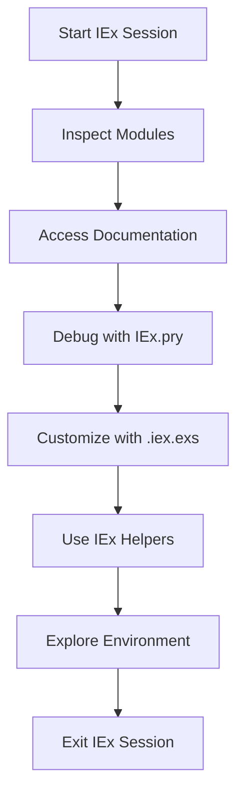

## 3.12. Effective Use of IEx (Interactive Shell)

The Interactive Elixir (IEx) shell is a powerful tool that allows developers to interact with their Elixir code in real-time. It is an indispensable resource for exploring code, debugging, and customizing the development environment. In this section, we will delve into the various capabilities of IEx, providing expert insights and techniques to maximize its potential.

### Exploring Code in IEx

The IEx shell is not just a REPL (Read-Eval-Print Loop); it is a gateway to understanding and interacting with your Elixir codebase. Let's explore how you can effectively use IEx to inspect modules, functions, and documentation.

#### Inspecting Modules and Functions

IEx provides several commands to inspect the modules and functions within your Elixir application. Here are some essential commands:

- **`h/1`**: Access the documentation for a module or function.
- **`i/1`**: Retrieve information about a particular data type or variable.
- **`b/1`**: List the functions available in a module.
- **`r/1`**: Recompile and reload a module.

**Example: Inspecting a Module**

```elixir
# Start the IEx shell
iex -S mix

# Inspect the Enum module
iex> h Enum

# View functions in the Enum module
iex> b Enum

# Get information about a specific function
iex> h Enum.map
```

These commands provide a quick way to explore the capabilities of Elixir's standard library or any custom modules you've created.

#### Accessing Documentation

Elixir's documentation is embedded within the code, making it easily accessible through IEx. Use the `h/1` command to read the documentation for any module or function. This feature is particularly useful when working with unfamiliar libraries or APIs.

**Example: Accessing Function Documentation**

```elixir
# Access documentation for String.split/2
iex> h String.split

# Access documentation for a custom function
iex> h MyModule.my_function
```

### Debugging with IEx

Debugging is an essential part of software development, and IEx offers powerful tools to assist in this process. One of the standout features is `IEx.pry`, which allows you to pause execution and inspect the state of your application interactively.

#### Using `IEx.pry` for Interactive Debugging

`IEx.pry` is a powerful debugging tool that lets you pause the execution of your program and enter an interactive session. This is particularly useful for inspecting variables, testing hypotheses, and understanding the flow of your application.

**Example: Using `IEx.pry`**

```elixir
defmodule MyModule do
  def my_function(x) do
    require IEx; IEx.pry()
    x * 2
  end
end

# Run the function and trigger the pry session
iex> MyModule.my_function(5)
```

When the code execution reaches `IEx.pry`, it will pause, and you'll be able to inspect the current state, evaluate expressions, and modify variables in real-time.

#### Debugging Tips

- **Set Breakpoints**: Use `IEx.pry` strategically to set breakpoints in your code.
- **Inspect Variables**: Use `i/1` to inspect the state of variables during a debugging session.
- **Test Assumptions**: Evaluate expressions to test assumptions about your code's behavior.

### Customization

IEx can be customized to suit your development needs. By configuring IEx with a `.iex.exs` file, you can set up aliases, import modules, and define helper functions that streamline your workflow.

#### Configuring IEx with `.iex.exs`

The `.iex.exs` file is executed every time you start an IEx session. This file can be used to configure your environment, load necessary modules, and define utility functions.

**Example: Customizing IEx with `.iex.exs`**

```elixir
# Create a .iex.exs file in your project root

# Import frequently used modules
import Ecto.Query

# Define a helper function
defmodule Helpers do
  def greet(name) do
    IO.puts("Hello, #{name}!")
  end
end

# Alias a module for convenience
alias MyApp.Repo
```

With this setup, every time you start IEx, you'll have access to the imported modules, defined functions, and aliases, improving your productivity.

### Advanced IEx Techniques

As an expert Elixir developer, you can leverage advanced IEx techniques to further enhance your development workflow.

#### Using IEx Helpers

IEx comes with a set of built-in helpers that can be used to perform common tasks. These helpers can be accessed by typing `h()` in the IEx shell.

**Example: Using IEx Helpers**

```elixir
# List all available helpers
iex> h()

# Use the `c/2` helper to compile a file
iex> c("path/to/file.ex")

# Use the `l/1` helper to load a module
iex> l MyModule
```

These helpers provide a convenient way to perform tasks such as compiling files, loading modules, and more.

#### Exploring the IEx Session Environment

The IEx session environment can be explored and customized using various commands and techniques.

**Example: Exploring the Environment**

```elixir
# List all variables in the current session
iex> binding()

# Clear the console
iex> clear()

# Exit the IEx session
iex> exit()
```

These commands allow you to manage your IEx session effectively, providing a clean and organized environment for development.

### Visualizing IEx Workflow

To better understand the workflow of using IEx, let's visualize the process of exploring code, debugging, and customizing the environment.


```mermaid
flowchart TD
    A[Start IEx Session] --> B[Inspect Modules]
    B --> C[Access Documentation]
    C --> D[Debug with IEx.pry]
    D --> E[Customize with .iex.exs]
    E --> F[Use IEx Helpers]
    F --> G[Explore Environment]
    G --> H[Exit IEx Session]
```

**Diagram Description:** This flowchart illustrates the typical workflow of using IEx, starting from initiating a session to exploring modules, accessing documentation, debugging, customizing, using helpers, and finally exiting the session.

### Try It Yourself

To solidify your understanding of IEx, try the following exercises:

1. **Explore a Module**: Use IEx to explore a module from Elixir's standard library, such as `Enum` or `String`. Access the documentation and list available functions.

2. **Debug a Function**: Insert `IEx.pry` into a function within your codebase. Run the function and interact with the paused session to inspect variables and test expressions.

3. **Customize IEx**: Create a `.iex.exs` file in your project and configure it to import a module, define a helper function, and set an alias. Start IEx and verify that your customizations are applied.

### References and Links

- [Elixir IEx Documentation](https://hexdocs.pm/iex/IEx.html)
- [Debugging with IEx.pry](https://elixir-lang.org/getting-started/debugging.html)
- [Customizing IEx with .iex.exs](https://elixir-lang.org/getting-started/mix-otp/introduction-to-mix.html#the-iex-exs-file)

### Knowledge Check

- What command is used to access documentation for a module in IEx?
- How can you pause the execution of a program and enter an interactive session in IEx?
- Describe how you can customize your IEx environment using a `.iex.exs` file.

### Key Takeaways

- **IEx is a powerful tool** for exploring, debugging, and customizing your Elixir development environment.
- **Use `IEx.pry` for interactive debugging** to pause execution and inspect your application's state.
- **Customize IEx with `.iex.exs`** to streamline your workflow and improve productivity.

### Embrace the Journey

Remember, mastering IEx is just the beginning of your journey with Elixir. As you continue to explore and experiment, you'll discover new ways to leverage the power of the interactive shell to enhance your development process. Stay curious, keep learning, and enjoy the journey!

## Quiz Time!



### What command is used to access documentation for a module in IEx?

- [x] `h/1`
- [ ] `i/1`
- [ ] `b/1`
- [ ] `r/1`

> **Explanation:** The `h/1` command is used to access documentation for a module or function in IEx.

### How can you pause the execution of a program and enter an interactive session in IEx?

- [x] `IEx.pry`
- [ ] `IEx.break`
- [ ] `IEx.pause`
- [ ] `IEx.debug`

> **Explanation:** `IEx.pry` is used to pause the execution of a program and enter an interactive session in IEx.

### What file is used to customize the IEx environment?

- [x] `.iex.exs`
- [ ] `iex.config`
- [ ] `iex_settings.exs`
- [ ] `custom.iex`

> **Explanation:** The `.iex.exs` file is used to customize the IEx environment.

### What command is used to list functions available in a module?

- [x] `b/1`
- [ ] `h/1`
- [ ] `i/1`
- [ ] `r/1`

> **Explanation:** The `b/1` command is used to list functions available in a module in IEx.

### Which command allows you to recompile and reload a module?

- [x] `r/1`
- [ ] `c/2`
- [ ] `l/1`
- [ ] `b/1`

> **Explanation:** The `r/1` command allows you to recompile and reload a module in IEx.

### How can you clear the console in IEx?

- [x] `clear()`
- [ ] `reset()`
- [ ] `cls()`
- [ ] `wipe()`

> **Explanation:** The `clear()` command is used to clear the console in IEx.

### What command is used to load a module in IEx?

- [x] `l/1`
- [ ] `c/2`
- [ ] `r/1`
- [ ] `b/1`

> **Explanation:** The `l/1` command is used to load a module in IEx.

### How can you list all variables in the current IEx session?

- [x] `binding()`
- [ ] `vars()`
- [ ] `list_vars()`
- [ ] `show_vars()`

> **Explanation:** The `binding()` command is used to list all variables in the current IEx session.

### True or False: The `.iex.exs` file is executed every time you start an IEx session.

- [x] True
- [ ] False

> **Explanation:** The `.iex.exs` file is executed every time you start an IEx session, allowing you to customize the environment.

### What is the primary purpose of IEx in Elixir development?

- [x] To interact with Elixir code in real-time
- [ ] To compile Elixir code
- [ ] To deploy Elixir applications
- [ ] To manage Elixir dependencies

> **Explanation:** The primary purpose of IEx is to interact with Elixir code in real-time, providing a powerful tool for exploration and debugging.




