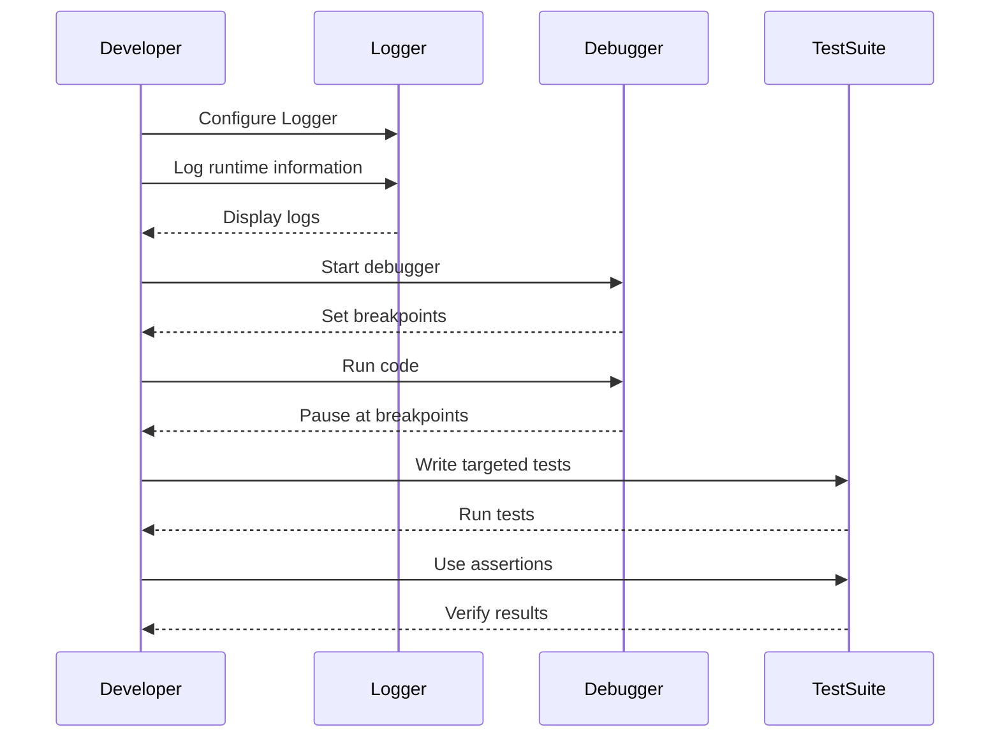

## 3.13. Debugging Techniques

Debugging is an essential skill for any software engineer, and in the world of Elixir, it becomes even more crucial due to the language's concurrent and distributed nature. In this section, we will delve into advanced debugging techniques that will empower you to efficiently identify and resolve issues in your Elixir applications. We will cover logging with the Logger module, breakpoint debugging using Erlang tools, and common strategies for isolating issues.

### Logging

Logging is a fundamental debugging technique that allows developers to capture runtime information about an application. Elixir provides a powerful logging library, the Logger module, which is part of the standard library.

#### Using the Logger Module

The Logger module is designed to be lightweight and flexible, making it easy to integrate into your applications. It supports different log levels, such as `:debug`, `:info`, `:warn`, and `:error`, allowing you to filter messages based on their severity.

```elixir
defmodule MyApp do
  require Logger

  def start do
    Logger.info("Application started")
    Logger.debug("Debugging information")
    Logger.warn("Warning: potential issue detected")
    Logger.error("Error: something went wrong")
  end
end
```

**Key Features of Logger:**

- **Configurable Backends:** Logger supports multiple backends, allowing you to direct log messages to different destinations, such as the console, files, or external systems.
- **Metadata:** You can attach metadata to log messages, providing additional context that can be useful for debugging.
- **Formatters:** Customize the format of log messages to suit your needs.

#### Configuring Logger

Logger can be configured through the `config/config.exs` file. Here’s an example configuration:

```elixir
config :logger,
  level: :info,
  backends: [:console],
  format: "$time $metadata[$level] $message\n",
  metadata: [:request_id]
```

**Explanation:**

- **Level:** Sets the minimum log level. Messages below this level will be ignored.
- **Backends:** Specifies where log messages should be sent.
- **Format:** Defines the format of log messages.
- **Metadata:** Lists the metadata fields to include in log messages.

#### Advanced Logging Techniques

- **Dynamic Log Levels:** Adjust log levels at runtime to increase or decrease verbosity without restarting the application.
- **Custom Backends:** Implement custom backends to send log messages to specific destinations, such as a remote logging service.
- **Structured Logging:** Use JSON or other structured formats for log messages to facilitate parsing and analysis.

### Breakpoint Debugging

Breakpoint debugging allows you to pause the execution of your program and inspect its state. Elixir, being built on the Erlang VM, can leverage Erlang's debugging tools for this purpose.

#### Integrating with Erlang Tools

Erlang provides several tools for debugging, including `:debugger`, `:observer`, and `:recon`. These tools can be used to set breakpoints, inspect processes, and analyze system performance.

##### Using :debugger

The `:debugger` module allows you to set breakpoints and step through your code. Here’s how to use it:

1. **Start the Debugger:**

   ```elixir
   :debugger.start()
   ```

2. **Attach to a Process:**

   Use the `:int` module to attach the debugger to a specific process:

   ```elixir
   :int.ni(MyModule)
   :int.break(MyModule, 10) # Set a breakpoint at line 10
   ```

3. **Run Your Code:**

   Execute your code, and the debugger will pause execution at the specified breakpoints.

##### Using :observer

The `:observer` tool provides a graphical interface for monitoring and debugging Erlang and Elixir applications. It allows you to inspect processes, memory usage, and system performance.

To start the observer, run:

```elixir
:observer.start()
```

**Features of :observer:**

- **Process List:** View all running processes and their states.
- **Application Tree:** Visualize the supervision tree of your application.
- **System Information:** Monitor CPU and memory usage.

#### Advanced Breakpoint Debugging Techniques

- **Conditional Breakpoints:** Set breakpoints that trigger only when specific conditions are met.
- **Tracing:** Use tracing to monitor function calls and message passing between processes.

### Common Debugging Strategies

Debugging complex systems requires a strategic approach. Here are some common strategies to help you isolate and resolve issues in your Elixir applications.

#### Isolating Issues with Targeted Tests and Assertions

Testing is a powerful tool for debugging. By writing targeted tests, you can isolate specific parts of your code and verify their behavior.

##### Writing Targeted Tests

Focus on writing tests for the smallest units of code, such as individual functions or modules. Use Elixir's `ExUnit` framework to create and run tests.

```elixir
defmodule MyModuleTest do
  use ExUnit.Case

  test "my_function returns the correct result" do
    assert MyModule.my_function(1) == 2
  end
end
```

##### Using Assertions

Assertions are conditions that must be true for a test to pass. Use assertions to verify the expected behavior of your code.

```elixir
assert value == expected_value
```

#### Debugging Concurrency Issues

Elixir's concurrency model can introduce unique challenges. Here are some techniques for debugging concurrency issues:

- **Process Inspection:** Use tools like `:observer` to inspect running processes and their states.
- **Message Tracing:** Trace messages between processes to identify communication issues.
- **Race Condition Detection:** Look for race conditions by running tests with different scheduling and timing configurations.

#### Debugging Distributed Systems

Elixir's distributed nature can complicate debugging. Here are some strategies for debugging distributed systems:

- **Node Monitoring:** Monitor the health and performance of individual nodes in your system.
- **Network Tracing:** Trace network communication between nodes to identify issues.
- **Fault Injection:** Simulate failures to test the resilience of your system.

### Visualizing Debugging Techniques

To better understand the flow of debugging techniques, let's visualize the process using a sequence diagram.



**Diagram Explanation:**

- **Logger:** The developer configures the Logger and logs runtime information, which is then displayed.
- **Debugger:** The developer starts the debugger, sets breakpoints, and runs the code. The debugger pauses execution at the breakpoints.
- **TestSuite:** The developer writes targeted tests and uses assertions to verify results.

### References and Links

For further reading on Elixir debugging techniques, consider the following resources:

- [Elixir Logger Documentation](https://hexdocs.pm/logger/Logger.html)
- [Erlang Debugger Documentation](https://erlang.org/doc/man/debugger.html)
- [Observer Documentation](https://erlang.org/doc/man/observer.html)
- [ExUnit Testing Framework](https://hexdocs.pm/ex_unit/ExUnit.html)

### Knowledge Check

To reinforce your understanding of debugging techniques in Elixir, consider the following questions:

1. What are the benefits of using the Logger module for debugging?
2. How can you set a breakpoint in an Elixir application using Erlang tools?
3. What strategies can you use to debug concurrency issues in Elixir?
4. How can targeted tests help isolate issues in your code?
5. What tools are available for monitoring distributed Elixir systems?

### Embrace the Journey

Remember, debugging is an iterative process that requires patience and persistence. As you become more familiar with Elixir's debugging tools and techniques, you'll gain confidence in your ability to identify and resolve issues. Keep experimenting, stay curious, and enjoy the journey!

### Quiz: Debugging Techniques



### What is the primary purpose of the Logger module in Elixir?

- [x] To capture runtime information about an application
- [ ] To compile Elixir code
- [ ] To manage application dependencies
- [ ] To deploy applications to production

> **Explanation:** The Logger module is used to capture runtime information, which is essential for debugging and monitoring applications.

### How can you start the Erlang debugger in an Elixir application?

- [x] :debugger.start()
- [ ] :logger.start()
- [ ] :observer.start()
- [ ] :int.start()

> **Explanation:** The `:debugger.start()` command is used to initiate the Erlang debugger in an Elixir application.

### What is a key feature of the :observer tool?

- [x] It provides a graphical interface for monitoring processes and system performance.
- [ ] It compiles Elixir code.
- [ ] It manages application dependencies.
- [ ] It deploys applications to production.

> **Explanation:** The `:observer` tool offers a graphical interface for monitoring processes, memory usage, and system performance.

### What is the benefit of using targeted tests in debugging?

- [x] They help isolate specific parts of the code and verify their behavior.
- [ ] They automatically fix bugs in the code.
- [ ] They compile the code faster.
- [ ] They deploy the application to production.

> **Explanation:** Targeted tests focus on specific parts of the code, making it easier to isolate and verify their behavior.

### Which of the following is a strategy for debugging concurrency issues?

- [x] Process inspection
- [ ] Code compilation
- [ ] Dependency management
- [ ] Application deployment

> **Explanation:** Process inspection is a strategy used to debug concurrency issues by examining the state and behavior of processes.

### What is the purpose of setting breakpoints in a debugger?

- [x] To pause execution and inspect the program's state
- [ ] To compile the code
- [ ] To manage dependencies
- [ ] To deploy the application

> **Explanation:** Breakpoints allow developers to pause execution and inspect the program's state, which is crucial for debugging.

### How can you configure the Logger module in Elixir?

- [x] Through the config/config.exs file
- [ ] By writing custom Elixir scripts
- [ ] By using the :observer tool
- [ ] By deploying the application

> **Explanation:** The Logger module is configured through the `config/config.exs` file, where you can set log levels, backends, and formats.

### What is a common use case for structured logging?

- [x] To facilitate parsing and analysis of log messages
- [ ] To compile Elixir code
- [ ] To manage application dependencies
- [ ] To deploy applications to production

> **Explanation:** Structured logging uses formats like JSON to make log messages easier to parse and analyze.

### What is the role of assertions in testing?

- [x] To verify the expected behavior of code
- [ ] To compile Elixir code
- [ ] To manage application dependencies
- [ ] To deploy applications to production

> **Explanation:** Assertions are used in tests to verify that the code behaves as expected.

### True or False: The :observer tool can be used to inspect memory usage in an Elixir application.

- [x] True
- [ ] False

> **Explanation:** The `:observer` tool provides insights into memory usage, process states, and system performance in Elixir applications.


