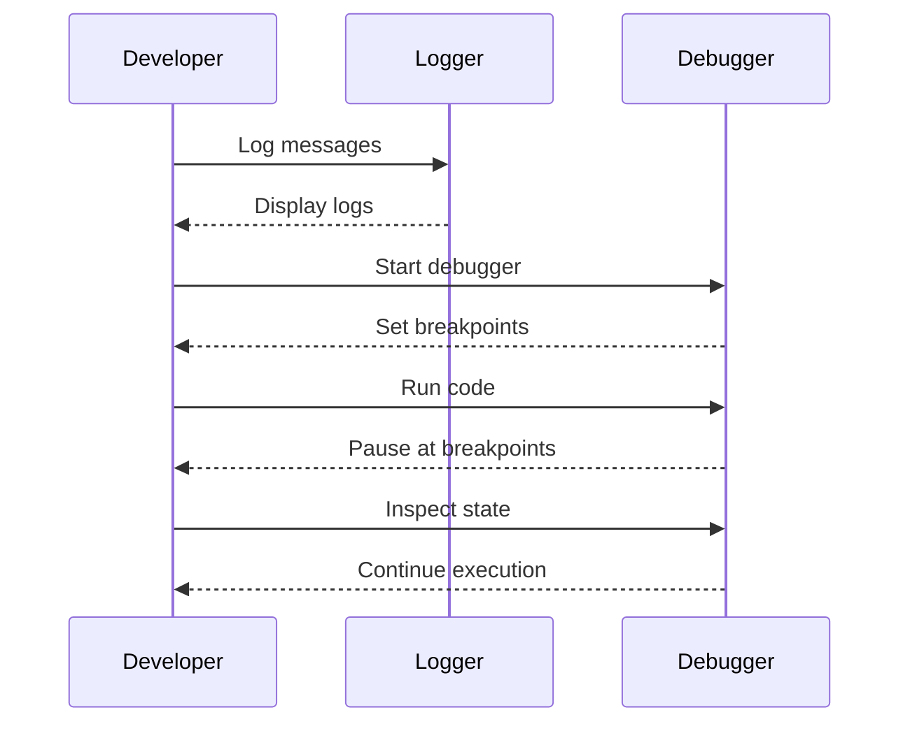

## 3.13. Debugging Techniques

Debugging is an essential skill for any software engineer, especially when working with complex systems like those built in Elixir. In this section, we will explore advanced debugging techniques that leverage Elixir's unique features and the powerful tools available within its ecosystem. We'll cover three primary areas: using the Logger module, integrating with Erlang tools for breakpoint debugging, and employing common debugging strategies to isolate and resolve issues.

### Logging

Logging is a fundamental part of debugging and monitoring applications. In Elixir, the Logger module provides a robust and flexible system for capturing runtime information.

#### Using the Logger Module

The Logger module in Elixir is designed to be simple yet powerful. It allows developers to log messages at various levels (debug, info, warn, error) and configure how these messages are handled.

```elixir
require Logger

defmodule MyApp do
  def start do
    Logger.info("Application started")
    Logger.debug("Debugging information")
    Logger.warn("Warning message")
    Logger.error("Error occurred")
  end
end
```

**Key Features of Logger:**

- **Log Levels:** Control the verbosity of your logs by setting the appropriate level. By default, Logger logs messages at the `:info` level and above.
- **Backends:** Logger supports multiple backends, allowing you to direct logs to different destinations, such as the console, files, or external systems.
- **Metadata:** Attach metadata to log messages for better context and filtering.

#### Configuring Logger

You can configure Logger in your application's `config/config.exs` file. For example, to change the log level and format:

```elixir
config :logger, :console,
  level: :debug,
  format: "$time $metadata[$level] $message\n",
  metadata: [:user_id]
```

This configuration sets the log level to `:debug` and includes metadata such as `:user_id` in the log output.

#### Best Practices for Logging

- **Log Meaningful Information:** Ensure that logs provide valuable insights into the application's behavior. Avoid logging sensitive information.
- **Use Metadata Wisely:** Attach relevant metadata to log messages to make them more informative and easier to filter.
- **Monitor Log Volume:** Be mindful of the volume of logs generated, especially in production environments, to avoid performance issues and excessive storage costs.

### Breakpoint Debugging

Breakpoint debugging allows you to pause the execution of your program and inspect its state. Elixir, being built on the Erlang VM, can leverage Erlang's powerful debugging tools.

#### Integrating with Erlang Tools

Erlang's `:debugger` module provides a graphical interface for setting breakpoints and stepping through code. To use it with Elixir, you need to start the debugger and load your Elixir modules.

```elixir
:debugger.start()
:int.ni(MyApp)
:int.break(MyApp, 10) # Set a breakpoint at line 10
```

**Steps for Breakpoint Debugging:**

1. **Start the Debugger:** Use `:debugger.start()` to launch the graphical debugger.
2. **Load Modules:** Use `:int.ni(ModuleName)` to load the module you want to debug.
3. **Set Breakpoints:** Use `:int.break(ModuleName, LineNumber)` to set breakpoints at specific lines.
4. **Run Your Code:** Execute your code as usual. The debugger will pause execution at breakpoints, allowing you to inspect variables and step through the code.

#### Using Observer for Debugging

The Observer tool provides a graphical interface for monitoring and debugging Erlang and Elixir applications. It allows you to inspect processes, view system statistics, and analyze application performance.

```elixir
:observer.start()
```

**Features of Observer:**

- **Process Inspection:** View details about running processes, including their state and message queues.
- **System Monitoring:** Monitor CPU, memory, and I/O statistics.
- **Application Analysis:** Analyze application performance and identify bottlenecks.

### Common Debugging Strategies

In addition to logging and breakpoint debugging, employing effective strategies can help isolate and resolve issues in your code.

#### Isolating Issues with Targeted Tests

Testing is a powerful tool for debugging. By writing targeted tests, you can isolate specific parts of your code and verify their behavior.

```elixir
defmodule MyAppTest do
  use ExUnit.Case

  test "function returns expected result" do
    assert MyApp.some_function() == :expected_result
  end
end
```

**Tips for Effective Testing:**

- **Write Unit Tests:** Focus on testing individual functions or modules in isolation.
- **Use Assertions:** Verify that your code produces the expected results using assertions.
- **Test Edge Cases:** Consider edge cases and potential failure scenarios in your tests.

#### Using Assertions and Guards

Assertions and guards can help catch errors early by enforcing conditions in your code.

```elixir
defmodule MyApp do
  def safe_divide(a, b) when b != 0 do
    a / b
  end

  def safe_divide(_, 0) do
    raise ArgumentError, "division by zero"
  end
end
```

**Benefits of Assertions and Guards:**

- **Error Prevention:** Catch errors early by enforcing preconditions and invariants.
- **Code Clarity:** Improve code readability by clearly specifying expected conditions.

#### Debugging with IEx

The Interactive Elixir (IEx) shell is a powerful tool for exploring and debugging Elixir code.

```elixir
iex> c("my_app.ex")
iex> MyApp.start()
```

**Features of IEx:**

- **Interactive Exploration:** Execute Elixir code interactively and inspect results.
- **Code Reloading:** Reload modules without restarting the shell using `r(ModuleName)`.
- **Breakpoints:** Use `IEx.break!` to set breakpoints in your code.

### Visualizing Debugging Techniques

To better understand the flow of debugging techniques in Elixir, let's use a sequence diagram to illustrate the process of using the Logger module and breakpoint debugging.


```mermaid
sequenceDiagram
    participant Developer
    participant Logger
    participant Debugger
    Developer->>Logger: Log messages
    Logger-->>Developer: Display logs
    Developer->>Debugger: Start debugger
    Debugger-->>Developer: Set breakpoints
    Developer->>Debugger: Run code
    Debugger-->>Developer: Pause at breakpoints
    Developer->>Debugger: Inspect state
    Debugger-->>Developer: Continue execution
```

**Diagram Description:** This sequence diagram illustrates the interaction between the developer, the Logger module, and the debugger during the debugging process. The developer logs messages, starts the debugger, sets breakpoints, and inspects the program state at breakpoints.

### Try It Yourself

To reinforce your understanding of these debugging techniques, try the following exercises:

1. **Experiment with Logger:** Modify the log level and format in your application. Add metadata to log messages and observe the output.
2. **Set Breakpoints:** Use the Erlang debugger to set breakpoints in your Elixir code. Step through the code and inspect variables.
3. **Write Targeted Tests:** Identify a function in your code that needs debugging. Write unit tests to verify its behavior and isolate issues.

### References and Further Reading

- [Elixir Logger Documentation](https://hexdocs.pm/logger/Logger.html)
- [Erlang Debugger Documentation](http://erlang.org/doc/man/debugger.html)
- [Observer Tool Documentation](http://erlang.org/doc/apps/observer/observer.pdf)

### Knowledge Check

To test your understanding of Elixir debugging techniques, consider the following questions and challenges:

- How can you configure the Logger module to include metadata in log messages?
- What steps are involved in setting a breakpoint using the Erlang debugger?
- How can targeted tests help isolate issues in your code?
- What are the benefits of using assertions and guards in your code?

### Embrace the Journey

Remember, debugging is an iterative process that requires patience and persistence. As you practice these techniques, you'll become more proficient at identifying and resolving issues in your Elixir applications. Keep experimenting, stay curious, and enjoy the journey!

## Quiz Time!



### What is the default log level for the Logger module in Elixir?

- [ ] :debug
- [x] :info
- [ ] :warn
- [ ] :error

> **Explanation:** By default, the Logger module logs messages at the `:info` level and above.

### Which tool provides a graphical interface for debugging Erlang and Elixir applications?

- [ ] IEx
- [x] Observer
- [ ] Mix
- [ ] ExUnit

> **Explanation:** The Observer tool provides a graphical interface for monitoring and debugging Erlang and Elixir applications.

### How can you set a breakpoint at a specific line in your Elixir code using the Erlang debugger?

- [ ] Use `IEx.break!`
- [ ] Use `Logger.debug`
- [x] Use `:int.break(ModuleName, LineNumber)`
- [ ] Use `:observer.start`

> **Explanation:** The `:int.break(ModuleName, LineNumber)` function is used to set breakpoints at specific lines in your code with the Erlang debugger.

### What is one advantage of using assertions in your Elixir code?

- [x] They help catch errors early by enforcing conditions.
- [ ] They improve code performance.
- [ ] They automatically fix bugs.
- [ ] They replace the need for tests.

> **Explanation:** Assertions help catch errors early by enforcing conditions and ensuring that certain preconditions are met in your code.

### Which of the following is a feature of the IEx shell?

- [x] Interactive exploration of Elixir code
- [ ] Automatic code optimization
- [ ] Graphical debugging interface
- [ ] Built-in deployment tools

> **Explanation:** The IEx shell allows for interactive exploration of Elixir code, enabling developers to execute code and inspect results in real-time.

### What is the purpose of attaching metadata to log messages?

- [ ] To increase log verbosity
- [x] To provide additional context and filtering options
- [ ] To reduce log file size
- [ ] To enhance performance

> **Explanation:** Attaching metadata to log messages provides additional context and makes it easier to filter and analyze logs.

### How can you reload a module in IEx without restarting the shell?

- [ ] Use `Logger.info`
- [x] Use `r(ModuleName)`
- [ ] Use `:observer.start`
- [ ] Use `:int.ni(ModuleName)`

> **Explanation:** The `r(ModuleName)` command in IEx allows you to reload a module without restarting the shell.

### What is one benefit of using the Observer tool for debugging?

- [x] It allows you to inspect processes and view system statistics.
- [ ] It automatically fixes bugs in your code.
- [ ] It provides real-time code optimization.
- [ ] It replaces the need for tests.

> **Explanation:** The Observer tool allows you to inspect processes, view system statistics, and analyze application performance, making it a valuable tool for debugging.

### Which of the following is a common debugging strategy in Elixir?

- [ ] Avoiding tests
- [x] Writing targeted tests to isolate issues
- [ ] Using macros for debugging
- [ ] Disabling logging

> **Explanation:** Writing targeted tests helps isolate specific parts of your code and verify their behavior, making it a common debugging strategy.

### True or False: The Logger module in Elixir can only log messages to the console.

- [ ] True
- [x] False

> **Explanation:** The Logger module supports multiple backends, allowing you to direct logs to different destinations, such as the console, files, or external systems.


