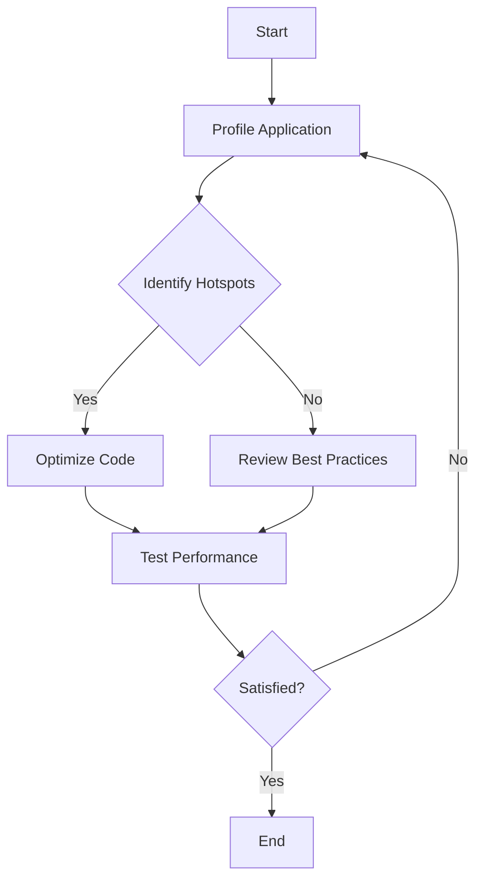

## 3.14. Performance Optimization Tips

Performance optimization is a crucial aspect of software development, especially when building scalable and efficient systems with Elixir. In this section, we will delve into various techniques and tools that can help you optimize your Elixir applications. We will cover profiling tools, code optimization strategies, and best practices to ensure your applications run smoothly and efficiently.

### Profiling Tools

Profiling is the first step in performance optimization. It involves analyzing your application to identify bottlenecks and areas that require improvement. Elixir offers several powerful tools for profiling:

#### 1. `:fprof`

`:fprof` is a built-in Erlang tool that provides detailed function call profiling. It is useful for identifying which functions consume the most time and resources.

```elixir
# Example of using :fprof to profile a function
:fprof.start()
:fprof.trace([:start, {:procs, self()}])
# Call the function you want to profile
result = MyModule.my_function()
:fprof.trace(:stop)
:fprof.analyse([:totals, :details, :caller])
```

- **Key Points**: 
  - Start the profiler with `:fprof.start()`.
  - Use `:fprof.trace/1` to begin tracing specific processes.
  - Analyze the results with `:fprof.analyse/1`.

#### 2. `:eprof`

`:eprof` is another Erlang profiling tool that provides time profiling for processes. It is less detailed than `:fprof` but easier to use for quick checks.

```elixir
# Example of using :eprof
:eprof.start()
:eprof.profile(MyModule, :my_function, [arg1, arg2])
:eprof.stop()
:eprof.analyse()
```

- **Key Points**:
  - Use `:eprof.start()` to initialize the profiler.
  - Profile specific functions with `:eprof.profile/3`.
  - Analyze the results with `:eprof.analyse()`.

#### 3. `:observer`

`:observer` is a graphical tool that provides a real-time view of your application's performance. It is excellent for monitoring system metrics and process information.

```elixir
# Start the observer tool
:observer.start()
```

- **Key Points**:
  - Provides a GUI for monitoring system performance.
  - Useful for real-time analysis and debugging.

### Code Optimization

Once you have identified performance bottlenecks using profiling tools, the next step is to optimize your code. Here are some strategies to consider:

#### Identifying Hotspots

Hotspots are sections of code that consume a disproportionate amount of resources. Use profiling tools to pinpoint these areas and focus your optimization efforts there.

- **Example**: If a specific function is taking too long to execute, consider optimizing its algorithm or logic.

#### Efficient Algorithms

Choosing the right algorithm can significantly impact performance. Ensure that you are using the most efficient algorithms for your use case.

- **Example**: Use binary search instead of linear search for sorted data.

#### Avoiding Unnecessary Computations

Minimize redundant calculations by caching results or using memoization techniques.

```elixir
# Example of memoization
defmodule Fibonacci do
  def fib(n), do: fib(n, %{})

  defp fib(0, _), do: 0
  defp fib(1, _), do: 1
  defp fib(n, cache) do
    case Map.get(cache, n) do
      nil ->
        result = fib(n - 1, cache) + fib(n - 2, cache)
        {result, Map.put(cache, n, result)}
      cached_result ->
        {cached_result, cache}
    end
  end
end
```

- **Key Points**:
  - Use caching to store results of expensive computations.
  - Avoid recalculating values that have already been computed.

### Best Practices

Adhering to best practices can help you write efficient and maintainable Elixir code. Here are some tips:

#### Writing Efficient Pattern Matches

Pattern matching is a powerful feature in Elixir, but it can be inefficient if not used correctly. Ensure that your pattern matches are as specific as possible to avoid unnecessary computations.

```elixir
# Example of efficient pattern matching
defmodule Example do
  def process_list([]), do: :empty
  def process_list([head | tail]) when is_integer(head), do: :integer_list
  def process_list([_ | _]), do: :other_list
end
```

- **Key Points**:
  - Use guards to refine pattern matches.
  - Avoid overly complex pattern matches that can slow down execution.

#### Avoiding Unnecessary Processes

While Elixir's concurrency model encourages the use of processes, creating too many processes can lead to overhead. Use processes judiciously and only when necessary.

- **Example**: Instead of spawning a new process for every small task, consider batching tasks together.

#### Leveraging Elixir's Built-in Functions

Elixir provides a rich set of built-in functions that are optimized for performance. Use these functions whenever possible instead of implementing your own versions.

```elixir
# Example of using built-in functions
Enum.map([1, 2, 3], &(&1 * 2))
```

- **Key Points**:
  - Built-in functions are often more efficient than custom implementations.
  - Familiarize yourself with Elixir's standard library to take advantage of these functions.

### Visualizing Performance Optimization

To better understand the impact of performance optimization, let's visualize the process using a flowchart. This diagram illustrates the steps involved in profiling and optimizing an Elixir application.



**Diagram Description**: This flowchart represents the iterative process of profiling, identifying hotspots, optimizing code, and testing performance until the desired efficiency is achieved.

### Try It Yourself

To solidify your understanding of performance optimization in Elixir, try modifying the code examples provided. Experiment with different profiling tools and optimization techniques to see how they affect performance. Consider creating your own functions and profiling them to identify potential improvements.

### References and Links

- [Elixir Official Documentation](https://elixir-lang.org/docs.html)
- [Erlang Profiling Tools](http://erlang.org/doc/man/fprof.html)
- [Observer Tool](http://erlang.org/doc/man/observer.html)

### Knowledge Check

- What are the key differences between `:fprof` and `:eprof`?
- How can memoization improve performance in Elixir?
- Why is it important to use specific pattern matches?

### Embrace the Journey

Remember, performance optimization is an ongoing process. As you continue to develop your Elixir applications, keep experimenting with different techniques and tools. Stay curious, and enjoy the journey of making your applications faster and more efficient!

## Quiz: Performance Optimization Tips



### What is the primary purpose of profiling tools in Elixir?

- [x] To identify performance bottlenecks
- [ ] To write new code
- [ ] To refactor code
- [ ] To deploy applications

> **Explanation:** Profiling tools are used to identify areas in the code that are consuming excessive resources, allowing developers to focus their optimization efforts effectively.

### Which tool provides a graphical interface for monitoring Elixir applications?

- [ ] :fprof
- [ ] :eprof
- [x] :observer
- [ ] :debugger

> **Explanation:** `:observer` is a graphical tool that provides real-time monitoring of system performance and process information.

### How can memoization improve performance?

- [x] By caching results of expensive computations
- [ ] By increasing code complexity
- [ ] By reducing code readability
- [ ] By creating more processes

> **Explanation:** Memoization stores the results of expensive function calls and returns the cached result when the same inputs occur again, reducing the need for repeated calculations.

### What is a hotspot in the context of performance optimization?

- [x] A section of code that consumes a disproportionate amount of resources
- [ ] A bug in the code
- [ ] A feature request
- [ ] A type of database

> **Explanation:** Hotspots are parts of the code that are resource-intensive and can significantly impact the overall performance of the application.

### Why should pattern matches be as specific as possible?

- [x] To avoid unnecessary computations
- [ ] To make the code longer
- [ ] To increase the number of processes
- [ ] To reduce readability

> **Explanation:** Specific pattern matches help the compiler optimize the code and reduce unnecessary computations, leading to better performance.

### What is a key benefit of using Elixir's built-in functions?

- [x] They are optimized for performance
- [ ] They are always faster than custom implementations
- [ ] They are easier to write
- [ ] They require less memory

> **Explanation:** Elixir's built-in functions are often optimized for performance and can be more efficient than custom implementations.

### What should you do if you identify a performance bottleneck?

- [x] Optimize the code in that area
- [ ] Ignore it
- [ ] Add more processes
- [ ] Rewrite the entire application

> **Explanation:** Once a bottleneck is identified, focus on optimizing the code in that specific area to improve performance.

### How can you avoid creating unnecessary processes?

- [x] By batching tasks together
- [ ] By spawning a process for every task
- [ ] By using more memory
- [ ] By writing longer code

> **Explanation:** Batching tasks together can reduce the overhead associated with creating too many processes, improving performance.

### What is the role of the `:fprof` tool?

- [x] To provide detailed function call profiling
- [ ] To monitor system metrics
- [ ] To debug code
- [ ] To deploy applications

> **Explanation:** `:fprof` provides detailed profiling of function calls, helping developers identify which functions consume the most resources.

### True or False: Profiling should only be done once during the development process.

- [ ] True
- [x] False

> **Explanation:** Profiling is an ongoing process that should be performed regularly to ensure that performance remains optimal as the application evolves.



By following these performance optimization tips and utilizing the tools and techniques discussed, you can enhance the efficiency of your Elixir applications and ensure they run smoothly in production environments.
