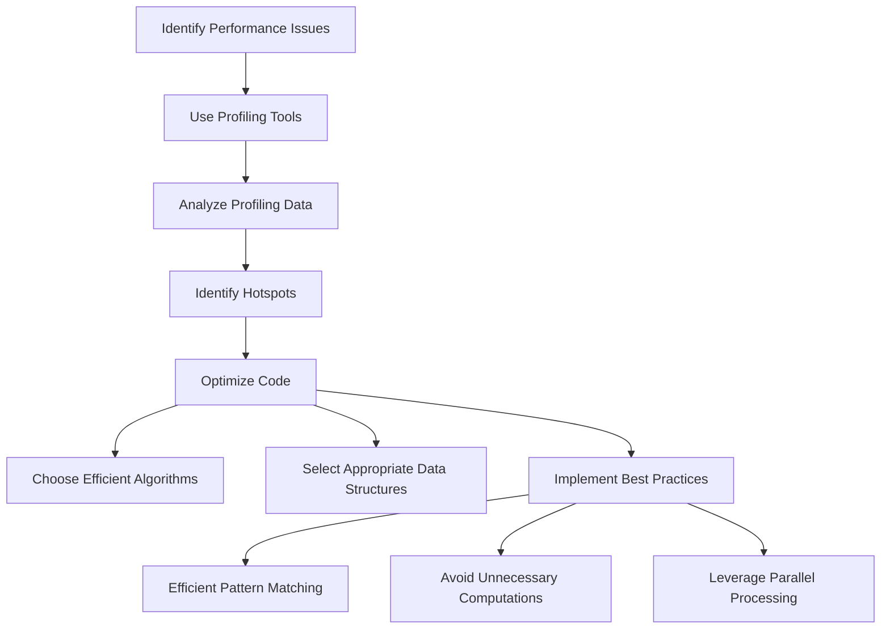

## 3.14. Performance Optimization Tips

In the world of software development, performance optimization is crucial, especially when building scalable and efficient applications. Elixir, a functional programming language built on the Erlang VM (BEAM), offers robust tools and techniques for optimizing performance. In this section, we will explore various strategies and best practices to enhance the performance of your Elixir applications.

### Profiling Tools

Profiling is the first step in performance optimization. It helps identify bottlenecks and inefficient code paths. Elixir provides several powerful profiling tools:

#### :fprof

`:fprof` is a profiling tool that provides detailed information about function calls and execution times. It is particularly useful for identifying slow functions and understanding how time is distributed across your application.

```elixir
# Example usage of :fprof
:fprof.start()
:fprof.trace([:start, {:procs, self()}])
# Run the code you want to profile
:fprof.trace(:stop)
:fprof.analyse()
```

- **Key Features**: Provides a comprehensive call graph, including the time spent in each function.
- **Use Case**: Ideal for detailed analysis of specific functions or modules.

#### :eprof

`:eprof` is another profiling tool that focuses on measuring the time spent in each process. It is less detailed than `:fprof` but provides a broader overview of process-level performance.

```elixir
# Example usage of :eprof
:eprof.start()
:eprof.profile(Process.list())
# Run the code you want to profile
:eprof.stop()
:eprof.analyse()
```

- **Key Features**: Offers a high-level view of process performance, making it easier to spot processes consuming excessive resources.
- **Use Case**: Suitable for applications with multiple concurrent processes.

#### :observer

`:observer` is a graphical tool that provides real-time insights into the performance of your Elixir application. It offers a variety of views, including process information, application supervision trees, and memory usage.

```elixir
# Start the observer
:observer.start()
```

- **Key Features**: Real-time monitoring, graphical interface, and comprehensive system information.
- **Use Case**: Ideal for monitoring live systems and diagnosing performance issues on the fly.

### Code Optimization

Once you have identified performance bottlenecks using profiling tools, the next step is to optimize your code. Here are some strategies to consider:

#### Identifying Hotspots

Hotspots are sections of code that consume a disproportionate amount of resources. Use profiling data to pinpoint these areas and focus your optimization efforts there.

- **Strategy**: Analyze call graphs and execution times to identify functions that are called frequently or have high execution times.

#### Efficient Algorithms

Choosing the right algorithm can have a significant impact on performance. Consider the complexity of your algorithms and opt for more efficient ones when possible.

- **Example**: Use tail-recursive functions to improve performance and avoid stack overflow in recursive calls.

```elixir
# Tail-recursive function example
defmodule Factorial do
  def calculate(n), do: calculate(n, 1)

  defp calculate(0, acc), do: acc
  defp calculate(n, acc), do: calculate(n - 1, n * acc)
end
```

- **Explanation**: Tail recursion allows the compiler to optimize recursive calls, reducing memory usage and improving performance.

#### Data Structures

Choosing the right data structures can also improve performance. Elixir offers a variety of data structures, each with its own performance characteristics.

- **Lists vs. Maps**: Use lists for ordered collections and maps for key-value pairs where fast lookup is required.

```elixir
# Example of using maps for fast lookup
users = %{"alice" => 25, "bob" => 30}
age = Map.get(users, "alice")
```

- **Explanation**: Maps provide O(1) average-time complexity for lookups, making them suitable for scenarios where fast access is needed.

### Best Practices

Adhering to best practices can help you write efficient and maintainable Elixir code. Here are some tips to consider:

#### Efficient Pattern Matching

Pattern matching is a powerful feature in Elixir, but it can also be a source of inefficiency if not used properly.

- **Tip**: Match on specific patterns first to reduce the number of comparisons.

```elixir
# Example of efficient pattern matching
defmodule Example do
  def process(:ok), do: "Success"
  def process(:error), do: "Failure"
end
```

- **Explanation**: By matching specific patterns first, you minimize the number of comparisons needed, improving performance.

#### Avoiding Unnecessary Computations

Eliminate redundant computations and calculations that do not contribute to the final result.

- **Tip**: Use memoization or caching to store results of expensive computations.

```elixir
# Example of memoization
defmodule Fibonacci do
  def calculate(n) when n < 2, do: n
  def calculate(n) do
    calculate(n - 1) + calculate(n - 2)
  end
end
```

- **Explanation**: Memoization stores the results of expensive function calls and returns the cached result when the same inputs occur again, reducing computation time.

#### Parallel Processing

Leverage Elixir's concurrency model to perform tasks in parallel, improving throughput and resource utilization.

- **Tip**: Use `Task` and `Task.async` for parallel execution of independent tasks.

```elixir
# Example of parallel processing with Task
defmodule ParallelExample do
  def run do
    task1 = Task.async(fn -> perform_task1() end)
    task2 = Task.async(fn -> perform_task2() end)

    Task.await(task1) + Task.await(task2)
  end

  defp perform_task1, do: # Task 1 logic
  defp perform_task2, do: # Task 2 logic
end
```

- **Explanation**: By executing tasks in parallel, you can take full advantage of multi-core processors, reducing overall execution time.

### Visualizing Performance Optimization

To better understand the flow of performance optimization in Elixir, let's visualize the process using a flowchart.


```mermaid
graph TD;
    A[Identify Performance Issues] --> B[Use Profiling Tools]
    B --> C[Analyze Profiling Data]
    C --> D[Identify Hotspots]
    D --> E[Optimize Code]
    E --> F[Choose Efficient Algorithms]
    E --> G[Select Appropriate Data Structures]
    E --> H[Implement Best Practices]
    H --> I[Efficient Pattern Matching]
    H --> J[Avoid Unnecessary Computations]
    H --> K[Leverage Parallel Processing]
```

This flowchart illustrates the steps involved in optimizing performance, from identifying issues to implementing best practices.

### References and Links

For further reading and deeper dives into performance optimization in Elixir, consider the following resources:

- [Elixir Lang Documentation](https://elixir-lang.org/docs.html)
- [Erlang Efficiency Guide](https://erlang.org/doc/efficiency_guide/introduction.html)
- [BEAM Performance Tips](https://www.erlang-solutions.com/blog/beam-performance-tips.html)

### Knowledge Check

To reinforce your understanding of performance optimization in Elixir, consider the following questions:

- What are the key differences between `:fprof` and `:eprof`?
- How can tail recursion improve the performance of recursive functions?
- Why is it important to choose the right data structure for your application?

### Embrace the Journey

Remember, performance optimization is an ongoing process. As you continue to develop your Elixir applications, keep experimenting with different techniques and tools. Stay curious, and enjoy the journey of mastering performance optimization in Elixir!

### Quiz Time!



### Which profiling tool provides a comprehensive call graph in Elixir?

- [x] :fprof
- [ ] :eprof
- [ ] :observer
- [ ] :exprof

> **Explanation:** `:fprof` provides a detailed call graph, making it ideal for analyzing function-level performance.

### What is the primary focus of :eprof?

- [ ] Function-level performance
- [x] Process-level performance
- [ ] Memory usage
- [ ] Real-time monitoring

> **Explanation:** `:eprof` focuses on measuring time spent in each process, providing a broader overview of process-level performance.

### How does tail recursion benefit recursive functions?

- [x] Reduces memory usage
- [ ] Increases execution time
- [ ] Improves readability
- [ ] Simplifies code

> **Explanation:** Tail recursion allows the compiler to optimize recursive calls, reducing memory usage and improving performance.

### Which data structure provides O(1) average-time complexity for lookups?

- [ ] Lists
- [x] Maps
- [ ] Tuples
- [ ] Sets

> **Explanation:** Maps provide O(1) average-time complexity for lookups, making them suitable for fast access scenarios.

### What is a key benefit of using Task.async for parallel processing?

- [x] Improved throughput
- [ ] Simplified code
- [ ] Reduced memory usage
- [ ] Enhanced readability

> **Explanation:** Task.async allows for parallel execution of tasks, improving throughput and resource utilization.

### What should you do first when optimizing performance in Elixir?

- [ ] Optimize code
- [ ] Choose efficient algorithms
- [x] Identify performance issues
- [ ] Implement best practices

> **Explanation:** Identifying performance issues is the first step in optimization, allowing you to focus efforts on problematic areas.

### What is a benefit of using memoization in Elixir?

- [x] Reduces computation time
- [ ] Increases memory usage
- [ ] Simplifies code
- [ ] Enhances readability

> **Explanation:** Memoization stores results of expensive computations, reducing computation time when the same inputs occur again.

### Which tool provides real-time insights into Elixir application performance?

- [ ] :fprof
- [ ] :eprof
- [x] :observer
- [ ] :exprof

> **Explanation:** `:observer` is a graphical tool that provides real-time insights into application performance.

### What is an example of efficient pattern matching?

- [ ] Matching on general patterns first
- [x] Matching on specific patterns first
- [ ] Using regular expressions
- [ ] Avoiding pattern matching

> **Explanation:** Matching on specific patterns first reduces the number of comparisons needed, improving performance.

### True or False: Profiling should be done after code optimization.

- [ ] True
- [x] False

> **Explanation:** Profiling should be done before code optimization to identify performance bottlenecks and focus optimization efforts.


