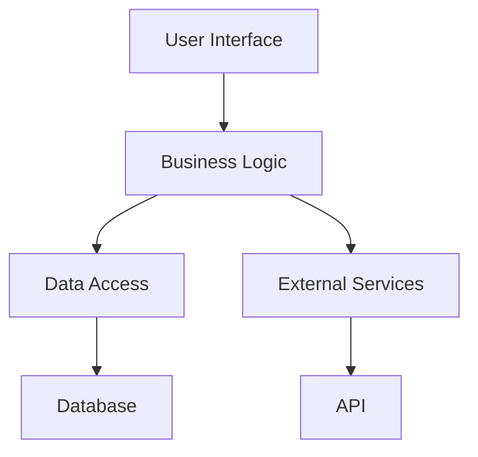

## 3.15. Best Practices in Code Organization

In the world of software development, the organization of code is paramount to creating systems that are maintainable, scalable, and easy to understand. This section delves into the best practices for organizing code in Elixir, focusing on three key principles: **Modular Design**, **Separation of Concerns**, and **Scalability**. By adhering to these principles, you can build robust applications that are easier to manage and extend over time.

### Modular Design

Modular design is the practice of dividing a software system into distinct, cohesive modules. Each module encapsulates a specific piece of functionality, making the system easier to understand and maintain. In Elixir, modules are the building blocks of your application, and organizing them effectively is crucial.

#### Structuring Applications into Cohesive Modules

1. **Define Clear Boundaries**: Each module should have a well-defined purpose and interface. This clarity helps in understanding the module's role within the application and facilitates easier testing and maintenance.

2. **Use Descriptive Names**: Naming conventions are vital. Use descriptive names for modules that convey their purpose and functionality. This practice aids in readability and helps other developers quickly grasp the module's intent.

3. **Encapsulate Functionality**: Encapsulation is a core principle of modular design. Each module should encapsulate its functionality, exposing only what is necessary through a well-defined API. This approach minimizes dependencies and reduces the risk of unintended interactions between modules.

4. **Leverage Elixir's Module System**: Elixir's module system is powerful and flexible. Use it to create namespaces and organize related functions logically. This practice helps in avoiding name clashes and keeps the codebase organized.

5. **Example: Modular Design in Elixir**

```elixir
defmodule MyApp.User do
  @moduledoc """
  Provides functions for user management.
  """

  def create_user(attrs) do
    # Logic to create a user
  end

  def get_user(id) do
    # Logic to retrieve a user
  end
end

defmodule MyApp.Auth do
  @moduledoc """
  Handles authentication logic.
  """

  def login(credentials) do
    # Logic to authenticate a user
  end

  def logout(user) do
    # Logic to log out a user
  end
end
```

In this example, the `MyApp.User` module is responsible for user management, while the `MyApp.Auth` module handles authentication. Each module has a clear boundary and encapsulates its functionality.

### Separation of Concerns

Separation of concerns is a design principle that advocates for dividing a program into distinct sections, each addressing a separate concern. This principle helps in reducing complexity and improving code maintainability.

#### Keeping Business Logic, Data Access, and Interface Layers Distinct

1. **Business Logic Layer**: This layer contains the core functionality of your application. It should be independent of data access and user interface concerns. By isolating business logic, you can easily test and modify it without affecting other parts of the application.

2. **Data Access Layer**: This layer is responsible for interacting with the database or other data sources. It should provide a clean API for the business logic layer to use, abstracting away the details of data storage and retrieval.

3. **Interface Layer**: The interface layer handles user interactions and presentation logic. It should communicate with the business logic layer to perform operations and update the user interface accordingly.

4. **Example: Separation of Concerns in Elixir**

```elixir
defmodule MyApp.UserService do
  @moduledoc """
  Business logic for user operations.
  """

  alias MyApp.Repo
  alias MyApp.User

  def create_user(attrs) do
    %User{}
    |> User.changeset(attrs)
    |> Repo.insert()
  end
end

defmodule MyApp.UserController do
  @moduledoc """
  Handles HTTP requests for user operations.
  """

  use MyAppWeb, :controller
  alias MyApp.UserService

  def create(conn, %{"user" => user_params}) do
    case UserService.create_user(user_params) do
      {:ok, user} -> json(conn, %{user: user})
      {:error, changeset} -> json(conn, %{errors: changeset})
    end
  end
end
```

In this example, `MyApp.UserService` contains the business logic for user operations, while `MyApp.UserController` handles HTTP requests. This separation ensures that changes in one layer do not affect the others.

### Scalability

Scalability is the ability of a system to handle increased load without compromising performance. Designing with scalability in mind ensures that your application can grow and adapt to changing requirements.

#### Designing with Growth in Mind

1. **Use Concurrency**: Elixir's concurrency model, based on the Actor model, allows you to build scalable systems. Use processes to handle concurrent tasks and distribute load effectively.

2. **Leverage OTP**: The Open Telecom Platform (OTP) provides tools and libraries for building scalable and fault-tolerant applications. Use supervisors to manage processes and ensure system reliability.

3. **Design for Distribution**: Elixir's distributed nature allows you to run applications across multiple nodes. Design your system to take advantage of this feature, distributing load and improving fault tolerance.

4. **Example: Scalability in Elixir**

```elixir
defmodule MyApp.Worker do
  use GenServer

  def start_link(args) do
    GenServer.start_link(__MODULE__, args, name: __MODULE__)
  end

  def init(args) do
    {:ok, args}
  end

  def handle_call(:work, _from, state) do
    # Perform work
    {:reply, :ok, state}
  end
end

defmodule MyApp.Supervisor do
  use Supervisor

  def start_link(_) do
    Supervisor.start_link(__MODULE__, :ok, name: __MODULE__)
  end

  def init(:ok) do
    children = [
      {MyApp.Worker, []}
    ]

    Supervisor.init(children, strategy: :one_for_one)
  end
end
```

In this example, `MyApp.Worker` is a GenServer that performs work concurrently. `MyApp.Supervisor` manages the worker processes, ensuring that they are restarted if they fail.

### Visualizing Code Organization

To better understand how these principles interact, let's visualize the structure of an Elixir application using a Mermaid.js diagram.



**Diagram Description**: This diagram illustrates the separation of concerns in an Elixir application. The user interface interacts with the business logic, which in turn communicates with the data access layer and external services. The data access layer interfaces with the database, while external services are accessed through APIs.

### References and Links

- [Elixir Documentation](https://elixir-lang.org/docs.html)
- [OTP Design Principles](https://erlang.org/doc/design_principles/des_princ.html)
- [Functional Programming in Elixir](https://pragprog.com/titles/elixir16/programming-elixir-1-6/)

### Knowledge Check

- **Question**: What is the primary benefit of modular design in Elixir?
- **Exercise**: Refactor an existing Elixir application to separate business logic, data access, and interface layers.

### Embrace the Journey

Remember, organizing code effectively is an ongoing process. As you gain experience, you'll develop a deeper understanding of how to structure your applications for maximum efficiency and maintainability. Keep experimenting, stay curious, and enjoy the journey!

### Quiz: Best Practices in Code Organization



### What is the primary goal of modular design in Elixir?

- [x] To encapsulate functionality and define clear boundaries
- [ ] To increase code duplication
- [ ] To make code less readable
- [ ] To reduce the number of modules

> **Explanation:** Modular design aims to encapsulate functionality within clear boundaries, making the codebase easier to manage and understand.

### Which layer should contain the core functionality of an application?

- [ ] Data Access Layer
- [x] Business Logic Layer
- [ ] Interface Layer
- [ ] Presentation Layer

> **Explanation:** The Business Logic Layer contains the core functionality of an application, independent of data access and user interface concerns.

### What is a key feature of Elixir that aids in building scalable systems?

- [ ] Lack of concurrency
- [x] Actor model and concurrency
- [ ] Single-threaded execution
- [ ] Static typing

> **Explanation:** Elixir's concurrency model, based on the Actor model, allows for building scalable systems by handling concurrent tasks effectively.

### What is the role of a Supervisor in Elixir?

- [x] To manage and restart processes
- [ ] To handle HTTP requests
- [ ] To perform database operations
- [ ] To render user interfaces

> **Explanation:** A Supervisor in Elixir manages processes, ensuring they are restarted if they fail, contributing to system reliability.

### How does separation of concerns improve code maintainability?

- [x] By dividing a program into distinct sections, each addressing a separate concern
- [ ] By increasing code complexity
- [ ] By merging all functionalities into a single module
- [ ] By reducing the number of tests

> **Explanation:** Separation of concerns divides a program into distinct sections, each addressing a separate concern, reducing complexity and improving maintainability.

### What is the purpose of using descriptive names for modules?

- [x] To convey the module's purpose and functionality
- [ ] To confuse other developers
- [ ] To increase code length
- [ ] To reduce readability

> **Explanation:** Descriptive names for modules convey their purpose and functionality, aiding in readability and understanding.

### What is the benefit of encapsulating functionality within modules?

- [x] It minimizes dependencies and reduces unintended interactions
- [ ] It increases code duplication
- [ ] It makes the code less modular
- [ ] It complicates testing

> **Explanation:** Encapsulating functionality within modules minimizes dependencies and reduces unintended interactions, enhancing modularity.

### What is a key advantage of designing for distribution in Elixir?

- [x] Improved fault tolerance and load distribution
- [ ] Increased code complexity
- [ ] Reduced scalability
- [ ] Decreased performance

> **Explanation:** Designing for distribution in Elixir improves fault tolerance and load distribution, enhancing scalability and reliability.

### What is the role of the data access layer in an application?

- [x] To interact with the database or other data sources
- [ ] To handle user interactions
- [ ] To perform business logic operations
- [ ] To render user interfaces

> **Explanation:** The data access layer interacts with the database or other data sources, providing a clean API for the business logic layer.

### True or False: Elixir's module system helps avoid name clashes and keeps the codebase organized.

- [x] True
- [ ] False

> **Explanation:** Elixir's module system helps avoid name clashes and keeps the codebase organized by creating namespaces and organizing related functions logically.


