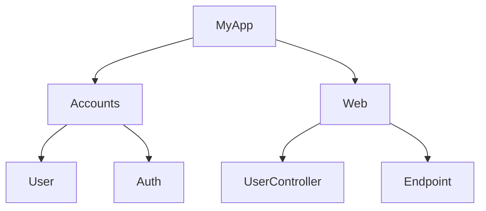

## 3.15. Best Practices in Code Organization

In the realm of software development, the organization of code is a critical aspect that affects the maintainability, scalability, and readability of the application. In Elixir, a functional programming language known for its concurrency and fault-tolerance capabilities, organizing code effectively is paramount. This section will delve into the best practices for code organization in Elixir, focusing on modular design, separation of concerns, and scalability.

### Modular Design

Modular design is a foundational principle in software engineering, emphasizing the decomposition of a system into smaller, manageable, and interchangeable modules. In Elixir, modules are the primary means of organizing code.

#### Structuring Applications into Cohesive Modules

1. **Define Clear Boundaries**: Each module should have a well-defined purpose. Avoid mixing unrelated functionalities within the same module. For instance, a module handling user authentication should not include database operations unrelated to user management.

2. **Use Descriptive Names**: Module names should reflect their responsibilities. For example, `UserAuth` is more descriptive than `Auth` if the module specifically handles user authentication.

3. **Encapsulate Functionality**: Modules should encapsulate their functionality and expose a clear API. This means using private functions for internal workings that should not be accessed directly from outside the module.

4. **Organize by Domain**: Group related modules into directories based on their domain or functionality. This can be visualized as a tree structure:

```plaintext
lib/
  ├── my_app/
  │   ├── accounts/
  │   │   ├── user.ex
  │   │   ├── auth.ex
  │   ├── blog/
  │   │   ├── post.ex
  │   │   ├── comment.ex
```

5. **Leverage Elixir's Module System**: Use nested modules to group related functionalities, but avoid deep nesting as it can make the code harder to navigate.

#### Code Example: Modular Design

Here's an example of how you might structure a simple user authentication system:

```elixir
defmodule MyApp.Accounts.User do
  defstruct [:id, :name, :email, :hashed_password]

  def new(attrs) do
    %User{}
    |> Map.merge(attrs)
    |> hash_password()
  end

  defp hash_password(user) do
    # Logic to hash the password
    user
  end
end

defmodule MyApp.Accounts.Auth do
  alias MyApp.Accounts.User

  def authenticate(email, password) do
    user = find_user_by_email(email)
    verify_password(user, password)
  end

  defp find_user_by_email(email) do
    # Logic to find a user by email
  end

  defp verify_password(user, password) do
    # Logic to verify the password
  end
end
```

### Separation of Concerns

Separation of concerns (SoC) is a design principle for separating a computer program into distinct sections, such that each section addresses a separate concern. This principle helps in reducing complexity and increasing maintainability.

#### Keeping Business Logic, Data Access, and Interface Layers Distinct

1. **Business Logic**: This layer contains the core functionality and rules of the application. In Elixir, this is typically found in the context modules.

2. **Data Access**: Use separate modules or libraries like Ecto for database interactions. Keep SQL queries and data manipulation logic out of the business logic.

3. **Interface Layer**: This could be a web interface using Phoenix or an API. Keep presentation logic separate from business logic.

#### Code Example: Separation of Concerns

```elixir
defmodule MyApp.Accounts do
  alias MyApp.Repo
  alias MyApp.Accounts.User

  def create_user(attrs) do
    %User{}
    |> User.changeset(attrs)
    |> Repo.insert()
  end
end

defmodule MyAppWeb.UserController do
  use MyAppWeb, :controller
  alias MyApp.Accounts

  def create(conn, %{"user" => user_params}) do
    case Accounts.create_user(user_params) do
      {:ok, user} -> 
        conn
        |> put_status(:created)
        |> render("show.json", user: user)
      {:error, changeset} -> 
        conn
        |> put_status(:unprocessable_entity)
        |> render(MyAppWeb.ChangesetView, "error.json", changeset: changeset)
    end
  end
end
```

### Scalability

Scalability refers to the ability of a system to handle growing amounts of work or its potential to accommodate growth. In Elixir, scalability is often achieved through the use of lightweight processes and OTP (Open Telecom Platform) principles.

#### Designing with Growth in Mind

1. **Use Supervision Trees**: Leverage OTP's supervision trees to manage processes and ensure fault tolerance. This makes it easier to scale parts of the system independently.

2. **Decouple Components**: Design systems where components can be scaled independently. For example, separate the web layer from the background processing layer.

3. **Leverage Concurrency**: Use Elixir's lightweight processes to handle concurrent operations, which is crucial for scalability.

4. **Optimize for Performance**: Use tools like ETS (Erlang Term Storage) for in-memory data storage to improve performance.

5. **Plan for Distribution**: Consider how the application will run on multiple nodes. Use distributed Elixir features to ensure the application can scale horizontally.

#### Code Example: Scalability

```elixir
defmodule MyApp.Application do
  use Application

  def start(_type, _args) do
    children = [
      MyApp.Repo,
      MyAppWeb.Endpoint,
      {MyApp.Worker, arg}
    ]

    opts = [strategy: :one_for_one, name: MyApp.Supervisor]
    Supervisor.start_link(children, opts)
  end
end

defmodule MyApp.Worker do
  use GenServer

  def start_link(arg) do
    GenServer.start_link(__MODULE__, arg, name: __MODULE__)
  end

  def init(arg) do
    {:ok, arg}
  end

  # Handle calls and casts
end
```

### Visualizing Code Organization

To better understand how these principles come together, let's visualize the structure of an Elixir application using a mermaid diagram.


```mermaid
graph TD;
    A[MyApp] --> B[Accounts]
    A --> C[Web]
    B --> D[User]
    B --> E[Auth]
    C --> F[UserController]
    C --> G[Endpoint]
```

**Diagram Description**: This diagram illustrates a simple Elixir application structure, where the main application (`MyApp`) is divided into two main components: `Accounts` and `Web`. The `Accounts` component further contains `User` and `Auth` modules, while the `Web` component includes `UserController` and `Endpoint`.

### References and Links

- [Elixir Documentation](https://elixir-lang.org/docs.html)
- [Ecto Library](https://hexdocs.pm/ecto/Ecto.html)
- [Phoenix Framework](https://hexdocs.pm/phoenix/Phoenix.html)

### Knowledge Check

- What are the benefits of modular design in Elixir?
- How does separation of concerns improve code maintainability?
- What are some strategies for designing scalable Elixir applications?

### Summary

In this section, we explored best practices for organizing Elixir code. We discussed the importance of modular design, separation of concerns, and scalability. By structuring applications into cohesive modules, keeping business logic separate from data access and interface layers, and designing with growth in mind, we can build maintainable and scalable Elixir applications.

### Embrace the Journey

Remember, this is just the beginning. As you progress, you'll build more complex and interactive applications. Keep experimenting, stay curious, and enjoy the journey!

## Quiz Time!



### What is a key benefit of modular design in Elixir?

- [x] Improved code maintainability
- [ ] Increased code redundancy
- [ ] Slower application performance
- [ ] More complex codebase

> **Explanation:** Modular design improves code maintainability by organizing code into smaller, manageable components.

### How does separation of concerns help in code organization?

- [x] It reduces complexity by dividing code into distinct sections
- [ ] It combines all functionalities into a single module
- [ ] It makes the code harder to navigate
- [ ] It increases the number of dependencies

> **Explanation:** Separation of concerns reduces complexity by dividing code into distinct sections, each addressing a separate concern.

### Which Elixir feature is crucial for scalability?

- [x] Lightweight processes
- [ ] Deeply nested modules
- [ ] Monolithic design
- [ ] Global variables

> **Explanation:** Elixir's lightweight processes are crucial for scalability as they allow concurrent operations.

### What should be avoided in modular design?

- [x] Mixing unrelated functionalities within the same module
- [ ] Using descriptive names for modules
- [ ] Defining clear boundaries for modules
- [ ] Encapsulating functionality

> **Explanation:** Mixing unrelated functionalities within the same module should be avoided to maintain clear module boundaries.

### What is an advantage of using supervision trees in Elixir?

- [x] They help manage processes and ensure fault tolerance
- [ ] They make the code less maintainable
- [ ] They increase the complexity of the application
- [ ] They reduce the performance of the application

> **Explanation:** Supervision trees help manage processes and ensure fault tolerance, which is beneficial for scalable applications.

### How can you optimize performance in Elixir applications?

- [x] Use ETS for in-memory data storage
- [ ] Avoid using supervision trees
- [ ] Use global variables
- [ ] Deeply nest modules

> **Explanation:** Using ETS for in-memory data storage can optimize performance in Elixir applications.

### What is a characteristic of a well-organized Elixir application?

- [x] Clear separation of business logic, data access, and interface layers
- [ ] All code in a single module
- [ ] No use of OTP principles
- [ ] Heavy use of global variables

> **Explanation:** A well-organized Elixir application has a clear separation of business logic, data access, and interface layers.

### What is the purpose of the `use` keyword in Elixir?

- [x] To bring in functionality from another module
- [ ] To define a new module
- [ ] To declare a variable
- [ ] To start a new process

> **Explanation:** The `use` keyword in Elixir is used to bring in functionality from another module, often implementing a behaviour.

### Why is it important to plan for distribution in Elixir applications?

- [x] To ensure the application can scale horizontally
- [ ] To make the code less readable
- [ ] To increase the number of dependencies
- [ ] To reduce application performance

> **Explanation:** Planning for distribution ensures the application can scale horizontally, which is important for handling increased loads.

### True or False: Deeply nesting modules is a recommended practice in Elixir.

- [ ] True
- [x] False

> **Explanation:** Deeply nesting modules is not recommended as it can make the code harder to navigate.


