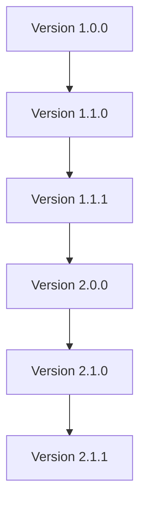
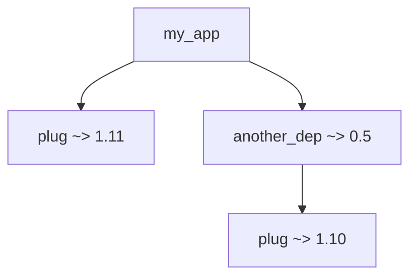

## 3.16. Versioning and Dependency Management

In the world of software development, managing dependencies and versioning is crucial to maintaining a stable and scalable application. Elixir, with its robust tooling and community-driven ecosystem, provides powerful mechanisms to handle these aspects effectively. In this section, we will delve into the intricacies of versioning and dependency management in Elixir, focusing on semantic versioning, managing dependencies using Mix, and resolving conflicts.

### Semantic Versioning

Semantic Versioning (SemVer) is a versioning scheme that conveys meaning about the underlying changes with each new release. It follows the format `MAJOR.MINOR.PATCH`, where each segment has a specific purpose:

- **MAJOR**: Incremented for incompatible API changes.
- **MINOR**: Incremented for backward-compatible functionality.
- **PATCH**: Incremented for backward-compatible bug fixes.

#### Understanding Major, Minor, and Patch Version Increments

Semantic versioning helps developers understand the impact of updating a dependency. Let's explore each component:

- **Major Version**: A major version increment indicates breaking changes. For instance, if a library changes its API in a way that existing code will not work without modification, the major version should be incremented. This signals to developers that they need to review the changes and possibly update their code.

- **Minor Version**: A minor version increment introduces new features that are backward-compatible. This means existing code will continue to work without modification, but new functionality is available.

- **Patch Version**: A patch version increment is for backward-compatible bug fixes. These are changes that do not affect the API or introduce new features but resolve issues in the current functionality.

#### Example of Semantic Versioning

Consider a library with the version `2.3.1`. Here's what each part signifies:

- `2` is the major version, indicating potential breaking changes from version `1.x.x`.
- `3` is the minor version, showing that new features have been added since `2.0.0`.
- `1` is the patch version, reflecting bug fixes since `2.3.0`.

#### Visualizing Semantic Versioning



**Diagram Explanation:** This diagram illustrates the progression of semantic versioning from `1.0.0` to `2.1.1`, highlighting major, minor, and patch increments.

### Managing Dependencies

Elixir uses Mix, its build tool, to manage dependencies. Mix provides a straightforward way to define, fetch, and update dependencies in your project.

#### Using `mix deps` for Adding and Updating Packages

To manage dependencies in Elixir, you define them in the `mix.exs` file under the `deps` function. Here's how you can add and update dependencies:

1. **Adding a Dependency**: To add a new dependency, include it in the `deps` function. For example, to add the `Plug` library:

    ```elixir
    defp deps do
      [
        {:plug, "~> 1.11"}
      ]
    end
    ```

2. **Fetching Dependencies**: Run the following command to fetch and compile the dependencies:

    ```bash
    mix deps.get
    ```

3. **Updating Dependencies**: To update dependencies, use:

    ```bash
    mix deps.update <dependency_name>
    ```

   To update all dependencies, omit the dependency name:

    ```bash
    mix deps.update --all
    ```

#### Example: Managing Dependencies with Mix

Let's create a simple Elixir project and manage its dependencies:

1. **Create a New Project**:

    ```bash
    mix new my_project
    cd my_project
    ```

2. **Edit `mix.exs`**: Add a dependency to the `deps` function:

    ```elixir
    defp deps do
      [
        {:httpoison, "~> 1.8"}
      ]
    end
    ```

3. **Fetch Dependencies**:

    ```bash
    mix deps.get
    ```

4. **Use the Dependency**: In your application, you can now use HTTPoison:

    ```elixir
    defmodule MyProject do
      def fetch_data(url) do
        HTTPoison.get(url)
      end
    end
    ```

#### Try It Yourself

Experiment by adding a new dependency to your project. Modify the version constraints and observe how Mix handles different versions.

### Handling Conflicts

Dependency conflicts occur when two or more dependencies require different versions of the same library. Elixir provides mechanisms to resolve these conflicts effectively.

#### Resolving Version Incompatibilities Between Dependencies

1. **Understanding Conflicts**: When you run `mix deps.get`, Mix may report conflicts if dependencies require incompatible versions of a library. For example:

    ```bash
    Failed to use "plug" (version 1.11.0) because
      my_app depends on plug ~> 1.11
      another_dep depends on plug ~> 1.10
    ```

2. **Resolving Conflicts**: To resolve conflicts, you can:

   - **Update Dependencies**: Check if newer versions of the conflicting dependencies are available that are compatible with each other.
   - **Use Overrides**: In some cases, you can use the `override: true` option to force a specific version. However, use this with caution as it may lead to runtime errors if the dependencies are not truly compatible.

    ```elixir
    defp deps do
      [
        {:plug, "~> 1.11", override: true}
      ]
    end
    ```

3. **Consult Documentation**: Review the documentation of the conflicting libraries for any notes on compatibility or migration paths.

#### Example: Resolving Dependency Conflicts

Consider a project with conflicting dependencies:

1. **Edit `mix.exs`**: Add conflicting dependencies:

    ```elixir
    defp deps do
      [
        {:plug, "~> 1.11"},
        {:another_dep, "~> 0.5"}
      ]
    end
    ```

2. **Simulate Conflict**: Assume `another_dep` requires `plug ~> 1.10`.

3. **Resolve Conflict**: Update `another_dep` to a compatible version or use `override: true` if necessary.

#### Visualizing Dependency Conflicts



**Diagram Explanation:** This diagram shows a conflict where `my_app` and `another_dep` require different versions of `plug`.

### Best Practices for Versioning and Dependency Management

1. **Adopt Semantic Versioning**: Follow semantic versioning for your projects to communicate changes clearly.

2. **Regularly Update Dependencies**: Keep dependencies up-to-date to benefit from bug fixes and new features.

3. **Review Changelogs**: Before updating, review the changelogs of dependencies to understand the impact of changes.

4. **Use Lock Files**: Mix generates a `mix.lock` file to lock dependencies to specific versions. Commit this file to version control to ensure consistent builds.

5. **Test Thoroughly**: After updating dependencies, run your test suite to catch any issues introduced by the updates.

6. **Document Dependency Changes**: Maintain a changelog for your project to document changes in dependencies and their impact.

### Conclusion

Versioning and dependency management are vital aspects of software development in Elixir. By understanding semantic versioning, effectively managing dependencies with Mix, and resolving conflicts, you can build robust and maintainable applications. Remember, this is just the beginning. As you progress, you'll encounter more complex scenarios. Keep experimenting, stay curious, and enjoy the journey!

## Quiz: Versioning and Dependency Management



### What does a major version increment signify in semantic versioning?

- [x] Incompatible API changes
- [ ] Backward-compatible functionality
- [ ] Bug fixes
- [ ] Performance improvements

> **Explanation:** A major version increment indicates incompatible API changes that may require modifications to existing code.

### How do you add a new dependency in an Elixir project?

- [x] By adding it to the `deps` function in `mix.exs`
- [ ] By creating a new file in the `lib` directory
- [ ] By modifying the `config.exs` file
- [ ] By running `mix new <dependency_name>`

> **Explanation:** Dependencies are added to the `deps` function in the `mix.exs` file, where you specify the package and version.

### What command is used to fetch dependencies in Elixir?

- [x] `mix deps.get`
- [ ] `mix deps.fetch`
- [ ] `mix get.deps`
- [ ] `mix fetch.deps`

> **Explanation:** The `mix deps.get` command is used to fetch and compile dependencies specified in the `mix.exs` file.

### How can you resolve dependency conflicts in Elixir?

- [x] By updating dependencies or using `override: true`
- [ ] By deleting the `mix.lock` file
- [ ] By renaming conflicting dependencies
- [ ] By running `mix deps.clean`

> **Explanation:** Conflicts can be resolved by updating dependencies to compatible versions or using `override: true` cautiously.

### What is the purpose of the `mix.lock` file?

- [x] To lock dependencies to specific versions
- [ ] To store application configuration
- [ ] To define project tasks
- [ ] To manage environment variables

> **Explanation:** The `mix.lock` file locks dependencies to specific versions, ensuring consistent builds across environments.

### What should you do before updating dependencies?

- [x] Review the changelogs
- [ ] Delete the `mix.lock` file
- [ ] Rename the `mix.exs` file
- [ ] Run `mix clean`

> **Explanation:** Reviewing changelogs helps understand the impact of changes and prepare for any necessary code updates.

### How can you force a specific version of a dependency?

- [x] By using `override: true` in the `deps` function
- [ ] By modifying the `mix.lock` file directly
- [ ] By running `mix deps.force`
- [ ] By creating a new `mix.exs` file

> **Explanation:** The `override: true` option can be used to force a specific version, but it should be used with caution.

### What is the format of semantic versioning?

- [x] `MAJOR.MINOR.PATCH`
- [ ] `PATCH.MINOR.MAJOR`
- [ ] `MINOR.MAJOR.PATCH`
- [ ] `PATCH.MAJOR.MINOR`

> **Explanation:** Semantic versioning follows the `MAJOR.MINOR.PATCH` format, where each segment has a specific meaning.

### Why is it important to commit the `mix.lock` file to version control?

- [x] To ensure consistent builds across environments
- [ ] To store application secrets
- [ ] To define project tasks
- [ ] To manage environment variables

> **Explanation:** Committing the `mix.lock` file ensures that all team members and environments use the same dependency versions.

### True or False: A patch version increment introduces new features.

- [ ] True
- [x] False

> **Explanation:** A patch version increment is for backward-compatible bug fixes, not new features.


