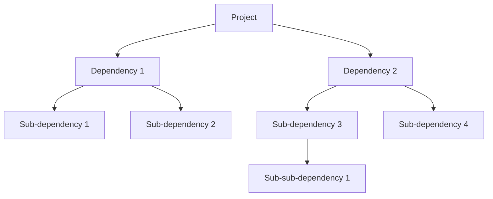

## 3.16. Versioning and Dependency Management

In the world of software development, managing dependencies and versioning is crucial for maintaining a stable and scalable codebase. Elixir, with its robust tooling and community-driven ecosystem, provides excellent support for these tasks. In this section, we'll explore the intricacies of versioning and dependency management in Elixir, focusing on semantic versioning, using Mix for managing dependencies, and resolving conflicts.

### Semantic Versioning

Semantic Versioning (SemVer) is a versioning scheme that aims to convey meaning about the underlying changes with each new release. It uses a three-part version number: MAJOR.MINOR.PATCH. Understanding and applying semantic versioning is essential for effective dependency management.

#### Understanding Major, Minor, and Patch Version Increments

- **Major Version (X.y.z):** Incremented when there are incompatible API changes. This indicates that consumers of the library may need to make changes to their code to accommodate the new version.
- **Minor Version (x.Y.z):** Incremented when new functionality is added in a backward-compatible manner. This means that existing code will continue to work without modification.
- **Patch Version (x.y.Z):** Incremented for backward-compatible bug fixes. These are typically small changes that do not affect the API.

**Example:**

```
1.0.0 -> 2.0.0 : Major changes, possibly breaking
1.0.0 -> 1.1.0 : Minor changes, new features added
1.0.0 -> 1.0.1 : Patch changes, bug fixes
```

Semantic versioning helps developers understand the impact of updating dependencies and ensures that changes are communicated clearly.

#### Why Semantic Versioning Matters

Semantic versioning provides a standardized way of communicating changes, making it easier for developers to manage dependencies. It helps in:

- **Predictability:** Knowing what to expect with each version increment.
- **Compatibility:** Ensuring that updates do not break existing functionality.
- **Communication:** Clearly conveying the nature and impact of changes.

### Managing Dependencies with Mix

Elixir uses Mix, a build tool that provides tasks for creating, compiling, and testing Elixir projects. Mix also plays a crucial role in managing dependencies.

#### Adding and Updating Packages

To manage dependencies in an Elixir project, you define them in the `mix.exs` file under the `deps` function. Here's how you can add and update packages:

**Adding a Dependency:**

To add a new dependency, specify it in the `deps` function:

```elixir
defp deps do
  [
    {:phoenix, "~> 1.5.9"},
    {:ecto, "~> 3.6"}
  ]
end
```

- The `~>` operator is used to specify version constraints. In this case, `~> 1.5.9` means "compatible with 1.5.x, but not 1.6.0 or above."

**Updating Dependencies:**

To update dependencies, use the following Mix tasks:

- `mix deps.get`: Fetches all dependencies listed in `mix.exs`.
- `mix deps.update <package>`: Updates a specific package to the latest compatible version.
- `mix deps.update --all`: Updates all dependencies to their latest compatible versions.

**Example:**

```shell
# Fetch all dependencies
mix deps.get

# Update a specific package
mix deps.update phoenix

# Update all packages
mix deps.update --all
```

#### Using Hex for Dependency Management

Hex is the package manager for the Erlang ecosystem, which Elixir is a part of. It provides a repository for publishing and managing packages.

- **Publishing Packages:** You can publish your own packages to Hex, making them available for others to use.
- **Version Constraints:** Hex supports semantic versioning, allowing you to specify version constraints for dependencies.

**Example:**

```elixir
defp deps do
  [
    {:httpoison, "~> 1.8"},
    {:jason, "~> 1.2"}
  ]
end
```

### Handling Conflicts

Dependency conflicts can arise when two or more dependencies require different versions of the same package. Resolving these conflicts is crucial to maintain a stable codebase.

#### Resolving Version Incompatibilities

When you encounter a version conflict, you have several options:

1. **Check Compatibility:** Review the changelogs and documentation of the conflicting packages to determine if a newer version is compatible with your code.

2. **Update Dependencies:** Update the dependencies to the latest compatible versions using `mix deps.update`.

3. **Override Dependencies:** In some cases, you can override a dependency version in `mix.exs`:

```elixir
defp deps do
  [
    {:plug, "~> 1.11", override: true}
  ]
end
```

4. **Fork and Modify:** If a package does not support the required version, consider forking the repository and making necessary changes.

5. **Contact Maintainers:** Reach out to the maintainers of the conflicting packages for guidance or to request updates.

#### Visualizing Dependency Management

Understanding the relationships between dependencies can be complex. Here's a diagram to help visualize how dependencies are managed in Elixir projects:


```mermaid
graph TD;
    A[Project] --> B[Dependency 1];
    A --> C[Dependency 2];
    B --> D[Sub-dependency 1];
    B --> E[Sub-dependency 2];
    C --> F[Sub-dependency 3];
    C --> G[Sub-dependency 4];
    F --> H[Sub-sub-dependency 1];
```

**Description:** This diagram illustrates a project with two main dependencies, each having their own sub-dependencies. Managing these dependencies effectively is crucial for maintaining a stable codebase.

### Best Practices for Versioning and Dependency Management

1. **Use Semantic Versioning:** Always adhere to semantic versioning principles for your projects and dependencies.

2. **Regular Updates:** Regularly update your dependencies to benefit from bug fixes and new features.

3. **Lock Dependencies:** Use `mix.lock` to lock dependency versions, ensuring consistent builds across environments.

4. **Monitor Changelogs:** Keep an eye on changelogs for your dependencies to understand the impact of updates.

5. **Test Thoroughly:** After updating dependencies, run your test suite to ensure nothing breaks.

6. **Document Changes:** Document any changes to dependencies and their impact on your project.

### Try It Yourself

To reinforce your understanding, try the following exercises:

- **Exercise 1:** Add a new dependency to an Elixir project and specify a version constraint using semantic versioning.
  
- **Exercise 2:** Update an existing dependency and observe the changes in `mix.lock`.

- **Exercise 3:** Resolve a simulated version conflict by overriding a dependency version.

### Knowledge Check

- **Question 1:** What does the `~>` operator signify in Elixir dependency management?
  
- **Question 2:** How can you update all dependencies in an Elixir project?

- **Question 3:** What is the purpose of the `mix.lock` file?

### Summary and Key Takeaways

- Semantic versioning is essential for managing dependencies and ensuring compatibility.
- Mix provides powerful tools for adding, updating, and managing dependencies in Elixir projects.
- Handling conflicts requires understanding version constraints and using strategies like overrides and forks.
- Regular updates and thorough testing are crucial for maintaining a stable codebase.

Remember, mastering versioning and dependency management is a journey. Continue exploring, experimenting, and applying these concepts to your projects. As you progress, you'll gain greater confidence in managing complex dependencies and building robust Elixir applications.

## Quiz Time!



### What is the purpose of semantic versioning?

- [x] To convey meaning about the underlying changes with each new release
- [ ] To ensure all dependencies are always up-to-date
- [ ] To automatically resolve dependency conflicts
- [ ] To provide a unique identifier for each release

> **Explanation:** Semantic versioning is used to convey meaning about the underlying changes with each new release, helping developers understand the impact of updates.

### What does the `~>` operator signify in Elixir dependency management?

- [x] It specifies version compatibility
- [ ] It indicates a major version change
- [ ] It locks the dependency version
- [ ] It updates the dependency to the latest version

> **Explanation:** The `~>` operator specifies version compatibility, allowing updates within a compatible range.

### How can you update all dependencies in an Elixir project?

- [x] Use `mix deps.update --all`
- [ ] Use `mix deps.get`
- [ ] Use `mix deps.compile`
- [ ] Use `mix deps.clean`

> **Explanation:** `mix deps.update --all` updates all dependencies to their latest compatible versions.

### What is the purpose of the `mix.lock` file?

- [x] To lock dependency versions for consistent builds
- [ ] To store project configuration
- [ ] To list all available Mix tasks
- [ ] To compile Elixir code

> **Explanation:** The `mix.lock` file locks dependency versions, ensuring consistent builds across environments.

### How can you resolve a version conflict in Elixir?

- [x] Override the dependency version
- [x] Update the conflicting dependencies
- [ ] Ignore the conflict
- [ ] Remove the conflicting dependency

> **Explanation:** You can resolve a version conflict by overriding the dependency version or updating the conflicting dependencies.

### What tool does Elixir use for dependency management?

- [x] Mix
- [ ] Hex
- [ ] Rebar
- [ ] Bundler

> **Explanation:** Mix is the tool used for dependency management in Elixir.

### What is Hex in the context of Elixir?

- [x] A package manager for the Erlang ecosystem
- [ ] A build tool for Elixir projects
- [ ] A testing framework for Elixir
- [ ] A version control system

> **Explanation:** Hex is a package manager for the Erlang ecosystem, used for publishing and managing packages.

### Why is it important to monitor changelogs for dependencies?

- [x] To understand the impact of updates
- [ ] To find new dependencies
- [ ] To compile Elixir code
- [ ] To lock dependency versions

> **Explanation:** Monitoring changelogs helps you understand the impact of updates on your project.

### What is a common strategy for managing dependency conflicts?

- [x] Forking and modifying the conflicting package
- [ ] Ignoring the conflict
- [ ] Removing all dependencies
- [ ] Using a different programming language

> **Explanation:** Forking and modifying the conflicting package is a common strategy for managing dependency conflicts.

### True or False: Semantic versioning only applies to Elixir projects.

- [ ] True
- [x] False

> **Explanation:** Semantic versioning is a general versioning scheme used across various programming languages and ecosystems.




