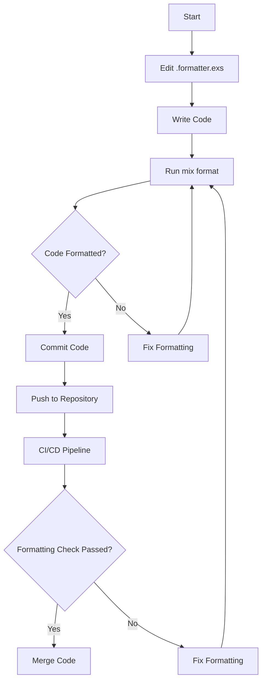

## 3.17. Automated Code Formatting with `mix format`

In the world of software development, maintaining a consistent code style is crucial for readability, maintainability, and collaboration. Elixir, a dynamic, functional language designed for building scalable and maintainable applications, offers a powerful tool for automated code formatting: `mix format`. This tool ensures that your code adheres to a consistent style, making it easier for teams to collaborate and for individual developers to focus on functionality rather than formatting.

### Configuring the Formatter

The first step in leveraging `mix format` is configuring it to suit your project's needs. This involves customizing formatting rules in the `.formatter.exs` file, which is typically located at the root of your Elixir project.

#### Understanding `.formatter.exs`

The `.formatter.exs` file is an Elixir script that returns a keyword list of options. These options dictate how `mix format` will format your code. Here is a basic example of a `.formatter.exs` file:

```elixir
# .formatter.exs
[
  inputs: ["{mix,.formatter}.exs", "{config,lib,test}/**/*.{ex,exs}"],
  line_length: 80,
  import_deps: [:ecto, :phoenix]
]
```

- **inputs**: Specifies the files and directories to be formatted. In this example, it includes the mix and formatter files themselves, as well as all `.ex` and `.exs` files in the `config`, `lib`, and `test` directories.
- **line_length**: Sets the maximum line length. This is a common style guide rule that helps keep code readable.
- **import_deps**: Allows you to import formatting rules from dependencies, such as `ecto` and `phoenix`, ensuring that your code style is consistent with these libraries.

#### Customizing Formatting Rules

You can customize the formatting rules to match your team's preferences. Here are some common options:

- **locals_without_parens**: A list of local functions that should be called without parentheses. This can be useful for DSLs or custom macros.
- **export**: Allows you to export the configuration to be used by other projects or tools.

Example of customizing `locals_without_parens`:

```elixir
# .formatter.exs
[
  inputs: ["{mix,.formatter}.exs", "{config,lib,test}/**/*.{ex,exs}"],
  line_length: 100,
  locals_without_parens: [my_custom_macro: 1, another_macro: 2]
]
```

### Integrating with Development Tools

To maximize the benefits of `mix format`, integrate it into your development workflow. This ensures that code is consistently formatted before it is committed to version control.

#### Running `mix format` Before Commits

One effective strategy is to run `mix format` automatically before each commit. This can be achieved using Git hooks, specifically the `pre-commit` hook.

1. **Create a Pre-Commit Hook**: Navigate to your project's `.git/hooks` directory and create a file named `pre-commit`.

2. **Add the Following Script**:

```bash
#!/bin/sh
mix format --check-formatted
if [ $? -ne 0 ]; then
  echo "Code is not formatted. Please run 'mix format'."
  exit 1
fi
```

3. **Make the Hook Executable**:

```bash
chmod +x .git/hooks/pre-commit
```

This script checks if the code is formatted before allowing a commit. If the code is not formatted, it prompts the developer to run `mix format`.

### Team Collaboration

Ensuring a consistent coding style across team members is essential for collaboration. `mix format` plays a crucial role in achieving this goal.

#### Establishing a Team-Wide Style Guide

While `mix format` provides a default style, teams can establish their own style guide by customizing the `.formatter.exs` file. It's important to document these decisions and ensure all team members are aware of them.

#### Conducting Code Reviews

During code reviews, focus on the logic and functionality rather than formatting issues. With `mix format`, you can be confident that the code adheres to the agreed-upon style, allowing reviewers to concentrate on more critical aspects of the code.

#### Continuous Integration

Incorporate `mix format` into your continuous integration (CI) pipeline to automatically check code formatting. This can be done by adding a step in your CI configuration to run `mix format --check-formatted`.

Example for a CI configuration:

```yaml
# .github/workflows/elixir.yml
name: Elixir CI

on: [push, pull_request]

jobs:
  build:
    runs-on: ubuntu-latest

    steps:
    - uses: actions/checkout@v2
    - name: Set up Elixir
      uses: actions/setup-elixir@v1
      with:
        elixir-version: '1.12'
        otp-version: '24'
    - name: Install dependencies
      run: mix deps.get
    - name: Run formatter
      run: mix format --check-formatted
```

### Try It Yourself

To get hands-on experience with `mix format`, try modifying the `.formatter.exs` file in a sample project. Experiment with different options, such as changing the `line_length` or adding functions to `locals_without_parens`. Run `mix format` to see how these changes affect your code.

### Visualizing Code Formatting Workflow

To better understand the workflow of automated code formatting with `mix format`, let's visualize the process using a flowchart.



**Diagram Description**: This flowchart illustrates the process of configuring and using `mix format` in a development workflow. It starts with editing the `.formatter.exs` file, writing code, and running `mix format`. If the code is formatted correctly, it can be committed and pushed to the repository. The CI/CD pipeline then checks the formatting, and if it passes, the code is merged.

### References and Links

For further reading on code formatting in Elixir, consider the following resources:

- [Elixir's Official Documentation on Code Formatting](https://hexdocs.pm/mix/Mix.Tasks.Format.html)
- [Git Hooks Documentation](https://git-scm.com/book/en/v2/Customizing-Git-Git-Hooks)
- [Continuous Integration with GitHub Actions](https://docs.github.com/en/actions)

### Knowledge Check

To reinforce your understanding of automated code formatting with `mix format`, consider the following questions:

1. What is the purpose of the `.formatter.exs` file in an Elixir project?
2. How can you customize the line length for code formatting?
3. Describe how to integrate `mix format` into a Git pre-commit hook.
4. Why is it beneficial to include `mix format` in a CI pipeline?
5. What are some common options you can configure in `.formatter.exs`?

### Embrace the Journey

Remember, mastering code formatting with `mix format` is just one step in your journey as an Elixir developer. As you continue to explore Elixir's features and best practices, you'll find new ways to enhance your productivity and collaboration. Keep experimenting, stay curious, and enjoy the process of learning and growing as a developer!

## Quiz: Automated Code Formatting with `mix format`



### What is the primary purpose of `mix format` in Elixir?

- [x] To ensure consistent code style across a project
- [ ] To compile Elixir code
- [ ] To run tests
- [ ] To deploy applications

> **Explanation:** `mix format` is used to automatically format code to ensure a consistent style across a project.

### Which file is used to configure `mix format`?

- [x] .formatter.exs
- [ ] mix.exs
- [ ] config.exs
- [ ] settings.exs

> **Explanation:** The `.formatter.exs` file is used to configure the behavior of `mix format`.

### How can you specify which files `mix format` should format?

- [x] By setting the `inputs` option in `.formatter.exs`
- [ ] By using command line arguments
- [ ] By editing mix.exs
- [ ] By modifying config.exs

> **Explanation:** The `inputs` option in `.formatter.exs` specifies which files and directories should be formatted.

### What is a common use of the `locals_without_parens` option?

- [x] To specify functions that should be called without parentheses
- [ ] To define local variables
- [ ] To import dependencies
- [ ] To set environment variables

> **Explanation:** The `locals_without_parens` option allows you to specify functions that should be called without parentheses, useful for DSLs or custom macros.

### How can you integrate `mix format` into a Git workflow?

- [x] By creating a pre-commit hook
- [ ] By adding it to the README
- [ ] By using a Docker container
- [ ] By modifying the .gitignore file

> **Explanation:** A pre-commit hook can be used to automatically run `mix format` before committing code to ensure it is properly formatted.

### What command checks if the code is formatted correctly?

- [x] mix format --check-formatted
- [ ] mix format --verify
- [ ] mix format --test
- [ ] mix format --lint

> **Explanation:** The `mix format --check-formatted` command checks if the code is formatted according to the rules specified in `.formatter.exs`.

### Why is it important to include `mix format` in a CI pipeline?

- [x] To automatically verify code formatting in pull requests
- [ ] To compile the code
- [ ] To run end-to-end tests
- [ ] To deploy the application

> **Explanation:** Including `mix format` in a CI pipeline ensures that code formatting is automatically verified in pull requests, maintaining consistency across the codebase.

### What happens if code is not formatted correctly in a pre-commit hook?

- [x] The commit is blocked, and the developer is prompted to format the code
- [ ] The code is automatically formatted
- [ ] The commit proceeds with a warning
- [ ] The repository is reset

> **Explanation:** If code is not formatted correctly, the pre-commit hook blocks the commit and prompts the developer to format the code.

### Which option in `.formatter.exs` allows importing formatting rules from dependencies?

- [x] import_deps
- [ ] include_deps
- [ ] require_deps
- [ ] use_deps

> **Explanation:** The `import_deps` option allows importing formatting rules from specified dependencies, ensuring consistency with those libraries.

### True or False: `mix format` can be used to format both `.ex` and `.exs` files.

- [x] True
- [ ] False

> **Explanation:** `mix format` can format both `.ex` and `.exs` files, which are common file extensions for Elixir source code and scripts.


