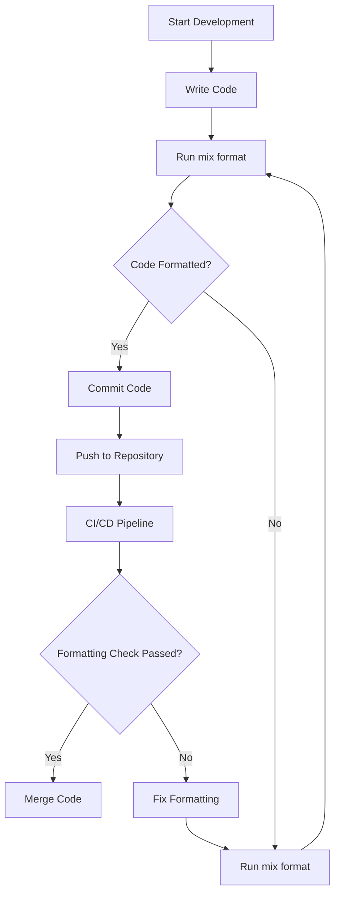

## 3.17. Automated Code Formatting with `mix format`

In the world of software development, maintaining a consistent code style is crucial for readability, maintainability, and collaboration. Elixir provides a powerful tool for this purpose: `mix format`. This tool helps automate the process of code formatting, ensuring that your code adheres to a consistent style across your entire codebase. In this section, we will explore how to configure `mix format`, integrate it with development tools, and use it to enhance team collaboration.

### Configuring the Formatter

To get started with `mix format`, you need to configure it to suit your project's needs. This is done through the `.formatter.exs` file, which specifies the formatting rules and options.

#### Creating and Customizing `.formatter.exs`

The `.formatter.exs` file is an Elixir script that returns a keyword list. Here's a basic example:

```elixir
# .formatter.exs
[
  inputs: ["{mix,.formatter}.exs", "{config,lib,test}/**/*.{ex,exs}"],
  line_length: 80,
  locals_without_parens: [my_function: 2]
]
```

**Explanation:**

- **inputs**: Specifies the files and directories to be formatted. It's common to include configuration files and all Elixir source files.
- **line_length**: Sets the maximum line length. This helps maintain readability across different screen sizes.
- **locals_without_parens**: Lists local functions that can be called without parentheses, improving readability for DSL-like code.

#### Advanced Configuration Options

The `.formatter.exs` file offers several other options to fine-tune formatting:

- **import_deps**: Allows importing formatting rules from dependencies.
- **export**: Exports formatting rules to other projects.
- **subdirectories**: Specifies subdirectories with their own `.formatter.exs`.

Here's an example with advanced options:

```elixir
# .formatter.exs
[
  inputs: ["{mix,.formatter}.exs", "{config,lib,test}/**/*.{ex,exs}"],
  line_length: 100,
  import_deps: [:ecto, :phoenix],
  subdirectories: ["priv/*/migrations"],
  export: [locals_without_parens: [my_macro: 1]]
]
```

**Try It Yourself:** Experiment with different `line_length` values and observe how it affects your code's readability.

### Integrating with Development Tools

Automating the formatting process is key to ensuring consistency without manual intervention. Let's explore how to integrate `mix format` into your development workflow.

#### Running `mix format` Before Commits

One effective way to enforce code formatting is by running `mix format` before commits. This can be achieved using Git hooks.

**Setting Up a Pre-Commit Hook:**

1. Create a `.git/hooks/pre-commit` file in your repository.
2. Add the following script to run `mix format`:

```bash
#!/bin/sh
mix format --check-formatted
if [ $? -ne 0 ]; then
  echo "Code is not formatted. Please run 'mix format'."
  exit 1
fi
```

3. Make the hook executable:

```bash
chmod +x .git/hooks/pre-commit
```

**Explanation:**

- The script runs `mix format --check-formatted`, which checks if the code is already formatted.
- If the code is not formatted, the commit is aborted, prompting the developer to run `mix format`.

#### Integrating with IDEs and Editors

Most modern IDEs and editors support running `mix format` automatically. Here's how to set it up in some popular tools:

- **Visual Studio Code**: Install the ElixirLS extension, which formats code on save.
- **IntelliJ IDEA**: Use the Elixir plugin, and configure it to run `mix format` on save.
- **Atom**: Install the `atom-elixir` package, which supports code formatting.

**Try It Yourself:** Set up `mix format` in your preferred editor and observe how it enhances your coding experience.

### Team Collaboration

Consistency in code style is vital for team collaboration. `mix format` helps ensure that all team members adhere to the same coding standards.

#### Ensuring Consistent Coding Style Across Team Members

To maintain a consistent coding style across your team, consider the following practices:

- **Establish a Common `.formatter.exs`**: Ensure that all team members use the same `.formatter.exs` file. Store it in your version control system.
- **Conduct Code Reviews**: During code reviews, check for adherence to the formatting rules. Encourage team members to run `mix format` before submitting code for review.
- **Automate Formatting in CI/CD Pipelines**: Integrate `mix format` into your CI/CD pipelines to automatically check for formatting issues.

**Example CI/CD Integration with GitHub Actions:**

Create a `.github/workflows/format.yml` file:

```yaml
name: Elixir Format Check

on: [push, pull_request]

jobs:
  format:
    runs-on: ubuntu-latest
    steps:
    - uses: actions/checkout@v2
    - name: Set up Elixir
      uses: actions/setup-elixir@v1
      with:
        elixir-version: '1.12'
        otp-version: '24.0'
    - name: Install Dependencies
      run: mix deps.get
    - name: Run Formatter
      run: mix format --check-formatted
```

**Explanation:**

- The workflow runs on every push and pull request.
- It sets up Elixir, installs dependencies, and checks the formatting.

### Visualizing the Workflow

Let's visualize the workflow of integrating `mix format` into your development process using a Mermaid.js flowchart:


```mermaid
flowchart TD
    A[Start Development] --> B[Write Code]
    B --> C[Run mix format]
    C --> D{Code Formatted?}
    D -->|Yes| E[Commit Code]
    D -->|No| F[Run mix format]
    F --> C
    E --> G[Push to Repository]
    G --> H[CI/CD Pipeline]
    H --> I{Formatting Check Passed?}
    I -->|Yes| J[Merge Code]
    I -->|No| K[Fix Formatting]
    K --> F
```

**Description:** This flowchart illustrates the process of writing code, running `mix format`, and ensuring that code is formatted before committing and merging.

### References and Links

For further reading and resources on Elixir and `mix format`, consider the following links:

- [Elixir Official Documentation](https://elixir-lang.org/docs.html)
- [Elixir Formatter Guide](https://hexdocs.pm/mix/Mix.Tasks.Format.html)
- [Git Hooks Documentation](https://git-scm.com/docs/githooks)

### Knowledge Check

Let's test your understanding of `mix format` with a few questions:

1. What is the purpose of the `.formatter.exs` file?
2. How can you enforce code formatting before commits?
3. Describe how to integrate `mix format` with your IDE.
4. Why is consistent code formatting important for team collaboration?
5. How can `mix format` be integrated into CI/CD pipelines?

### Embrace the Journey

Remember, mastering `mix format` is just one step towards writing clean and maintainable code. As you progress, you'll discover more tools and techniques to enhance your development workflow. Keep experimenting, stay curious, and enjoy the journey!

## Quiz Time!



### What is the primary purpose of `mix format` in Elixir?

- [x] To automate code formatting for consistency
- [ ] To compile Elixir code
- [ ] To run tests
- [ ] To deploy applications

> **Explanation:** `mix format` is used to automate code formatting, ensuring consistent style across the codebase.

### Which file is used to configure the formatting rules for `mix format`?

- [x] `.formatter.exs`
- [ ] `mix.exs`
- [ ] `config.exs`
- [ ] `format.config`

> **Explanation:** The `.formatter.exs` file is used to specify formatting rules and options for `mix format`.

### How can you enforce code formatting before committing changes?

- [x] Use a Git pre-commit hook
- [ ] Rely on manual checks
- [ ] Use a post-commit hook
- [ ] Use a cron job

> **Explanation:** A Git pre-commit hook can be set up to run `mix format` and ensure code is formatted before committing.

### What command checks if the code is already formatted?

- [x] `mix format --check-formatted`
- [ ] `mix format --check`
- [ ] `mix format --verify`
- [ ] `mix format --test`

> **Explanation:** The `mix format --check-formatted` command checks if the code is already formatted.

### How can `mix format` be integrated into CI/CD pipelines?

- [x] By adding it as a step in the pipeline configuration
- [ ] By running it manually after deployment
- [ ] By using a separate server for formatting
- [ ] By ignoring it in CI/CD

> **Explanation:** `mix format` can be added as a step in the CI/CD pipeline configuration to automatically check for formatting issues.

### Which option in `.formatter.exs` specifies files to be formatted?

- [x] `inputs`
- [ ] `line_length`
- [ ] `locals_without_parens`
- [ ] `import_deps`

> **Explanation:** The `inputs` option in `.formatter.exs` specifies the files and directories to be formatted.

### What is the benefit of using `mix format` in a team setting?

- [x] Ensures consistent coding style across team members
- [ ] Increases code execution speed
- [ ] Reduces the need for code reviews
- [ ] Eliminates the need for documentation

> **Explanation:** `mix format` ensures that all team members adhere to the same coding standards, promoting consistency.

### Which command is used to format code in Elixir?

- [x] `mix format`
- [ ] `mix compile`
- [ ] `mix test`
- [ ] `mix run`

> **Explanation:** The `mix format` command is used to format code in Elixir.

### Can `mix format` be configured to ignore specific files?

- [x] True
- [ ] False

> **Explanation:** Yes, `mix format` can be configured to ignore specific files by adjusting the `inputs` option in `.formatter.exs`.

### What is a common practice to ensure code is formatted before merging?

- [x] Integrate `mix format` in CI/CD pipelines
- [ ] Manually check each file
- [ ] Use a separate formatting tool
- [ ] Format code after deployment

> **Explanation:** Integrating `mix format` in CI/CD pipelines ensures that code is formatted before merging, maintaining consistency.


