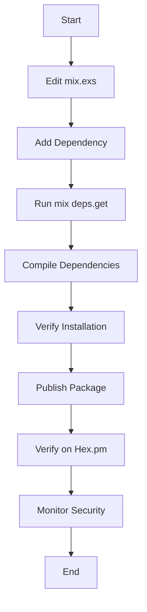

## 3.18. Managing Dependencies with Hex

In the world of software development, managing dependencies efficiently is crucial for building robust and maintainable applications. Elixir, with its powerful ecosystem, leverages Hex, a package manager designed to handle dependencies seamlessly. In this section, we will delve into the process of managing dependencies with Hex, covering everything from adding dependencies to publishing your own packages, and ensuring security throughout.

### Adding Dependencies

Adding dependencies in Elixir is straightforward, thanks to the integration of Hex with Mix, Elixir's build tool. Let's explore how to utilize Hex packages in your `mix.exs` file.

#### Utilizing Hex Packages in `mix.exs`

The `mix.exs` file is the heart of your Elixir project configuration. It defines your project's dependencies, among other settings. To add a dependency, follow these steps:

1. **Locate the `mix.exs` File**: This file is typically found in the root directory of your Elixir project.

2. **Edit the `mix.exs` File**: Open the file and locate the `deps` function within the `defp` block. This function returns a list of tuples, each representing a dependency.

3. **Add a Dependency**: To add a new dependency, append a tuple to the list. The tuple should include the package name as an atom and the version constraint as a string. For example, to add the `Phoenix` framework, you would write:

    ```elixir
    defp deps do
      [
        {:phoenix, "~> 1.6.0"}
      ]
    end
    ```

4. **Fetch Dependencies**: Run the following command in your terminal to fetch and install the dependencies:

    ```shell
    mix deps.get
    ```

5. **Compile Dependencies**: After fetching, compile the dependencies with:

    ```shell
    mix deps.compile
    ```

By following these steps, you can easily manage your project's dependencies. Hex ensures that the specified versions are fetched and installed, maintaining consistency across different environments.

#### Version Constraints

When specifying version constraints, you have several options:

- **Exact Version**: Use `==` to specify an exact version.
- **Compatible Version**: Use `~>` to allow updates that do not break compatibility.
- **Greater Than or Equal**: Use `>=` to specify a minimum version.

Understanding these constraints helps you maintain control over the versions of dependencies in your project.

### Publishing Packages

Sharing your own libraries with the community is a rewarding experience. Hex makes it easy to publish packages, allowing others to benefit from your work.

#### Preparing Your Package

Before publishing, ensure your package is ready:

1. **Documentation**: Use ExDoc to generate documentation for your package. Well-documented code is crucial for user adoption.

2. **Versioning**: Follow semantic versioning principles to communicate changes effectively.

3. **Testing**: Ensure your package is thoroughly tested using ExUnit.

4. **Licensing**: Include a license file to specify the terms under which your package can be used.

#### Publishing to Hex

Once your package is ready, follow these steps to publish it:

1. **Create a Hex Account**: If you haven't already, create an account on [Hex.pm](https://hex.pm).

2. **Authenticate**: Authenticate your local environment with Hex by running:

    ```shell
    mix hex.user auth
    ```

3. **Publish Your Package**: Use the following command to publish your package:

    ```shell
    mix hex.publish
    ```

4. **Verify**: After publishing, verify that your package is available on Hex.pm.

Publishing packages not only contributes to the community but also enhances your reputation as a developer.

### Security Considerations

Security is paramount when dealing with dependencies. Hex provides several features to ensure the integrity and trustworthiness of packages.

#### Verifying Package Integrity

Hex uses checksums to verify the integrity of packages. When you fetch a package, Hex checks the checksum against the one stored in the registry. This ensures that the package has not been tampered with.

#### Trustworthiness of Packages

While Hex provides a level of security, it's essential to verify the trustworthiness of packages:

- **Review Code**: Whenever possible, review the source code of dependencies.
- **Check Maintainers**: Look at the maintainers' profiles and their contributions to the community.
- **Monitor Updates**: Keep an eye on updates and changelogs for any security patches.

By taking these precautions, you can mitigate the risks associated with third-party dependencies.

### Visualizing Dependency Management with Hex

To better understand the process of managing dependencies with Hex, let's visualize it using a flowchart.



**Figure 1: Dependency Management Workflow with Hex**

This flowchart illustrates the typical workflow for managing dependencies and publishing packages using Hex.

### Try It Yourself

To solidify your understanding, try adding a new dependency to an existing Elixir project. Experiment with different version constraints and observe how Hex handles them. Additionally, consider creating a simple library and publishing it to Hex.pm. This hands-on experience will reinforce the concepts covered in this section.

### Knowledge Check

- **What command is used to fetch dependencies in Elixir?**
- **How does Hex ensure the integrity of packages?**
- **What are the steps involved in publishing a package to Hex?**

### Summary

In this section, we've explored the intricacies of managing dependencies with Hex in Elixir. From adding dependencies to publishing your own packages and ensuring security, Hex provides a comprehensive solution for dependency management. By mastering these concepts, you can build robust and maintainable Elixir applications.

Remember, this is just the beginning. As you progress, you'll discover more advanced techniques and best practices for managing dependencies. Keep experimenting, stay curious, and enjoy the journey!

## Quiz: Managing Dependencies with Hex



### What is the primary file used to manage dependencies in an Elixir project?

- [x] mix.exs
- [ ] mix.lock
- [ ] deps.exs
- [ ] hex.exs

> **Explanation:** The `mix.exs` file is used to manage dependencies in an Elixir project.

### Which command is used to fetch dependencies in Elixir?

- [x] mix deps.get
- [ ] mix deps.fetch
- [ ] mix deps.install
- [ ] mix deps.update

> **Explanation:** The `mix deps.get` command is used to fetch dependencies in Elixir.

### What is the purpose of the `~>` operator in version constraints?

- [x] Allow updates that do not break compatibility
- [ ] Specify an exact version
- [ ] Specify a minimum version
- [ ] Specify a maximum version

> **Explanation:** The `~>` operator allows updates that do not break compatibility.

### Before publishing a package to Hex, what should you ensure?

- [x] The package is well-documented
- [x] The package is thoroughly tested
- [x] The package follows semantic versioning
- [ ] The package is closed-source

> **Explanation:** Before publishing, ensure the package is well-documented, thoroughly tested, and follows semantic versioning.

### How does Hex verify the integrity of packages?

- [x] Using checksums
- [ ] Using digital signatures
- [ ] Using encryption
- [ ] Using manual review

> **Explanation:** Hex uses checksums to verify the integrity of packages.

### What is a recommended practice for ensuring the trustworthiness of a package?

- [x] Review the source code
- [x] Check the maintainers' profiles
- [x] Monitor updates and changelogs
- [ ] Ignore security patches

> **Explanation:** Reviewing the source code, checking maintainers' profiles, and monitoring updates are recommended practices.

### What command is used to publish a package to Hex?

- [x] mix hex.publish
- [ ] mix hex.push
- [ ] mix hex.deploy
- [ ] mix hex.release

> **Explanation:** The `mix hex.publish` command is used to publish a package to Hex.

### What should you do after publishing a package to Hex?

- [x] Verify that the package is available on Hex.pm
- [ ] Delete the local package
- [ ] Ignore any feedback
- [ ] Immediately publish a new version

> **Explanation:** After publishing, verify that the package is available on Hex.pm.

### True or False: Hex automatically reviews the source code of all packages for security vulnerabilities.

- [ ] True
- [x] False

> **Explanation:** Hex does not automatically review the source code of packages for security vulnerabilities; this is the responsibility of the developer.

### What is the first step in adding a dependency to an Elixir project?

- [x] Locate the mix.exs file
- [ ] Run mix deps.get
- [ ] Compile the project
- [ ] Publish the project

> **Explanation:** The first step is to locate the `mix.exs` file and edit it to add the dependency.


