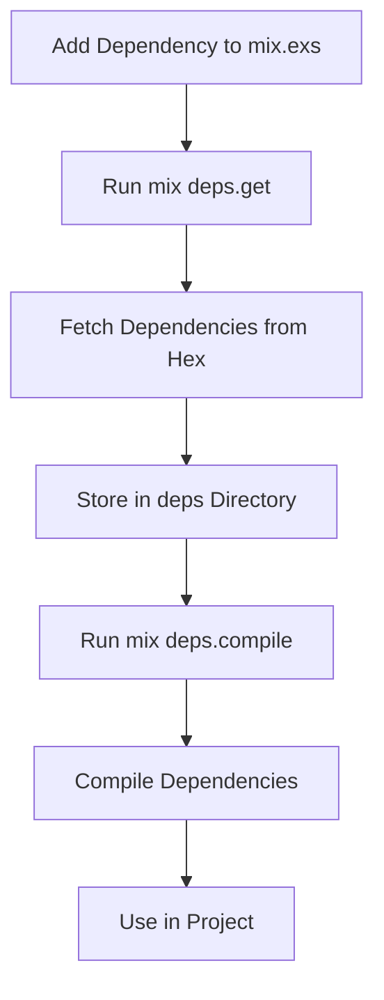

## 3.18. Managing Dependencies with Hex

In the world of Elixir, managing dependencies efficiently is crucial for building scalable and maintainable applications. Hex, the package manager for the Erlang ecosystem, plays a pivotal role in this process. In this section, we will explore how to add dependencies to your projects, publish your own packages, and ensure security when dealing with external libraries.

### Adding Dependencies

Adding dependencies to your Elixir project is a straightforward process thanks to Hex. Dependencies are specified in the `mix.exs` file, which is the configuration file for Mix, Elixir's build tool. Let's walk through the steps of adding dependencies and managing them effectively.

#### Utilizing Hex Packages in `mix.exs`

To add a dependency, you need to modify the `deps` function in your `mix.exs` file. This function returns a list of tuples, each representing a dependency. Here's a basic example:

```elixir
defp deps do
  [
    {:phoenix, "~> 1.6.0"},
    {:ecto, "~> 3.7"},
    {:plug_cowboy, "~> 2.5"}
  ]
end
```

- **Dependency Tuple**: Each tuple consists of the package name (as an atom), the version requirement (as a string), and optionally, additional options such as `only: :dev` to specify environments where the dependency is needed.

- **Version Requirement**: The version requirement uses Semantic Versioning (SemVer) to specify compatible versions. The `~>` operator allows for patch and minor version updates, ensuring compatibility.

#### Fetching and Compiling Dependencies

Once you've added dependencies to `mix.exs`, you can fetch and compile them using Mix commands:

```shell
mix deps.get
mix deps.compile
```

- **mix deps.get**: This command fetches the dependencies specified in `mix.exs` from Hex and stores them in the `deps` directory.

- **mix deps.compile**: This command compiles the fetched dependencies, making them ready for use in your project.

#### Managing Dependency Conflicts

Dependency conflicts can arise when different packages require different versions of the same library. Mix provides tools to resolve these conflicts:

- **mix deps.unlock**: Use this command to unlock specific dependencies, allowing you to update them to the latest compatible versions.

- **mix deps.tree**: This command displays the dependency tree, helping you identify conflicting packages and their requirements.

#### Example: Adding a New Dependency

Let's say you want to add a JSON parsing library to your project. You can add `Jason` as a dependency like this:

```elixir
defp deps do
  [
    {:jason, "~> 1.2"}
  ]
end
```

After updating `mix.exs`, run `mix deps.get` to fetch the library. You can then use `Jason` in your code:

```elixir
# Parsing JSON
{:ok, data} = Jason.decode("{\"name\": \"Elixir\"}")

# Encoding to JSON
json_string = Jason.encode!(%{language: "Elixir"})
```

### Publishing Packages

Sharing your own libraries with the community is a rewarding experience. Hex makes it easy to publish packages, allowing others to benefit from your work. Here's how you can publish your own package on Hex.

#### Preparing Your Package

Before publishing, ensure your package meets the following criteria:

- **Documentation**: Provide comprehensive documentation using ExDoc. This helps users understand how to use your library effectively.

- **Versioning**: Follow Semantic Versioning (SemVer) principles to communicate changes clearly. Start with version `0.1.0` for initial releases.

- **Licensing**: Include a LICENSE file to specify the terms under which your package can be used.

#### Publishing Process

To publish your package, follow these steps:

1. **Create a Hex Account**: If you haven't already, create an account on [Hex.pm](https://hex.pm).

2. **Authenticate with Hex**: Use the `mix hex.user auth` command to authenticate your local environment with your Hex account.

3. **Package Metadata**: Ensure your `mix.exs` file includes the necessary metadata:

   ```elixir
   defp package do
     [
       name: "my_package",
       description: "A sample Elixir package",
       licenses: ["MIT"],
       links: %{"GitHub" => "https://github.com/username/my_package"},
       maintainers: ["Your Name"]
     ]
   end
   ```

4. **Publish the Package**: Run `mix hex.publish` to publish your package. Follow the prompts to confirm the publication.

#### Versioning and Updates

When updating your package, increment the version number according to SemVer guidelines. Use `mix hex.publish` to publish the new version. Hex will handle versioning and ensure users can access the latest release.

### Security Considerations

Security is a paramount concern when managing dependencies. Ensuring the integrity and trustworthiness of packages is essential to protect your applications from vulnerabilities.

#### Verifying Package Integrity

Hex provides tools to verify the integrity of packages:

- **Checksums**: When you fetch a package, Hex verifies its checksum to ensure it hasn't been tampered with.

- **Hex Audit**: Use the `mix hex.audit` command to check for known vulnerabilities in your dependencies. This command compares your dependencies against a database of known security issues.

#### Trustworthiness of Packages

Before adding a dependency, consider the following:

- **Community Reputation**: Check the package's popularity and community feedback on Hex.pm. A well-maintained package with active contributors is generally more trustworthy.

- **Source Code Review**: Review the source code of the package to understand its functionality and assess potential security risks.

- **Update Regularly**: Keep your dependencies up to date to benefit from security patches and improvements.

### Visualizing Dependency Management with Hex

To better understand how Hex manages dependencies, let's visualize the process using a flowchart.


```mermaid
graph TD;
    A[Add Dependency to mix.exs] --> B[Run mix deps.get];
    B --> C[Fetch Dependencies from Hex];
    C --> D[Store in deps Directory];
    D --> E[Run mix deps.compile];
    E --> F[Compile Dependencies];
    F --> G[Use in Project];
```

**Figure 1: Dependency Management Process with Hex**

### Try It Yourself

Experiment with managing dependencies by adding a new library to your project. Try the following:

- Add a new dependency to `mix.exs` and fetch it using `mix deps.get`.
- Resolve any dependency conflicts using `mix deps.unlock` and `mix deps.tree`.
- Publish a simple package on Hex and update it with a new version.

### Knowledge Check

- What command is used to fetch dependencies in Elixir?
- How can you resolve dependency conflicts in your project?
- What are the key considerations when publishing a package on Hex?
- How does Hex ensure the integrity of packages?

### Summary

Managing dependencies with Hex is a crucial skill for Elixir developers. By understanding how to add, publish, and secure packages, you can build robust and maintainable applications. Remember, this is just the beginning. As you progress, you'll gain more insights into the Elixir ecosystem and its vibrant community. Keep experimenting, stay curious, and enjoy the journey!

## Quiz Time!



### What is the primary file used to manage dependencies in an Elixir project?

- [x] mix.exs
- [ ] config.exs
- [ ] application.ex
- [ ] deps.ex

> **Explanation:** The `mix.exs` file is where dependencies are specified in an Elixir project.

### Which command is used to fetch dependencies specified in the mix.exs file?

- [x] mix deps.get
- [ ] mix deps.compile
- [ ] mix deps.unlock
- [ ] mix deps.tree

> **Explanation:** The `mix deps.get` command fetches the dependencies listed in the `mix.exs` file.

### How does Hex ensure the integrity of packages?

- [x] By verifying checksums
- [ ] By using digital signatures
- [ ] By requiring manual verification
- [ ] By encrypting packages

> **Explanation:** Hex verifies the integrity of packages by checking their checksums.

### What is the purpose of the `mix hex.audit` command?

- [x] To check for known vulnerabilities in dependencies
- [ ] To update dependencies to the latest version
- [ ] To compile dependencies
- [ ] To publish a package to Hex

> **Explanation:** The `mix hex.audit` command checks for known vulnerabilities in the project's dependencies.

### When publishing a package, what is a crucial step to ensure users can access the latest release?

- [x] Increment the version number according to SemVer guidelines
- [ ] Change the package name
- [ ] Remove old versions from Hex
- [ ] Manually notify users

> **Explanation:** Incrementing the version number according to Semantic Versioning (SemVer) guidelines ensures users can access the latest release.

### Which command is used to compile fetched dependencies in Elixir?

- [x] mix deps.compile
- [ ] mix deps.get
- [ ] mix deps.unlock
- [ ] mix hex.publish

> **Explanation:** The `mix deps.compile` command compiles the fetched dependencies.

### What is a key consideration when adding a new dependency to your project?

- [x] Reviewing the source code for potential security risks
- [ ] Ensuring it has a complex version requirement
- [ ] Adding it without checking compatibility
- [ ] Ignoring community feedback

> **Explanation:** Reviewing the source code helps assess potential security risks when adding a new dependency.

### What should you include in your package before publishing it to Hex?

- [x] Comprehensive documentation
- [ ] Only the source code
- [ ] A list of users
- [ ] A detailed changelog

> **Explanation:** Comprehensive documentation helps users understand how to use your library effectively.

### How can you resolve dependency conflicts in your Elixir project?

- [x] Using mix deps.unlock and mix deps.tree
- [ ] By deleting conflicting dependencies
- [ ] By ignoring the conflicts
- [ ] By recompiling the project

> **Explanation:** The `mix deps.unlock` and `mix deps.tree` commands help resolve dependency conflicts.

### True or False: Hex automatically updates dependencies to the latest version.

- [ ] True
- [x] False

> **Explanation:** Hex does not automatically update dependencies; developers must manually update them to the desired version.


