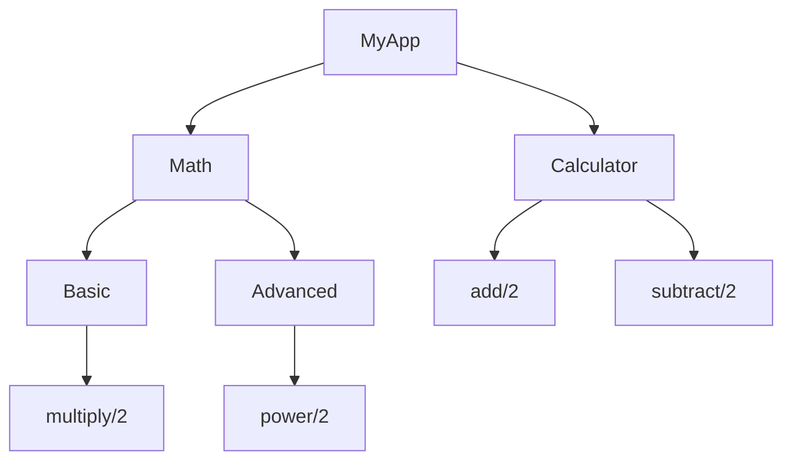

## 3.2. Modules and Functions

In Elixir, modules and functions are the building blocks of code organization and functionality. They allow developers to encapsulate logic, create reusable components, and maintain a clean codebase. This section delves into the nuances of defining modules, leveraging namespacing, and understanding the intricacies of functions, including arity and pattern matching.

### Organizing Code with Modules

Modules in Elixir serve as containers for functions and data types, providing a way to group related functionalities. They are defined using the `defmodule` keyword and can be nested to create hierarchies.

#### Defining Modules Using `defmodule`

To define a module in Elixir, use the `defmodule` keyword followed by the module name. The module name is typically capitalized and can be nested using dot notation to create a hierarchy.

```elixir
defmodule MyApp.Calculator do
  def add(a, b) do
    a + b
  end

  def subtract(a, b) do
    a - b
  end
end
```

In this example, `MyApp.Calculator` is a module containing two functions: `add` and `subtract`. The module name `MyApp.Calculator` indicates that it is part of the `MyApp` namespace, which helps in organizing code logically.

#### Namespacing and Module Hierarchies

Namespacing in Elixir is achieved through module hierarchies. This allows developers to organize code into logical groups, preventing name clashes and improving code readability.

```elixir
defmodule MyApp.Math.Basic do
  def multiply(a, b) do
    a * b
  end
end

defmodule MyApp.Math.Advanced do
  def power(base, exp) do
    :math.pow(base, exp)
  end
end
```

Here, `MyApp.Math.Basic` and `MyApp.Math.Advanced` are two modules under the `MyApp.Math` namespace. This structure helps in categorizing functions based on their complexity or purpose.

### Functions

Functions in Elixir are first-class citizens, meaning they can be passed as arguments, returned from other functions, and assigned to variables. They are defined using `def` for public functions and `defp` for private functions.

#### Public (`def`) and Private (`defp`) Functions

Public functions are accessible from outside the module, while private functions are only accessible within the module they are defined in. This distinction helps in encapsulating logic and exposing only the necessary functions.

```elixir
defmodule MyApp.Utils do
  def public_function do
    private_function()
  end

  defp private_function do
    IO.puts("This is a private function")
  end
end
```

In this example, `public_function` can be called from outside the `MyApp.Utils` module, but `private_function` cannot. This encapsulation is crucial for maintaining a clean API and hiding implementation details.

#### Function Arity and Pattern-Matched Definitions

Function arity refers to the number of arguments a function takes. In Elixir, functions are identified by their name and arity, allowing for multiple definitions with different arities.

```elixir
defmodule MyApp.Greeter do
  def greet(name) do
    "Hello, #{name}!"
  end

  def greet(name, language) do
    case language do
      :spanish -> "Hola, #{name}!"
      :french -> "Bonjour, #{name}!"
      _ -> "Hello, #{name}!"
    end
  end
end
```

Here, `greet/1` and `greet/2` are two different functions distinguished by their arity. This feature is particularly useful for overloading functions with different behaviors based on the number of arguments.

##### Pattern Matching in Function Definitions

Pattern matching is a powerful feature in Elixir that allows functions to be defined with multiple clauses, each handling different patterns of input.

```elixir
defmodule MyApp.Patterns do
  def process({:ok, result}) do
    IO.puts("Success: #{result}")
  end

  def process({:error, reason}) do
    IO.puts("Error: #{reason}")
  end
end
```

In this example, the `process/1` function has two clauses, each matching a different tuple pattern. This allows for concise and expressive code that handles different cases seamlessly.

### Visualizing Modules and Functions

To better understand the relationship between modules and functions, let's visualize a simple module hierarchy and function calls using Mermaid.js:



This diagram illustrates the module hierarchy within the `MyApp` namespace and the functions contained within each module.

### Try It Yourself

Experiment with the code examples provided by modifying them to suit different scenarios. For instance, try adding more functions to the `MyApp.Calculator` module or create a new module under the `MyApp.Math` namespace with additional mathematical operations.

### Knowledge Check

- What is the purpose of using `defmodule` in Elixir?
- How does namespacing help in organizing code?
- What is the difference between public and private functions in Elixir?
- How does function arity affect function definitions?
- How can pattern matching be used in function definitions?

### Key Takeaways

- **Modules**: Use `defmodule` to define modules and organize code into namespaces.
- **Functions**: Define public functions with `def` and private functions with `defp`.
- **Arity**: Functions are identified by their name and arity, allowing for multiple definitions.
- **Pattern Matching**: Leverage pattern matching in function definitions for expressive and concise code.

Remember, mastering modules and functions is crucial for writing clean, maintainable, and efficient Elixir code. Keep experimenting, stay curious, and enjoy the journey!

## Quiz: Modules and Functions



### What is the purpose of using `defmodule` in Elixir?

- [x] To define a module and organize code
- [ ] To define a function
- [ ] To import external libraries
- [ ] To create a new data type

> **Explanation:** `defmodule` is used to define a module, which serves as a container for functions and data types, helping to organize code.

### How does namespacing help in organizing code?

- [x] By preventing name clashes and improving code readability
- [ ] By increasing code execution speed
- [ ] By reducing memory usage
- [ ] By simplifying function definitions

> **Explanation:** Namespacing helps organize code into logical groups, preventing name clashes and improving readability.

### What is the difference between public and private functions in Elixir?

- [x] Public functions are accessible from outside the module, while private functions are not
- [ ] Public functions are faster than private functions
- [ ] Private functions use less memory than public functions
- [ ] There is no difference between public and private functions

> **Explanation:** Public functions, defined with `def`, are accessible from outside the module, while private functions, defined with `defp`, are only accessible within the module.

### How does function arity affect function definitions?

- [x] Functions are identified by their name and arity, allowing for multiple definitions
- [ ] Arity determines the execution speed of a function
- [ ] Arity affects the memory usage of a function
- [ ] Arity is irrelevant in function definitions

> **Explanation:** Function arity refers to the number of arguments a function takes, allowing for multiple definitions with different behaviors.

### How can pattern matching be used in function definitions?

- [x] By defining multiple clauses, each handling different patterns of input
- [ ] By increasing the speed of function execution
- [ ] By reducing the memory usage of functions
- [ ] By simplifying function names

> **Explanation:** Pattern matching allows functions to have multiple clauses, each handling different input patterns, resulting in expressive and concise code.

### What keyword is used to define a private function in Elixir?

- [x] defp
- [ ] def
- [ ] private
- [ ] module

> **Explanation:** The `defp` keyword is used to define private functions in Elixir.

### Can functions in Elixir be passed as arguments to other functions?

- [x] Yes
- [ ] No

> **Explanation:** Functions in Elixir are first-class citizens, meaning they can be passed as arguments, returned from other functions, and assigned to variables.

### What is the significance of function arity in Elixir?

- [x] It allows for function overloading based on the number of arguments
- [ ] It determines the execution speed of a function
- [ ] It affects the memory usage of a function
- [ ] It is irrelevant in function definitions

> **Explanation:** Function arity allows for function overloading, enabling multiple definitions with different behaviors based on the number of arguments.

### What is the purpose of pattern matching in function definitions?

- [x] To handle different input patterns with multiple clauses
- [ ] To increase the speed of function execution
- [ ] To reduce the memory usage of functions
- [ ] To simplify function names

> **Explanation:** Pattern matching allows functions to have multiple clauses, each handling different input patterns, resulting in expressive and concise code.

### True or False: Modules in Elixir can be nested using dot notation.

- [x] True
- [ ] False

> **Explanation:** Modules in Elixir can be nested using dot notation, creating a hierarchy that helps organize code into logical groups.


