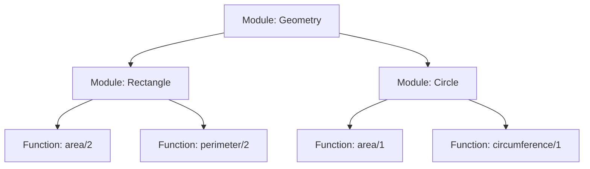

## 3.2. Modules and Functions

In Elixir, modules and functions are the cornerstone of code organization and functionality. Understanding how to effectively use these tools is critical for building scalable, maintainable, and efficient applications. In this section, we will delve into the details of defining modules, organizing them into hierarchies, and crafting functions with precision and clarity. 

### Organizing Code with Modules

Modules in Elixir serve as containers for functions and other constructs, allowing developers to organize code logically and intuitively. Let's explore how to define and use modules effectively.

#### Defining Modules Using `defmodule`

The `defmodule` keyword is used to define a module in Elixir. A module can contain functions, macros, and other modules, providing a namespace to avoid naming conflicts. Here's a simple example:

```elixir
defmodule MathOperations do
  def add(a, b) do
    a + b
  end

  def subtract(a, b) do
    a - b
  end
end
```

In this example, `MathOperations` is a module containing two functions: `add/2` and `subtract/2`. The `/2` indicates the arity of the function, which is the number of arguments it takes.

#### Namespacing and Module Hierarchies

Modules can be nested to create hierarchies, which helps in organizing code into logical sections. This is particularly useful in large projects where related functionalities are grouped together. Consider the following example:

```elixir
defmodule Geometry do
  defmodule Rectangle do
    def area(length, width) do
      length * width
    end

    def perimeter(length, width) do
      2 * (length + width)
    end
  end

  defmodule Circle do
    def area(radius) do
      :math.pi() * radius * radius
    end

    def circumference(radius) do
      2 * :math.pi() * radius
    end
  end
end
```

Here, `Geometry` is the parent module, and `Rectangle` and `Circle` are nested modules. This hierarchy allows us to call functions like `Geometry.Rectangle.area/2` and `Geometry.Circle.area/1`.

### Functions

Functions in Elixir can be public or private, and understanding their scope and usage is essential for writing clean and efficient code.

#### Public (`def`) and Private (`defp`) Functions

Functions defined with `def` are public and can be accessed from outside the module. In contrast, functions defined with `defp` are private and can only be called within the module they are defined in. Here's how you can define both:

```elixir
defmodule Example do
  def public_function do
    IO.puts("This is a public function.")
    private_function()
  end

  defp private_function do
    IO.puts("This is a private function.")
  end
end

Example.public_function() 
# Output:
# This is a public function.
# This is a private function.

# Example.private_function() # This will cause a compilation error
```

In this example, `public_function` is accessible from outside the module, while `private_function` is not.

#### Function Arity and Pattern-Matched Definitions

Function arity is a crucial concept in Elixir. It refers to the number of arguments a function takes. Elixir allows defining multiple functions with the same name but different arities. This is known as function overloading. Additionally, pattern matching can be used in function definitions to provide different implementations based on the input:

```elixir
defmodule Greeter do
  def greet(name) when is_binary(name) do
    "Hello, #{name}!"
  end

  def greet(age) when is_integer(age) do
    "Wow, you're #{age} years old!"
  end

  def greet(_), do: "Hello, stranger!"
end

IO.puts Greeter.greet("Alice") # Output: Hello, Alice!
IO.puts Greeter.greet(30)      # Output: Wow, you're 30 years old!
IO.puts Greeter.greet(:unknown) # Output: Hello, stranger!
```

In this example, the `greet/1` function is overloaded to handle different types of input: a string, an integer, and a catch-all for other types.

### Visualizing Module and Function Relationships

To better understand how modules and functions interact, let's visualize their relationships using a Mermaid.js diagram.


```mermaid
graph TD;
    A[Module: Geometry] --> B[Module: Rectangle]
    A --> C[Module: Circle]
    B --> D[Function: area/2]
    B --> E[Function: perimeter/2]
    C --> F[Function: area/1]
    C --> G[Function: circumference/1]
```

This diagram illustrates the hierarchy within the `Geometry` module, showing how `Rectangle` and `Circle` modules contain their respective functions.

### Best Practices for Modules and Functions

1. **Modular Design**: Break down large modules into smaller, focused ones. This makes the codebase easier to navigate and maintain.
2. **Descriptive Naming**: Use clear and descriptive names for modules and functions to convey their purpose.
3. **Function Documentation**: Document functions using `@doc` and `@moduledoc` attributes to provide context and usage examples.
4. **Pattern Matching**: Leverage pattern matching in function definitions to handle different cases cleanly and efficiently.
5. **Private Functions**: Use private functions for helper methods that are not intended to be part of the module's public API.

### Try It Yourself

Experiment with the code examples provided by modifying them to suit different scenarios. For instance, try adding more geometric shapes to the `Geometry` module or create additional functions in the `Greeter` module to handle more data types.

### References and Further Reading

- [Elixir Official Documentation](https://elixir-lang.org/docs.html)
- [Elixir School - Modules](https://elixirschool.com/en/lessons/basics/modules/)
- [Elixir School - Functions](https://elixirschool.com/en/lessons/basics/functions/)

### Knowledge Check

- What is the purpose of the `defmodule` keyword in Elixir?
- How can you define a private function in Elixir?
- Explain the concept of function arity and how it is used in Elixir.
- How does pattern matching enhance function definitions in Elixir?

### Embrace the Journey

Remember, mastering modules and functions in Elixir is a journey. As you continue to explore these concepts, you'll gain deeper insights into building robust and scalable applications. Keep experimenting, stay curious, and enjoy the process!

## Quiz Time!



### What is the purpose of the `defmodule` keyword in Elixir?

- [x] To define a module in Elixir.
- [ ] To define a function in Elixir.
- [ ] To define a variable in Elixir.
- [ ] To define a macro in Elixir.

> **Explanation:** The `defmodule` keyword is used to define a module in Elixir, which serves as a container for functions and other constructs.

### How can you define a private function in Elixir?

- [ ] Using the `def` keyword.
- [x] Using the `defp` keyword.
- [ ] Using the `private` keyword.
- [ ] Using the `module` keyword.

> **Explanation:** Private functions in Elixir are defined using the `defp` keyword, making them accessible only within the module they are defined in.

### What does function arity refer to in Elixir?

- [ ] The return type of a function.
- [ ] The name of a function.
- [x] The number of arguments a function takes.
- [ ] The module a function belongs to.

> **Explanation:** Function arity refers to the number of arguments a function takes. It is an important concept in Elixir as it allows for function overloading.

### How does pattern matching enhance function definitions in Elixir?

- [x] By allowing different implementations based on input patterns.
- [ ] By making functions run faster.
- [ ] By reducing the number of lines in a function.
- [ ] By making functions public.

> **Explanation:** Pattern matching in function definitions allows for different implementations based on the input patterns, making the code more expressive and concise.

### Which of the following is a best practice for organizing code in Elixir?

- [x] Use modular design to break down large modules.
- [ ] Use long and complex names for modules.
- [ ] Avoid using pattern matching in functions.
- [ ] Keep all functions in a single module.

> **Explanation:** Using modular design to break down large modules into smaller, focused ones is a best practice in Elixir, making the codebase easier to navigate and maintain.

### What is the benefit of using private functions in Elixir?

- [x] To encapsulate helper methods not intended for the public API.
- [ ] To make functions run faster.
- [ ] To allow functions to be accessed from other modules.
- [ ] To make functions immutable.

> **Explanation:** Private functions encapsulate helper methods that are not intended to be part of the module's public API, promoting encapsulation and modularity.

### What keyword is used to create a nested module in Elixir?

- [x] `defmodule`
- [ ] `def`
- [ ] `nested`
- [ ] `module`

> **Explanation:** The `defmodule` keyword is used to create both top-level and nested modules in Elixir.

### How can you document a function in Elixir?

- [ ] Using the `document` keyword.
- [ ] Using comments only.
- [x] Using the `@doc` attribute.
- [ ] Using the `def` keyword.

> **Explanation:** The `@doc` attribute is used to document functions in Elixir, providing context and usage examples.

### What is the output of calling `Example.private_function()` in the provided code example?

- [ ] "This is a public function."
- [ ] "This is a private function."
- [x] Compilation error.
- [ ] No output.

> **Explanation:** Calling `Example.private_function()` will result in a compilation error because `private_function` is defined as a private function using `defp`.

### True or False: Functions with the same name but different arities can coexist in Elixir.

- [x] True
- [ ] False

> **Explanation:** In Elixir, functions with the same name but different arities can coexist, allowing for function overloading based on the number of arguments.


