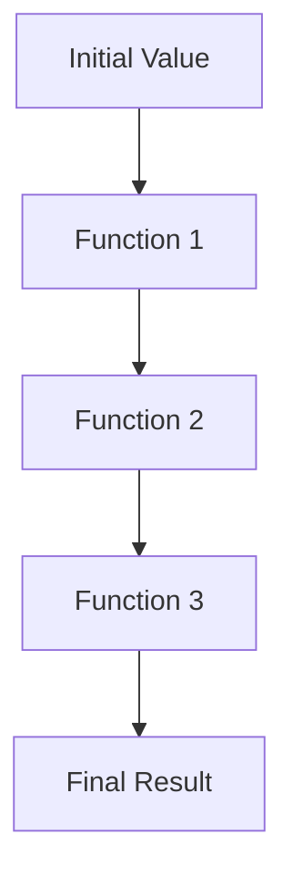

## 3.3. The Pipe Operator (`|>`)

In the world of Elixir programming, the pipe operator (`|>`) is a powerful tool that allows developers to write clean, readable, and maintainable code. This section will delve into the intricacies of the pipe operator, exploring its usage, benefits, and best practices. By the end of this guide, you'll have a comprehensive understanding of how to leverage the pipe operator to enhance your Elixir applications.

### Introduction to the Pipe Operator

The pipe operator (`|>`) is a fundamental feature in Elixir that facilitates function chaining by passing the result of one function as the first argument to the next. This operator is not unique to Elixir, but its implementation in the language is particularly elegant and powerful, making it a staple in idiomatic Elixir code.

#### Chaining Function Calls

At its core, the pipe operator is about chaining function calls. It allows you to express a sequence of operations in a linear and readable manner. Consider the following example:

```elixir
# Without pipe operator
result = function3(function2(function1(initial_value)))

# With pipe operator
result = initial_value
         |> function1()
         |> function2()
         |> function3()
```

In the above example, the pipe operator takes the result of `function1` and passes it as the first argument to `function2`, and so on. This approach improves readability by allowing the code to be read from top to bottom, mirroring the logical flow of operations.

### Improving Readability

One of the primary benefits of using the pipe operator is the improvement in code readability. By structuring code in a linear fashion, it becomes easier to follow the sequence of operations. This is particularly beneficial in complex data transformations or when dealing with nested function calls.

#### Example: Data Transformation

Let's consider a practical example where we transform a list of maps:

```elixir
# A list of maps representing users
users = [
  %{name: "Alice", age: 30},
  %{name: "Bob", age: 25},
  %{name: "Charlie", age: 35}
]

# Transforming the data using the pipe operator
transformed_users = users
  |> Enum.filter(fn user -> user.age > 28 end)
  |> Enum.map(fn user -> Map.put(user, :status, "active") end)
  |> Enum.sort_by(& &1.name)
```

In this example, we filter the list to include only users older than 28, add a `status` field to each user, and then sort the list by name. The pipe operator allows us to express these operations in a clear and concise manner.

### Best Practices

While the pipe operator is a powerful tool, it's important to use it judiciously. Here are some best practices to keep in mind:

#### Keeping Pipelines Focused

- **Avoid Excessively Long Chains:** Long chains of function calls can become difficult to read and understand. Break them into smaller, focused pipelines.
- **Use Descriptive Variable Names:** When breaking pipelines, use descriptive variable names to make the code self-explanatory.
- **Limit Side Effects:** Ensure that functions within a pipeline are pure and free of side effects to maintain predictability.

#### Example: Breaking Long Pipelines

```elixir
# Long pipeline
result = data
  |> step1()
  |> step2()
  |> step3()
  |> step4()
  |> step5()

# Breaking into smaller pipelines
intermediate_result = data
  |> step1()
  |> step2()

final_result = intermediate_result
  |> step3()
  |> step4()
  |> step5()
```

By breaking the pipeline into smaller parts, we improve readability and maintainability.

### Advanced Usage and Considerations

The pipe operator is not limited to simple function chaining. It can be used in more advanced scenarios, such as:

#### Using the Pipe Operator with Anonymous Functions

Anonymous functions can be used within a pipeline, but they require special syntax:

```elixir
result = data
  |> (&function_with_multiple_args(&1, arg2)).()
```

In this example, the anonymous function is used to pass additional arguments to `function_with_multiple_args`.

#### Combining with Other Elixir Features

The pipe operator can be combined with other Elixir features, such as pattern matching and the `with` construct, to create expressive and powerful code.

```elixir
result = data
  |> process()
  |> case do
    {:ok, value} -> handle_success(value)
    {:error, reason} -> handle_error(reason)
  end
```

### Visualizing the Pipe Operator

To better understand the flow of data through a pipeline, let's visualize it using a Mermaid.js diagram:



This diagram illustrates how the initial value is transformed through a series of functions, with each function passing its result to the next.

### Try It Yourself

Experiment with the pipe operator by modifying the following code example:

```elixir
# Original code
numbers = [1, 2, 3, 4, 5]

result = numbers
  |> Enum.map(&(&1 * 2))
  |> Enum.filter(&(&1 > 5))
  |> Enum.sum()

IO.puts("Result: #{result}")

# Try modifying the code to calculate the product of numbers greater than 5 instead of the sum.
```

### References and Further Reading

For more information on the pipe operator and functional programming in Elixir, consider exploring the following resources:

- [Elixir Documentation: Pipe Operator](https://elixir-lang.org/getting-started/enumerables-and-streams.html#the-pipe-operator)
- [Elixir School: Pipe Operator](https://elixirschool.com/en/lessons/basics/pipe_operator/)
- [Functional Programming Concepts in Elixir](https://www.learnelixir.tv/)

### Knowledge Check

Let's reinforce your understanding of the pipe operator with some practice questions.

## Quiz Time!



### What is the primary purpose of the pipe operator in Elixir?

- [x] To chain function calls in a readable manner
- [ ] To handle errors in a program
- [ ] To define anonymous functions
- [ ] To manage concurrency

> **Explanation:** The pipe operator is used to chain function calls, passing the result of one function as the first argument to the next, enhancing code readability.

### How does the pipe operator improve code readability?

- [x] By allowing code to be read from top to bottom
- [ ] By reducing the number of lines of code
- [ ] By eliminating the need for comments
- [ ] By automatically documenting the code

> **Explanation:** The pipe operator improves readability by structuring code in a linear fashion, allowing it to be read from top to bottom.

### What is a best practice when using the pipe operator?

- [x] Keeping pipelines focused and avoiding excessively long chains
- [ ] Using side effects within pipelines
- [ ] Nesting pipelines within each other
- [ ] Using the pipe operator for error handling

> **Explanation:** It's best to keep pipelines focused and avoid long chains to maintain readability and clarity.

### How can you pass additional arguments to a function within a pipeline?

- [x] By using an anonymous function
- [ ] By using pattern matching
- [ ] By using the `with` construct
- [ ] By using a case statement

> **Explanation:** Anonymous functions can be used within a pipeline to pass additional arguments to a function.

### Which of the following is a valid use of the pipe operator?

- [x] Chaining a series of data transformations
- [ ] Handling exceptions in a program
- [ ] Defining a module
- [ ] Creating a new process

> **Explanation:** The pipe operator is used for chaining data transformations, not for handling exceptions or defining modules.

### What should you avoid when using the pipe operator?

- [x] Creating excessively long pipelines
- [ ] Using descriptive variable names
- [ ] Breaking pipelines into smaller parts
- [ ] Using pure functions

> **Explanation:** Avoid creating long pipelines as they can become difficult to read and maintain.

### How can the pipe operator be combined with pattern matching?

- [x] By using it within a `case` statement
- [ ] By using it to define a new function
- [ ] By using it to create a new module
- [ ] By using it to handle errors

> **Explanation:** The pipe operator can be combined with pattern matching within a `case` statement to handle different outcomes.

### What is the result of the following pipeline?
```elixir
[1, 2, 3]
|> Enum.map(&(&1 * 2))
|> Enum.filter(&(&1 > 4))
|> Enum.sum()
```
- [x] 10
- [ ] 12
- [ ] 14
- [ ] 16

> **Explanation:** The pipeline doubles each number, filters out those not greater than 4, and sums the remaining numbers (6 + 4 = 10).

### Can the pipe operator be used with anonymous functions?

- [x] Yes
- [ ] No

> **Explanation:** Yes, the pipe operator can be used with anonymous functions, but they require special syntax.

### True or False: The pipe operator can be used to manage concurrency in Elixir.

- [ ] True
- [x] False

> **Explanation:** The pipe operator is not used for managing concurrency; it is used for chaining function calls.



Remember, mastering the pipe operator is just the beginning of writing expressive and maintainable Elixir code. Keep experimenting, stay curious, and enjoy the journey!
